# Polyglot Codebase Knowledge Graph

> Generated offline by **readmenator**. Supports C, C++, Python, Go, Rust, JS/TS, Java, C#, Shell, PHP, Dart, GDScript, Nim, ASM, Ruby, Swift, Kotlin, Scala, Lua, Elixir.
> No LLMs. No tokens. Pure static analysis. See more [here](https://github.com/grisuno/ReadMenator)

**Total Files Parsed:** 27 | **Total Symbols Extracted:** 694 | **Total Imports:** 105

<!-- ranking_model: v1.0 | weights: {ppr:0.45,auth:0.2,test:0.15,doc:0.1,fresh:0.1} | alpha:0.85 | commit:75d209c | date:2026-07-18 -->


## Table of Contents

1. [Statistics Dashboard](#statistics-dashboard)
2. [Architectural Layers](#architectural-layers)
3. [Ranked Context](#ranked-context)
4. [God Nodes](#god-nodes)
5. [Suggested Questions](#suggested-questions)
6. [Taint Propagation Map](#taint-propagation-map)
7. [Hotspot Analysis](#hotspot-analysis)
8. [Change Impact Analysis](#change-impact-analysis)
9. [Suggested Linting Rules](#suggested-linting-rules)
10. [Query Recipes](#query-recipes)
11. [Structural Knowledge Map](#structural-knowledge-map)
12. [UML Class Diagram](#uml-class-diagram)
13. [Code Property Graph](#code-property-graph)
14. [Architecture Reference](#architecture-reference)
    - [C (17 files)](#c-17-files)
    - [GO (2 files)](#go-2-files)
    - [H (5 files)](#h-5-files)
    - [PY (1 files)](#py-1-files)
    - [SH (2 files)](#sh-2-files)

---

## Statistics Dashboard

| Metric | Value |
|--------|-------|
| Total Files | 27 |
| Total Symbols | 694 |
| Total Imports | 105 |
| Call Edges | 150 |
| Inheritance Edges | 0 |
| Languages | 5 |
| Avg Symbols/File | 25.7 |
| Avg Imports/File | 3.9 |

### Top Files by Import Count (Fan-Out)

| File | Imports | Symbols | Language |
|------|---------|---------|----------|
| `fatfs_vuln_test.c` | 17 | 16 | c |
| `exploit_disks.c` | 10 | 51 | c |
| `rce_demo.c` | 10 | 12 | c |
| `ffsystem.c` | 9 | 7 | c |
| `libfuzzer_harness.c` | 8 | 2 | c |
| `test_harness.c` | 8 | 40 | c |
| `main.go` | 7 | 7 | go |
| `ff.c` | 5 | 332 | c |
| `gen_exploit_image.py` | 5 | 8 | py |
| `app4.c` | 4 | 3 | c |

---

## Architectural Layers

Auto-detected from path patterns, naming conventions, and imported frameworks.

| Layer | Files |
|-------|-------|
| utility | 15 |
| testing | 7 |
| infrastructure | 5 |

### utility

- `app1.c` (c, 2 symbols)
- `app2.c` (c, 1 symbols)
- `app3.c` (c, 2 symbols)
- `app4.c` (c, 3 symbols)
- `app5.c` (c, 1 symbols)
- `app6.c` (c, 1 symbols)
- `ff.c` (c, 332 symbols)
- `ff.h` (h, 44 symbols)
- `ffconf.h` (h, 42 symbols)
- `ffsystem.c` (c, 7 symbols)
- `ffunicode.c` (c, 9 symbols)
- `fat_image.go` (go, 18 symbols)
- `main.go` (go, 7 symbols)
- `libfuzzer_harness.c` (c, 2 symbols)
- `rce_demo.c` (c, 12 symbols)

### infrastructure

- `diskio.c` (c, 8 symbols)
- `diskio.h` (h, 24 symbols)
- `diskio_ramdisk.c` (c, 9 symbols)
- `diskio_ramdisk.h` (h, 4 symbols)
- `exploit_disks.c` (c, 51 symbols)

### testing

- `fatfs_vuln_test.c` (c, 16 symbols)
- `run.sh` (sh, 6 symbols)
- `gen_exploit_image.py` (py, 8 symbols)
- `run_test.sh` (sh, 0 symbols)
- `ffunicode_stub.c` (c, 3 symbols)
- `test_ffconf.h` (h, 42 symbols)
- `test_harness.c` (c, 40 symbols)

---

## Ranked Context

Files ranked by composite score for the current query context. The ranking combines Personalized PageRank (query relevance), global authority, test coverage, documentation coverage, and code freshness. Model: v1.0.

| Rank | File | Composite | PPR | Authority | Test | Doc |
|------|------|-----------|-----|-----------|------|-----|
| 1 | `app2.c` | 0.2000 | 0.0000 | 0.0000 | 0.00 | 2.00 |
| 2 | `app5.c` | 0.2000 | 0.0000 | 0.0000 | 0.00 | 2.00 |
| 3 | `app6.c` | 0.2000 | 0.0000 | 0.0000 | 0.00 | 2.00 |
| 4 | `app1.c` | 0.1000 | 0.0000 | 0.0000 | 0.00 | 1.00 |
| 5 | `run_test.sh` | 0.1000 | 0.0000 | 0.0000 | 0.00 | 1.00 |
| 6 | `libfuzzer_harness.c` | 0.1000 | 0.0000 | 0.0000 | 0.00 | 1.00 |
| 7 | `gen_exploit_image.py` | 0.0875 | 0.0000 | 0.0000 | 0.00 | 0.88 |
| 8 | `ffsystem.c` | 0.0857 | 0.0000 | 0.0000 | 0.00 | 0.86 |
| 9 | `fat_image.go` | 0.0833 | 0.0000 | 0.0000 | 0.00 | 0.83 |
| 10 | `diskio.c` | 0.0750 | 0.0000 | 0.0000 | 0.00 | 0.75 |

---

## God Nodes

Most architecturally central files ranked by combined import/export degree and symbol richness.

| File | Score | Connections | PageRank |
|------|-------|-------------|----------|
| `ff.c` | 33.2 | | 0.0000 |
| `exploit_disks.c` | 5.1 | | 0.0000 |
| `ff.h` | 4.4 | | 0.0000 |
| `ffconf.h` | 4.2 | | 0.0000 |
| `test_ffconf.h` | 4.2 | | 0.0000 |
| `test_harness.c` | 4.0 | | 0.0000 |
| `diskio.h` | 2.4 | | 0.0000 |
| `fat_image.go` | 1.8 | | 0.0000 |
| `fatfs_vuln_test.c` | 1.6 | | 0.0000 |
| `rce_demo.c` | 1.2 | | 0.0000 |

---

## Suggested Questions

Auto-generated exploration prompts based on graph structure:

- What does ff.c depend on, and what depends on it? (0 connections)
- What does exploit_disks.c depend on, and what depends on it? (0 connections)
- What does ff.h depend on, and what depends on it? (0 connections)
- What is the overall architecture of this codebase?

---

## Taint Propagation Map

Taint analysis traces how dangerous imports propagate through the codebase via transitive dependencies. Source files import dangerous modules directly; sink files receive the danger indirectly.

**Taint Sources:** 1 | **Taint Sinks:** 1 | **Propagation Paths:** 1

- `gen_exploit_image.py` imports `subprocess` (0 hop to `gen_exploit_image.py`) [high]
  Path: gen_exploit_image.py

---

## Hotspot Analysis

Files ranked by combined complexity (symbol count) and centrality (connection count). High-scoring files are architecturally critical and may need refactoring attention.

| File | Complexity | Centrality | Combined | Symbols | Connections |
|------|-----------|------------|----------|---------|-------------|
| `app2.c` | 0.003 | 0.000 | 0.001 | 1 | 0 |
| `app5.c` | 0.003 | 0.000 | 0.001 | 1 | 0 |
| `app6.c` | 0.003 | 0.235 | 0.142 | 1 | 4 |
| `app1.c` | 0.006 | 0.000 | 0.002 | 2 | 0 |
| `run_test.sh` | 0.000 | 0.000 | 0.000 | 0 | 0 |
| `libfuzzer_harness.c` | 0.006 | 0.471 | 0.285 | 2 | 8 |
| `gen_exploit_image.py` | 0.024 | 0.294 | 0.186 | 8 | 5 |
| `ffsystem.c` | 0.021 | 0.529 | 0.326 | 7 | 9 |
| `fat_image.go` | 0.054 | 0.118 | 0.092 | 18 | 2 |
| `diskio.c` | 0.024 | 0.235 | 0.151 | 8 | 4 |
| `fatfs_vuln_test.c` | 0.048 | 1.000 | 0.619 | 16 | 17 |
| `ff.c` | 1.000 | 0.294 | 0.577 | 332 | 5 |
| `exploit_disks.c` | 0.154 | 0.588 | 0.414 | 51 | 10 |
| `rce_demo.c` | 0.036 | 0.588 | 0.367 | 12 | 10 |
| `test_harness.c` | 0.120 | 0.471 | 0.331 | 40 | 8 |

---

## Change Impact Analysis

Files sorted by how many other files would be affected if they changed. High-impact files should be changed with caution.

| File | Direct Dependents | Transitive Dependents | Total Impact |
|------|------------------|----------------------|--------------|
| `app1.c` | 0 | 0 | 0 |
| `app2.c` | 0 | 0 | 0 |
| `app3.c` | 0 | 0 | 0 |
| `app4.c` | 0 | 0 | 0 |
| `app5.c` | 0 | 0 | 0 |
| `app6.c` | 0 | 0 | 0 |
| `diskio.c` | 0 | 0 | 0 |
| `diskio.h` | 0 | 0 | 0 |
| `ff.c` | 0 | 0 | 0 |
| `ff.h` | 0 | 0 | 0 |
| `ffconf.h` | 0 | 0 | 0 |
| `ffsystem.c` | 0 | 0 | 0 |
| `ffunicode.c` | 0 | 0 | 0 |
| `fatfs_vuln_test.c` | 0 | 0 | 0 |
| `run.sh` | 0 | 0 | 0 |

---

## Suggested Linting Rules

Automatically suggested linting and security rules based on patterns detected in the codebase. These can be exported as Semgrep rules using the `--export-rules` flag.

| Rule ID | Severity | Description | Language | Matches |
|---------|----------|-------------|----------|---------|
| `RM001` | info | Large number of functions in c: 205 total | c | 205 |
| `RM002` | info | Large number of functions in sh: 6 total | sh | 6 |
| `RM003` | info | Large number of functions in py: 8 total | py | 8 |
| `RM004` | info | Large number of functions in go: 23 total | go | 23 |
| `RM005` | info | Print statement found (consider logging instead) | python | 33 |

---

## Query Recipes

Example queries you can run against this knowledge base using the ranking engine:

```
# Find files most relevant to a concept
readmenator query "Where is the import resolver implemented?"

# Rank files by relevance to a topic
readmenator query "How does documentation generation work?"

# Explain why a file ranks highly
readmenator query "explain readmenator/_documentation.py"

# Trace dependency paths with ranked context
readmenator query "path from CLI to exporter"
```

The ranking model uses the following signals:

- **Personalized PageRank** (45% weight): query-specific relevance via seed propagation
- **Global Authority** (20% weight): structural importance via standard PageRank
- **Test Coverage** (15% weight): fraction of symbols referenced in test files
- **Doc Coverage** (10% weight): presence of docstrings and file-level docs
- **Freshness** (10% weight): recent modification activity

Results include score decomposition and justification paths for each ranked item.

---

## Structural Knowledge Map


---

## UML Class Diagram

Auto-generated Mermaid class diagram from parsed class-level symbols. Shows classes, structs, interfaces, traits, and their methods with inheritance and dependency relationships.

```mermaid
classDiagram
  class fatfs_vuln_test_c_ota_update_ctx {
    <<struct>>
    +__attribute__((noinline)) static void unsafe_copy_dirent_name(char *dst, const struct dirent *entry)
    +legitimate_update_callback(void)
    +run_lfn_copy_probe(void)
    +get_firmware_size(void)
    +read_firmware_image(int fd, size_t firmware_size)
    +run_update_flow(long attacker_fsize)
    +app_main(void)
  }
  class fatfs_vuln_test_c_ota_exec_region {
    <<struct>>
    +__attribute__((noinline)) static void unsafe_copy_dirent_name(char *dst, const struct dirent *entry)
    +legitimate_update_callback(void)
    +run_lfn_copy_probe(void)
    +get_firmware_size(void)
    +read_firmware_image(int fd, size_t firmware_size)
    +run_update_flow(long attacker_fsize)
    +app_main(void)
  }
  class fatfs_vuln_test_c_lfn_overflow_probe {
    <<struct>>
    +__attribute__((noinline)) static void unsafe_copy_dirent_name(char *dst, const struct dirent *entry)
    +legitimate_update_callback(void)
    +run_lfn_copy_probe(void)
    +get_firmware_size(void)
    +read_firmware_image(int fd, size_t firmware_size)
    +run_update_flow(long attacker_fsize)
    +app_main(void)
  }
  class fat_image_go_FAT16Config {
    <<struct>>
    +le16(
    +le32(
    +le64(
    +newDisk(
    +DefaultFAT16Config(
    +BuildFAT16(
    +FAT16DataSector(
    +DefaultFAT32Config(
    +BuildFAT32(
    +BuildGPTImage(
  }
  class fat_image_go_FAT32Config {
    <<struct>>
    +le16(
    +le32(
    +le64(
    +newDisk(
    +DefaultFAT16Config(
    +BuildFAT16(
    +FAT16DataSector(
    +DefaultFAT32Config(
    +BuildFAT32(
    +BuildGPTImage(
  }
  class rce_demo_c_ota_ctx {
    <<struct>>
    +Build(without sanitisers, without stack protector — lets the overflow
 * reach the function...
    +st32le(uint8_t *p, uint32_t v)
    +st64le(uint8_t *p, uint64_t v)
    +safe_update_complete(void)
    +__attribute__((noinline))
static void rce_win(void)
    +vulnerable_ota_check(void)
    +build_exploit_image(uint8_t *disk, size_t disk_bytes,
                               ...
    +save_image(const char *path, const uint8_t *disk, size_t sz)
    +load_image(const char *path)
    +main(void)
  }
```



---

## Code Property Graph

Machine-readable Code Property Graph (CPG) in JSON-LD format. This block allows AI agents to parse the full structural graph without additional file reads. Compatible with GraphRAG pipelines.

```json
{"@context": "https://schema.org", "analysis": {"communities": [], "god_nodes": [{"node_id": "FatFs-R0.16/source/ff.c", "score": 33.2}, {"node_id": "harness/exploit_disks.c", "score": 5.1}, {"node_id": "FatFs-R0.16/source/ff.h", "score": 4.4}, {"node_id": "FatFs-R0.16/source/ffconf.h", "score": 4.2}, {"node_id": "harness/test_ffconf.h", "score": 4.2}, {"node_id": "harness/test_harness.c", "score": 4.0}, {"node_id": "FatFs-R0.16/source/diskio.h", "score": 2.4}, {"node_id": "fuzzer/fat_image.go", "score": 1.8}, {"node_id": "esp32-qemu-test/app/main/fatfs_vuln_test.c", "score": 1.6}, {"node_id": "harness/rce_demo.c", "score": 1.2}], "surprising_connections": []}, "edges": [{"confidence": "EXTRACTED", "relation": "imports", "source": "FatFs-R0.16/documents/res/app4.c", "target": "stdio.h"}, {"confidence": "EXTRACTED", "relation": "imports", "source": "FatFs-R0.16/documents/res/app4.c", "target": "string.h"}, {"confidence": "EXTRACTED", "relation": "imports", "source": "FatFs-R0.16/documents/res/app4.c", "target": "ff.h"}, {"confidence": "EXTRACTED", "relation": "imports", "source": "FatFs-R0.16/documents/res/app4.c", "target": "diskio.h"}, {"confidence": "EXTRACTED", "relation": "imports", "source": "FatFs-R0.16/documents/res/app6.c", "target": "stdio.h"}, {"confidence": "EXTRACTED", "relation": "imports", "source": "FatFs-R0.16/documents/res/app6.c", "target": "systimer.h"}, {"confidence": "EXTRACTED", "relation": "imports", "source": "FatFs-R0.16/documents/res/app6.c", "target": "diskio.h"}, {"confidence": "EXTRACTED", "relation": "imports", "source": "FatFs-R0.16/documents/res/app6.c", "target": "ff.h"}, {"confidence": "EXTRACTED", "relation": "imports", "source": "FatFs-R0.16/source/diskio.c", "target": "ff.h"}, {"confidence": "EXTRACTED", "relation": "imports", "source": "FatFs-R0.16/source/diskio.c", "target": "diskio.h"}, {"confidence": "EXTRACTED", "relation": "imports", "source": "FatFs-R0.16/source/diskio.c", "target": "platform.h"}, {"confidence": "EXTRACTED", "relation": "imports", "source": "FatFs-R0.16/source/diskio.c", "target": "storage.h"}, {"confidence": "EXTRACTED", "relation": "imports", "source": "FatFs-R0.16/source/ff.c", "target": "string.h"}, {"confidence": "EXTRACTED", "relation": "imports", "source": "FatFs-R0.16/source/ff.c", "target": "ff.h"}, {"confidence": "EXTRACTED", "relation": "imports", "source": "FatFs-R0.16/source/ff.c", "target": "diskio.h"}, {"confidence": "EXTRACTED", "relation": "imports", "source": "FatFs-R0.16/source/ff.c", "target": "stdarg.h"}, {"confidence": "EXTRACTED", "relation": "imports", "source": "FatFs-R0.16/source/ff.c", "target": "math.h"}, {"confidence": "EXTRACTED", "relation": "imports", "source": "FatFs-R0.16/source/ff.h", "target": "ffconf.h"}, {"confidence": "EXTRACTED", "relation": "imports", "source": "FatFs-R0.16/source/ff.h", "target": "windows.h"}, {"confidence": "EXTRACTED", "relation": "imports", "source": "FatFs-R0.16/source/ff.h", "target": "float.h"}, {"confidence": "EXTRACTED", "relation": "imports", "source": "FatFs-R0.16/source/ff.h", "target": "stdint.h"}, {"confidence": "EXTRACTED", "relation": "imports", "source": "FatFs-R0.16/source/ffsystem.c", "target": "ff.h"}, {"confidence": "EXTRACTED", "relation": "imports", "source": "FatFs-R0.16/source/ffsystem.c", "target": "stdlib.h"}, {"confidence": "EXTRACTED", "relation": "imports", "source": "FatFs-R0.16/source/ffsystem.c", "target": "windows.h"}, {"confidence": "EXTRACTED", "relation": "imports", "source": "FatFs-R0.16/source/ffsystem.c", "target": "itron.h"}, {"confidence": "EXTRACTED", "relation": "imports", "source": "FatFs-R0.16/source/ffsystem.c", "target": "kernel.h"}, {"confidence": "EXTRACTED", "relation": "imports", "source": "FatFs-R0.16/source/ffsystem.c", "target": "includes.h"}, {"confidence": "EXTRACTED", "relation": "imports", "source": "FatFs-R0.16/source/ffsystem.c", "target": "FreeRTOS.h"}, {"confidence": "EXTRACTED", "relation": "imports", "source": "FatFs-R0.16/source/ffsystem.c", "target": "semphr.h"}, {"confidence": "EXTRACTED", "relation": "imports", "source": "FatFs-R0.16/source/ffsystem.c", "target": "cmsis_os.h"}, {"confidence": "EXTRACTED", "relation": "imports", "source": "FatFs-R0.16/source/ffunicode.c", "target": "ff.h"}, {"confidence": "EXTRACTED", "relation": "imports", "source": "esp32-qemu-test/app/main/fatfs_vuln_test.c", "target": "stdio.h"}, {"confidence": "EXTRACTED", "relation": "imports", "source": "esp32-qemu-test/app/main/fatfs_vuln_test.c", "target": "string.h"}, {"confidence": "EXTRACTED", "relation": "imports", "source": "esp32-qemu-test/app/main/fatfs_vuln_test.c", "target": "stdlib.h"}, {"confidence": "EXTRACTED", "relation": "imports", "source": "esp32-qemu-test/app/main/fatfs_vuln_test.c", "target": "sys/stat.h"}, {"confidence": "EXTRACTED", "relation": "imports", "source": "esp32-qemu-test/app/main/fatfs_vuln_test.c", "target": "errno.h"}, {"confidence": "EXTRACTED", "relation": "imports", "source": "esp32-qemu-test/app/main/fatfs_vuln_test.c", "target": "inttypes.h"}, {"confidence": "EXTRACTED", "relation": "imports", "source": "esp32-qemu-test/app/main/fatfs_vuln_test.c", "target": "fcntl.h"}, {"confidence": "EXTRACTED", "relation": "imports", "source": "esp32-qemu-test/app/main/fatfs_vuln_test.c", "target": "unistd.h"}, {"confidence": "EXTRACTED", "relation": "imports", "source": "esp32-qemu-test/app/main/fatfs_vuln_test.c", "target": "dirent.h"}, {"confidence": "EXTRACTED", "relation": "imports", "source": "esp32-qemu-test/app/main/fatfs_vuln_test.c", "target": "stdbool.h"}, {"confidence": "EXTRACTED", "relation": "imports", "source": "esp32-qemu-test/app/main/fatfs_vuln_test.c", "target": "esp_log.h"}, {"confidence": "EXTRACTED", "relation": "imports", "source": "esp32-qemu-test/app/main/fatfs_vuln_test.c", "target": "esp_system.h"}, {"confidence": "EXTRACTED", "relation": "imports", "source": "esp32-qemu-test/app/main/fatfs_vuln_test.c", "target": "esp_idf_version.h"}, {"confidence": "EXTRACTED", "relation": "imports", "source": "esp32-qemu-test/app/main/fatfs_vuln_test.c", "target": "esp_vfs_fat.h"}, {"confidence": "EXTRACTED", "relation": "imports", "source": "esp32-qemu-test/app/main/fatfs_vuln_test.c", "target": "esp_partition.h"}, {"confidence": "EXTRACTED", "relation": "imports", "source": "esp32-qemu-test/app/main/fatfs_vuln_test.c", "target": "freertos/FreeRTOS.h"}, {"confidence": "EXTRACTED", "relation": "imports", "source": "esp32-qemu-test/app/main/fatfs_vuln_test.c", "target": "freertos/task.h"}, {"confidence": "EXTRACTED", "relation": "imports", "source": "esp32-qemu-test/scripts/gen_exploit_image.py", "target": "struct"}, {"confidence": "EXTRACTED", "relation": "imports", "source": "esp32-qemu-test/scripts/gen_exploit_image.py", "target": "subprocess"}, {"confidence": "EXTRACTED", "relation": "imports", "source": "esp32-qemu-test/scripts/gen_exploit_image.py", "target": "sys"}, {"confidence": "EXTRACTED", "relation": "imports", "source": "esp32-qemu-test/scripts/gen_exploit_image.py", "target": "os"}, {"confidence": "EXTRACTED", "relation": "imports", "source": "esp32-qemu-test/scripts/gen_exploit_image.py", "target": "tempfile"}, {"confidence": "EXTRACTED", "relation": "imports", "source": "fuzzer/fat_image.go", "target": "encoding/binary"}, {"confidence": "EXTRACTED", "relation": "imports", "source": "fuzzer/fat_image.go", "target": "math/rand"}, {"confidence": "EXTRACTED", "relation": "imports", "source": "fuzzer/main.go", "target": "encoding/binary"}, {"confidence": "EXTRACTED", "relation": "imports", "source": "fuzzer/main.go", "target": "flag"}, {"confidence": "EXTRACTED", "relation": "imports", "source": "fuzzer/main.go", "target": "fmt"}, {"confidence": "EXTRACTED", "relation": "imports", "source": "fuzzer/main.go", "target": "math/rand"}, {"confidence": "EXTRACTED", "relation": "imports", "source": "fuzzer/main.go", "target": "os"}, {"confidence": "EXTRACTED", "relation": "imports", "source": "fuzzer/main.go", "target": "path/filepath"}, {"confidence": "EXTRACTED", "relation": "imports", "source": "fuzzer/main.go", "target": "testing"}, {"confidence": "EXTRACTED", "relation": "imports", "source": "harness/diskio_ramdisk.c", "target": "ff.h"}, {"confidence": "EXTRACTED", "relation": "imports", "source": "harness/diskio_ramdisk.c", "target": "diskio.h"}, {"confidence": "EXTRACTED", "relation": "imports", "source": "harness/diskio_ramdisk.c", "target": "diskio_ramdisk.h"}, {"confidence": "EXTRACTED", "relation": "imports", "source": "harness/diskio_ramdisk.c", "target": "string.h"}, {"confidence": "EXTRACTED", "relation": "imports", "source": "harness/diskio_ramdisk.h", "target": "ff.h"}, {"confidence": "EXTRACTED", "relation": "imports", "source": "harness/diskio_ramdisk.h", "target": "stdint.h"}, {"confidence": "EXTRACTED", "relation": "imports", "source": "harness/exploit_disks.c", "target": "stdio.h"}, {"confidence": "EXTRACTED", "relation": "imports", "source": "harness/exploit_disks.c", "target": "stdlib.h"}, {"confidence": "EXTRACTED", "relation": "imports", "source": "harness/exploit_disks.c", "target": "string.h"}, {"confidence": "EXTRACTED", "relation": "imports", "source": "harness/exploit_disks.c", "target": "stdint.h"}, {"confidence": "EXTRACTED", "relation": "imports", "source": "harness/exploit_disks.c", "target": "stddef.h"}, {"confidence": "EXTRACTED", "relation": "imports", "source": "harness/exploit_disks.c", "target": "sys/stat.h"}, {"confidence": "EXTRACTED", "relation": "imports", "source": "harness/exploit_disks.c", "target": "errno.h"}, {"confidence": "EXTRACTED", "relation": "imports", "source": "harness/exploit_disks.c", "target": "ff.h"}, {"confidence": "EXTRACTED", "relation": "imports", "source": "harness/exploit_disks.c", "target": "diskio.h"}, {"confidence": "EXTRACTED", "relation": "imports", "source": "harness/exploit_disks.c", "target": "diskio_ramdisk.h"}, {"confidence": "EXTRACTED", "relation": "imports", "source": "harness/ffunicode_stub.c", "target": "ff.h"}, {"confidence": "EXTRACTED", "relation": "imports", "source": "harness/libfuzzer_harness.c", "target": "stdint.h"}, {"confidence": "EXTRACTED", "relation": "imports", "source": "harness/libfuzzer_harness.c", "target": "stddef.h"}, {"confidence": "EXTRACTED", "relation": "imports", "source": "harness/libfuzzer_harness.c", "target": "string.h"}, {"confidence": "EXTRACTED", "relation": "imports", "source": "harness/libfuzzer_harness.c", "target": "stdlib.h"}, {"confidence": "EXTRACTED", "relation": "imports", "source": "harness/libfuzzer_harness.c", "target": "ff.h"}, {"confidence": "EXTRACTED", "relation": "imports", "source": "harness/libfuzzer_harness.c", "target": "diskio.h"}, {"confidence": "EXTRACTED", "relation": "imports", "source": "harness/libfuzzer_harness.c", "target": "diskio_ramdisk.h"}, {"confidence": "EXTRACTED", "relation": "imports", "source": "harness/libfuzzer_harness.c", "target": "stdio.h"}, {"confidence": "EXTRACTED", "relation": "imports", "source": "harness/rce_demo.c", "target": "stdio.h"}, {"confidence": "EXTRACTED", "relation": "imports", "source": "harness/rce_demo.c", "target": "stdlib.h"}, {"confidence": "EXTRACTED", "relation": "imports", "source": "harness/rce_demo.c", "target": "string.h"}, {"confidence": "EXTRACTED", "relation": "imports", "source": "harness/rce_demo.c", "target": "stdint.h"}, {"confidence": "EXTRACTED", "relation": "imports", "source": "harness/rce_demo.c", "target": "stddef.h"}, {"confidence": "EXTRACTED", "relation": "imports", "source": "harness/rce_demo.c", "target": "assert.h"}, {"confidence": "EXTRACTED", "relation": "imports", "source": "harness/rce_demo.c", "target": "inttypes.h"}, {"confidence": "EXTRACTED", "relation": "imports", "source": "harness/rce_demo.c", "target": "ff.h"}, {"confidence": "EXTRACTED", "relation": "imports", "source": "harness/rce_demo.c", "target": "diskio.h"}, {"confidence": "EXTRACTED", "relation": "imports", "source": "harness/rce_demo.c", "target": "diskio_ramdisk.h"}, {"confidence": "EXTRACTED", "relation": "imports", "source": "harness/test_harness.c", "target": "stdio.h"}, {"confidence": "EXTRACTED", "relation": "imports", "source": "harness/test_harness.c", "target": "stdlib.h"}, {"confidence": "EXTRACTED", "relation": "imports", "source": "harness/test_harness.c", "target": "string.h"}, {"confidence": "EXTRACTED", "relation": "imports", "source": "harness/test_harness.c", "target": "stdint.h"}, {"confidence": "EXTRACTED", "relation": "imports", "source": "harness/test_harness.c", "target": "assert.h"}, {"confidence": "EXTRACTED", "relation": "imports", "source": "harness/test_harness.c", "target": "ff.h"}, {"confidence": "EXTRACTED", "relation": "imports", "source": "harness/test_harness.c", "target": "diskio.h"}, {"confidence": "EXTRACTED", "relation": "imports", "source": "harness/test_harness.c", "target": "diskio_ramdisk.h"}], "generator": "readmenator", "metadata": {"edge_count": 255, "file_count": 27, "language_count": 5, "symbol_count": 694}, "nodes": [{"doc": "------------------------------------------------------------", "id": "FatFs-R0.16/documents/res/app1.c", "kind": "module", "label": "app1.c", "language": "c", "sha256": "6fc03258744402e9", "symbol_count": 2, "symbols": [{"doc": "-----------------------------------------------------------/ Open or create a file in append mode (This function was sperseded by FA_OPEN_APPEND flag at FatFs R0.12a) /------------------------------------------------------------", "kind": "function", "line": 5, "name": "open_append", "signature": "FRESULT open_append (\n    FIL* fp,            /* [OUT] File object to create */\n    const char* p..."}, {"kind": "function", "line": 23, "name": "main", "signature": "int main (void)"}]}, {"doc": "------------------------------------------------------------", "id": "FatFs-R0.16/documents/res/app2.c", "kind": "module", "label": "app2.c", "language": "c", "sha256": "27aaabdef7f2d9ce", "symbol_count": 1, "symbols": [{"doc": "-----------------------------------------------------------/ Delete a sub-directory even if it contains any file -------------------------------------------------------------/ The delete_node() function is for R0.12+. It works regardless of FF_FS_RPATH.", "kind": "function", "line": 7, "name": "delete_node", "signature": "FRESULT delete_node (\n    TCHAR* path,    /* Path name buffer with the sub-directory to delete */..."}]}, {"doc": "----------------------------------------------------------------------", "id": "FatFs-R0.16/documents/res/app3.c", "kind": "module", "label": "app3.c", "language": "c", "sha256": "c43fb9482472a856", "symbol_count": 2, "symbols": [{"kind": "function", "line": 18, "name": "allocate_contiguous_clusters", "signature": "DWORD allocate_contiguous_clusters (    /* Returns the first sector in LBA (0:error or not contig..."}, {"kind": "function", "line": 76, "name": "main", "signature": "int main (void)"}]}, {"doc": "----------------------------------------------------------------------", "id": "FatFs-R0.16/documents/res/app4.c", "kind": "module", "label": "app4.c", "language": "c", "sha256": "2b9d4f90069c6a87", "symbol_count": 3, "symbols": [{"doc": "---------------------------------------------------------------------/ Low level disk I/O module function checker                            / -----------------------------------------------------------------------/ WARNING: The data on the target drive will be lost!  #include <stdio.h> #include <string.h> #include \"ff.h\"         /* Declarations of sector size #include \"diskio.h\"     /* Declarations of disk functions", "kind": "function", "line": 11, "name": "pn", "signature": "static DWORD pn (       /* Pseudo random number generator */\n    DWORD pns   /* 0:Initialize, !0:..."}, {"kind": "function", "line": 34, "name": "test_diskio", "signature": "int test_diskio (\n    BYTE pdrv,      /* Physical drive number to be checked (all data on the dri..."}, {"kind": "function", "line": 296, "name": "main", "signature": "int main (int argc, char* argv[])"}]}, {"doc": "----------------------------------------------------------------------", "id": "FatFs-R0.16/documents/res/app5.c", "kind": "module", "label": "app5.c", "language": "c", "sha256": "1b8ae53229ab342e", "symbol_count": 1, "symbols": [{"doc": "---------------------------------------------------------------------/ Test if the file is contiguous                                        / /----------------------------------------------------------------------", "kind": "function", "line": 4, "name": "test_contiguous_file", "signature": "FRESULT test_contiguous_file (\n    FIL* fp,    /* [IN]  Open file object to be checked */\n    int..."}]}, {"doc": "---------------------------------------------------------------------", "id": "FatFs-R0.16/documents/res/app6.c", "kind": "module", "label": "app6.c", "language": "c", "sha256": "054c5809c31efb87", "symbol_count": 1, "symbols": [{"doc": "include <stdio.h> include <systimer.h> include \"diskio.h\" include \"ff.h\"", "kind": "function", "line": 9, "name": "test_raw_speed", "signature": "int test_raw_speed (\n    BYTE pdrv,      /* Physical drive number */\n    DWORD lba,      /* Start..."}]}, {"doc": "-----------------------------------------------------------------------", "id": "FatFs-R0.16/source/diskio.c", "kind": "module", "label": "diskio.c", "language": "c", "sha256": "3d9c1002168eb64d", "symbol_count": 8, "symbols": [{"doc": "/* Example: Declarations of the platform and disk functions in the project #include \"platform.h\" #include \"storage.h\" /* Example: Mapping of physical drive number for each drive #define DEV_FLASH\t0\t/* Map FTL to physical drive 0 #define DEV_MMC\t\t1\t/* Map MMC/SD card to physical drive 1 #define DEV_USB\t\t2\t/* Map USB MSD to physical drive 2 /*----------------------------------------------------------------------- /* Get Drive Status /*-----------------------------------------------------------------------", "kind": "function", "line": 26, "name": "disk_status", "signature": "DSTATUS disk_status (\n\tBYTE pdrv\t\t/* Physical drive nmuber to identify the drive */\n)"}, {"doc": "result = USB_disk_status(); translate the reslut code here return stat; } return STA_NOINIT; } /*----------------------------------------------------------------------- /* Inidialize a Drive /*-----------------------------------------------------------------------", "kind": "function", "line": 64, "name": "disk_initialize", "signature": "DSTATUS disk_initialize (\n\tBYTE pdrv\t\t\t\t/* Physical drive nmuber to identify the drive */\n)"}, {"doc": "result = USB_disk_initialize(); translate the reslut code here return stat; } return STA_NOINIT; } /*----------------------------------------------------------------------- /* Read Sector(s) /*-----------------------------------------------------------------------", "kind": "function", "line": 102, "name": "disk_read", "signature": "DRESULT disk_read (\n\tBYTE pdrv,\t\t/* Physical drive nmuber to identify the drive */\n\tBYTE *buff,\t\t..."}, {"doc": "if FF_FS_READONLY == 0", "kind": "function", "line": 152, "name": "disk_write", "signature": "DRESULT disk_write (\n\tBYTE pdrv,\t\t\t/* Physical drive nmuber to identify the drive */\n\tconst BYTE ..."}, {"doc": "translate the reslut code here return res; } return RES_PARERR; } #endif /*----------------------------------------------------------------------- /* Miscellaneous Functions /*-----------------------------------------------------------------------", "kind": "function", "line": 201, "name": "disk_ioctl", "signature": "DRESULT disk_ioctl (\n\tBYTE pdrv,\t\t/* Physical drive nmuber (0..) */\n\tBYTE cmd,\t\t/* Control code *..."}, {"kind": "macro", "line": 18, "name": "DEV_FLASH"}, {"kind": "macro", "line": 19, "name": "DEV_MMC"}, {"kind": "macro", "line": 20, "name": "DEV_USB"}]}, {"doc": "-----------------------------------------------------------------------", "id": "FatFs-R0.16/source/diskio.h", "kind": "module", "label": "diskio.h", "language": "h", "sha256": "7e72c5fccd4584ed", "symbol_count": 24, "symbols": [{"kind": "macro", "line": 6, "name": "_DISKIO_DEFINED"}, {"kind": "macro", "line": 37, "name": "STA_NOINIT"}, {"kind": "macro", "line": 39, "name": "STA_NODISK"}, {"kind": "macro", "line": 40, "name": "STA_PROTECT"}, {"kind": "macro", "line": 46, "name": "CTRL_SYNC"}, {"kind": "macro", "line": 47, "name": "GET_SECTOR_COUNT"}, {"kind": "macro", "line": 48, "name": "GET_SECTOR_SIZE"}, {"kind": "macro", "line": 49, "name": "GET_BLOCK_SIZE"}, {"kind": "macro", "line": 50, "name": "CTRL_TRIM"}, {"kind": "macro", "line": 53, "name": "CTRL_POWER"}, {"kind": "macro", "line": 54, "name": "CTRL_LOCK"}, {"kind": "macro", "line": 55, "name": "CTRL_EJECT"}, {"kind": "macro", "line": 56, "name": "CTRL_FORMAT"}, {"kind": "macro", "line": 59, "name": "MMC_GET_TYPE"}, {"kind": "macro", "line": 60, "name": "MMC_GET_CSD"}, {"kind": "macro", "line": 61, "name": "MMC_GET_CID"}, {"kind": "macro", "line": 62, "name": "MMC_GET_OCR"}, {"kind": "macro", "line": 63, "name": "MMC_GET_SDSTAT"}, {"kind": "macro", "line": 64, "name": "ISDIO_READ"}, {"kind": "macro", "line": 65, "name": "ISDIO_WRITE"}, {"kind": "macro", "line": 66, "name": "ISDIO_MRITE"}, {"kind": "macro", "line": 69, "name": "ATA_GET_REV"}, {"kind": "macro", "line": 70, "name": "ATA_GET_MODEL"}, {"kind": "macro", "line": 71, "name": "ATA_GET_SN"}]}, {"doc": "----------------------------------------------------------------------------", "id": "FatFs-R0.16/source/ff.c", "kind": "module", "label": "ff.c", "language": "c", "sha256": "3e8f4204290cab42", "symbol_count": 332, "symbols": [{"doc": "ptr++ = (BYTE)val; val >>= 8; ptr++ = (BYTE)val; val >>= 8; ptr++ = (BYTE)val; } #endif #endif\t/* !FF_FS_READONLY /*----------------------------------------------------------------------- /* String functions /*----------------------------------------------------------------------- /* Test if the byte is DBC 1st byte", "kind": "function", "line": 693, "name": "dbc_1st", "signature": "static int dbc_1st (BYTE c)"}, {"doc": "} #elif FF_CODE_PAGE >= 900\t/* DBCS fixed code page if (c >= DbcTbl[0]) { if (c <= DbcTbl[1]) return 1; if (c >= DbcTbl[2] && c <= DbcTbl[3]) return 1; } #else\t\t\t\t\t\t/* SBCS fixed code page if (c != 0) return 0;\t/* Always false #endif return 0; } /* Test if the byte is DBC 2nd byte", "kind": "function", "line": 713, "name": "dbc_2nd", "signature": "static int dbc_2nd (BYTE c)"}, {"doc": "if (c <= DbcTbl[5]) return 1; if (c >= DbcTbl[6] && c <= DbcTbl[7]) return 1; if (c >= DbcTbl[8] && c <= DbcTbl[9]) return 1; } #else\t\t\t\t\t\t/* SBCS fixed code page if (c != 0) return 0;\t/* Always false #endif return 0; } #if FF_USE_LFN /* Get a Unicode code point from the TCHAR string in defined API encodeing", "kind": "function", "line": 737, "name": "tchar2uni", "signature": "static DWORD tchar2uni (\t/* Returns a character in UTF-16 encoding (>=0x10000 on surrogate pair, ..."}, {"doc": "} if (wc != 0) { wc = ff_oem2uni(wc, CODEPAGE);\t/* ANSI/OEM ==> Unicode if (wc == 0) return 0xFFFFFFFF;\t/* Invalid code? } uc = wc; #endif *str = p;\t/* Next read pointer return uc; } /* Store a Unicode char in defined API encoding", "kind": "function", "line": 806, "name": "put_utf", "signature": "static UINT put_utf (\t/* Returns number of encoding units written (0:buffer overflow or wrong enc..."}, {"doc": "return 2; } if (wc == 0 || szb < 1) return 0;\t/* Invalid character or buffer overflow? *buf++ = (TCHAR)wc;\t\t\t\t\t/* Store the character return 1; #endif } #endif\t/* FF_USE_LFN #if FF_FS_REENTRANT /*----------------------------------------------------------------------- /* Request/Release grant to access the volume /*-----------------------------------------------------------------------", "kind": "function", "line": 895, "name": "lock_volume", "signature": "static int lock_volume (\t/* 1:Ok, 0:timeout */\n\tFATFS* fs,\t\t\t\t/* Filesystem object to lock */\n\tin..."}, {"kind": "function", "line": 920, "name": "unlock_volume", "signature": "static void unlock_volume (\n\tFATFS* fs,\t\t/* Filesystem object */\n\tFRESULT res\t\t/* Result code to ..."}, {"doc": "} #endif ff_mutex_give(fs->ldrv);\t/* Unlock the volume } } #endif #if FF_FS_LOCK /*----------------------------------------------------------------------- /* File sharing control functions /*-----------------------------------------------------------------------", "kind": "function", "line": 946, "name": "chk_share", "signature": "static FRESULT chk_share (\t/* Check if the file can be accessed */\n\tDIR* dp,\t\t/* Directory object..."}, {"kind": "function", "line": 981, "name": "inc_share", "signature": "static UINT inc_share (\t/* Increment object open counter and returns its index (0:Internal error)..."}, {"kind": "function", "line": 1012, "name": "dec_share", "signature": "static FRESULT dec_share (\t/* Decrement object open counter */\n\tUINT i\t\t\t/* Semaphore index (1..)..."}, {"kind": "function", "line": 1036, "name": "clear_share", "signature": "static void clear_share (\t/* Clear all lock entries of the volume */\n\tFATFS* fs\n)"}, {"doc": "for (i = 0; i < FF_FS_LOCK; i++) { if (Files[i].fs == fs) Files[i].fs = 0; } } #endif\t/* FF_FS_LOCK /*----------------------------------------------------------------------- /* Move/Flush disk access window in the filesystem object /*----------------------------------------------------------------------- if !FF_FS_READONLY", "kind": "function", "line": 1057, "name": "sync_window", "signature": "static FRESULT sync_window (\t/* Returns FR_OK or FR_DISK_ERR */\n\tFATFS* fs\t\t\t/* Filesystem object..."}, {"doc": "endif", "kind": "function", "line": 1077, "name": "move_window", "signature": "static FRESULT move_window (\t/* Returns FR_OK or FR_DISK_ERR */\n\tFATFS* fs,\t\t/* Filesystem object..."}, {"doc": "} fs->winsect = sect; } } return res; } #if !FF_FS_READONLY /*----------------------------------------------------------------------- /* Synchronize filesystem and data on the storage /*-----------------------------------------------------------------------", "kind": "function", "line": 1109, "name": "sync_fs", "signature": "static FRESULT sync_fs (\t/* Returns FR_OK or FR_DISK_ERR */\n\tFATFS* fs\t\t/* Filesystem object */\n)"}, {"doc": "/* Make sure that no pending write process in the lower layer if (disk_ioctl(fs->pdrv, CTRL_SYNC, 0) != RES_OK) res = FR_DISK_ERR; } return res; } #endif /*----------------------------------------------------------------------- /* Get physical sector number from cluster number /*-----------------------------------------------------------------------", "kind": "function", "line": 1158, "name": "clst2sect", "signature": "static LBA_t clst2sect (\t/* !=0:Sector number, 0:Failed (invalid cluster#) */\n\tFATFS* fs,\t\t/* Fil..."}, {"doc": "DWORD clst\t\t/* Cluster# to be converted ) { clst -= 2;\t\t/* Cluster number is origin from 2 if (clst >= fs->n_fatent - 2) return 0;\t\t/* Is it invalid cluster number? return fs->database + (LBA_t)fs->csize * clst;\t/* Start sector number of the cluster } /*----------------------------------------------------------------------- /* FAT access - Read value of an FAT entry /*-----------------------------------------------------------------------", "kind": "function", "line": 1175, "name": "get_fat", "signature": "static DWORD get_fat (\t\t/* 0xFFFFFFFF:Disk error, 1:Internal error, 2..0x7FFFFFFF:Cluster status ..."}, {"doc": "val = 1;\t/* Internal error } } return val; } #if !FF_FS_READONLY /*----------------------------------------------------------------------- /* FAT access - Change value of an FAT entry /*-----------------------------------------------------------------------", "kind": "function", "line": 1253, "name": "put_fat", "signature": "static FRESULT put_fat (\t/* FR_OK(0):succeeded, !=0:error */\n\tFATFS* fs,\t\t/* Corresponding filesy..."}, {"doc": "#endif /* !FF_FS_READONLY #if FF_FS_EXFAT && !FF_FS_READONLY /*----------------------------------------------------------------------- /* exFAT: Accessing FAT and Allocation Bitmap /*----------------------------------------------------------------------- /*-------------------------------------- /* Find a contiguous free cluster block /*--------------------------------------", "kind": "function", "line": 1318, "name": "find_bitmap", "signature": "static DWORD find_bitmap (\t/* 0:Not found, 2..:Cluster block found, 0xFFFFFFFF:Disk error */\n\tFAT..."}, {"doc": "} else { scl = val; ctr = 0;\t\t/* Encountered a cluster in-use, restart to scan } if (val == clst) return 0;\t/* All cluster scanned? } while (bm != 0); bm = 1; } while (++i < SS(fs)); } } /*---------------------------------------- /* Set/Clear a block of allocation bitmap /*----------------------------------------", "kind": "function", "line": 1358, "name": "change_bitmap", "signature": "static FRESULT change_bitmap (\n\tFATFS* fs,\t/* Filesystem object */\n\tDWORD clst,\t/* Cluster number..."}, {"doc": "fs->win[i] ^= bm;\t/* Flip the bit fs->wflag = 1; if (--ncl == 0) return FR_OK;\t/* All bits processed? } while (bm <<= 1);\t\t/* Next bit bm = 1; } while (++i < SS(fs));\t\t/* Next byte i = 0; } } /*--------------------------------------------- /* Fill the first fragment of the FAT chain /*---------------------------------------------", "kind": "function", "line": 1394, "name": "fill_first_frag", "signature": "static FRESULT fill_first_frag (\n\tFFOBJID* obj\t/* Pointer to the corresponding object */\n)"}, {"doc": "if (obj->stat == 3) {\t/* Has the object been changed 'fragmented' in this session? for (cl = obj->sclust, n = obj->n_cont; n; cl++, n--) {\t/* Create cluster chain on the FAT res = put_fat(obj->fs, cl, cl + 1); if (res != FR_OK) return res; } obj->stat = 0;\t/* Change status 'FAT chain is valid' } return FR_OK; } /*--------------------------------------------- /* Fill the last fragment of the FAT chain /*---------------------------------------------", "kind": "function", "line": 1417, "name": "fill_last_frag", "signature": "static FRESULT fill_last_frag (\n\tFFOBJID* obj,\t/* Pointer to the corresponding object */\n\tDWORD l..."}, {"doc": "if (res != FR_OK) return res; obj->n_frag--; } return FR_OK; } #endif\t/* FF_FS_EXFAT && !FF_FS_READONLY #if !FF_FS_READONLY /*----------------------------------------------------------------------- /* FAT handling - Remove a cluster chain /*-----------------------------------------------------------------------", "kind": "function", "line": 1443, "name": "remove_chain", "signature": "static FRESULT remove_chain (\t/* FR_OK(0):succeeded, !=0:error */\n\tFFOBJID* obj,\t\t/* Correspondin..."}, {"doc": "} } } } #endif return FR_OK; } /*----------------------------------------------------------------------- /* FAT handling - Stretch a chain or Create a new chain /*-----------------------------------------------------------------------", "kind": "function", "line": 1538, "name": "create_chain", "signature": "static DWORD create_chain (\t/* 0:No free cluster, 1:Internal error, 0xFFFFFFFF:Disk error, >=2:Ne..."}, {"doc": "} return ncl;\t\t/* Return new cluster number or error status } #endif /* !FF_FS_READONLY #if FF_USE_FASTSEEK /*----------------------------------------------------------------------- /* FAT handling - Convert offset into cluster with link map table /*-----------------------------------------------------------------------", "kind": "function", "line": 1643, "name": "clmt_clust", "signature": "static DWORD clmt_clust (\t/* <2:Error, >=2:Cluster number */\n\tFIL* fp,\t\t/* Pointer to the file ob..."}, {"doc": "if !FF_FS_READONLY", "kind": "function", "line": 1675, "name": "dir_clear", "signature": "static FRESULT dir_clear (\t/* Returns FR_OK or FR_DISK_ERR */\n\tFATFS *fs,\t\t/* Filesystem object *..."}, {"doc": "{ ibuf = fs->win; szb = 1;\t/* Use window buffer (many single-sector writes may take a time) for (n = 0; n < fs->csize && disk_write(fs->pdrv, ibuf, sect + n, szb) == RES_OK; n += szb) ;\t/* Fill the cluster with 0 } return (n == fs->csize) ? FR_OK : FR_DISK_ERR; } #endif\t/* !FF_FS_READONLY /*----------------------------------------------------------------------- /* Directory handling - Set directory index /*-----------------------------------------------------------------------", "kind": "function", "line": 1713, "name": "dir_sdi", "signature": "static FRESULT dir_sdi (\t/* FR_OK(0):succeeded, !=0:error */\n\tDIR* dp,\t\t/* Pointer to directory o..."}, {"doc": "dp->clust = clst;\t\t\t\t\t/* Current cluster# if (dp->sect == 0) return FR_INT_ERR; dp->sect += ofs / SS(fs);\t\t\t/* Sector# of the directory entry dp->dir = fs->win + (ofs % SS(fs));\t/* Pointer to the entry in the win[] return FR_OK; } /*----------------------------------------------------------------------- /* Directory handling - Move directory table index next /*-----------------------------------------------------------------------", "kind": "function", "line": 1761, "name": "dir_next", "signature": "static FRESULT dir_next (\t/* FR_OK(0):succeeded, FR_NO_FILE:End of table, FR_DENIED:Could not str..."}, {"doc": "} dp->dptr = ofs;\t\t\t\t\t\t/* Current entry dp->dir = fs->win + ofs % SS(fs);\t/* Pointer to the entry in the win[] return FR_OK; } #if !FF_FS_READONLY /*----------------------------------------------------------------------- /* Directory handling - Reserve a block of directory entries /*-----------------------------------------------------------------------", "kind": "function", "line": 1822, "name": "dir_alloc", "signature": "static FRESULT dir_alloc (\t/* FR_OK(0):succeeded, !=0:error */\n\tDIR* dp,\t\t\t\t/* Pointer to the dir..."}, {"doc": "} if (res == FR_NO_FILE) res = FR_DENIED;\t/* No directory entry to allocate return res; } #endif\t/* !FF_FS_READONLY /*----------------------------------------------------------------------- /* FAT: Directory handling - Load/Store start cluster number /*-----------------------------------------------------------------------", "kind": "function", "line": 1864, "name": "ld_clust", "signature": "static DWORD ld_clust (\t/* Returns the top cluster value of the SFN entry */\n\tFATFS* fs,\t\t\t/* Poi..."}, {"doc": "if !FF_FS_READONLY", "kind": "function", "line": 1882, "name": "st_clust", "signature": "static void st_clust (\n\tFATFS* fs,\t/* Pointer to the fs object */\n\tBYTE* dir,\t/* Pointer to the k..."}, {"doc": "{ st_16(dir + DIR_FstClusLO, (WORD)cl); if (fs->fs_type == FS_FAT32) { st_16(dir + DIR_FstClusHI, (WORD)(cl >> 16)); } } #endif #if FF_USE_LFN /*-------------------------------------------------------- /* FAT-LFN: Compare a part of file name with an LFN entry /*--------------------------------------------------------", "kind": "function", "line": 1901, "name": "cmp_lfn", "signature": "static int cmp_lfn (\t\t/* 1:matched, 0:not matched */\n\tconst WCHAR* lfnbuf,\t/* Pointer to the LFN ..."}, {"doc": "if (chr != 0xFFFF) return 0;\t/* Check filler } } if ((dir[LDIR_Ord] & LLEF) && pchr && lfnbuf[ni]) return 0;\t/* Last name segment matched but different length return 1;\t\t/* The part of LFN matched } #if FF_FS_MINIMIZE <= 1 || FF_FS_RPATH >= 2 || FF_USE_LABEL || FF_FS_EXFAT /*----------------------------------------------------- /* FAT-LFN: Pick a part of file name from an LFN entry /*-----------------------------------------------------", "kind": "function", "line": 1937, "name": "pick_lfn", "signature": "static int pick_lfn (\t/* 1:succeeded, 0:buffer overflow or invalid LFN entry */\n\tWCHAR* lfnbuf,\t\t..."}, {"doc": "if (dir[LDIR_Ord] & LLEF && pchr != 0) {\t/* Put terminator if it is the last LFN part and not terminated if (ni >= FF_MAX_LFN + 1) return 0;\t\t/* Buffer overflow? lfnbuf[ni] = 0; } return 1;\t\t/* The part of LFN is valid } #endif #if !FF_FS_READONLY /*----------------------------------------- /* FAT-LFN: Create an entry of LFN entries /*-----------------------------------------", "kind": "function", "line": 1975, "name": "put_lfn", "signature": "static void put_lfn (\n\tconst WCHAR* lfn,\t/* Pointer to the LFN */\n\tBYTE* dir,\t\t\t/* Pointer to the..."}, {"doc": "} while (++di < 13); if (chr == 0xFFFF || !lfn[ni]) ord |= LLEF;\t/* Last LFN part is the start of an enrty set dir[LDIR_Ord] = ord;\t\t\t/* Set order in the entry set } #endif\t/* !FF_FS_READONLY #endif\t/* FF_USE_LFN #if FF_USE_LFN && !FF_FS_READONLY /*----------------------------------------------------------------------- /* FAT-LFN: Create a Numbered SFN /*-----------------------------------------------------------------------", "kind": "function", "line": 2012, "name": "gen_numname", "signature": "static void gen_numname (\n\tBYTE* dst,\t\t\t/* Pointer to the buffer to store numbered SFN */\n\tconst ..."}, {"doc": "} } do {\t/* Append the suffix dst[j++] = (i < 8) ? ns[i++] : ' '; } while (j < 8); } #endif\t/* FF_USE_LFN && !FF_FS_READONLY #if FF_USE_LFN /*----------------------------------------------------------------------- /* FAT-LFN: Calculate checksum of an SFN entry /*-----------------------------------------------------------------------", "kind": "function", "line": 2069, "name": "sum_sfn", "signature": "static BYTE sum_sfn (\n\tconst BYTE* dir\t\t/* Pointer to the SFN entry */\n)"}, {"doc": "do { sum = (sum >> 1) + (sum << 7) + *dir++; } while (--n); return sum; } #endif\t/* FF_USE_LFN #if FF_FS_EXFAT /*----------------------------------------------------------------------- /* exFAT: Checksum /*-----------------------------------------------------------------------", "kind": "function", "line": 2091, "name": "xdir_sum", "signature": "static WORD xdir_sum (\t/* Get checksum of the directoly entry block */\n\tconst BYTE* dir\t\t/* Direc..."}, {"kind": "function", "line": 2110, "name": "xname_sum", "signature": "static WORD xname_sum (\t/* Get check sum (to be used as hash) of the file name */\n\tconst WCHAR* n..."}, {"doc": "if !FF_FS_READONLY && FF_USE_MKFS", "kind": "function", "line": 2131, "name": "xsum32", "signature": "static DWORD xsum32 (\t/* Returns 32-bit checksum */\n\tBYTE  dat,\t\t\t/* Byte to be calculated (byte-..."}, {"doc": "BYTE  dat,\t\t\t/* Byte to be calculated (byte-by-byte processing) DWORD sum\t\t\t/* Previous sum value ) { sum = ((sum & 1) ? 0x80000000 : 0) + (sum >> 1) + dat; return sum; } #endif /*------------------------------------ /* exFAT: Get a directory entry block /*------------------------------------", "kind": "function", "line": 2146, "name": "load_xdir", "signature": "static FRESULT load_xdir (\t/* FR_INT_ERR: invalid entry block */\n\tDIR* dp\t\t\t\t\t/* Reading director..."}, {"doc": "} while ((i += SZDIRE) < sz_ent); /* Sanity check (do it for only accessible object) if (i <= MAXDIRB(FF_MAX_LFN)) { if (xdir_sum(dirb) != ld_16(dirb + XDIR_SetSum)) return FR_INT_ERR; } return FR_OK; } /*------------------------------------------------------------------ /* exFAT: Initialize object allocation info with loaded entry block /*------------------------------------------------------------------", "kind": "function", "line": 2198, "name": "init_alloc_info", "signature": "static void init_alloc_info (\n\tFFOBJID* dobj,\t/* Object allocation information to be initialized ..."}, {"doc": "dobj->c_ofs = sdir->blk_ofs; } dobj->sclust = ld_32(fs->dirbuf + XDIR_FstClus);\t/* Start cluster dobj->objsize = ld_64(fs->dirbuf + XDIR_FileSize);\t/* Size dobj->stat = fs->dirbuf[XDIR_GenFlags] & 2;\t\t\t/* Allocation status dobj->n_frag = 0;\t\t\t\t\t\t\t\t\t/* No last fragment info } #if !FF_FS_READONLY || FF_FS_RPATH /*------------------------------------------------ /* exFAT: Load the object's directory entry block /*------------------------------------------------", "kind": "function", "line": 2224, "name": "load_obj_xdir", "signature": "static FRESULT load_obj_xdir (\n\tDIR* dp,\t\t\t/* Blank directory object to be used to access contain..."}, {"doc": "res = dir_sdi(dp, dp->blk_ofs);\t/* Goto object's entry block if (res == FR_OK) { res = load_xdir(dp);\t\t/* Load the object's entry block } return res; } #endif #if !FF_FS_READONLY /*---------------------------------------- /* exFAT: Store the directory entry block /*----------------------------------------", "kind": "function", "line": 2253, "name": "store_xdir", "signature": "static FRESULT store_xdir (\n\tDIR* dp\t\t\t\t/* Pointer to the directory object */\n)"}, {"doc": "dp->obj.fs->wflag = 1; if (--nent == 0) break;\t/* All done? dirb += SZDIRE; res = dir_next(dp, 0);\t/* Next entry } return (res == FR_OK || res == FR_DISK_ERR) ? res : FR_INT_ERR; } /*------------------------------------------- /* exFAT: Create a new directory entry block /*-------------------------------------------", "kind": "function", "line": 2287, "name": "create_xdir", "signature": "static void create_xdir (\n\tBYTE* dirb,\t\t\t/* Pointer to the directory entry block buffer */\n\tconst..."}, {"doc": "define DIR_READ_FILE(dp) dir_read(dp, 0) define DIR_READ_LABEL(dp) dir_read(dp, 1)", "kind": "function", "line": 2333, "name": "dir_read", "signature": "static FRESULT dir_read (\n\tDIR* dp,\t\t/* Pointer to the directory object */\n\tint vol\t\t\t/* Filtered..."}, {"doc": "if (res != FR_OK) break; } if (res != FR_OK) dp->sect = 0;\t\t/* Terminate the read operation on error or EOT return res; } #endif\t/* FF_FS_MINIMIZE <= 1 || FF_USE_LABEL || FF_FS_RPATH >= 2 /*----------------------------------------------------------------------- /* Directory handling - Find an object in the directory /*-----------------------------------------------------------------------", "kind": "function", "line": 2411, "name": "dir_find", "signature": "static FRESULT dir_find (\t/* FR_OK(0):succeeded, !=0:error */\n\tDIR* dp\t\t\t\t\t/* Pointer to the dire..."}, {"doc": "#endif res = dir_next(dp, 0);\t/* Next entry } while (res == FR_OK); return res; } #if !FF_FS_READONLY /*----------------------------------------------------------------------- /* Register an object to the directory /*-----------------------------------------------------------------------", "kind": "function", "line": 2493, "name": "dir_register", "signature": "static FRESULT dir_register (\t/* FR_OK:succeeded, FR_DENIED:no free entry or too many SFN collisi..."}, {"doc": "} } return res; } #endif /* !FF_FS_READONLY #if !FF_FS_READONLY && FF_FS_MINIMIZE == 0 /*----------------------------------------------------------------------- /* Remove an object from the directory /*-----------------------------------------------------------------------", "kind": "function", "line": 2606, "name": "dir_remove", "signature": "static FRESULT dir_remove (\t/* FR_OK:Succeeded, FR_DISK_ERR:A disk error */\n\tDIR* dp\t\t\t\t\t/* Direc..."}, {"doc": "} #endif return res; } #endif /* !FF_FS_READONLY && FF_FS_MINIMIZE == 0 #if FF_FS_MINIMIZE <= 1 || FF_FS_RPATH >= 2 /*----------------------------------------------------------------------- /* Get file information from directory entry /*-----------------------------------------------------------------------", "kind": "function", "line": 2652, "name": "get_fileinfo", "signature": "static void get_fileinfo (\n\tDIR* dp,\t\t\t/* Pointer to the directory object */\n\tFILINFO* fno\t\t/* Po..."}, {"doc": "fno->crdate = ld_16(dp->dir + DIR_CrtTime + 2);\t/* Created date #endif } #endif /* FF_FS_MINIMIZE <= 1 || FF_FS_RPATH >= 2 #if FF_USE_FIND && FF_FS_MINIMIZE <= 1 /*----------------------------------------------------------------------- /* Pattern matching /*----------------------------------------------------------------------- #define FIND_RECURS\t4\t/* Maximum number of wildcard terms in the pattern to limit recursion", "kind": "function", "line": 2805, "name": "get_achar", "signature": "static DWORD get_achar (\t/* Get a character and advance ptr */\n\tconst TCHAR** ptr\t\t/* Pointer to ..."}, {"kind": "function", "line": 2836, "name": "pattern_match", "signature": "static int pattern_match (\t/* 0:mismatched, 1:matched */\n\tconst TCHAR* pat,\t/* Matching pattern *..."}, {"doc": "} get_achar(&nam);\t\t\t/* nam++ } while (skip && nchr);\t\t/* Retry until end of name if infinite search is specified return 0; } #endif /* FF_USE_FIND && FF_FS_MINIMIZE <= 1 /*----------------------------------------------------------------------- /* Pick a top segment and create the object name in directory form /*-----------------------------------------------------------------------", "kind": "function", "line": 2891, "name": "create_name", "signature": "static FRESULT create_name (\t/* FR_OK: successful, FR_INVALID_NAME: could not create */\n\tDIR* dp,..."}, {"doc": "if (sfn[0] == DDEM) sfn[0] = RDDEM;\t/* If the first character collides with DDEM, replace it with RDDEM sfn[NSFLAG] = (c <= ' ' || p[si] <= ' ') ? NS_LAST : 0;\t/* Set last segment flag if end of the path return FR_OK; #endif /* FF_USE_LFN } /*----------------------------------------------------------------------- /* Follow a file path /*-----------------------------------------------------------------------", "kind": "function", "line": 3100, "name": "follow_path", "signature": "static FRESULT follow_path (\t/* FR_OK(0): successful, !=0: error code */\n\tDIR* dp,\t\t\t\t\t/* Directo..."}, {"doc": "dp->obj.sclust = ld_clust(fs, fs->win + dp->dptr % SS(fs));\t/* Open next directory } } } return res; } /*----------------------------------------------------------------------- /* Get logical drive number from path name /*-----------------------------------------------------------------------", "kind": "function", "line": 3219, "name": "get_ldnumber", "signature": "static int get_ldnumber (\t/* Returns logical drive number (-1:invalid drive number or null pointe..."}, {"doc": "return 0;\t\t\t\t/* Default drive is 0 #endif } /*----------------------------------------------------------------------- /* GPT support functions /*----------------------------------------------------------------------- #if FF_LBA64 /* Calculate CRC32 in byte-by-byte", "kind": "function", "line": 3296, "name": "crc32", "signature": "static DWORD crc32 (\t/* Returns next CRC value */\n\tDWORD crc,\t\t\t/* Current CRC value */\n\tBYTE d\t\t..."}, {"doc": ") { BYTE b; for (b = 1; b; b <<= 1) { crc ^= (d & b) ? 1 : 0; crc = (crc & 1) ? crc >> 1 ^ 0xEDB88320 : crc >> 1; } return crc; } /* Check validity of GPT header", "kind": "function", "line": 3314, "name": "test_gpt_header", "signature": "static int test_gpt_header (\t/* 0:Invalid, 1:Valid */\n\tconst BYTE* gpth\t\t\t/* Pointer to the GPT h..."}, {"doc": "if (hlen < 92 || hlen > FF_MIN_SS) return 0; for (i = 0, bcc = 0xFFFFFFFF; i < hlen; i++) {\t\t\t/* Check header BCC bcc = crc32(bcc, i - GPTH_Bcc < 4 ? 0 : gpth[i]); } if (~bcc != ld_32(gpth + GPTH_Bcc)) return 0; if (ld_32(gpth + GPTH_PteSize) != SZ_GPTE) return 0;\t/* Table entry size (must be SZ_GPTE bytes) if (ld_32(gpth + GPTH_PtNum) > 128) return 0;\t\t\t/* Table size (must be 128 entries or less) return 1; } #if !FF_FS_READONLY && FF_USE_MKFS /* Generate a random value", "kind": "function", "line": 3339, "name": "make_rand", "signature": "static DWORD make_rand (\t/* Returns a seed value for next */\n\tDWORD seed,\t\t\t\t/* Seed value */\n\tBY..."}, {"doc": "} while (--n); return seed; } #endif #endif /*----------------------------------------------------------------------- /* Load a sector and check if it is an FAT VBR /*----------------------------------------------------------------------- /* Check what the sector is", "kind": "function", "line": 3366, "name": "check_fs", "signature": "static UINT check_fs (\t/* 0:FAT/FAT32 VBR, 1:exFAT VBR, 2:Not FAT and valid BS, 3:Not FAT and inv..."}, {"doc": "&& ld_16(fs->win + BPB_RsvdSecCnt) != 0\t\t/* Properness of number of reserved sectors (MNBZ) && (UINT)fs->win[BPB_NumFATs] - 1 <= 1\t\t/* Properness of number of FATs (1 or 2) && ld_16(fs->win + BPB_RootEntCnt) != 0\t\t/* Properness of root dir size (MNBZ) && (ld_16(fs->win + BPB_TotSec16) >= 128 || ld_32(fs->win + BPB_TotSec32) >= 0x10000)\t/* Properness of volume size (>=128) && ld_16(fs->win + BPB_FATSz16) != 0) {\t\t/* Properness of FAT size (MNBZ) return 0;\t/* It can be presumed an FAT VBR } } return sign == 0xAA55 ? 2 : 3;\t/* Not an FAT VBR (with valid or invalid BS) } /* Find an FAT volume /* (It supports only generic partitioning rules, MBR, GPT and SFD)", "kind": "function", "line": 3406, "name": "find_volume", "signature": "static UINT find_volume (\t/* Returns BS status found in the hosting drive */\n\tFATFS* fs,\t\t/* File..."}, {"doc": "} i = part ? part - 1 : 0;\t\t/* Table index to find first do {\t\t\t\t\t\t\t/* Find an FAT volume fmt = mbr_pt[i] ? check_fs(fs, mbr_pt[i]) : 3;\t/* Check if the partition is FAT } while (part == 0 && fmt >= 2 && ++i < 4); return fmt; } /*----------------------------------------------------------------------- /* Determine logical drive number and mount the volume if needed /*-----------------------------------------------------------------------", "kind": "function", "line": 3460, "name": "mount_volume", "signature": "static FRESULT mount_volume (\t/* FR_OK(0): successful, !=0: an error occurred */\n\tconst TCHAR** p..."}, {"doc": "#if FF_FS_LOCK\t\t\t\t/* Clear file lock semaphores clear_share(fs); #endif return FR_OK; } /*----------------------------------------------------------------------- /* Check if the file/directory object is valid or not /*-----------------------------------------------------------------------", "kind": "function", "line": 3694, "name": "validate", "signature": "static FRESULT validate (\t/* Returns FR_OK or FR_INVALID_OBJECT */\n\tFFOBJID* obj,\t\t\t/* Pointer to..."}, {"doc": "} if (opt == 0) return FR_OK;\t/* Do not mount now, it will be mounted in subsequent file functions res = mount_volume(&path, &fs, 0);\t/* Force mounted the volume in this function LEAVE_FF(fs, res); } /*----------------------------------------------------------------------- /* API: Open or Create a File /*-----------------------------------------------------------------------", "kind": "function", "line": 3798, "name": "f_open", "signature": "FRESULT f_open (\n\tFIL* fp,\t\t\t/* Pointer to the blank file object */\n\tconst TCHAR* path,\t/* Pointe..."}, {"doc": "FREE_NAMEBUFF(); } if (res != FR_OK) fp->obj.fs = 0;\t/* Invalidate file object on error LEAVE_FF(fs, res); } /*----------------------------------------------------------------------- /* API: Read File /*-----------------------------------------------------------------------", "kind": "function", "line": 3995, "name": "f_read", "signature": "FRESULT f_read (\n\tFIL* fp, \t/* Open file to be read */\n\tvoid* buff,\t/* Data buffer to store the r..."}, {"doc": "memcpy(rbuff, fp->buf + fp->fptr % SS(fs), rcnt);\t/* Extract partial sector #endif } LEAVE_FF(fs, FR_OK); } #if !FF_FS_READONLY /*----------------------------------------------------------------------- /* API: Write File /*-----------------------------------------------------------------------", "kind": "function", "line": 4096, "name": "f_write", "signature": "FRESULT f_write (\n\tFIL* fp,\t\t\t/* Open file to be written */\n\tconst void* buff,\t/* Data to be writ..."}, {"doc": "#endif } fp->flag |= FA_MODIFIED;\t\t\t\t/* Set file change flag LEAVE_FF(fs, FR_OK); } /*----------------------------------------------------------------------- /* API: Synchronize the File /*-----------------------------------------------------------------------", "kind": "function", "line": 4217, "name": "f_sync", "signature": "FRESULT f_sync (\n\tFIL* fp\t\t/* Open file to be synced */\n)"}, {"doc": "} } LEAVE_FF(fs, res); } #endif /* !FF_FS_READONLY /*----------------------------------------------------------------------- /* API: Close File /*-----------------------------------------------------------------------", "kind": "function", "line": 4298, "name": "f_close", "signature": "FRESULT f_close (\n\tFIL* fp\t\t/* Open file to be closed */\n)"}, {"doc": "unlock_volume(fs, FR_OK);\t\t/* Unlock volume #endif } } return res; } #if FF_FS_RPATH >= 1 /*----------------------------------------------------------------------- /* API: Change Current Drive /*-----------------------------------------------------------------------", "kind": "function", "line": 4334, "name": "f_chdrive", "signature": "FRESULT f_chdrive (\n\tconst TCHAR* path\t\t/* Drive number to set */\n)"}, {"doc": "/* Get logical drive number vol = get_ldnumber(&path); if (vol < 0) return FR_INVALID_DRIVE; CurrVol = (BYTE)vol;\t/* Set it as current volume return FR_OK; } /*----------------------------------------------------------------------- /* API: Change Current Directory /*-----------------------------------------------------------------------", "kind": "function", "line": 4356, "name": "f_chdir", "signature": "FRESULT f_chdir (\n\tconst TCHAR* path\t/* Pointer to the directory path */\n)"}, {"doc": "} #endif } LEAVE_FF(fs, res); } #if FF_FS_RPATH >= 2 /*----------------------------------------------------------------------- /* API: Get Curent Directory /*-----------------------------------------------------------------------", "kind": "function", "line": 4418, "name": "f_getcwd", "signature": "FRESULT f_getcwd (\n\tTCHAR* buff,\t/* Pointer to the buffer to store the current direcotry path */\n..."}, {"doc": "} LEAVE_FF(fs, res); } #endif /* FF_FS_RPATH >= 2 #endif /* FF_FS_RPATH >= 1 #if FF_FS_MINIMIZE <= 2 /*----------------------------------------------------------------------- /* API: Seek File Read/Write Pointer /*-----------------------------------------------------------------------", "kind": "function", "line": 4554, "name": "f_lseek", "signature": "FRESULT f_lseek (\n\tFIL* fp,\t\t/* Pointer to the file object */\n\tFSIZE_t ofs\t\t/* File pointer from ..."}, {"doc": "#endif fp->sect = nsect; } } LEAVE_FF(fs, res); } #if FF_FS_MINIMIZE <= 1 /*----------------------------------------------------------------------- /* API: Create a Directory Object /*-----------------------------------------------------------------------", "kind": "function", "line": 4718, "name": "f_opendir", "signature": "FRESULT f_opendir (\n\tDIR* dp,\t\t\t/* Pointer to directory object to create */\n\tconst TCHAR* path\t/*..."}, {"doc": "FREE_NAMEBUFF(); if (res == FR_NO_FILE) res = FR_NO_PATH; } if (res != FR_OK) dp->obj.fs = 0;\t\t/* Invalidate the directory object if function failed LEAVE_FF(fs, res); } /*----------------------------------------------------------------------- /* API: Close Directory /*-----------------------------------------------------------------------", "kind": "function", "line": 4780, "name": "f_closedir", "signature": "FRESULT f_closedir (\n\tDIR *dp\t\t/* Pointer to the directory object to be closed */\n)"}, {"doc": "#endif #if FF_FS_REENTRANT unlock_volume(fs, FR_OK);\t/* Unlock volume #endif } return res; } /*----------------------------------------------------------------------- /* API: Read Directory Entries in Sequence /*-----------------------------------------------------------------------", "kind": "function", "line": 4810, "name": "f_readdir", "signature": "FRESULT f_readdir (\n\tDIR* dp,\t\t\t/* Pointer to the open directory object */\n\tFILINFO* fno\t\t/* Poin..."}, {"doc": "FREE_NAMEBUFF(); } } if (fno && res != FR_OK) fno->fname[0] = 0;\t/* Clear the file information if any error occured LEAVE_FF(fs, res); } #if FF_USE_FIND /*----------------------------------------------------------------------- /* API: Find Next File /*-----------------------------------------------------------------------", "kind": "function", "line": 4849, "name": "f_findnext", "signature": "FRESULT f_findnext (\n\tDIR* dp,\t\t/* Pointer to the open directory object */\n\tFILINFO* fno\t/* Point..."}, {"doc": "if (res != FR_OK || !fno || !fno->fname[0]) break;\t/* Terminate if any error or end of directory if (pattern_match(dp->pat, fno->fname, 0, FIND_RECURS)) break;\t\t/* Test for the file name #if FF_USE_LFN && FF_USE_FIND == 2 if (pattern_match(dp->pat, fno->altname, 0, FIND_RECURS)) break;\t/* Test for alternative name if exist #endif } return res; } /*----------------------------------------------------------------------- /* API: Find First File /*-----------------------------------------------------------------------", "kind": "function", "line": 4874, "name": "f_findfirst", "signature": "FRESULT f_findfirst (\n\tDIR* dp,\t\t\t\t/* Pointer to the blank directory object */\n\tFILINFO* fno,\t\t\t/..."}, {"doc": "if (res == FR_OK) { res = f_findnext(dp, fno);\t/* Find the first item } return res; } #endif\t/* FF_USE_FIND #if FF_FS_MINIMIZE == 0 /*----------------------------------------------------------------------- /* API: Get File Status /*-----------------------------------------------------------------------", "kind": "function", "line": 4901, "name": "f_stat", "signature": "FRESULT f_stat (\n\tconst TCHAR* path,\t/* Pointer to the file path */\n\tFILINFO* fno\t\t/* Pointer to ..."}, {"doc": "} FREE_NAMEBUFF(); } if (fno && res != FR_OK) fno->fname[0] = 0;\t/* Invalidate the file information if an error occured LEAVE_FF(dj.obj.fs, res); } #if !FF_FS_READONLY /*----------------------------------------------------------------------- /* API: Get Number of Free Clusters /*-----------------------------------------------------------------------", "kind": "function", "line": 4938, "name": "f_getfree", "signature": "FRESULT f_getfree (\n\tconst TCHAR* path,\t/* Logical drive number */\n\tDWORD* nclst,\t\t/* Pointer to ..."}, {"doc": "fs->fsi_flag |= 1;\t\t/* FAT32/exfAT : Allocation information is to be updated } } } LEAVE_FF(fs, res); } /*----------------------------------------------------------------------- /* API: Truncate File /*-----------------------------------------------------------------------", "kind": "function", "line": 5035, "name": "f_truncate", "signature": "FRESULT f_truncate (\n\tFIL* fp\t\t/* Pointer to the file object */\n)"}, {"doc": "} #endif if (res != FR_OK) ABORT(fs, res); } LEAVE_FF(fs, res); } /*----------------------------------------------------------------------- /* API: Delete a File/Directory /*-----------------------------------------------------------------------", "kind": "function", "line": 5086, "name": "f_unlink", "signature": "FRESULT f_unlink (\n\tconst TCHAR* path\t\t/* Pointer to the file or directory path */\n)"}, {"doc": "if (res == FR_OK) res = sync_fs(fs); } FREE_NAMEBUFF(); } LEAVE_FF(fs, res); } /*----------------------------------------------------------------------- /* API: Create a Directory /*-----------------------------------------------------------------------", "kind": "function", "line": 5175, "name": "f_mkdir", "signature": "FRESULT f_mkdir (\n\tconst TCHAR* path\t\t/* Pointer to the directory path */\n)"}, {"doc": "} } FREE_NAMEBUFF(); } LEAVE_FF(fs, res); } /*----------------------------------------------------------------------- /* API: Rename a File/Directory /*-----------------------------------------------------------------------", "kind": "function", "line": 5260, "name": "f_rename", "signature": "FRESULT f_rename (\n\tconst TCHAR* path_old,\t/* Pointer to the object name to be renamed */\n\tconst ..."}, {"doc": "LEAVE_FF(fs, res); } #endif /* !FF_FS_READONLY #endif /* FF_FS_MINIMIZE == 0 #endif /* FF_FS_MINIMIZE <= 1 #endif /* FF_FS_MINIMIZE <= 2 #if FF_USE_CHMOD && !FF_FS_READONLY /*----------------------------------------------------------------------- /* API: Change Attribute /*-----------------------------------------------------------------------", "kind": "function", "line": 5384, "name": "f_chmod", "signature": "FRESULT f_chmod (\n\tconst TCHAR* path,\t/* Pointer to the file path */\n\tBYTE attr,\t\t\t/* Attribute b..."}, {"doc": "} } FREE_NAMEBUFF(); } LEAVE_FF(fs, res); } /*----------------------------------------------------------------------- /* API: Change Timestamp /*-----------------------------------------------------------------------", "kind": "function", "line": 5433, "name": "f_utime", "signature": "FRESULT f_utime (\n\tconst TCHAR* path,\t/* Pointer to the file/directory name */\n\tconst FILINFO* fn..."}, {"doc": "FREE_NAMEBUFF(); } LEAVE_FF(fs, res); } #endif\t/* FF_USE_CHMOD && !FF_FS_READONLY #if FF_USE_LABEL /*----------------------------------------------------------------------- /* API: Get Volume Label /*-----------------------------------------------------------------------", "kind": "function", "line": 5501, "name": "f_getlabel", "signature": "FRESULT f_getlabel (\n\tconst TCHAR* path,\t/* Logical drive number */\n\tTCHAR* label,\t\t/* Buffer to ..."}, {"doc": "} *vsn = di ? ld_32(fs->win + di) : 0;\t/* Get VSN in the VBR } } LEAVE_FF(fs, res); } #if !FF_FS_READONLY /*----------------------------------------------------------------------- /* API: Set Volume Label /*-----------------------------------------------------------------------", "kind": "function", "line": 5602, "name": "f_setlabel", "signature": "FRESULT f_setlabel (\n\tconst TCHAR* label\t/* Volume label to set with heading logical drive number..."}, {"doc": "} LEAVE_FF(fs, res); } #endif /* !FF_FS_READONLY #endif /* FF_USE_LABEL #if FF_USE_EXPAND && !FF_FS_READONLY /*----------------------------------------------------------------------- /* API: Allocate a Contiguous Blocks to the File /*-----------------------------------------------------------------------", "kind": "function", "line": 5725, "name": "f_expand", "signature": "FRESULT f_expand (\n\tFIL* fp,\t\t/* Pointer to the file object */\n\tFSIZE_t fsz,\t/* File size to be e..."}, {"doc": "} } LEAVE_FF(fs, res); } #endif /* FF_USE_EXPAND && !FF_FS_READONLY #if FF_USE_FORWARD /*----------------------------------------------------------------------- /* API: Forward Data to the Stream Directly /*-----------------------------------------------------------------------", "kind": "function", "line": 5821, "name": "f_forward", "signature": "FRESULT f_forward (\n\tFIL* fp, \t\t\t\t\t\t/* Pointer to the file object */\n\tUINT (*func)(const BYTE*,UI..."}, {"doc": "#if !FF_FS_READONLY && FF_USE_MKFS /*----------------------------------------------------------------------- /* API: Create FAT/exFAT volume (with a sub-function) /*----------------------------------------------------------------------- #define N_SEC_TRACK 63\t\t\t/* Sectors per track for determination of drive CHS #define\tGPT_ALIGN\t0x100000\t/* Alignment of partitions in GPT [byte] (>=128KB) #define GPT_ITEMS\t128\t\t\t/* Number of GPT table items (>=128, sector aligned) /* Create partitions on the physical drive in format of MBR or GPT", "kind": "function", "line": 5899, "name": "create_partition", "signature": "static FRESULT create_partition (\n\tBYTE drv,\t\t\t/* Physical drive number */\n\tconst LBA_t plst[],\t/..."}, {"kind": "function", "line": 6040, "name": "f_mkfs", "signature": "FRESULT f_mkfs (\n\tconst TCHAR* path,\t\t/* Logical drive number */\n\tconst MKFS_PARM* opt,\t/* Format..."}, {"doc": "} if (disk_ioctl(pdrv, CTRL_SYNC, 0) != RES_OK) LEAVE_MKFS(FR_DISK_ERR); LEAVE_MKFS(FR_OK); } #if FF_MULTI_PARTITION /*----------------------------------------------------------------------- /* API: Create Partition Table on the Physical Drive /*-----------------------------------------------------------------------", "kind": "function", "line": 6547, "name": "f_fdisk", "signature": "FRESULT f_fdisk (\n\tBYTE pdrv,\t\t\t/* Physical drive number */\n\tconst LBA_t ptbl[],\t/* Pointer to th..."}, {"doc": "#endif /* FF_MULTI_PARTITION #endif /* !FF_FS_READONLY && FF_USE_MKFS #if FF_USE_STRFUNC #if FF_USE_LFN && FF_LFN_UNICODE && (FF_STRF_ENCODE < 0 || FF_STRF_ENCODE > 3) #error Wrong FF_STRF_ENCODE setting #endif /*----------------------------------------------------------------------- /* API: Get a String from the File /*-----------------------------------------------------------------------", "kind": "function", "line": 6587, "name": "f_gets", "signature": "TCHAR* f_gets (\n\tTCHAR* buff,\t/* Pointer to the buffer to store read string */\n\tint len,\t\t/* Size..."}, {"doc": "typedef struct { FIL *fp;\t\t/* Pointer to the writing file int idx, nchr;\t/* Write index of buf[] (-1:error), number of written encoding units #if FF_USE_LFN && FF_LFN_UNICODE == 1 WCHAR hs; #elif FF_USE_LFN && FF_LFN_UNICODE == 2 BYTE bs[4]; UINT wi, ct; #endif BYTE buf[SZ_PUTC_BUF];\t/* Write buffer } putbuff; /* Buffered file write with code conversion", "kind": "function", "line": 6739, "name": "putc_bfd", "signature": "static void putc_bfd (putbuff* pb, TCHAR c)"}, {"doc": "#else\t\t\t\t\t\t\t/* ANSI/OEM input (without re-encoding) pb->buf[i++] = (BYTE)c; #endif if (i >= (int)(sizeof pb->buf) - 4) {\t/* Write buffered characters to the file f_write(pb->fp, pb->buf, (UINT)i, &n); i = (n == (UINT)i) ? 0 : -1; } pb->idx = i; pb->nchr = nc + 1; } /* Flush characters left in the buffer and return number of characters written", "kind": "function", "line": 6870, "name": "putc_flush", "signature": "static int putc_flush (putbuff* pb)"}, {"doc": "static int putc_flush (putbuff* pb) { UINT nw; if (   pb->idx >= 0\t/* Flush buffered characters to the file && f_write(pb->fp, pb->buf, (UINT)pb->idx, &nw) == FR_OK && (UINT)pb->idx == nw) { return pb->nchr; } return -1; } /* Initialize write buffer", "kind": "function", "line": 6885, "name": "putc_init", "signature": "static void putc_init (putbuff* pb, FIL* fp)"}, {"kind": "function", "line": 6891, "name": "f_putc", "signature": "int f_putc (\n\tTCHAR c,\t/* A character to be output */\n\tFIL* fp\t\t/* Pointer to the file object */\n)"}, {"doc": "putbuff pb; putc_init(&pb, fp); putc_bfd(&pb, c);\t/* Put the character return putc_flush(&pb); } /*----------------------------------------------------------------------- /* API: Put a String to the File /*-----------------------------------------------------------------------", "kind": "function", "line": 6913, "name": "f_puts", "signature": "int f_puts (\n\tconst TCHAR* str,\t/* Pointer to the string to be output */\n\tFIL* fp\t\t\t\t/* Pointer t..."}, {"kind": "function", "line": 6978, "name": "ftoa", "signature": "static void ftoa (\n\tchar* buf,\t/* Buffer to output the floating point string */\n\tdouble val,\t/* V..."}, {"doc": "buf++ = (char)('0' + exp / 10); buf++ = (char)('0' + exp % 10); } } } if (er) {\t/* Error condition if (sign) *buf++ = sign;\t\t/* Add sign if needed do {\t\t/* Put error symbol buf++ = *er++; } while (*er); } *buf = 0;\t/* Term } #endif\t/* FF_PRINT_FLOAT && FF_INTDEF == 2", "kind": "function", "line": 7054, "name": "f_printf", "signature": "int f_printf (\n\tFIL* fp,\t\t\t/* Pointer to the file object */\n\tconst TCHAR* fmt,\t/* Pointer to the ..."}, {"doc": "va_end(arp); return putc_flush(&pb); } #endif /* !FF_FS_READONLY #endif /* FF_USE_STRFUNC #if FF_CODE_PAGE == 0 /*----------------------------------------------------------------------- /* API: Set Active Codepage for the Path Name /*-----------------------------------------------------------------------", "kind": "function", "line": 7225, "name": "f_setcp", "signature": "FRESULT f_setcp (\n\tWORD cp\t\t/* Value to be set as active code page */\n)"}, {"kind": "macro", "line": 38, "name": "MAX_DIR"}, {"kind": "macro", "line": 39, "name": "MAX_DIR_EX"}, {"kind": "macro", "line": 40, "name": "MAX_FAT12"}, {"kind": "macro", "line": 41, "name": "MAX_FAT16"}, {"kind": "macro", "line": 42, "name": "MAX_FAT32"}, {"kind": "macro", "line": 43, "name": "MAX_EXFAT"}, {"kind": "macro", "line": 47, "name": "IsUpper"}, {"kind": "macro", "line": 48, "name": "IsLower"}, {"kind": "macro", "line": 49, "name": "IsDigit"}, {"kind": "macro", "line": 50, "name": "IsSeparator"}, {"kind": "macro", "line": 51, "name": "IsTerminator"}, {"kind": "macro", "line": 52, "name": "IsSurrogate"}, {"kind": "macro", "line": 53, "name": "IsSurrogateH"}, {"kind": "macro", "line": 54, "name": "IsSurrogateL"}, {"kind": "macro", "line": 58, "name": "FA_SEEKEND"}, {"kind": "macro", "line": 59, "name": "FA_MODIFIED"}, {"kind": "macro", "line": 60, "name": "FA_DIRTY"}, {"kind": "macro", "line": 64, "name": "AM_VOL"}, {"kind": "macro", "line": 65, "name": "AM_LFN"}, {"kind": "macro", "line": 66, "name": "AM_MASK"}, {"kind": "macro", "line": 67, "name": "AM_MASKX"}, {"kind": "macro", "line": 71, "name": "NSFLAG"}, {"kind": "macro", "line": 72, "name": "NS_LOSS"}, {"kind": "macro", "line": 73, "name": "NS_LFN"}, {"kind": "macro", "line": 74, "name": "NS_LAST"}, {"kind": "macro", "line": 75, "name": "NS_BODY"}, {"kind": "macro", "line": 76, "name": "NS_EXT"}, {"kind": "macro", "line": 77, "name": "NS_DOT"}, {"kind": "macro", "line": 78, "name": "NS_NOLFN"}, {"kind": "macro", "line": 79, "name": "NS_NONAME"}, {"kind": "macro", "line": 83, "name": "ET_BITMAP"}, {"kind": "macro", "line": 84, "name": "ET_UPCASE"}, {"kind": "macro", "line": 85, "name": "ET_VLABEL"}, {"kind": "macro", "line": 86, "name": "ET_FILEDIR"}, {"kind": "macro", "line": 87, "name": "ET_STREAM"}, {"kind": "macro", "line": 88, "name": "ET_FILENAME"}, {"kind": "macro", "line": 93, "name": "BS_JmpBoot"}, {"kind": "macro", "line": 95, "name": "BS_OEMName"}, {"kind": "macro", "line": 96, "name": "BPB_BytsPerSec"}, {"kind": "macro", "line": 97, "name": "BPB_SecPerClus"}, {"kind": "macro", "line": 98, "name": "BPB_RsvdSecCnt"}, {"kind": "macro", "line": 99, "name": "BPB_NumFATs"}, {"kind": "macro", "line": 100, "name": "BPB_RootEntCnt"}, {"kind": "macro", "line": 101, "name": "BPB_TotSec16"}, {"kind": "macro", "line": 102, "name": "BPB_Media"}, {"kind": "macro", "line": 103, "name": "BPB_FATSz16"}, {"kind": "macro", "line": 104, "name": "BPB_SecPerTrk"}, {"kind": "macro", "line": 105, "name": "BPB_NumHeads"}, {"kind": "macro", "line": 106, "name": "BPB_HiddSec"}, {"kind": "macro", "line": 107, "name": "BPB_TotSec32"}, {"kind": "macro", "line": 108, "name": "BS_DrvNum"}, {"kind": "macro", "line": 109, "name": "BS_NTres"}, {"kind": "macro", "line": 110, "name": "BS_BootSig"}, {"kind": "macro", "line": 111, "name": "BS_VolID"}, {"kind": "macro", "line": 112, "name": "BS_VolLab"}, {"kind": "macro", "line": 113, "name": "BS_FilSysType"}, {"kind": "macro", "line": 114, "name": "BS_BootCode"}, {"kind": "macro", "line": 115, "name": "BS_55AA"}, {"kind": "macro", "line": 116, "name": "BPB_FATSz32"}, {"kind": "macro", "line": 118, "name": "BPB_ExtFlags32"}, {"kind": "macro", "line": 119, "name": "BPB_FSVer32"}, {"kind": "macro", "line": 120, "name": "BPB_RootClus32"}, {"kind": "macro", "line": 121, "name": "BPB_FSInfo32"}, {"kind": "macro", "line": 122, "name": "BPB_BkBootSec32"}, {"kind": "macro", "line": 123, "name": "BS_DrvNum32"}, {"kind": "macro", "line": 124, "name": "BS_NTres32"}, {"kind": "macro", "line": 125, "name": "BS_BootSig32"}, {"kind": "macro", "line": 126, "name": "BS_VolID32"}, {"kind": "macro", "line": 127, "name": "BS_VolLab32"}, {"kind": "macro", "line": 128, "name": "BS_FilSysType32"}, {"kind": "macro", "line": 129, "name": "BS_BootCode32"}, {"kind": "macro", "line": 130, "name": "BPB_ZeroedEx"}, {"kind": "macro", "line": 132, "name": "BPB_VolOfsEx"}, {"kind": "macro", "line": 133, "name": "BPB_TotSecEx"}, {"kind": "macro", "line": 134, "name": "BPB_FatOfsEx"}, {"kind": "macro", "line": 135, "name": "BPB_FatSzEx"}, {"kind": "macro", "line": 136, "name": "BPB_DataOfsEx"}, {"kind": "macro", "line": 137, "name": "BPB_NumClusEx"}, {"kind": "macro", "line": 138, "name": "BPB_RootClusEx"}, {"kind": "macro", "line": 139, "name": "BPB_VolIDEx"}, {"kind": "macro", "line": 140, "name": "BPB_FSVerEx"}, {"kind": "macro", "line": 141, "name": "BPB_VolFlagEx"}, {"kind": "macro", "line": 142, "name": "BPB_BytsPerSecEx"}, {"kind": "macro", "line": 143, "name": "BPB_SecPerClusEx"}, {"kind": "macro", "line": 144, "name": "BPB_NumFATsEx"}, {"kind": "macro", "line": 145, "name": "BPB_DrvNumEx"}, {"kind": "macro", "line": 146, "name": "BPB_PercInUseEx"}, {"kind": "macro", "line": 147, "name": "BPB_RsvdEx"}, {"kind": "macro", "line": 148, "name": "BS_BootCodeEx"}, {"kind": "macro", "line": 149, "name": "DIR_Name"}, {"kind": "macro", "line": 151, "name": "DIR_Attr"}, {"kind": "macro", "line": 152, "name": "DIR_NTres"}, {"kind": "macro", "line": 153, "name": "DIR_CrtTime10"}, {"kind": "macro", "line": 154, "name": "DIR_CrtTime"}, {"kind": "macro", "line": 155, "name": "DIR_LstAccDate"}, {"kind": "macro", "line": 156, "name": "DIR_FstClusHI"}, {"kind": "macro", "line": 157, "name": "DIR_ModTime"}, {"kind": "macro", "line": 158, "name": "DIR_FstClusLO"}, {"kind": "macro", "line": 159, "name": "DIR_FileSize"}, {"kind": "macro", "line": 160, "name": "LDIR_Ord"}, {"kind": "macro", "line": 161, "name": "LDIR_Attr"}, {"kind": "macro", "line": 162, "name": "LDIR_Type"}, {"kind": "macro", "line": 163, "name": "LDIR_Chksum"}, {"kind": "macro", "line": 164, "name": "LDIR_FstClusLO"}, {"kind": "macro", "line": 165, "name": "XDIR_Type"}, {"kind": "macro", "line": 166, "name": "XDIR_NumLabel"}, {"kind": "macro", "line": 167, "name": "XDIR_Label"}, {"kind": "macro", "line": 168, "name": "XDIR_CaseSum"}, {"kind": "macro", "line": 169, "name": "XDIR_NumSec"}, {"kind": "macro", "line": 170, "name": "XDIR_SetSum"}, {"kind": "macro", "line": 171, "name": "XDIR_Attr"}, {"kind": "macro", "line": 172, "name": "XDIR_CrtTime"}, {"kind": "macro", "line": 173, "name": "XDIR_ModTime"}, {"kind": "macro", "line": 174, "name": "XDIR_AccTime"}, {"kind": "macro", "line": 175, "name": "XDIR_CrtTime10"}, {"kind": "macro", "line": 176, "name": "XDIR_ModTime10"}, {"kind": "macro", "line": 177, "name": "XDIR_CrtTZ"}, {"kind": "macro", "line": 178, "name": "XDIR_ModTZ"}, {"kind": "macro", "line": 179, "name": "XDIR_AccTZ"}, {"kind": "macro", "line": 180, "name": "XDIR_GenFlags"}, {"kind": "macro", "line": 181, "name": "XDIR_NumName"}, {"kind": "macro", "line": 182, "name": "XDIR_NameHash"}, {"kind": "macro", "line": 183, "name": "XDIR_ValidFileSize"}, {"kind": "macro", "line": 184, "name": "XDIR_FstClus"}, {"kind": "macro", "line": 185, "name": "XDIR_FileSize"}, {"kind": "macro", "line": 186, "name": "SZDIRE"}, {"kind": "macro", "line": 188, "name": "DDEM"}, {"kind": "macro", "line": 189, "name": "RDDEM"}, {"kind": "macro", "line": 190, "name": "LLEF"}, {"kind": "macro", "line": 191, "name": "FSI_LeadSig"}, {"kind": "macro", "line": 193, "name": "FSI_StrucSig"}, {"kind": "macro", "line": 194, "name": "FSI_Free_Count"}, {"kind": "macro", "line": 195, "name": "FSI_Nxt_Free"}, {"kind": "macro", "line": 196, "name": "FSI_TrailSig"}, {"kind": "macro", "line": 197, "name": "MBR_Table"}, {"kind": "macro", "line": 199, "name": "SZ_PTE"}, {"kind": "macro", "line": 200, "name": "PTE_Boot"}, {"kind": "macro", "line": 201, "name": "PTE_StHead"}, {"kind": "macro", "line": 202, "name": "PTE_StSec"}, {"kind": "macro", "line": 203, "name": "PTE_StCyl"}, {"kind": "macro", "line": 204, "name": "PTE_System"}, {"kind": "macro", "line": 205, "name": "PTE_EdHead"}, {"kind": "macro", "line": 206, "name": "PTE_EdSec"}, {"kind": "macro", "line": 207, "name": "PTE_EdCyl"}, {"kind": "macro", "line": 208, "name": "PTE_StLba"}, {"kind": "macro", "line": 209, "name": "PTE_SizLba"}, {"kind": "macro", "line": 210, "name": "GPTH_Sign"}, {"kind": "macro", "line": 212, "name": "GPTH_Rev"}, {"kind": "macro", "line": 213, "name": "GPTH_Size"}, {"kind": "macro", "line": 214, "name": "GPTH_Bcc"}, {"kind": "macro", "line": 215, "name": "GPTH_CurLba"}, {"kind": "macro", "line": 216, "name": "GPTH_BakLba"}, {"kind": "macro", "line": 217, "name": "GPTH_FstLba"}, {"kind": "macro", "line": 218, "name": "GPTH_LstLba"}, {"kind": "macro", "line": 219, "name": "GPTH_DskGuid"}, {"kind": "macro", "line": 220, "name": "GPTH_PtOfs"}, {"kind": "macro", "line": 221, "name": "GPTH_PtNum"}, {"kind": "macro", "line": 222, "name": "GPTH_PteSize"}, {"kind": "macro", "line": 223, "name": "GPTH_PtBcc"}, {"kind": "macro", "line": 224, "name": "SZ_GPTE"}, {"kind": "macro", "line": 225, "name": "GPTE_PtGuid"}, {"kind": "macro", "line": 226, "name": "GPTE_UpGuid"}, {"kind": "macro", "line": 227, "name": "GPTE_FstLba"}, {"kind": "macro", "line": 228, "name": "GPTE_LstLba"}, {"kind": "macro", "line": 229, "name": "GPTE_Flags"}, {"kind": "macro", "line": 230, "name": "GPTE_Name"}, {"kind": "macro", "line": 234, "name": "ABORT"}, {"kind": "macro", "line": 242, "name": "LEAVE_FF"}, {"kind": "macro", "line": 244, "name": "LEAVE_FF"}, {"kind": "macro", "line": 250, "name": "LD2PD"}, {"kind": "macro", "line": 251, "name": "LD2PT"}, {"kind": "macro", "line": 253, "name": "LD2PD"}, {"kind": "macro", "line": 254, "name": "LD2PT"}, {"kind": "macro", "line": 263, "name": "SS"}, {"kind": "macro", "line": 265, "name": "SS"}, {"kind": "macro", "line": 274, "name": "GET_FATTIME"}, {"kind": "macro", "line": 276, "name": "GET_FATTIME"}, {"kind": "macro", "line": 295, "name": "TBL_CT437"}, {"kind": "macro", "line": 303, "name": "TBL_CT720"}, {"kind": "macro", "line": 311, "name": "TBL_CT737"}, {"kind": "macro", "line": 319, "name": "TBL_CT771"}, {"kind": "macro", "line": 327, "name": "TBL_CT775"}, {"kind": "macro", "line": 335, "name": "TBL_CT850"}, {"kind": "macro", "line": 343, "name": "TBL_CT852"}, {"kind": "macro", "line": 351, "name": "TBL_CT855"}, {"kind": "macro", "line": 359, "name": "TBL_CT857"}, {"kind": "macro", "line": 367, "name": "TBL_CT860"}, {"kind": "macro", "line": 375, "name": "TBL_CT861"}, {"kind": "macro", "line": 383, "name": "TBL_CT862"}, {"kind": "macro", "line": 391, "name": "TBL_CT863"}, {"kind": "macro", "line": 399, "name": "TBL_CT864"}, {"kind": "macro", "line": 407, "name": "TBL_CT865"}, {"kind": "macro", "line": 415, "name": "TBL_CT866"}, {"kind": "macro", "line": 423, "name": "TBL_CT869"}, {"kind": "macro", "line": 435, "name": "TBL_DC932"}, {"kind": "macro", "line": 436, "name": "TBL_DC936"}, {"kind": "macro", "line": 437, "name": "TBL_DC949"}, {"kind": "macro", "line": 438, "name": "TBL_DC950"}, {"kind": "macro", "line": 442, "name": "MERGE_2STR"}, {"kind": "macro", "line": 443, "name": "MKCVTBL"}, {"kind": "macro", "line": 502, "name": "DEF_NAMEBUFF"}, {"kind": "macro", "line": 503, "name": "INIT_NAMEBUFF"}, {"kind": "macro", "line": 504, "name": "FREE_NAMEBUFF"}, {"kind": "macro", "line": 505, "name": "LEAVE_MKFS"}, {"kind": "macro", "line": 518, "name": "MAXDIRB"}, {"kind": "macro", "line": 525, "name": "DEF_NAMEBUFF"}, {"kind": "macro", "line": 526, "name": "INIT_NAMEBUFF"}, {"kind": "macro", "line": 527, "name": "FREE_NAMEBUFF"}, {"kind": "macro", "line": 528, "name": "LEAVE_MKFS"}, {"kind": "macro", "line": 532, "name": "DEF_NAMEBUFF"}, {"kind": "macro", "line": 533, "name": "INIT_NAMEBUFF"}, {"kind": "macro", "line": 534, "name": "FREE_NAMEBUFF"}, {"kind": "macro", "line": 536, "name": "DEF_NAMEBUFF"}, {"kind": "macro", "line": 537, "name": "INIT_NAMEBUFF"}, {"kind": "macro", "line": 538, "name": "FREE_NAMEBUFF"}, {"kind": "macro", "line": 540, "name": "LEAVE_MKFS"}, {"kind": "macro", "line": 544, "name": "DEF_NAMEBUFF"}, {"kind": "macro", "line": 545, "name": "INIT_NAMEBUFF"}, {"kind": "macro", "line": 546, "name": "FREE_NAMEBUFF"}, {"kind": "macro", "line": 548, "name": "DEF_NAMEBUFF"}, {"kind": "macro", "line": 549, "name": "INIT_NAMEBUFF"}, {"kind": "macro", "line": 550, "name": "FREE_NAMEBUFF"}, {"kind": "macro", "line": 552, "name": "LEAVE_MKFS"}, {"kind": "macro", "line": 553, "name": "MAX_MALLOC"}, {"kind": "macro", "line": 568, "name": "CODEPAGE"}, {"kind": "macro", "line": 596, "name": "CODEPAGE"}, {"kind": "macro", "line": 600, "name": "CODEPAGE"}, {"kind": "macro", "line": 2330, "name": "DIR_READ_FILE"}, {"kind": "macro", "line": 2332, "name": "DIR_READ_LABEL"}, {"kind": "macro", "line": 2803, "name": "FIND_RECURS"}, {"kind": "macro", "line": 5892, "name": "N_SEC_TRACK"}, {"kind": "macro", "line": 5894, "name": "GPT_ALIGN"}, {"kind": "macro", "line": 5895, "name": "GPT_ITEMS"}, {"kind": "macro", "line": 6716, "name": "SZ_PUTC_BUF"}, {"kind": "macro", "line": 6717, "name": "SZ_NUM_BUF"}]}, {"doc": "----------------------------------------------------------------------------", "id": "FatFs-R0.16/source/ff.h", "kind": "module", "label": "ff.h", "language": "h", "sha256": "0ebe3f968ad2d880", "symbol_count": 44, "symbols": [{"kind": "macro", "line": 23, "name": "FF_DEFINED"}, {"kind": "macro", "line": 40, "name": "FF_INTDEF"}, {"kind": "macro", "line": 44, "name": "isnan"}, {"kind": "macro", "line": 45, "name": "isinf"}, {"kind": "macro", "line": 48, "name": "FF_INTDEF"}, {"kind": "macro", "line": 58, "name": "FF_INTDEF"}, {"kind": "macro", "line": 93, "name": "_T"}, {"kind": "macro", "line": 94, "name": "_TEXT"}, {"kind": "macro", "line": 97, "name": "_T"}, {"kind": "macro", "line": 98, "name": "_TEXT"}, {"kind": "macro", "line": 101, "name": "_T"}, {"kind": "macro", "line": 102, "name": "_TEXT"}, {"kind": "macro", "line": 107, "name": "_T"}, {"kind": "macro", "line": 108, "name": "_TEXT"}, {"kind": "macro", "line": 359, "name": "f_eof"}, {"kind": "macro", "line": 361, "name": "f_error"}, {"kind": "macro", "line": 362, "name": "f_tell"}, {"kind": "macro", "line": 363, "name": "f_size"}, {"kind": "macro", "line": 364, "name": "f_rewind"}, {"kind": "macro", "line": 365, "name": "f_rewinddir"}, {"kind": "macro", "line": 366, "name": "f_rmdir"}, {"kind": "macro", "line": 367, "name": "f_unmount"}, {"kind": "macro", "line": 412, "name": "FA_READ"}, {"kind": "macro", "line": 413, "name": "FA_WRITE"}, {"kind": "macro", "line": 414, "name": "FA_OPEN_EXISTING"}, {"kind": "macro", "line": 415, "name": "FA_CREATE_NEW"}, {"kind": "macro", "line": 416, "name": "FA_CREATE_ALWAYS"}, {"kind": "macro", "line": 417, "name": "FA_OPEN_ALWAYS"}, {"kind": "macro", "line": 418, "name": "FA_OPEN_APPEND"}, {"kind": "macro", "line": 421, "name": "CREATE_LINKMAP"}, {"kind": "macro", "line": 424, "name": "FM_FAT"}, {"kind": "macro", "line": 425, "name": "FM_FAT32"}, {"kind": "macro", "line": 426, "name": "FM_EXFAT"}, {"kind": "macro", "line": 427, "name": "FM_ANY"}, {"kind": "macro", "line": 428, "name": "FM_SFD"}, {"kind": "macro", "line": 431, "name": "FS_FAT12"}, {"kind": "macro", "line": 432, "name": "FS_FAT16"}, {"kind": "macro", "line": 433, "name": "FS_FAT32"}, {"kind": "macro", "line": 434, "name": "FS_EXFAT"}, {"kind": "macro", "line": 437, "name": "AM_RDO"}, {"kind": "macro", "line": 438, "name": "AM_HID"}, {"kind": "macro", "line": 439, "name": "AM_SYS"}, {"kind": "macro", "line": 440, "name": "AM_DIR"}, {"kind": "macro", "line": 441, "name": "AM_ARC"}]}, {"doc": "---------------------------------------------------------------------------", "id": "FatFs-R0.16/source/ffconf.h", "kind": "module", "label": "ffconf.h", "language": "h", "sha256": "da386d714778b07d", "symbol_count": 42, "symbols": [{"kind": "macro", "line": 4, "name": "FFCONF_DEF"}, {"kind": "macro", "line": 10, "name": "FF_FS_READONLY"}, {"kind": "macro", "line": 16, "name": "FF_FS_MINIMIZE"}, {"kind": "macro", "line": 26, "name": "FF_USE_FIND"}, {"kind": "macro", "line": 31, "name": "FF_USE_MKFS"}, {"kind": "macro", "line": 35, "name": "FF_USE_FASTSEEK"}, {"kind": "macro", "line": 39, "name": "FF_USE_EXPAND"}, {"kind": "macro", "line": 43, "name": "FF_USE_CHMOD"}, {"kind": "macro", "line": 48, "name": "FF_USE_LABEL"}, {"kind": "macro", "line": 53, "name": "FF_USE_FORWARD"}, {"kind": "macro", "line": 57, "name": "FF_USE_STRFUNC"}, {"kind": "macro", "line": 60, "name": "FF_PRINT_LLI"}, {"kind": "macro", "line": 61, "name": "FF_PRINT_FLOAT"}, {"kind": "macro", "line": 62, "name": "FF_STRF_ENCODE"}, {"kind": "macro", "line": 86, "name": "FF_CODE_PAGE"}, {"kind": "macro", "line": 114, "name": "FF_USE_LFN"}, {"kind": "macro", "line": 117, "name": "FF_MAX_LFN"}, {"kind": "macro", "line": 134, "name": "FF_LFN_UNICODE"}, {"kind": "macro", "line": 146, "name": "FF_LFN_BUF"}, {"kind": "macro", "line": 149, "name": "FF_SFN_BUF"}, {"kind": "macro", "line": 154, "name": "FF_FS_RPATH"}, {"kind": "macro", "line": 163, "name": "FF_PATH_DEPTH"}, {"kind": "macro", "line": 180, "name": "FF_VOLUMES"}, {"kind": "macro", "line": 183, "name": "FF_STR_VOLUME_ID"}, {"kind": "macro", "line": 186, "name": "FF_VOLUME_STRS"}, {"kind": "macro", "line": 197, "name": "FF_MULTI_PARTITION"}, {"kind": "macro", "line": 206, "name": "FF_MIN_SS"}, {"kind": "macro", "line": 209, "name": "FF_MAX_SS"}, {"kind": "macro", "line": 216, "name": "FF_LBA64"}, {"kind": "macro", "line": 221, "name": "FF_MIN_GPT"}, {"kind": "macro", "line": 226, "name": "FF_USE_TRIM"}, {"kind": "macro", "line": 238, "name": "FF_FS_TINY"}, {"kind": "macro", "line": 244, "name": "FF_FS_EXFAT"}, {"kind": "macro", "line": 250, "name": "FF_FS_NORTC"}, {"kind": "macro", "line": 253, "name": "FF_NORTC_MON"}, {"kind": "macro", "line": 254, "name": "FF_NORTC_MDAY"}, {"kind": "macro", "line": 255, "name": "FF_NORTC_YEAR"}, {"kind": "macro", "line": 264, "name": "FF_FS_CRTIME"}, {"kind": "macro", "line": 269, "name": "FF_FS_NOFSINFO"}, {"kind": "macro", "line": 281, "name": "FF_FS_LOCK"}, {"kind": "macro", "line": 293, "name": "FF_FS_REENTRANT"}, {"kind": "macro", "line": 296, "name": "FF_FS_TIMEOUT"}]}, {"doc": "------------------------------------------------------------------------", "id": "FatFs-R0.16/source/ffsystem.c", "kind": "module", "label": "ffsystem.c", "language": "c", "sha256": "c81aea8312abdc76", "symbol_count": 7, "symbols": [{"doc": "/*------------------------------------------------------------------------ /* A Sample Code of User Provided OS Dependent Functions for FatFs /*------------------------------------------------------------------------ #include \"ff.h\" #if FF_USE_LFN == 3\t/* Use dynamic memory allocation /*------------------------------------------------------------------------ /* Allocate/Free a Memory Block /*------------------------------------------------------------------------ #include <stdlib.h>\t\t/* with POSIX API", "kind": "function", "line": 15, "name": "ff_memalloc", "signature": "void* ff_memalloc (\t/* Returns pointer to the allocated memory block (null if not enough core) */..."}, {"kind": "function", "line": 23, "name": "ff_memfree", "signature": "void ff_memfree (\n\tvoid* mblock\t/* Pointer to the memory block to free (no effect if null) */\n)"}, {"doc": "This function is called in f_mount function to create a new mutex or semaphore for the volume. When a 0 is returned, the f_mount function fails with FR_INT_ERR.", "kind": "function", "line": 78, "name": "ff_mutex_create", "signature": "int ff_mutex_create (\t/* Returns 1:Function succeeded or 0:Could not create the mutex */\n\tint vol..."}, {"doc": "This function is called in f_mount function to delete a mutex or semaphore of the volume created with ff_mutex_create function.", "kind": "function", "line": 119, "name": "ff_mutex_delete", "signature": "void ff_mutex_delete (\t/* Returns 1:Function succeeded or 0:Could not delete due to an error */\n\t..."}, {"doc": "This function is called on enter file functions to lock the volume. When a 0 is returned, the file function fails with FR_TIMEOUT.", "kind": "function", "line": 151, "name": "ff_mutex_take", "signature": "int ff_mutex_take (\t/* Returns 1:Succeeded or 0:Timeout */\n\tint vol\t\t\t/* Mutex ID: Volume mutex (..."}, {"doc": "This function is called on leave file functions to unlock the volume.", "kind": "function", "line": 184, "name": "ff_mutex_give", "signature": "void ff_mutex_give (\n\tint vol\t\t\t/* Mutex ID: Volume mutex (0 to FF_VOLUMES - 1) or system mutex (..."}, {"kind": "macro", "line": 41, "name": "OS_TYPE"}]}, {"doc": "------------------------------------------------------------------------", "id": "FatFs-R0.16/source/ffunicode.c", "kind": "module", "label": "ffunicode.c", "language": "c", "sha256": "4d0aee0501784735", "symbol_count": 9, "symbols": [{"doc": "if FF_CODE_PAGE != 0 && FF_CODE_PAGE < 900", "kind": "function", "line": 15222, "name": "ff_uni2oem", "signature": "WCHAR ff_uni2oem (\t/* Returns OEM code character, zero on error */\n\tDWORD\tuni,\t/* UTF-16 encoded ..."}, {"kind": "function", "line": 15243, "name": "ff_oem2uni", "signature": "WCHAR ff_oem2uni (\t/* Returns Unicode character in UTF-16, zero on error */\n\tWCHAR\toem,\t/* OEM co..."}, {"doc": "if FF_CODE_PAGE >= 900", "kind": "function", "line": 15275, "name": "ff_uni2oem", "signature": "WCHAR ff_uni2oem (\t/* Returns OEM code character, zero on error */\n\tDWORD\tuni,\t/* UTF-16 encoded ..."}, {"kind": "function", "line": 15309, "name": "ff_oem2uni", "signature": "WCHAR ff_oem2uni (\t/* Returns Unicode character in UTF-16, zero on error */\n\tWCHAR\toem,\t/* OEM co..."}, {"kind": "function", "line": 15356, "name": "ff_uni2oem", "signature": "WCHAR ff_uni2oem (\t/* Returns OEM code character, zero on error */\n\tDWORD\tuni,\t/* UTF-16 encoded ..."}, {"kind": "function", "line": 15408, "name": "ff_oem2uni", "signature": "WCHAR ff_oem2uni (\t/* Returns Unicode character in UTF-16, zero on error */\n\tWCHAR\toem,\t/* OEM co..."}, {"doc": "if (n != 0) c = p[i * 2 + 1]; } } } return c; } #endif /*------------------------------------------------------------------------ /* Unicode Up-case Conversion /*------------------------------------------------------------------------", "kind": "function", "line": 15463, "name": "ff_wtoupper", "signature": "DWORD ff_wtoupper (\t/* Returns up-converted code point */\n\tDWORD uni\t\t/* Unicode code point to be..."}, {"kind": "macro", "line": 29, "name": "MERGE2"}, {"kind": "macro", "line": 31, "name": "CVTBL"}]}, {"doc": "include <stdio.h> include <string.h> include <stdlib.h> include <sys/stat.h> include <errno.h> include <inttypes.h> include <fcntl.h> include <unistd.h> include <dirent.h> include <stdbool.h>  include \"esp_log.h\" include \"esp_system.h\" include \"esp_idf_version.h\" include \"esp_vfs_fat.h\" include \"esp_partition.h\"  include \"freertos/FreeRTOS.h\" include \"freertos/task.h\"", "id": "esp32-qemu-test/app/main/fatfs_vuln_test.c", "kind": "module", "label": "fatfs_vuln_test.c", "language": "c", "sha256": "3e3091313d2c1997", "symbol_count": 16, "symbols": [{"kind": "struct", "line": 29, "name": "ota_update_ctx"}, {"kind": "struct", "line": 36, "name": "ota_exec_region"}, {"kind": "struct", "line": 48, "name": "lfn_overflow_probe"}, {"kind": "function", "line": 54, "name": "__attribute__", "signature": "__attribute__((noinline)) static void unsafe_copy_dirent_name(char *dst, const struct dirent *entry)"}, {"kind": "function", "line": 66, "name": "legitimate_update_callback", "signature": "static void legitimate_update_callback(void)"}, {"kind": "function", "line": 71, "name": "run_lfn_copy_probe", "signature": "static bool run_lfn_copy_probe(void)"}, {"kind": "function", "line": 120, "name": "get_firmware_size", "signature": "static long get_firmware_size(void)"}, {"kind": "function", "line": 133, "name": "read_firmware_image", "signature": "static bool read_firmware_image(int fd, size_t firmware_size)"}, {"kind": "function", "line": 151, "name": "run_update_flow", "signature": "static void run_update_flow(long attacker_fsize)"}, {"kind": "function", "line": 170, "name": "app_main", "signature": "void app_main(void)"}, {"kind": "macro", "line": 22, "name": "MOUNT_POINT"}, {"kind": "macro", "line": 24, "name": "FW_HDR_SIZE"}, {"kind": "macro", "line": 27, "name": "OTA_READ_SLAB_SIZE"}, {"kind": "macro", "line": 42, "name": "CANARY_CRC"}, {"kind": "macro", "line": 44, "name": "CANARY_VERSION"}, {"kind": "macro", "line": 45, "name": "LFN_GUARD_VALUE"}]}, {"doc": "=========================================================================== run.sh — Build and run the ESP32 QEMU FatFs vulnerability demonstration  This is the single-command entry point.  It builds the Docker image (which compiles the ESP32 application) and then runs the container (which injects the exploit and launches QEMU).  Usage: ./run.sh              Build and run the test ./run.sh --build      Build the Docker image only ./run.sh --run        Run the container only (image must exist) ./run.sh --shell      Open a shell in the container for debugging  Requirements: - Docker (19.03+ recommended) - ~6 GB disk space (ESP-IDF Docker image + build artifacts) - ~15 minutes for first build (subsequent runs use Docker cache) ===========================================================================", "id": "esp32-qemu-test/run.sh", "kind": "module", "label": "run.sh", "language": "sh", "sha256": "f62c7ec8d33729ff", "symbol_count": 6, "symbols": [{"kind": "function", "line": 25, "name": "usage"}, {"kind": "function", "line": 35, "name": "image_exists"}, {"kind": "function", "line": 39, "name": "ensure_image"}, {"kind": "function", "line": 46, "name": "do_build"}, {"kind": "function", "line": 53, "name": "do_run"}, {"kind": "function", "line": 63, "name": "do_shell"}]}, {"id": "esp32-qemu-test/scripts/gen_exploit_image.py", "kind": "module", "label": "gen_exploit_image.py", "language": "py", "sha256": "3be0c72fb08d6e27", "symbol_count": 8, "symbols": [{"doc": "Calculate VFAT LFN checksum for an 8.3 short name (11 bytes).", "kind": "function", "line": 67, "name": "lfn_checksum", "signature": "def lfn_checksum(short_name_11)"}, {"doc": "Build VFAT LFN entries followed by the 8.3 entry for the same file.", "kind": "function", "line": 76, "name": "build_lfn_entries", "signature": "def build_lfn_entries(long_name, short_name_11)"}, {"doc": "Resolve a symbol address from an ELF using nm.", "kind": "function", "line": 115, "name": "resolve_symbol_address", "signature": "def resolve_symbol_address(elf_path, symbol_name)"}, {"doc": "Assemble raw Xtensa bytes that write a marker directly to UART0 and return.\nThese bytes are copied from FIRMWARE.BIN into g_ota_region.ctx.fw_header.", "kind": "function", "line": 149, "name": "build_xtensa_uart_shellcode", "signature": "def build_xtensa_uart_shellcode()"}, {"doc": "Build sector-8 payload bytes. The file starts as a normal firmware header\nread, then overwrites the post-update callback in ota_update_ctx_t.", "kind": "function", "line": 271, "name": "build_payload_sector", "signature": "def build_payload_sector(shellcode, callback_target_addr)"}, {"doc": "Generate a crafted FAT32 image for the ESP32 PoC.\n\nThis keeps the CVE-2026-6682-style geometry corruption while embedding a\nlong VFAT filename entry used by the CVE-2026-6688 caller-copy probe.\n\nReturns bytes of length PARTITION_SIZE.", "kind": "function", "line": 282, "name": "generate_bug1_espidf_image", "signature": "def generate_bug1_espidf_image(shellcode, callback_target_addr)"}, {"doc": "Read the merged ESP32 flash image, inject the exploit FatFs partition\nat PARTITION_OFFSET, and write the result.", "kind": "function", "line": 389, "name": "inject_into_flash", "signature": "def inject_into_flash(flash_path, output_path, shellcode, callback_target_addr)"}, {"kind": "function", "line": 456, "name": "main", "signature": "def main()"}]}, {"doc": "=========================================================================== run_test.sh — Build, inject, and run the ESP32 FatFs vulnerability demo  This is the container entrypoint.  It: 1. Sources the ESP-IDF environment (adds QEMU and esptool to PATH) 2. Creates a merged 4 MB flash image from the built application 3. Injects the crafted FatFs partition at offset 0x110000 4. Runs the ESP32 application in QEMU 5. Checks the output for vulnerability confirmation markers  Exit codes: 0 — CVE-2026-6688 caller overflow demonstrated successfully 1 — Test did not confirm the vulnerability ===========================================================================", "id": "esp32-qemu-test/scripts/run_test.sh", "kind": "module", "label": "run_test.sh", "language": "sh", "sha256": "4d22198ca69cc766", "symbol_count": 0, "symbols": []}, {"id": "fuzzer/fat_image.go", "kind": "module", "label": "fat_image.go", "language": "go", "sha256": "cdb9d67da946c50d", "symbol_count": 18, "symbols": [{"kind": "function", "line": 19, "name": "le16", "signature": "func le16("}, {"kind": "function", "line": 20, "name": "le32", "signature": "func le32("}, {"kind": "function", "line": 21, "name": "le64", "signature": "func le64("}, {"doc": "newDisk returns a zeroed byte slice of min(totalSectors, maxDiskSectors) * 512 bytes.  Callers should still write the intended TotalSectors value into the appropriate BPB field so the filesystem metadata reflects the intended size.", "kind": "function", "line": 29, "name": "newDisk", "signature": "func newDisk("}, {"doc": "DefaultFAT16Config returns a valid, minimal 1 MiB FAT16 configuration.", "kind": "function", "line": 52, "name": "DefaultFAT16Config", "signature": "func DefaultFAT16Config("}, {"doc": "BuildFAT16 constructs a minimal FAT16 disk image from the given config.", "kind": "function", "line": 65, "name": "BuildFAT16", "signature": "func BuildFAT16("}, {"doc": "FAT16DataSector returns the first sector of cluster c (c >= 2).", "kind": "function", "line": 107, "name": "FAT16DataSector", "signature": "func FAT16DataSector("}, {"doc": "DefaultFAT32Config returns a valid FAT32 configuration sized to fit in the test harness RAM disk (4096 sectors = 2 MiB).  BPB_TotSec32 still reflects the full claimed size; actual bytes on disk are capped to 2 MiB.", "kind": "function", "line": 131, "name": "DefaultFAT32Config", "signature": "func DefaultFAT32Config("}, {"doc": "BuildFAT32 constructs a minimal FAT32 disk image.", "kind": "function", "line": 144, "name": "BuildFAT32", "signature": "func BuildFAT32("}, {"doc": "BuildGPTImage constructs a disk image with a GPT-protective MBR, a GPT header at sector 1 declaring nPartitions entries, and nMSBDP entries whose PartTypeGUID matches guidMSBasicData.  When nMSBDP == 0 the loop in find_volume() iterates nPartitions times without finding a match, then returns \"not found\".  With nPartitions = 0xFFFFFFFF this causes ~268 million disk reads on real hardware (DoS).", "kind": "function", "line": 214, "name": "BuildGPTImage", "signature": "func BuildGPTImage("}, {"doc": "BuildExFATImage creates a minimal exFAT VBR. When numClusters == 0, n_fatent becomes 2 in FatFs, which is the divide-by-zero precondition in sync_fs() (CVE-2026-6683).", "kind": "function", "line": 262, "name": "BuildExFATImage", "signature": "func BuildExFATImage("}, {"doc": "MutateFAT32BPB returns a copy of a FAT32 disk image with the named BPB field set to value.", "kind": "function", "line": 303, "name": "MutateFAT32BPB", "signature": "func MutateFAT32BPB("}, {"doc": "RandomMutate applies a single random byte-flip to a copy of disk.", "kind": "function", "line": 324, "name": "RandomMutate", "signature": "func RandomMutate("}, {"doc": "volume-label directory entry has XDIR_NumLabel set to numLabel.  The exFAT spec limits XDIR_NumLabel to 11 characters.  FatFs reads it as a raw BYTE (0-255) and uses it directly as a loop count in f_getlabel() with no spec-compliance check.  A caller using a typical char label[24] stack buffer gets overflowed when numLabel > 23.  Image layout: Sector  0: exFAT VBR Sector 24: FAT (clusters 0-3: media / EOC / root-EOC / bitmap-EOC) Sector 25: root directory entry 0 (offset  0): Allocation Bitmap  (ET_BITMAP=0x81, clus=3) entry 1 (offset 32): Volume Label       (ET_VLABEL=0x83, NumLabel=crafted) Sector 26: allocation bitmap data (all-zero = no clusters in use)", "kind": "function", "line": 354, "name": "BuildExFATWithLargeLabel", "signature": "func BuildExFATWithLargeLabel("}, {"doc": "sfnChecksum computes the LFN checksum of an 11-byte FAT SFN (matching sum_sfn() in ff.c).", "kind": "function", "line": 430, "name": "sfnChecksum", "signature": "func sfnChecksum("}, {"doc": "BuildFAT16WithLFNFile returns a FAT16 image identical to BuildFAT16(cfg) but with one file in the root directory whose LFN is lfnName.  len(lfnName) should be between 1 and 255.  The SFN is derived from the first 6 chars of lfnName uppercased + \"~1\", padded with spaces.  This image is used to exercise the CVE-2026-6688 path: f_readdir returns fno.fname = lfnName (up to 255 chars), and callers using a small stack buffer for path construction get overflowed.", "kind": "function", "line": 451, "name": "BuildFAT16WithLFNFile", "signature": "func BuildFAT16WithLFNFile("}, {"doc": "FAT16Config holds parameters for a minimal FAT16 volume.", "kind": "struct", "line": 41, "name": "FAT16Config"}, {"doc": "FAT32Config holds parameters for a minimal FAT32 volume.", "kind": "struct", "line": 118, "name": "FAT32Config"}]}, {"doc": "main.go — FatFs corpus generator and native Go fuzzer  Modes of operation ────────────────── 1. Corpus generator (default): go run . -out ./corpus Writes all seed images to the output directory. These seeds are used by both the C libfuzzer harness and AFL++.  2. Go native fuzzer (requires Go 1.21+): go test -fuzz=FuzzFAT32BPB -fuzztime=60s Mutates BPB field values and verifies structural invariants. Does NOT call into C; structural fuzzing only. Feed generated corpus to the C harness for runtime validation.  Seed corpus produced ───────────────────── fat32_valid.img                        Normal FAT32 (baseline coverage) fat32_bug1_overflow.img                CVE-2026-6682: BPB_FATSz32=0x80000001 (DWORD wrap) fat32_zero_nfats.img                   BPB_NumFATs=0 (edge: rejected by check) fat32_max_clusters.img                 nclst = MAX_FAT32 = 0x0FFFFFF5 fat16_valid.img                        Normal FAT16 (baseline) fat16_bug5_stale.img                   CVE-2026-6686: preloaded stale cluster data fat16_bug7_lfn_50chars.img             CVE-2026-6688: 50-char LFN overflows SFN-sized path bufs fat16_bug7_lfn_200chars.img            CVE-2026-6688: 200-char LFN (near FF_LFN_BUF) fat16_bug7_lfn_255chars.img            CVE-2026-6688: 255-char LFN = FF_LFN_BUF maximum gpt_normal.img                         GPT with 128 entries (benign) gpt_bug3_large.img                     CVE-2026-6684: n_ent=0x00010000 (65536 entries) gpt_bug3_maxent.img                    CVE-2026-6684: n_ent=0xFFFFFFFF (max DoS) exfat_bug2_nclusters0.img              CVE-2026-6683: exFAT with BPB_NumClusEx=0", "id": "fuzzer/main.go", "kind": "module", "label": "main.go", "language": "go", "sha256": "a50798faa39d8224", "symbol_count": 7, "symbols": [{"kind": "function", "line": 51, "name": "main", "signature": "func main("}, {"kind": "function", "line": 76, "name": "buildAllSeeds", "signature": "func buildAllSeeds("}, {"kind": "function", "line": 290, "name": "BuildFAT12Minimal", "signature": "func BuildFAT12Minimal("}, {"doc": "FuzzFAT32BPB mutates individual BPB fields and checks structural consistency of the generated images.  The corpus is seeded with known interesting values (valid, overflow-triggering, and zero).", "kind": "function", "line": 343, "name": "FuzzFAT32BPB", "signature": "func FuzzFAT32BPB("}, {"doc": "FuzzGPTNEnt mutates GPTH_PtNum to explore the loop bound behaviour.", "kind": "function", "line": 398, "name": "FuzzGPTNEnt", "signature": "func FuzzGPTNEnt("}, {"doc": "FuzzExFATNumLabel mutates the XDIR_NumLabel byte in an exFAT volume label entry and checks structural invariants of the generated image.", "kind": "function", "line": 449, "name": "FuzzExFATNumLabel", "signature": "func FuzzExFATNumLabel("}, {"doc": "FuzzFAT16LFNLength mutates the length of the LFN filename.", "kind": "function", "line": 507, "name": "FuzzFAT16LFNLength", "signature": "func FuzzFAT16LFNLength("}]}, {"doc": "---------------------------------------------------------------------------", "id": "harness/diskio_ramdisk.c", "kind": "module", "label": "diskio_ramdisk.c", "language": "c", "sha256": "1eb2c51584b3db04", "symbol_count": 9, "symbols": [{"kind": "function", "line": 34, "name": "ramdisk_reset_stats", "signature": "void ramdisk_reset_stats(void)"}, {"doc": "Load up to RAMDISK_SECTOR_COUNT × RAMDISK_SECTOR_SIZE bytes of image data.  Any sector beyond the image is left zeroed.  Call this before * mounting a volume.", "kind": "function", "line": 46, "name": "ramdisk_load", "signature": "void ramdisk_load(const BYTE *image, UINT size)"}, {"doc": "Load up to RAMDISK_SECTOR_COUNT × RAMDISK_SECTOR_SIZE bytes of image data.  Any sector beyond the image is left zeroed.  Call this before * mounting a volume. void ramdisk_load(const BYTE *image, UINT size) { UINT bytes = (size < sizeof(ramdisk)) ? size : (UINT)sizeof(ramdisk); memset(ramdisk, 0, sizeof(ramdisk)); memcpy(ramdisk, image, bytes); disk_stat = 0;    /* initialised, not write-protected } /* Force the disk state back to \"uninitialised\".", "kind": "function", "line": 55, "name": "ramdisk_eject", "signature": "void ramdisk_eject(void)"}, {"doc": "{ UINT bytes = (size < sizeof(ramdisk)) ? size : (UINT)sizeof(ramdisk); memset(ramdisk, 0, sizeof(ramdisk)); memcpy(ramdisk, image, bytes); disk_stat = 0;    /* initialised, not write-protected } /* Force the disk state back to \"uninitialised\". void ramdisk_eject(void) { disk_stat = STA_NOINIT; } /* ── diskio interface ─────────────────────────────────────────────────────", "kind": "function", "line": 61, "name": "disk_status", "signature": "DSTATUS disk_status(BYTE pdrv)"}, {"kind": "function", "line": 67, "name": "disk_initialize", "signature": "DSTATUS disk_initialize(BYTE pdrv)"}, {"kind": "function", "line": 74, "name": "disk_read", "signature": "DRESULT disk_read(BYTE pdrv, BYTE *buff, LBA_t sector, UINT count)"}, {"kind": "function", "line": 94, "name": "disk_write", "signature": "DRESULT disk_write(BYTE pdrv, const BYTE *buff, LBA_t sector, UINT count)"}, {"kind": "function", "line": 113, "name": "disk_ioctl", "signature": "DRESULT disk_ioctl(BYTE pdrv, BYTE cmd, void *buff)"}, {"doc": "return RES_OK; case GET_SECTOR_SIZE: (WORD *)buff = RAMDISK_SECTOR_SIZE; return RES_OK; case GET_BLOCK_SIZE: (DWORD *)buff = 1; return RES_OK; default: return RES_PARERR; } } /* ── timestamp stub ─────────────────────────────────────────────────────── /* Required when FF_FS_NORTC == 0  (the default).", "kind": "function", "line": 136, "name": "get_fattime", "signature": "DWORD get_fattime(void)"}]}, {"doc": "---------------------------------------------------------------------------", "id": "harness/diskio_ramdisk.h", "kind": "module", "label": "diskio_ramdisk.h", "language": "h", "sha256": "8c2b195b14d6c307", "symbol_count": 4, "symbols": [{"kind": "macro", "line": 6, "name": "DISKIO_RAMDISK_H"}, {"kind": "macro", "line": 12, "name": "RAMDISK_SECTOR_SIZE"}, {"kind": "macro", "line": 14, "name": "RAMDISK_SECTOR_COUNT"}, {"kind": "macro", "line": 15, "name": "RAMDISK_SIZE_BYTES"}]}, {"doc": "===========================================================================", "id": "harness/exploit_disks.c", "kind": "module", "label": "exploit_disks.c", "language": "c", "sha256": "8f8d73ccd6f39194", "symbol_count": 51, "symbols": [{"kind": "function", "line": 49, "name": "exploit_disks", "signature": "*   make exploit_disks            (see Makefile target)\n *\n * Expected output:\n *   Generating 14..."}, {"kind": "function", "line": 99, "name": "st32le", "signature": "static inline void st32le(uint8_t *p, uint32_t v)"}, {"kind": "function", "line": 102, "name": "st64le", "signature": "static inline void st64le(uint8_t *p, uint64_t v)"}, {"doc": "-------------------------------------------------------------------------- I/O helpers *---------------------------------------------------------------------------", "kind": "function", "line": 116, "name": "save_image", "signature": "static int save_image(const char *name, const uint8_t *buf, size_t sz)"}, {"kind": "function", "line": 128, "name": "load_ramdisk", "signature": "static void load_ramdisk(const uint8_t *buf, size_t sz)"}, {"doc": "clst2sect(2) = 6 → attacker plants root-dir entry at sector 6 clst2sect(4) = 8 → attacker plants file payload at sector 8  The filesystem believes \"FIRMWARE.BIN\" starts at cluster 4 (sector 8) and has size = DIR_FileSize (chosen per target).  f_stat() returns that size as finfo.fsize; f_read() delivers sector-8 bytes to the caller's buffer.  Payload at sector 8 can be: • A raw function pointer (for OTA / callback-pattern exploits) • Shellcode • Any fill pattern to overflow a stack/heap buffer to a chosen size *=========================================================================== /* Write the standard CVE-2026-6682 VBR into sector 0 of disk[].", "kind": "function", "line": 156, "name": "bug1_write_vbr", "signature": "static void bug1_write_vbr(uint8_t *disk)"}, {"doc": "bug1_fill_payload  —  write exploit bytes into sector 8 (cluster 4).  The first payload_sz bytes of sector 8 are filled with payload_buf. If payload_buf is NULL the sector is filled with the repeating byte `fill`.", "kind": "function", "line": 227, "name": "bug1_fill_payload", "signature": "static void bug1_fill_payload(uint8_t *disk,\n                               const uint8_t *payloa..."}, {"doc": "Allocate and build a complete CVE-2026-6682 image for a given file_size / payload. * Returns pointer to RAMDISK_SIZE_BYTES-sized buffer (caller must free).", "kind": "function", "line": 241, "name": "bug1_build", "signature": "static uint8_t *bug1_build(uint32_t file_size,\n                            const uint8_t *payload..."}, {"doc": "static uint8_t *bug1_build(uint32_t file_size, const uint8_t *payload, uint32_t payload_sz, uint8_t fill, const char *fname8, const char *ext3) { uint8_t *disk = calloc(1, RAMDISK_SIZE_BYTES); if (!disk) { perror(\"calloc\"); exit(1); } bug1_write_vbr(disk); bug1_plant_dir_entry(disk, fname8, ext3, file_size, 4); bug1_fill_payload(disk, payload, payload_sz, fill); return disk; } /* Self-test: mount and verify database is at sector 6 (inside FAT).", "kind": "function", "line": 255, "name": "bug1_verify", "signature": "static int bug1_verify(uint8_t *disk, const char *filename)"}, {"kind": "function", "line": 293, "name": "Payload", "signature": "*   Payload (sector 8): placeholder address 0xDEADBEEFCAFEBABE\n *   Simulates: embedded OTA reade..."}, {"doc": "-------------------------------------------------------------------------- CVE-2026-6682  image 2:  ESP-IDF stat/malloc/read pattern ESP-IDF vfs_fat.c: st.st_size = finfo.fsize Application:  buf = malloc(st.st_size);  fread(buf, 1, st.st_size, fp); Craft: finfo.fsize = 0x01000000 (16 MB) → malloc returns NULL or succeeds with a huge allocation; subsequent fread overflows it. File: FIRMWARE.BIN  (matches ESP-IDF OTA staging file convention) *---------------------------------------------------------------------------", "kind": "function", "line": 317, "name": "gen_bug1_espidf", "signature": "static void gen_bug1_espidf(void)"}, {"doc": "-------------------------------------------------------------------------- CVE-2026-6682  image 3:  STM32 CubeMX firmware-update buffer overflow STM32 CubeMX generates: uint8_t fw_buf[1024]; f_read(&fp, fw_buf, finfo.fsize, &br); Craft: finfo.fsize = 0x100000 (1 MB) → overflows the 1 KB stack buffer by 1 MB - 1 KB = 1047552 bytes, smashing the STM32 Cortex-M stack frame. File: FWUPDATE.BIN *---------------------------------------------------------------------------", "kind": "function", "line": 338, "name": "gen_bug1_stm32", "signature": "static void gen_bug1_stm32(void)"}, {"doc": "-------------------------------------------------------------------------- CVE-2026-6682  image 4:  Keystone3 hardware wallet OTA overflow Keystone3 src/user_fatfs.c: f_read(&fp, update_buf, finfo.fsize, &br); update_buf is a fixed stack/heap allocation for the expected firmware blob. Craft: finfo.fsize = 0x80000 (512 KB) overflows the update buffer, potentially reaching the secure-enclave key derivation stack on Cortex-M33. File: KEYSTONE.BIN  (mimics the Keystone3 firmware update filename) *---------------------------------------------------------------------------", "kind": "function", "line": 359, "name": "gen_bug1_keystone3", "signature": "static void gen_bug1_keystone3(void)"}, {"doc": "-------------------------------------------------------------------------- CVE-2026-6682  image 5:  ArduPilot / Mbed OS (R0.14b) log buffer overflow ArduPilot R0.14b:  f_read(&fp, buf, finfo.fsize, &br) in AP_Logger A crafted SD card with a huge \"log file\" overflows the log-read buffer, corrupting the flight-controller memory during post-mission log parsing. Also affects: ArduPilot/ChibiOS ext/fatfs, ARMmbed/mbed-os (R0.14b), RIOT-OS (R0.15), MicroPython oofatfs (R0.13c). finfo.fsize = 0x200000 (2 MB) — larger than any typical log buffer. File: LOGFILE.BIN *---------------------------------------------------------------------------", "kind": "function", "line": 382, "name": "gen_bug1_ardupilot", "signature": "static void gen_bug1_ardupilot(void)"}, {"kind": "function", "line": 455, "name": "gen_bug2_exfat", "signature": "static void gen_bug2_exfat(void)"}, {"kind": "function", "line": 498, "name": "MicroPython", "signature": "*                            MicroPython (if the port enables FF_LBA64)\n *\n * R0.16 fix:  test_gp..."}, {"kind": "function", "line": 576, "name": "chain", "signature": "*   An application writes 64 bytes to the END of cluster chain (fp->sect = X,\n *   FA_DIRTY set),..."}, {"kind": "function", "line": 637, "name": "bug4_set_fat16_entry", "signature": "static void bug4_set_fat16_entry(uint8_t *disk, uint16_t cluster, uint16_t value)"}, {"kind": "function", "line": 647, "name": "gen_bug4_fragmented", "signature": "static void gen_bug4_fragmented(void)"}, {"kind": "function", "line": 836, "name": "Zephyr", "signature": "*                     Zephyr (R0.16), ArduPilot (R0.14b),\n *                     RIOT-OS (R0.15),..."}, {"kind": "function", "line": 892, "name": "bug6_verify_overflow", "signature": "static int bug6_verify_overflow(uint8_t *disk, const char *imgname,\n                             ..."}, {"kind": "function", "line": 932, "name": "gen_bug6_stm32", "signature": "static void gen_bug6_stm32(void)"}, {"kind": "function", "line": 947, "name": "gen_bug6_zephyr", "signature": "static void gen_bug6_zephyr(void)"}, {"kind": "function", "line": 989, "name": "layout", "signature": "*\n * Directory layout (FAT16):\n *   Entries in order: LFN entries (N × 32 bytes) then 8.3 SFN ent..."}, {"kind": "function", "line": 1006, "name": "bug7_build", "signature": "static void bug7_build(uint8_t *disk, int lfn_len, uint16_t dirent_name_size)"}, {"kind": "function", "line": 1059, "name": "bug7_verify", "signature": "static int bug7_verify(uint8_t *disk, const char *imgname, int expected_lfn_len)"}, {"kind": "function", "line": 1095, "name": "gen_bug7_max255", "signature": "static void gen_bug7_max255(void)"}, {"kind": "function", "line": 1111, "name": "gen_bug7_zephyr", "signature": "static void gen_bug7_zephyr(void)"}, {"doc": "=========================================================================== main *===========================================================================", "kind": "function", "line": 1273, "name": "main", "signature": "int main(void)"}, {"kind": "macro", "line": 94, "name": "IMG_DIR"}, {"kind": "macro", "line": 107, "name": "INFO"}, {"kind": "macro", "line": 109, "name": "PASS"}, {"kind": "macro", "line": 110, "name": "FAIL"}, {"kind": "macro", "line": 111, "name": "SKIP"}, {"kind": "macro", "line": 592, "name": "B4_BYTES_PER_SEC"}, {"kind": "macro", "line": 593, "name": "B4_SEC_PER_CLUS"}, {"kind": "macro", "line": 594, "name": "B4_RESERVED_SECS"}, {"kind": "macro", "line": 595, "name": "B4_N_FATS"}, {"kind": "macro", "line": 596, "name": "B4_ROOT_ENTRIES"}, {"kind": "macro", "line": 597, "name": "B4_FAT_SIZE_SECS"}, {"kind": "macro", "line": 598, "name": "B4_TOT_SECS"}, {"kind": "macro", "line": 599, "name": "B4_ROOT_DIR_SECS"}, {"kind": "macro", "line": 600, "name": "B4_SYS_SECS"}, {"kind": "macro", "line": 601, "name": "B4_FAT_OFFSET_SECS"}, {"kind": "macro", "line": 602, "name": "B4_ROOT_OFFSET_SECS"}, {"kind": "macro", "line": 603, "name": "B4_DATA_OFFSET_SECS"}, {"kind": "macro", "line": 604, "name": "B4_CLUS2SEC"}, {"kind": "macro", "line": 738, "name": "B5_SEC_PER_CLUS"}, {"kind": "macro", "line": 739, "name": "B5_CLUS2SEC"}, {"kind": "macro", "line": 740, "name": "B5_SECRET"}, {"kind": "macro", "line": 741, "name": "B5_WRITE_SIZE"}]}, {"doc": "---------------------------------------------------------------------------", "id": "harness/ffunicode_stub.c", "kind": "module", "label": "ffunicode_stub.c", "language": "c", "sha256": "aea91c5c8ccd5ef4", "symbol_count": 3, "symbols": [{"kind": "function", "line": 5, "name": "ff_uni2oem", "signature": "* ff_uni2oem() and ff_wtoupper() which normally come from ffunicode.c.\n * These stubs are suffici..."}, {"kind": "function", "line": 17, "name": "ff_uni2oem", "signature": "WCHAR ff_uni2oem(DWORD uni, WORD cp)"}, {"doc": "WCHAR ff_oem2uni(WCHAR oem, WORD cp) { (void)cp; return (oem < 0x80) ? oem : 0; } WCHAR ff_uni2oem(DWORD uni, WORD cp) { (void)cp; return (uni < 0x80) ? (WCHAR)uni : 0; } /* ff.h declares ff_wtoupper as:  DWORD ff_wtoupper(DWORD uni)", "kind": "function", "line": 25, "name": "ff_wtoupper", "signature": "DWORD ff_wtoupper(DWORD chr)"}]}, {"doc": "---------------------------------------------------------------------------", "id": "harness/libfuzzer_harness.c", "kind": "module", "label": "libfuzzer_harness.c", "language": "c", "sha256": "0ca37ff730dace59", "symbol_count": 2, "symbols": [{"kind": "function", "line": 9, "name": "Usage", "signature": "*\n * Usage (libFuzzer):\n *   ./fuzz_fatfs -max_len=2097152 corpus/\n *\n * Usage (AFL++):\n *   afl-..."}, {"doc": "f_close(&fp); break; /* process at most one file per fuzz iteration } f_closedir(&dj); } done: f_mount(NULL, \"0:\", 0); return 0; } /* ── AFL++ shim ─────────────────────────────────────────────────────────── ifdef AFL_SHIM include <stdio.h>", "kind": "function", "line": 128, "name": "main", "signature": "int main(int argc, char **argv)"}]}, {"doc": "===========================================================================", "id": "harness/rce_demo.c", "kind": "module", "label": "rce_demo.c", "language": "c", "sha256": "d9e9df670a80eb63", "symbol_count": 12, "symbols": [{"kind": "struct", "line": 98, "name": "ota_ctx"}, {"kind": "function", "line": 45, "name": "Build", "signature": "*\n * Build (without sanitisers, without stack protector — lets the overflow\n * reach the function..."}, {"kind": "function", "line": 73, "name": "st32le", "signature": "static inline void st32le(uint8_t *p, uint32_t v)"}, {"kind": "function", "line": 76, "name": "st64le", "signature": "static inline void st64le(uint8_t *p, uint64_t v)"}, {"kind": "function", "line": 123, "name": "safe_update_complete", "signature": "static void safe_update_complete(void)"}, {"kind": "function", "line": 131, "name": "__attribute__", "signature": "__attribute__((noinline))\nstatic void rce_win(void)"}, {"doc": "This function is the VICTIM.  It contains no deliberately insecure code except for one extremely common mistake:  f_read(&fp, ctx.fw_header, finfo.fsize, &br) ^^^^^^^^^^^^^^  ^^^^^^^^^^^^ destination     size = ATTACKER-CONTROLLED  The developer assumed finfo.fsize <= FW_HDR_SIZE.  On a trusted disk that assumption holds; on a crafted CVE-2026-6682 disk it does not.  Everything else here — the struct, the callback, the stat/open/read pattern — is normal embedded application code. *===========================================================================", "kind": "function", "line": 155, "name": "vulnerable_ota_check", "signature": "static void vulnerable_ota_check(void)"}, {"doc": "→ database = sector 6   (inside FAT area [4, ∞)) → clst2sect(2) = 6  (root dir reads from sector 6) → clst2sect(4) = 8  (FIRMWARE.BIN data reads from sector 8)  Sector 6 — fake root directory entry for FIRMWARE.BIN: FileSize = sizeof(ota_ctx_t) = 144  ← key: > FW_HDR_SIZE FstClus  = 4  Sector 8 — payload (144 bytes): [  0.. 127] 0x42 'B' fill    → lands in ctx.fw_header (no effect) [128..131]  fake crc32       → lands in ctx.crc32     (no effect) [132..135]  fake version     → lands in ctx.version   (no effect) [136..143]  target fptr LE   → lands in ctx.on_apply  (CONTROL!) *===========================================================================", "kind": "function", "line": 232, "name": "build_exploit_image", "signature": "static void build_exploit_image(uint8_t *disk, size_t disk_bytes,\n                               ..."}, {"doc": "printf(\"             version    [%u..%u)  = 0x00010000\\n\", FW_HDR_SIZE + 4, FW_HDR_SIZE + 8); printf(\"             on_apply   [%u..%u)  = %p  (rce_win)\\n\", (unsigned)(FW_HDR_SIZE + 8), (unsigned)(FW_HDR_SIZE + 16), (void *)target); printf(\"  [ATTACKER] DIR_FileSize in fake entry = %u\\n\", (unsigned)sizeof(ota_ctx_t)); printf(\"  [ATTACKER] Overflow: %u bytes written, \" \"only %u fit in fw_header → %zu bytes past end\\n\", (unsigned)sizeof(ota_ctx_t), FW_HDR_SIZE, sizeof(ota_ctx_t) - FW_HDR_SIZE); } /* Write the disk image to a file (so it can be inspected or replayed).", "kind": "function", "line": 348, "name": "save_image", "signature": "static int save_image(const char *path, const uint8_t *disk, size_t sz)"}, {"doc": "{ FILE *f = fopen(path, \"wb\"); if (!f) { perror(path); return -1; } size_t written = fwrite(disk, 1, sz, f); fclose(f); if (written != sz) { fprintf(stderr, \"save_image: short write %zu / %zu\\n\", written, sz); return -1; } printf(\"  [ATTACKER] Disk image saved to '%s' (%zu bytes)\\n\", path, sz); return 0; } /* Load the disk image from a file into the RAM disk layer.", "kind": "function", "line": 363, "name": "load_image", "signature": "static int load_image(const char *path)"}, {"doc": "=========================================================================== main *===========================================================================", "kind": "function", "line": 380, "name": "main", "signature": "int main(void)"}, {"kind": "macro", "line": 95, "name": "FW_HDR_SIZE"}]}, {"doc": "---------------------------------------------------------------------------", "id": "harness/test_ffconf.h", "kind": "module", "label": "test_ffconf.h", "language": "h", "sha256": "886309e534c770f4", "symbol_count": 42, "symbols": [{"kind": "macro", "line": 22, "name": "TEST_FFCONF_H"}, {"kind": "macro", "line": 25, "name": "FFCONF_DEF"}, {"kind": "macro", "line": 28, "name": "FF_FS_READONLY"}, {"kind": "macro", "line": 29, "name": "FF_FS_MINIMIZE"}, {"kind": "macro", "line": 30, "name": "FF_USE_FIND"}, {"kind": "macro", "line": 31, "name": "FF_USE_MKFS"}, {"kind": "macro", "line": 32, "name": "FF_USE_FASTSEEK"}, {"kind": "macro", "line": 33, "name": "FF_USE_EXPAND"}, {"kind": "macro", "line": 34, "name": "FF_USE_CHMOD"}, {"kind": "macro", "line": 35, "name": "FF_USE_LABEL"}, {"kind": "macro", "line": 36, "name": "FF_USE_FORWARD"}, {"kind": "macro", "line": 37, "name": "FF_USE_STRFUNC"}, {"kind": "macro", "line": 38, "name": "FF_PRINT_LLI"}, {"kind": "macro", "line": 39, "name": "FF_PRINT_FLOAT"}, {"kind": "macro", "line": 40, "name": "FF_STRF_ENCODE"}, {"kind": "macro", "line": 43, "name": "FF_CODE_PAGE"}, {"kind": "macro", "line": 44, "name": "FF_USE_LFN"}, {"kind": "macro", "line": 45, "name": "FF_MAX_LFN"}, {"kind": "macro", "line": 46, "name": "FF_LFN_UNICODE"}, {"kind": "macro", "line": 47, "name": "FF_LFN_BUF"}, {"kind": "macro", "line": 48, "name": "FF_SFN_BUF"}, {"kind": "macro", "line": 49, "name": "FF_FS_RPATH"}, {"kind": "macro", "line": 50, "name": "FF_PATH_DEPTH"}, {"kind": "macro", "line": 53, "name": "FF_VOLUMES"}, {"kind": "macro", "line": 54, "name": "FF_STR_VOLUME_ID"}, {"kind": "macro", "line": 55, "name": "FF_VOLUME_STRS"}, {"kind": "macro", "line": 56, "name": "FF_MULTI_PARTITION"}, {"kind": "macro", "line": 57, "name": "FF_MIN_SS"}, {"kind": "macro", "line": 58, "name": "FF_MAX_SS"}, {"kind": "macro", "line": 59, "name": "FF_LBA64"}, {"kind": "macro", "line": 60, "name": "FF_MIN_GPT"}, {"kind": "macro", "line": 61, "name": "FF_USE_TRIM"}, {"kind": "macro", "line": 64, "name": "FF_FS_TINY"}, {"kind": "macro", "line": 65, "name": "FF_FS_EXFAT"}, {"kind": "macro", "line": 66, "name": "FF_FS_NORTC"}, {"kind": "macro", "line": 67, "name": "FF_NORTC_MON"}, {"kind": "macro", "line": 68, "name": "FF_NORTC_MDAY"}, {"kind": "macro", "line": 69, "name": "FF_NORTC_YEAR"}, {"kind": "macro", "line": 70, "name": "FF_FS_CRTIME"}, {"kind": "macro", "line": 71, "name": "FF_FS_NOFSINFO"}, {"kind": "macro", "line": 72, "name": "FF_FS_LOCK"}, {"kind": "macro", "line": 73, "name": "FF_FS_REENTRANT"}]}, {"doc": "===========================================================================", "id": "harness/test_harness.c", "kind": "module", "label": "test_harness.c", "language": "c", "sha256": "62dfeec3be028105", "symbol_count": 40, "symbols": [{"kind": "function", "line": 36, "name": "buffers", "signature": "*         buffers (e.g. char path[16]) and unchecked string copies\n *         (sprintf, strcat) o..."}, {"kind": "function", "line": 65, "name": "st32le", "signature": "static inline void st32le(BYTE *p, uint32_t v)"}, {"kind": "function", "line": 70, "name": "st64le", "signature": "static inline void st64le(BYTE *p, uint64_t v)"}, {"kind": "function", "line": 119, "name": "rce_proof_of_execution", "signature": "static void rce_proof_of_execution(void)"}, {"kind": "function", "line": 120, "name": "build_fat32_bug1", "signature": "static void build_fat32_bug1(BYTE *disk, size_t disk_bytes)"}, {"kind": "function", "line": 261, "name": "MCUs", "signature": "*    common on embedded MCUs (STM32, RP2040, ESP32, …).  The resulting call\n *    invokes rce_pro..."}, {"kind": "function", "line": 338, "name": "test_bug1_rce_exploit", "signature": "static int test_bug1_rce_exploit(void)"}, {"doc": "Minimal protective-MBR + GPT header disk image builder.  Only as much structure as find_volume needs to enter the loop: - MBR: partition 0 type = 0xEE (GPT protective) - Sector 1: GPT header with valid signature and n_ent - All GPT PartTypeGUID bytes = 0 (not MS Basic Data → no FAT match)  The loop iterates n_ent times, reads ceil(n_ent / 4) unique sectors, then exits with \"not found\".", "kind": "function", "line": 459, "name": "build_gpt_image", "signature": "static void build_gpt_image(BYTE *disk, size_t disk_bytes, uint32_t n_ent)"}, {"kind": "function", "line": 509, "name": "releases", "signature": "*\n * Historical note: older FatFs releases (before test_gpt_header was\n * introduced) had no such..."}, {"doc": "through a range that includes X. 4. The bulk disk_read() returns stale (pre-write) data for sector X; the cache copy that would patch it is skipped due to the wrap.  Note: On a linear, monotonically allocated filesystem the second cluster is always at a higher sector than the first.  The bug manifests reliably in fragmented volumes or after explicit FAT manipulation.  This test constructs the FAT chain to guarantee that cluster 3 is at a lower absolute sector than cluster 2 — achievable by building the FAT manually so the chain is 2 → 3 but sector(cluster 3) < sector(cluster 2). (This cannot happen in a standard FAT16, so we mark this test as \"design-level analysis\" for documentation purposes.) *===========================================================================", "kind": "function", "line": 601, "name": "test_bug4_stale_cache_skip", "signature": "static int test_bug4_stale_cache_skip(void)"}, {"kind": "function", "line": 693, "name": "layout", "signature": "*\n * Disk layout (FAT16, 4 sectors/cluster):\n *   Sectors  0           VBR\n *   Sectors  1-4     ..."}, {"kind": "function", "line": 725, "name": "build_fat16_base", "signature": "static void build_fat16_base(BYTE *disk, size_t disk_bytes)"}, {"kind": "function", "line": 763, "name": "__attribute__", "signature": "__attribute__((unused))\nstatic void fat16_set_chain(BYTE *disk, uint16_t cluster, uint16_t next)"}, {"doc": "Write exactly one full cluster so fp->buf is never used (direct sector writes) and the cluster-2 content is fully under our control (0xBB). Seek ONE byte into the NEXT cluster: f_lseek calls create_chain to * allocate cluster 3 but never zeros its sectors → stale data survives. #define WRITE_SIZE       (F16_SEC_PER_CLUS * F16_BYTES_PER_SEC)  /* 2048 #define LSEEK_TARGET     (WRITE_SIZE + 1U)    /* 1 byte into cluster 3", "kind": "function", "line": 781, "name": "test_bug5_infoleak_lseek", "signature": "static int test_bug5_infoleak_lseek(void)"}, {"kind": "function", "line": 927, "name": "pass", "signature": "*      or pass (sizeof_label - di) instead of the hard-coded 4.\n *===============================..."}, {"kind": "function", "line": 998, "name": "test_bug6_getlabel_exfat_overflow", "signature": "static int test_bug6_getlabel_exfat_overflow(void)"}, {"doc": "char fname[13];                     // SFN-sized buffer strcpy(fname, fno.fname);           // overflows if LFN > 12 chars  Disk trigger: any FAT12/16/32 directory entry with LFN entries whose combined name length exceeds the caller's buffer capacity.  The libfuzzer_harness.c previously used char path[16 + FF_SFN_BUF] = [28] instead of char path[4 + FF_LFN_BUF] = [259], accidentally preventing f_open on any long-named file and hiding this vulnerability pattern from the fuzzer.  That bug has been fixed. *=========================================================================== /* SFN checksum — matches sum_sfn() in ff.c", "kind": "function", "line": 1090, "name": "sfn_checksum_b7", "signature": "static BYTE sfn_checksum_b7(const BYTE sfn[11])"}, {"doc": "static BYTE sfn_checksum_b7(const BYTE sfn[11]) { BYTE sum = 0; for (int i = 0; i < 11; i++) sum = (BYTE)(((sum & 1) ? 0x80 : 0) + (sum >> 1) + sfn[i]); return sum; } /* LFN character offsets within a 32-byte directory entry static const int LFN_CHAR_OFFSETS[13] = {1,3,5,7,9,14,16,18,20,22,24,28,30}; /* Build a FAT16 image containing one file with a long LFN. #define B7_LFN_LEN    50    /* LFN length: \"A\" × 50 #define B7_FILE_SIZE  64    /* file body: 64 bytes of 'D'", "kind": "function", "line": 1104, "name": "build_fat16_with_lfn", "signature": "static void build_fat16_with_lfn(BYTE *disk, size_t disk_bytes)"}, {"kind": "function", "line": 1156, "name": "test_bug7_lfn_path_overflow", "signature": "static int test_bug7_lfn_path_overflow(void)"}, {"doc": "=========================================================================== main *===========================================================================", "kind": "function", "line": 1257, "name": "main", "signature": "int main(void)"}, {"kind": "macro", "line": 77, "name": "RESULT"}, {"kind": "macro", "line": 83, "name": "INFO"}, {"kind": "macro", "line": 703, "name": "F16_BYTES_PER_SEC"}, {"kind": "macro", "line": 704, "name": "F16_SEC_PER_CLUS"}, {"kind": "macro", "line": 705, "name": "F16_RESERVED_SECS"}, {"kind": "macro", "line": 706, "name": "F16_N_FATS"}, {"kind": "macro", "line": 707, "name": "F16_ROOT_ENTRIES"}, {"kind": "macro", "line": 708, "name": "F16_FAT_SIZE_SECS"}, {"kind": "macro", "line": 709, "name": "F16_TOT_SECS"}, {"kind": "macro", "line": 710, "name": "F16_ROOT_DIR_SECS"}, {"kind": "macro", "line": 712, "name": "F16_SYS_SECS"}, {"kind": "macro", "line": 714, "name": "F16_FAT_OFFSET_SECS"}, {"kind": "macro", "line": 715, "name": "F16_ROOT_OFFSET_SECS"}, {"kind": "macro", "line": 716, "name": "F16_DATA_OFFSET_SECS"}, {"kind": "macro", "line": 717, "name": "F16_CLUS2SEC"}, {"kind": "macro", "line": 774, "name": "SECRET_PATTERN"}, {"kind": "macro", "line": 779, "name": "WRITE_SIZE"}, {"kind": "macro", "line": 780, "name": "LSEEK_TARGET"}, {"kind": "macro", "line": 1102, "name": "B7_LFN_LEN"}, {"kind": "macro", "line": 1103, "name": "B7_FILE_SIZE"}]}], "type": "CodePropertyGraph", "version": "1.0"}
```

---

## Architecture Reference

### C (17 files)

#### `app1.c`
**Path:** `FatFs-R0.16/documents/res/app1.c`
**File Doc:** *------------------------------------------------------------*

**Functions:**
- `open_append` (line 5) `FRESULT open_append (
    FIL* fp,            /* [OUT] File object to create */
    const char* p...` - *-----------------------------------------------------------/ Open or create a file in append mode (This function was sperseded by FA_OPEN_APPEND flag at FatFs R0.12a) /------------------------------------------------------------*
- `main` (line 23) `int main (void)`

#### `app2.c`
**Path:** `FatFs-R0.16/documents/res/app2.c`
**File Doc:** *------------------------------------------------------------*

**Functions:**
- `delete_node` (line 7) `FRESULT delete_node (
    TCHAR* path,    /* Path name buffer with the sub-directory to delete */...` - *-----------------------------------------------------------/ Delete a sub-directory even if it contains any file -------------------------------------------------------------/ The delete_node() function is for R0.12+. It works regardless of FF_FS_RPATH.*

#### `app3.c`
**Path:** `FatFs-R0.16/documents/res/app3.c`
**File Doc:** *----------------------------------------------------------------------*

**Functions:**
- `allocate_contiguous_clusters` (line 18) `DWORD allocate_contiguous_clusters (    /* Returns the first sector in LBA (0:error or not contig...`
- `main` (line 76) `int main (void)`

#### `app4.c`
**Path:** `FatFs-R0.16/documents/res/app4.c`
**File Doc:** *----------------------------------------------------------------------*

**Functions:**
- `pn` (line 11) `static DWORD pn (       /* Pseudo random number generator */
    DWORD pns   /* 0:Initialize, !0:...` - *---------------------------------------------------------------------/ Low level disk I/O module function checker                            / -----------------------------------------------------------------------/ WARNING: The data on the target drive will be lost!  #include <stdio.h> #include <string.h> #include "ff.h"         /* Declarations of sector size #include "diskio.h"     /* Declarations of disk functions*
- `test_diskio` (line 34) `int test_diskio (
    BYTE pdrv,      /* Physical drive number to be checked (all data on the dri...`
- `main` (line 296) `int main (int argc, char* argv[])`

#### `app5.c`
**Path:** `FatFs-R0.16/documents/res/app5.c`
**File Doc:** *----------------------------------------------------------------------*

**Functions:**
- `test_contiguous_file` (line 4) `FRESULT test_contiguous_file (
    FIL* fp,    /* [IN]  Open file object to be checked */
    int...` - *---------------------------------------------------------------------/ Test if the file is contiguous                                        / /----------------------------------------------------------------------*

#### `app6.c`
**Path:** `FatFs-R0.16/documents/res/app6.c`
**File Doc:** *---------------------------------------------------------------------*

**Functions:**
- `test_raw_speed` (line 9) `int test_raw_speed (
    BYTE pdrv,      /* Physical drive number */
    DWORD lba,      /* Start...` - *include <stdio.h> include <systimer.h> include "diskio.h" include "ff.h"*

#### `diskio.c`
**Path:** `FatFs-R0.16/source/diskio.c`
**File Doc:** *-----------------------------------------------------------------------*

**Functions:**
- `disk_status` (line 26) `DSTATUS disk_status (
	BYTE pdrv		/* Physical drive nmuber to identify the drive */
)` - */* Example: Declarations of the platform and disk functions in the project #include "platform.h" #include "storage.h" /* Example: Mapping of physical drive number for each drive #define DEV_FLASH	0	/* Map FTL to physical drive 0 #define DEV_MMC		1	/* Map MMC/SD card to physical drive 1 #define DEV_USB		2	/* Map USB MSD to physical drive 2 /*----------------------------------------------------------------------- /* Get Drive Status /*-----------------------------------------------------------------------*
- `disk_initialize` (line 64) `DSTATUS disk_initialize (
	BYTE pdrv				/* Physical drive nmuber to identify the drive */
)` - *result = USB_disk_status(); translate the reslut code here return stat; } return STA_NOINIT; } /*----------------------------------------------------------------------- /* Inidialize a Drive /*-----------------------------------------------------------------------*
- `disk_read` (line 102) `DRESULT disk_read (
	BYTE pdrv,		/* Physical drive nmuber to identify the drive */
	BYTE *buff,		...` - *result = USB_disk_initialize(); translate the reslut code here return stat; } return STA_NOINIT; } /*----------------------------------------------------------------------- /* Read Sector(s) /*-----------------------------------------------------------------------*
- `disk_write` (line 152) `DRESULT disk_write (
	BYTE pdrv,			/* Physical drive nmuber to identify the drive */
	const BYTE ...` - *if FF_FS_READONLY == 0*
- `disk_ioctl` (line 201) `DRESULT disk_ioctl (
	BYTE pdrv,		/* Physical drive nmuber (0..) */
	BYTE cmd,		/* Control code *...` - *translate the reslut code here return res; } return RES_PARERR; } #endif /*----------------------------------------------------------------------- /* Miscellaneous Functions /*-----------------------------------------------------------------------*

**Macros:**
- `DEV_FLASH` (line 18)
- `DEV_MMC` (line 19)
- `DEV_USB` (line 20)

#### `ff.c`
**Path:** `FatFs-R0.16/source/ff.c`
**File Doc:** *----------------------------------------------------------------------------*

**Functions:**
- `dbc_1st` (line 693) `static int dbc_1st (BYTE c)` - *ptr++ = (BYTE)val; val >>= 8; ptr++ = (BYTE)val; val >>= 8; ptr++ = (BYTE)val; } #endif #endif	/* !FF_FS_READONLY /*----------------------------------------------------------------------- /* String functions /*----------------------------------------------------------------------- /* Test if the byte is DBC 1st byte*
- `dbc_2nd` (line 713) `static int dbc_2nd (BYTE c)` - *} #elif FF_CODE_PAGE >= 900	/* DBCS fixed code page if (c >= DbcTbl[0]) { if (c <= DbcTbl[1]) return 1; if (c >= DbcTbl[2] && c <= DbcTbl[3]) return 1; } #else						/* SBCS fixed code page if (c != 0) return 0;	/* Always false #endif return 0; } /* Test if the byte is DBC 2nd byte*
- `tchar2uni` (line 737) `static DWORD tchar2uni (	/* Returns a character in UTF-16 encoding (>=0x10000 on surrogate pair, ...` - *if (c <= DbcTbl[5]) return 1; if (c >= DbcTbl[6] && c <= DbcTbl[7]) return 1; if (c >= DbcTbl[8] && c <= DbcTbl[9]) return 1; } #else						/* SBCS fixed code page if (c != 0) return 0;	/* Always false #endif return 0; } #if FF_USE_LFN /* Get a Unicode code point from the TCHAR string in defined API encodeing*
- `put_utf` (line 806) `static UINT put_utf (	/* Returns number of encoding units written (0:buffer overflow or wrong enc...` - *} if (wc != 0) { wc = ff_oem2uni(wc, CODEPAGE);	/* ANSI/OEM ==> Unicode if (wc == 0) return 0xFFFFFFFF;	/* Invalid code? } uc = wc; #endif *str = p;	/* Next read pointer return uc; } /* Store a Unicode char in defined API encoding*
- `lock_volume` (line 895) `static int lock_volume (	/* 1:Ok, 0:timeout */
	FATFS* fs,				/* Filesystem object to lock */
	in...` - *return 2; } if (wc == 0 || szb < 1) return 0;	/* Invalid character or buffer overflow? *buf++ = (TCHAR)wc;					/* Store the character return 1; #endif } #endif	/* FF_USE_LFN #if FF_FS_REENTRANT /*----------------------------------------------------------------------- /* Request/Release grant to access the volume /*-----------------------------------------------------------------------*
- `unlock_volume` (line 920) `static void unlock_volume (
	FATFS* fs,		/* Filesystem object */
	FRESULT res		/* Result code to ...`
- `chk_share` (line 946) `static FRESULT chk_share (	/* Check if the file can be accessed */
	DIR* dp,		/* Directory object...` - *} #endif ff_mutex_give(fs->ldrv);	/* Unlock the volume } } #endif #if FF_FS_LOCK /*----------------------------------------------------------------------- /* File sharing control functions /*-----------------------------------------------------------------------*
- `inc_share` (line 981) `static UINT inc_share (	/* Increment object open counter and returns its index (0:Internal error)...`
- `dec_share` (line 1012) `static FRESULT dec_share (	/* Decrement object open counter */
	UINT i			/* Semaphore index (1..)...`
- `clear_share` (line 1036) `static void clear_share (	/* Clear all lock entries of the volume */
	FATFS* fs
)`
- `sync_window` (line 1057) `static FRESULT sync_window (	/* Returns FR_OK or FR_DISK_ERR */
	FATFS* fs			/* Filesystem object...` - *for (i = 0; i < FF_FS_LOCK; i++) { if (Files[i].fs == fs) Files[i].fs = 0; } } #endif	/* FF_FS_LOCK /*----------------------------------------------------------------------- /* Move/Flush disk access window in the filesystem object /*----------------------------------------------------------------------- if !FF_FS_READONLY*
- `move_window` (line 1077) `static FRESULT move_window (	/* Returns FR_OK or FR_DISK_ERR */
	FATFS* fs,		/* Filesystem object...` - *endif*
- `sync_fs` (line 1109) `static FRESULT sync_fs (	/* Returns FR_OK or FR_DISK_ERR */
	FATFS* fs		/* Filesystem object */
)` - *} fs->winsect = sect; } } return res; } #if !FF_FS_READONLY /*----------------------------------------------------------------------- /* Synchronize filesystem and data on the storage /*-----------------------------------------------------------------------*
- `clst2sect` (line 1158) `static LBA_t clst2sect (	/* !=0:Sector number, 0:Failed (invalid cluster#) */
	FATFS* fs,		/* Fil...` - */* Make sure that no pending write process in the lower layer if (disk_ioctl(fs->pdrv, CTRL_SYNC, 0) != RES_OK) res = FR_DISK_ERR; } return res; } #endif /*----------------------------------------------------------------------- /* Get physical sector number from cluster number /*-----------------------------------------------------------------------*
- `get_fat` (line 1175) `static DWORD get_fat (		/* 0xFFFFFFFF:Disk error, 1:Internal error, 2..0x7FFFFFFF:Cluster status ...` - *DWORD clst		/* Cluster# to be converted ) { clst -= 2;		/* Cluster number is origin from 2 if (clst >= fs->n_fatent - 2) return 0;		/* Is it invalid cluster number? return fs->database + (LBA_t)fs->csize * clst;	/* Start sector number of the cluster } /*----------------------------------------------------------------------- /* FAT access - Read value of an FAT entry /*-----------------------------------------------------------------------*
- `put_fat` (line 1253) `static FRESULT put_fat (	/* FR_OK(0):succeeded, !=0:error */
	FATFS* fs,		/* Corresponding filesy...` - *val = 1;	/* Internal error } } return val; } #if !FF_FS_READONLY /*----------------------------------------------------------------------- /* FAT access - Change value of an FAT entry /*-----------------------------------------------------------------------*
- `find_bitmap` (line 1318) `static DWORD find_bitmap (	/* 0:Not found, 2..:Cluster block found, 0xFFFFFFFF:Disk error */
	FAT...` - *#endif /* !FF_FS_READONLY #if FF_FS_EXFAT && !FF_FS_READONLY /*----------------------------------------------------------------------- /* exFAT: Accessing FAT and Allocation Bitmap /*----------------------------------------------------------------------- /*-------------------------------------- /* Find a contiguous free cluster block /*--------------------------------------*
- `change_bitmap` (line 1358) `static FRESULT change_bitmap (
	FATFS* fs,	/* Filesystem object */
	DWORD clst,	/* Cluster number...` - *} else { scl = val; ctr = 0;		/* Encountered a cluster in-use, restart to scan } if (val == clst) return 0;	/* All cluster scanned? } while (bm != 0); bm = 1; } while (++i < SS(fs)); } } /*---------------------------------------- /* Set/Clear a block of allocation bitmap /*----------------------------------------*
- `fill_first_frag` (line 1394) `static FRESULT fill_first_frag (
	FFOBJID* obj	/* Pointer to the corresponding object */
)` - *fs->win[i] ^= bm;	/* Flip the bit fs->wflag = 1; if (--ncl == 0) return FR_OK;	/* All bits processed? } while (bm <<= 1);		/* Next bit bm = 1; } while (++i < SS(fs));		/* Next byte i = 0; } } /*--------------------------------------------- /* Fill the first fragment of the FAT chain /*---------------------------------------------*
- `fill_last_frag` (line 1417) `static FRESULT fill_last_frag (
	FFOBJID* obj,	/* Pointer to the corresponding object */
	DWORD l...` - *if (obj->stat == 3) {	/* Has the object been changed 'fragmented' in this session? for (cl = obj->sclust, n = obj->n_cont; n; cl++, n--) {	/* Create cluster chain on the FAT res = put_fat(obj->fs, cl, cl + 1); if (res != FR_OK) return res; } obj->stat = 0;	/* Change status 'FAT chain is valid' } return FR_OK; } /*--------------------------------------------- /* Fill the last fragment of the FAT chain /*---------------------------------------------*
- `remove_chain` (line 1443) `static FRESULT remove_chain (	/* FR_OK(0):succeeded, !=0:error */
	FFOBJID* obj,		/* Correspondin...` - *if (res != FR_OK) return res; obj->n_frag--; } return FR_OK; } #endif	/* FF_FS_EXFAT && !FF_FS_READONLY #if !FF_FS_READONLY /*----------------------------------------------------------------------- /* FAT handling - Remove a cluster chain /*-----------------------------------------------------------------------*
- `create_chain` (line 1538) `static DWORD create_chain (	/* 0:No free cluster, 1:Internal error, 0xFFFFFFFF:Disk error, >=2:Ne...` - *} } } } #endif return FR_OK; } /*----------------------------------------------------------------------- /* FAT handling - Stretch a chain or Create a new chain /*-----------------------------------------------------------------------*
- `clmt_clust` (line 1643) `static DWORD clmt_clust (	/* <2:Error, >=2:Cluster number */
	FIL* fp,		/* Pointer to the file ob...` - *} return ncl;		/* Return new cluster number or error status } #endif /* !FF_FS_READONLY #if FF_USE_FASTSEEK /*----------------------------------------------------------------------- /* FAT handling - Convert offset into cluster with link map table /*-----------------------------------------------------------------------*
- `dir_clear` (line 1675) `static FRESULT dir_clear (	/* Returns FR_OK or FR_DISK_ERR */
	FATFS *fs,		/* Filesystem object *...` - *if !FF_FS_READONLY*
- `dir_sdi` (line 1713) `static FRESULT dir_sdi (	/* FR_OK(0):succeeded, !=0:error */
	DIR* dp,		/* Pointer to directory o...` - *{ ibuf = fs->win; szb = 1;	/* Use window buffer (many single-sector writes may take a time) for (n = 0; n < fs->csize && disk_write(fs->pdrv, ibuf, sect + n, szb) == RES_OK; n += szb) ;	/* Fill the cluster with 0 } return (n == fs->csize) ? FR_OK : FR_DISK_ERR; } #endif	/* !FF_FS_READONLY /*----------------------------------------------------------------------- /* Directory handling - Set directory index /*-----------------------------------------------------------------------*
- `dir_next` (line 1761) `static FRESULT dir_next (	/* FR_OK(0):succeeded, FR_NO_FILE:End of table, FR_DENIED:Could not str...` - *dp->clust = clst;					/* Current cluster# if (dp->sect == 0) return FR_INT_ERR; dp->sect += ofs / SS(fs);			/* Sector# of the directory entry dp->dir = fs->win + (ofs % SS(fs));	/* Pointer to the entry in the win[] return FR_OK; } /*----------------------------------------------------------------------- /* Directory handling - Move directory table index next /*-----------------------------------------------------------------------*
- `dir_alloc` (line 1822) `static FRESULT dir_alloc (	/* FR_OK(0):succeeded, !=0:error */
	DIR* dp,				/* Pointer to the dir...` - *} dp->dptr = ofs;						/* Current entry dp->dir = fs->win + ofs % SS(fs);	/* Pointer to the entry in the win[] return FR_OK; } #if !FF_FS_READONLY /*----------------------------------------------------------------------- /* Directory handling - Reserve a block of directory entries /*-----------------------------------------------------------------------*
- `ld_clust` (line 1864) `static DWORD ld_clust (	/* Returns the top cluster value of the SFN entry */
	FATFS* fs,			/* Poi...` - *} if (res == FR_NO_FILE) res = FR_DENIED;	/* No directory entry to allocate return res; } #endif	/* !FF_FS_READONLY /*----------------------------------------------------------------------- /* FAT: Directory handling - Load/Store start cluster number /*-----------------------------------------------------------------------*
- `st_clust` (line 1882) `static void st_clust (
	FATFS* fs,	/* Pointer to the fs object */
	BYTE* dir,	/* Pointer to the k...` - *if !FF_FS_READONLY*
- `cmp_lfn` (line 1901) `static int cmp_lfn (		/* 1:matched, 0:not matched */
	const WCHAR* lfnbuf,	/* Pointer to the LFN ...` - *{ st_16(dir + DIR_FstClusLO, (WORD)cl); if (fs->fs_type == FS_FAT32) { st_16(dir + DIR_FstClusHI, (WORD)(cl >> 16)); } } #endif #if FF_USE_LFN /*-------------------------------------------------------- /* FAT-LFN: Compare a part of file name with an LFN entry /*--------------------------------------------------------*
- `pick_lfn` (line 1937) `static int pick_lfn (	/* 1:succeeded, 0:buffer overflow or invalid LFN entry */
	WCHAR* lfnbuf,		...` - *if (chr != 0xFFFF) return 0;	/* Check filler } } if ((dir[LDIR_Ord] & LLEF) && pchr && lfnbuf[ni]) return 0;	/* Last name segment matched but different length return 1;		/* The part of LFN matched } #if FF_FS_MINIMIZE <= 1 || FF_FS_RPATH >= 2 || FF_USE_LABEL || FF_FS_EXFAT /*----------------------------------------------------- /* FAT-LFN: Pick a part of file name from an LFN entry /*-----------------------------------------------------*
- `put_lfn` (line 1975) `static void put_lfn (
	const WCHAR* lfn,	/* Pointer to the LFN */
	BYTE* dir,			/* Pointer to the...` - *if (dir[LDIR_Ord] & LLEF && pchr != 0) {	/* Put terminator if it is the last LFN part and not terminated if (ni >= FF_MAX_LFN + 1) return 0;		/* Buffer overflow? lfnbuf[ni] = 0; } return 1;		/* The part of LFN is valid } #endif #if !FF_FS_READONLY /*----------------------------------------- /* FAT-LFN: Create an entry of LFN entries /*-----------------------------------------*
- `gen_numname` (line 2012) `static void gen_numname (
	BYTE* dst,			/* Pointer to the buffer to store numbered SFN */
	const ...` - *} while (++di < 13); if (chr == 0xFFFF || !lfn[ni]) ord |= LLEF;	/* Last LFN part is the start of an enrty set dir[LDIR_Ord] = ord;			/* Set order in the entry set } #endif	/* !FF_FS_READONLY #endif	/* FF_USE_LFN #if FF_USE_LFN && !FF_FS_READONLY /*----------------------------------------------------------------------- /* FAT-LFN: Create a Numbered SFN /*-----------------------------------------------------------------------*
- `sum_sfn` (line 2069) `static BYTE sum_sfn (
	const BYTE* dir		/* Pointer to the SFN entry */
)` - *} } do {	/* Append the suffix dst[j++] = (i < 8) ? ns[i++] : ' '; } while (j < 8); } #endif	/* FF_USE_LFN && !FF_FS_READONLY #if FF_USE_LFN /*----------------------------------------------------------------------- /* FAT-LFN: Calculate checksum of an SFN entry /*-----------------------------------------------------------------------*
- `xdir_sum` (line 2091) `static WORD xdir_sum (	/* Get checksum of the directoly entry block */
	const BYTE* dir		/* Direc...` - *do { sum = (sum >> 1) + (sum << 7) + *dir++; } while (--n); return sum; } #endif	/* FF_USE_LFN #if FF_FS_EXFAT /*----------------------------------------------------------------------- /* exFAT: Checksum /*-----------------------------------------------------------------------*
- `xname_sum` (line 2110) `static WORD xname_sum (	/* Get check sum (to be used as hash) of the file name */
	const WCHAR* n...`
- `xsum32` (line 2131) `static DWORD xsum32 (	/* Returns 32-bit checksum */
	BYTE  dat,			/* Byte to be calculated (byte-...` - *if !FF_FS_READONLY && FF_USE_MKFS*
- `load_xdir` (line 2146) `static FRESULT load_xdir (	/* FR_INT_ERR: invalid entry block */
	DIR* dp					/* Reading director...` - *BYTE  dat,			/* Byte to be calculated (byte-by-byte processing) DWORD sum			/* Previous sum value ) { sum = ((sum & 1) ? 0x80000000 : 0) + (sum >> 1) + dat; return sum; } #endif /*------------------------------------ /* exFAT: Get a directory entry block /*------------------------------------*
- `init_alloc_info` (line 2198) `static void init_alloc_info (
	FFOBJID* dobj,	/* Object allocation information to be initialized ...` - *} while ((i += SZDIRE) < sz_ent); /* Sanity check (do it for only accessible object) if (i <= MAXDIRB(FF_MAX_LFN)) { if (xdir_sum(dirb) != ld_16(dirb + XDIR_SetSum)) return FR_INT_ERR; } return FR_OK; } /*------------------------------------------------------------------ /* exFAT: Initialize object allocation info with loaded entry block /*------------------------------------------------------------------*
- `load_obj_xdir` (line 2224) `static FRESULT load_obj_xdir (
	DIR* dp,			/* Blank directory object to be used to access contain...` - *dobj->c_ofs = sdir->blk_ofs; } dobj->sclust = ld_32(fs->dirbuf + XDIR_FstClus);	/* Start cluster dobj->objsize = ld_64(fs->dirbuf + XDIR_FileSize);	/* Size dobj->stat = fs->dirbuf[XDIR_GenFlags] & 2;			/* Allocation status dobj->n_frag = 0;									/* No last fragment info } #if !FF_FS_READONLY || FF_FS_RPATH /*------------------------------------------------ /* exFAT: Load the object's directory entry block /*------------------------------------------------*
- `store_xdir` (line 2253) `static FRESULT store_xdir (
	DIR* dp				/* Pointer to the directory object */
)` - *res = dir_sdi(dp, dp->blk_ofs);	/* Goto object's entry block if (res == FR_OK) { res = load_xdir(dp);		/* Load the object's entry block } return res; } #endif #if !FF_FS_READONLY /*---------------------------------------- /* exFAT: Store the directory entry block /*----------------------------------------*
- `create_xdir` (line 2287) `static void create_xdir (
	BYTE* dirb,			/* Pointer to the directory entry block buffer */
	const...` - *dp->obj.fs->wflag = 1; if (--nent == 0) break;	/* All done? dirb += SZDIRE; res = dir_next(dp, 0);	/* Next entry } return (res == FR_OK || res == FR_DISK_ERR) ? res : FR_INT_ERR; } /*------------------------------------------- /* exFAT: Create a new directory entry block /*-------------------------------------------*
- `dir_read` (line 2333) `static FRESULT dir_read (
	DIR* dp,		/* Pointer to the directory object */
	int vol			/* Filtered...` - *define DIR_READ_FILE(dp) dir_read(dp, 0) define DIR_READ_LABEL(dp) dir_read(dp, 1)*
- `dir_find` (line 2411) `static FRESULT dir_find (	/* FR_OK(0):succeeded, !=0:error */
	DIR* dp					/* Pointer to the dire...` - *if (res != FR_OK) break; } if (res != FR_OK) dp->sect = 0;		/* Terminate the read operation on error or EOT return res; } #endif	/* FF_FS_MINIMIZE <= 1 || FF_USE_LABEL || FF_FS_RPATH >= 2 /*----------------------------------------------------------------------- /* Directory handling - Find an object in the directory /*-----------------------------------------------------------------------*
- `dir_register` (line 2493) `static FRESULT dir_register (	/* FR_OK:succeeded, FR_DENIED:no free entry or too many SFN collisi...` - *#endif res = dir_next(dp, 0);	/* Next entry } while (res == FR_OK); return res; } #if !FF_FS_READONLY /*----------------------------------------------------------------------- /* Register an object to the directory /*-----------------------------------------------------------------------*
- `dir_remove` (line 2606) `static FRESULT dir_remove (	/* FR_OK:Succeeded, FR_DISK_ERR:A disk error */
	DIR* dp					/* Direc...` - *} } return res; } #endif /* !FF_FS_READONLY #if !FF_FS_READONLY && FF_FS_MINIMIZE == 0 /*----------------------------------------------------------------------- /* Remove an object from the directory /*-----------------------------------------------------------------------*
- `get_fileinfo` (line 2652) `static void get_fileinfo (
	DIR* dp,			/* Pointer to the directory object */
	FILINFO* fno		/* Po...` - *} #endif return res; } #endif /* !FF_FS_READONLY && FF_FS_MINIMIZE == 0 #if FF_FS_MINIMIZE <= 1 || FF_FS_RPATH >= 2 /*----------------------------------------------------------------------- /* Get file information from directory entry /*-----------------------------------------------------------------------*
- `get_achar` (line 2805) `static DWORD get_achar (	/* Get a character and advance ptr */
	const TCHAR** ptr		/* Pointer to ...` - *fno->crdate = ld_16(dp->dir + DIR_CrtTime + 2);	/* Created date #endif } #endif /* FF_FS_MINIMIZE <= 1 || FF_FS_RPATH >= 2 #if FF_USE_FIND && FF_FS_MINIMIZE <= 1 /*----------------------------------------------------------------------- /* Pattern matching /*----------------------------------------------------------------------- #define FIND_RECURS	4	/* Maximum number of wildcard terms in the pattern to limit recursion*
- `pattern_match` (line 2836) `static int pattern_match (	/* 0:mismatched, 1:matched */
	const TCHAR* pat,	/* Matching pattern *...`
- `create_name` (line 2891) `static FRESULT create_name (	/* FR_OK: successful, FR_INVALID_NAME: could not create */
	DIR* dp,...` - *} get_achar(&nam);			/* nam++ } while (skip && nchr);		/* Retry until end of name if infinite search is specified return 0; } #endif /* FF_USE_FIND && FF_FS_MINIMIZE <= 1 /*----------------------------------------------------------------------- /* Pick a top segment and create the object name in directory form /*-----------------------------------------------------------------------*
- `follow_path` (line 3100) `static FRESULT follow_path (	/* FR_OK(0): successful, !=0: error code */
	DIR* dp,					/* Directo...` - *if (sfn[0] == DDEM) sfn[0] = RDDEM;	/* If the first character collides with DDEM, replace it with RDDEM sfn[NSFLAG] = (c <= ' ' || p[si] <= ' ') ? NS_LAST : 0;	/* Set last segment flag if end of the path return FR_OK; #endif /* FF_USE_LFN } /*----------------------------------------------------------------------- /* Follow a file path /*-----------------------------------------------------------------------*
- `get_ldnumber` (line 3219) `static int get_ldnumber (	/* Returns logical drive number (-1:invalid drive number or null pointe...` - *dp->obj.sclust = ld_clust(fs, fs->win + dp->dptr % SS(fs));	/* Open next directory } } } return res; } /*----------------------------------------------------------------------- /* Get logical drive number from path name /*-----------------------------------------------------------------------*
- `crc32` (line 3296) `static DWORD crc32 (	/* Returns next CRC value */
	DWORD crc,			/* Current CRC value */
	BYTE d		...` - *return 0;				/* Default drive is 0 #endif } /*----------------------------------------------------------------------- /* GPT support functions /*----------------------------------------------------------------------- #if FF_LBA64 /* Calculate CRC32 in byte-by-byte*
- `test_gpt_header` (line 3314) `static int test_gpt_header (	/* 0:Invalid, 1:Valid */
	const BYTE* gpth			/* Pointer to the GPT h...` - *) { BYTE b; for (b = 1; b; b <<= 1) { crc ^= (d & b) ? 1 : 0; crc = (crc & 1) ? crc >> 1 ^ 0xEDB88320 : crc >> 1; } return crc; } /* Check validity of GPT header*
- `make_rand` (line 3339) `static DWORD make_rand (	/* Returns a seed value for next */
	DWORD seed,				/* Seed value */
	BY...` - *if (hlen < 92 || hlen > FF_MIN_SS) return 0; for (i = 0, bcc = 0xFFFFFFFF; i < hlen; i++) {			/* Check header BCC bcc = crc32(bcc, i - GPTH_Bcc < 4 ? 0 : gpth[i]); } if (~bcc != ld_32(gpth + GPTH_Bcc)) return 0; if (ld_32(gpth + GPTH_PteSize) != SZ_GPTE) return 0;	/* Table entry size (must be SZ_GPTE bytes) if (ld_32(gpth + GPTH_PtNum) > 128) return 0;			/* Table size (must be 128 entries or less) return 1; } #if !FF_FS_READONLY && FF_USE_MKFS /* Generate a random value*
- `check_fs` (line 3366) `static UINT check_fs (	/* 0:FAT/FAT32 VBR, 1:exFAT VBR, 2:Not FAT and valid BS, 3:Not FAT and inv...` - *} while (--n); return seed; } #endif #endif /*----------------------------------------------------------------------- /* Load a sector and check if it is an FAT VBR /*----------------------------------------------------------------------- /* Check what the sector is*
- `find_volume` (line 3406) `static UINT find_volume (	/* Returns BS status found in the hosting drive */
	FATFS* fs,		/* File...` - *&& ld_16(fs->win + BPB_RsvdSecCnt) != 0		/* Properness of number of reserved sectors (MNBZ) && (UINT)fs->win[BPB_NumFATs] - 1 <= 1		/* Properness of number of FATs (1 or 2) && ld_16(fs->win + BPB_RootEntCnt) != 0		/* Properness of root dir size (MNBZ) && (ld_16(fs->win + BPB_TotSec16) >= 128 || ld_32(fs->win + BPB_TotSec32) >= 0x10000)	/* Properness of volume size (>=128) && ld_16(fs->win + BPB_FATSz16) != 0) {		/* Properness of FAT size (MNBZ) return 0;	/* It can be presumed an FAT VBR } } return sign == 0xAA55 ? 2 : 3;	/* Not an FAT VBR (with valid or invalid BS) } /* Find an FAT volume /* (It supports only generic partitioning rules, MBR, GPT and SFD)*
- `mount_volume` (line 3460) `static FRESULT mount_volume (	/* FR_OK(0): successful, !=0: an error occurred */
	const TCHAR** p...` - *} i = part ? part - 1 : 0;		/* Table index to find first do {							/* Find an FAT volume fmt = mbr_pt[i] ? check_fs(fs, mbr_pt[i]) : 3;	/* Check if the partition is FAT } while (part == 0 && fmt >= 2 && ++i < 4); return fmt; } /*----------------------------------------------------------------------- /* Determine logical drive number and mount the volume if needed /*-----------------------------------------------------------------------*
- `validate` (line 3694) `static FRESULT validate (	/* Returns FR_OK or FR_INVALID_OBJECT */
	FFOBJID* obj,			/* Pointer to...` - *#if FF_FS_LOCK				/* Clear file lock semaphores clear_share(fs); #endif return FR_OK; } /*----------------------------------------------------------------------- /* Check if the file/directory object is valid or not /*-----------------------------------------------------------------------*
- `f_open` (line 3798) `FRESULT f_open (
	FIL* fp,			/* Pointer to the blank file object */
	const TCHAR* path,	/* Pointe...` - *} if (opt == 0) return FR_OK;	/* Do not mount now, it will be mounted in subsequent file functions res = mount_volume(&path, &fs, 0);	/* Force mounted the volume in this function LEAVE_FF(fs, res); } /*----------------------------------------------------------------------- /* API: Open or Create a File /*-----------------------------------------------------------------------*
- `f_read` (line 3995) `FRESULT f_read (
	FIL* fp, 	/* Open file to be read */
	void* buff,	/* Data buffer to store the r...` - *FREE_NAMEBUFF(); } if (res != FR_OK) fp->obj.fs = 0;	/* Invalidate file object on error LEAVE_FF(fs, res); } /*----------------------------------------------------------------------- /* API: Read File /*-----------------------------------------------------------------------*
- `f_write` (line 4096) `FRESULT f_write (
	FIL* fp,			/* Open file to be written */
	const void* buff,	/* Data to be writ...` - *memcpy(rbuff, fp->buf + fp->fptr % SS(fs), rcnt);	/* Extract partial sector #endif } LEAVE_FF(fs, FR_OK); } #if !FF_FS_READONLY /*----------------------------------------------------------------------- /* API: Write File /*-----------------------------------------------------------------------*
- `f_sync` (line 4217) `FRESULT f_sync (
	FIL* fp		/* Open file to be synced */
)` - *#endif } fp->flag |= FA_MODIFIED;				/* Set file change flag LEAVE_FF(fs, FR_OK); } /*----------------------------------------------------------------------- /* API: Synchronize the File /*-----------------------------------------------------------------------*
- `f_close` (line 4298) `FRESULT f_close (
	FIL* fp		/* Open file to be closed */
)` - *} } LEAVE_FF(fs, res); } #endif /* !FF_FS_READONLY /*----------------------------------------------------------------------- /* API: Close File /*-----------------------------------------------------------------------*
- `f_chdrive` (line 4334) `FRESULT f_chdrive (
	const TCHAR* path		/* Drive number to set */
)` - *unlock_volume(fs, FR_OK);		/* Unlock volume #endif } } return res; } #if FF_FS_RPATH >= 1 /*----------------------------------------------------------------------- /* API: Change Current Drive /*-----------------------------------------------------------------------*
- `f_chdir` (line 4356) `FRESULT f_chdir (
	const TCHAR* path	/* Pointer to the directory path */
)` - */* Get logical drive number vol = get_ldnumber(&path); if (vol < 0) return FR_INVALID_DRIVE; CurrVol = (BYTE)vol;	/* Set it as current volume return FR_OK; } /*----------------------------------------------------------------------- /* API: Change Current Directory /*-----------------------------------------------------------------------*
- `f_getcwd` (line 4418) `FRESULT f_getcwd (
	TCHAR* buff,	/* Pointer to the buffer to store the current direcotry path */
...` - *} #endif } LEAVE_FF(fs, res); } #if FF_FS_RPATH >= 2 /*----------------------------------------------------------------------- /* API: Get Curent Directory /*-----------------------------------------------------------------------*
- `f_lseek` (line 4554) `FRESULT f_lseek (
	FIL* fp,		/* Pointer to the file object */
	FSIZE_t ofs		/* File pointer from ...` - *} LEAVE_FF(fs, res); } #endif /* FF_FS_RPATH >= 2 #endif /* FF_FS_RPATH >= 1 #if FF_FS_MINIMIZE <= 2 /*----------------------------------------------------------------------- /* API: Seek File Read/Write Pointer /*-----------------------------------------------------------------------*
- `f_opendir` (line 4718) `FRESULT f_opendir (
	DIR* dp,			/* Pointer to directory object to create */
	const TCHAR* path	/*...` - *#endif fp->sect = nsect; } } LEAVE_FF(fs, res); } #if FF_FS_MINIMIZE <= 1 /*----------------------------------------------------------------------- /* API: Create a Directory Object /*-----------------------------------------------------------------------*
- `f_closedir` (line 4780) `FRESULT f_closedir (
	DIR *dp		/* Pointer to the directory object to be closed */
)` - *FREE_NAMEBUFF(); if (res == FR_NO_FILE) res = FR_NO_PATH; } if (res != FR_OK) dp->obj.fs = 0;		/* Invalidate the directory object if function failed LEAVE_FF(fs, res); } /*----------------------------------------------------------------------- /* API: Close Directory /*-----------------------------------------------------------------------*
- `f_readdir` (line 4810) `FRESULT f_readdir (
	DIR* dp,			/* Pointer to the open directory object */
	FILINFO* fno		/* Poin...` - *#endif #if FF_FS_REENTRANT unlock_volume(fs, FR_OK);	/* Unlock volume #endif } return res; } /*----------------------------------------------------------------------- /* API: Read Directory Entries in Sequence /*-----------------------------------------------------------------------*
- `f_findnext` (line 4849) `FRESULT f_findnext (
	DIR* dp,		/* Pointer to the open directory object */
	FILINFO* fno	/* Point...` - *FREE_NAMEBUFF(); } } if (fno && res != FR_OK) fno->fname[0] = 0;	/* Clear the file information if any error occured LEAVE_FF(fs, res); } #if FF_USE_FIND /*----------------------------------------------------------------------- /* API: Find Next File /*-----------------------------------------------------------------------*
- `f_findfirst` (line 4874) `FRESULT f_findfirst (
	DIR* dp,				/* Pointer to the blank directory object */
	FILINFO* fno,			/...` - *if (res != FR_OK || !fno || !fno->fname[0]) break;	/* Terminate if any error or end of directory if (pattern_match(dp->pat, fno->fname, 0, FIND_RECURS)) break;		/* Test for the file name #if FF_USE_LFN && FF_USE_FIND == 2 if (pattern_match(dp->pat, fno->altname, 0, FIND_RECURS)) break;	/* Test for alternative name if exist #endif } return res; } /*----------------------------------------------------------------------- /* API: Find First File /*-----------------------------------------------------------------------*
- `f_stat` (line 4901) `FRESULT f_stat (
	const TCHAR* path,	/* Pointer to the file path */
	FILINFO* fno		/* Pointer to ...` - *if (res == FR_OK) { res = f_findnext(dp, fno);	/* Find the first item } return res; } #endif	/* FF_USE_FIND #if FF_FS_MINIMIZE == 0 /*----------------------------------------------------------------------- /* API: Get File Status /*-----------------------------------------------------------------------*
- `f_getfree` (line 4938) `FRESULT f_getfree (
	const TCHAR* path,	/* Logical drive number */
	DWORD* nclst,		/* Pointer to ...` - *} FREE_NAMEBUFF(); } if (fno && res != FR_OK) fno->fname[0] = 0;	/* Invalidate the file information if an error occured LEAVE_FF(dj.obj.fs, res); } #if !FF_FS_READONLY /*----------------------------------------------------------------------- /* API: Get Number of Free Clusters /*-----------------------------------------------------------------------*
- `f_truncate` (line 5035) `FRESULT f_truncate (
	FIL* fp		/* Pointer to the file object */
)` - *fs->fsi_flag |= 1;		/* FAT32/exfAT : Allocation information is to be updated } } } LEAVE_FF(fs, res); } /*----------------------------------------------------------------------- /* API: Truncate File /*-----------------------------------------------------------------------*
- `f_unlink` (line 5086) `FRESULT f_unlink (
	const TCHAR* path		/* Pointer to the file or directory path */
)` - *} #endif if (res != FR_OK) ABORT(fs, res); } LEAVE_FF(fs, res); } /*----------------------------------------------------------------------- /* API: Delete a File/Directory /*-----------------------------------------------------------------------*
- `f_mkdir` (line 5175) `FRESULT f_mkdir (
	const TCHAR* path		/* Pointer to the directory path */
)` - *if (res == FR_OK) res = sync_fs(fs); } FREE_NAMEBUFF(); } LEAVE_FF(fs, res); } /*----------------------------------------------------------------------- /* API: Create a Directory /*-----------------------------------------------------------------------*
- `f_rename` (line 5260) `FRESULT f_rename (
	const TCHAR* path_old,	/* Pointer to the object name to be renamed */
	const ...` - *} } FREE_NAMEBUFF(); } LEAVE_FF(fs, res); } /*----------------------------------------------------------------------- /* API: Rename a File/Directory /*-----------------------------------------------------------------------*
- `f_chmod` (line 5384) `FRESULT f_chmod (
	const TCHAR* path,	/* Pointer to the file path */
	BYTE attr,			/* Attribute b...` - *LEAVE_FF(fs, res); } #endif /* !FF_FS_READONLY #endif /* FF_FS_MINIMIZE == 0 #endif /* FF_FS_MINIMIZE <= 1 #endif /* FF_FS_MINIMIZE <= 2 #if FF_USE_CHMOD && !FF_FS_READONLY /*----------------------------------------------------------------------- /* API: Change Attribute /*-----------------------------------------------------------------------*
- `f_utime` (line 5433) `FRESULT f_utime (
	const TCHAR* path,	/* Pointer to the file/directory name */
	const FILINFO* fn...` - *} } FREE_NAMEBUFF(); } LEAVE_FF(fs, res); } /*----------------------------------------------------------------------- /* API: Change Timestamp /*-----------------------------------------------------------------------*
- `f_getlabel` (line 5501) `FRESULT f_getlabel (
	const TCHAR* path,	/* Logical drive number */
	TCHAR* label,		/* Buffer to ...` - *FREE_NAMEBUFF(); } LEAVE_FF(fs, res); } #endif	/* FF_USE_CHMOD && !FF_FS_READONLY #if FF_USE_LABEL /*----------------------------------------------------------------------- /* API: Get Volume Label /*-----------------------------------------------------------------------*
- `f_setlabel` (line 5602) `FRESULT f_setlabel (
	const TCHAR* label	/* Volume label to set with heading logical drive number...` - *} *vsn = di ? ld_32(fs->win + di) : 0;	/* Get VSN in the VBR } } LEAVE_FF(fs, res); } #if !FF_FS_READONLY /*----------------------------------------------------------------------- /* API: Set Volume Label /*-----------------------------------------------------------------------*
- `f_expand` (line 5725) `FRESULT f_expand (
	FIL* fp,		/* Pointer to the file object */
	FSIZE_t fsz,	/* File size to be e...` - *} LEAVE_FF(fs, res); } #endif /* !FF_FS_READONLY #endif /* FF_USE_LABEL #if FF_USE_EXPAND && !FF_FS_READONLY /*----------------------------------------------------------------------- /* API: Allocate a Contiguous Blocks to the File /*-----------------------------------------------------------------------*
- `f_forward` (line 5821) `FRESULT f_forward (
	FIL* fp, 						/* Pointer to the file object */
	UINT (*func)(const BYTE*,UI...` - *} } LEAVE_FF(fs, res); } #endif /* FF_USE_EXPAND && !FF_FS_READONLY #if FF_USE_FORWARD /*----------------------------------------------------------------------- /* API: Forward Data to the Stream Directly /*-----------------------------------------------------------------------*
- `create_partition` (line 5899) `static FRESULT create_partition (
	BYTE drv,			/* Physical drive number */
	const LBA_t plst[],	/...` - *#if !FF_FS_READONLY && FF_USE_MKFS /*----------------------------------------------------------------------- /* API: Create FAT/exFAT volume (with a sub-function) /*----------------------------------------------------------------------- #define N_SEC_TRACK 63			/* Sectors per track for determination of drive CHS #define	GPT_ALIGN	0x100000	/* Alignment of partitions in GPT [byte] (>=128KB) #define GPT_ITEMS	128			/* Number of GPT table items (>=128, sector aligned) /* Create partitions on the physical drive in format of MBR or GPT*
- `f_mkfs` (line 6040) `FRESULT f_mkfs (
	const TCHAR* path,		/* Logical drive number */
	const MKFS_PARM* opt,	/* Format...`
- `f_fdisk` (line 6547) `FRESULT f_fdisk (
	BYTE pdrv,			/* Physical drive number */
	const LBA_t ptbl[],	/* Pointer to th...` - *} if (disk_ioctl(pdrv, CTRL_SYNC, 0) != RES_OK) LEAVE_MKFS(FR_DISK_ERR); LEAVE_MKFS(FR_OK); } #if FF_MULTI_PARTITION /*----------------------------------------------------------------------- /* API: Create Partition Table on the Physical Drive /*-----------------------------------------------------------------------*
- `f_gets` (line 6587) `TCHAR* f_gets (
	TCHAR* buff,	/* Pointer to the buffer to store read string */
	int len,		/* Size...` - *#endif /* FF_MULTI_PARTITION #endif /* !FF_FS_READONLY && FF_USE_MKFS #if FF_USE_STRFUNC #if FF_USE_LFN && FF_LFN_UNICODE && (FF_STRF_ENCODE < 0 || FF_STRF_ENCODE > 3) #error Wrong FF_STRF_ENCODE setting #endif /*----------------------------------------------------------------------- /* API: Get a String from the File /*-----------------------------------------------------------------------*
- `putc_bfd` (line 6739) `static void putc_bfd (putbuff* pb, TCHAR c)` - *typedef struct { FIL *fp;		/* Pointer to the writing file int idx, nchr;	/* Write index of buf[] (-1:error), number of written encoding units #if FF_USE_LFN && FF_LFN_UNICODE == 1 WCHAR hs; #elif FF_USE_LFN && FF_LFN_UNICODE == 2 BYTE bs[4]; UINT wi, ct; #endif BYTE buf[SZ_PUTC_BUF];	/* Write buffer } putbuff; /* Buffered file write with code conversion*
- `putc_flush` (line 6870) `static int putc_flush (putbuff* pb)` - *#else							/* ANSI/OEM input (without re-encoding) pb->buf[i++] = (BYTE)c; #endif if (i >= (int)(sizeof pb->buf) - 4) {	/* Write buffered characters to the file f_write(pb->fp, pb->buf, (UINT)i, &n); i = (n == (UINT)i) ? 0 : -1; } pb->idx = i; pb->nchr = nc + 1; } /* Flush characters left in the buffer and return number of characters written*
- `putc_init` (line 6885) `static void putc_init (putbuff* pb, FIL* fp)` - *static int putc_flush (putbuff* pb) { UINT nw; if (   pb->idx >= 0	/* Flush buffered characters to the file && f_write(pb->fp, pb->buf, (UINT)pb->idx, &nw) == FR_OK && (UINT)pb->idx == nw) { return pb->nchr; } return -1; } /* Initialize write buffer*
- `f_putc` (line 6891) `int f_putc (
	TCHAR c,	/* A character to be output */
	FIL* fp		/* Pointer to the file object */
)`
- `f_puts` (line 6913) `int f_puts (
	const TCHAR* str,	/* Pointer to the string to be output */
	FIL* fp				/* Pointer t...` - *putbuff pb; putc_init(&pb, fp); putc_bfd(&pb, c);	/* Put the character return putc_flush(&pb); } /*----------------------------------------------------------------------- /* API: Put a String to the File /*-----------------------------------------------------------------------*
- `ftoa` (line 6978) `static void ftoa (
	char* buf,	/* Buffer to output the floating point string */
	double val,	/* V...`
- `f_printf` (line 7054) `int f_printf (
	FIL* fp,			/* Pointer to the file object */
	const TCHAR* fmt,	/* Pointer to the ...` - *buf++ = (char)('0' + exp / 10); buf++ = (char)('0' + exp % 10); } } } if (er) {	/* Error condition if (sign) *buf++ = sign;		/* Add sign if needed do {		/* Put error symbol buf++ = *er++; } while (*er); } *buf = 0;	/* Term } #endif	/* FF_PRINT_FLOAT && FF_INTDEF == 2*
- `f_setcp` (line 7225) `FRESULT f_setcp (
	WORD cp		/* Value to be set as active code page */
)` - *va_end(arp); return putc_flush(&pb); } #endif /* !FF_FS_READONLY #endif /* FF_USE_STRFUNC #if FF_CODE_PAGE == 0 /*----------------------------------------------------------------------- /* API: Set Active Codepage for the Path Name /*-----------------------------------------------------------------------*

**Macros:**
- `MAX_DIR` (line 38)
- `MAX_DIR_EX` (line 39)
- `MAX_FAT12` (line 40)
- `MAX_FAT16` (line 41)
- `MAX_FAT32` (line 42)
- `MAX_EXFAT` (line 43)
- `IsUpper` (line 47)
- `IsLower` (line 48)
- `IsDigit` (line 49)
- `IsSeparator` (line 50)
- `IsTerminator` (line 51)
- `IsSurrogate` (line 52)
- `IsSurrogateH` (line 53)
- `IsSurrogateL` (line 54)
- `FA_SEEKEND` (line 58)
- `FA_MODIFIED` (line 59)
- `FA_DIRTY` (line 60)
- `AM_VOL` (line 64)
- `AM_LFN` (line 65)
- `AM_MASK` (line 66)
- `AM_MASKX` (line 67)
- `NSFLAG` (line 71)
- `NS_LOSS` (line 72)
- `NS_LFN` (line 73)
- `NS_LAST` (line 74)
- `NS_BODY` (line 75)
- `NS_EXT` (line 76)
- `NS_DOT` (line 77)
- `NS_NOLFN` (line 78)
- `NS_NONAME` (line 79)
- `ET_BITMAP` (line 83)
- `ET_UPCASE` (line 84)
- `ET_VLABEL` (line 85)
- `ET_FILEDIR` (line 86)
- `ET_STREAM` (line 87)
- `ET_FILENAME` (line 88)
- `BS_JmpBoot` (line 93)
- `BS_OEMName` (line 95)
- `BPB_BytsPerSec` (line 96)
- `BPB_SecPerClus` (line 97)
- `BPB_RsvdSecCnt` (line 98)
- `BPB_NumFATs` (line 99)
- `BPB_RootEntCnt` (line 100)
- `BPB_TotSec16` (line 101)
- `BPB_Media` (line 102)
- `BPB_FATSz16` (line 103)
- `BPB_SecPerTrk` (line 104)
- `BPB_NumHeads` (line 105)
- `BPB_HiddSec` (line 106)
- `BPB_TotSec32` (line 107)
- `BS_DrvNum` (line 108)
- `BS_NTres` (line 109)
- `BS_BootSig` (line 110)
- `BS_VolID` (line 111)
- `BS_VolLab` (line 112)
- `BS_FilSysType` (line 113)
- `BS_BootCode` (line 114)
- `BS_55AA` (line 115)
- `BPB_FATSz32` (line 116)
- `BPB_ExtFlags32` (line 118)
- `BPB_FSVer32` (line 119)
- `BPB_RootClus32` (line 120)
- `BPB_FSInfo32` (line 121)
- `BPB_BkBootSec32` (line 122)
- `BS_DrvNum32` (line 123)
- `BS_NTres32` (line 124)
- `BS_BootSig32` (line 125)
- `BS_VolID32` (line 126)
- `BS_VolLab32` (line 127)
- `BS_FilSysType32` (line 128)
- `BS_BootCode32` (line 129)
- `BPB_ZeroedEx` (line 130)
- `BPB_VolOfsEx` (line 132)
- `BPB_TotSecEx` (line 133)
- `BPB_FatOfsEx` (line 134)
- `BPB_FatSzEx` (line 135)
- `BPB_DataOfsEx` (line 136)
- `BPB_NumClusEx` (line 137)
- `BPB_RootClusEx` (line 138)
- `BPB_VolIDEx` (line 139)
- `BPB_FSVerEx` (line 140)
- `BPB_VolFlagEx` (line 141)
- `BPB_BytsPerSecEx` (line 142)
- `BPB_SecPerClusEx` (line 143)
- `BPB_NumFATsEx` (line 144)
- `BPB_DrvNumEx` (line 145)
- `BPB_PercInUseEx` (line 146)
- `BPB_RsvdEx` (line 147)
- `BS_BootCodeEx` (line 148)
- `DIR_Name` (line 149)
- `DIR_Attr` (line 151)
- `DIR_NTres` (line 152)
- `DIR_CrtTime10` (line 153)
- `DIR_CrtTime` (line 154)
- `DIR_LstAccDate` (line 155)
- `DIR_FstClusHI` (line 156)
- `DIR_ModTime` (line 157)
- `DIR_FstClusLO` (line 158)
- `DIR_FileSize` (line 159)
- `LDIR_Ord` (line 160)
- `LDIR_Attr` (line 161)
- `LDIR_Type` (line 162)
- `LDIR_Chksum` (line 163)
- `LDIR_FstClusLO` (line 164)
- `XDIR_Type` (line 165)
- `XDIR_NumLabel` (line 166)
- `XDIR_Label` (line 167)
- `XDIR_CaseSum` (line 168)
- `XDIR_NumSec` (line 169)
- `XDIR_SetSum` (line 170)
- `XDIR_Attr` (line 171)
- `XDIR_CrtTime` (line 172)
- `XDIR_ModTime` (line 173)
- `XDIR_AccTime` (line 174)
- `XDIR_CrtTime10` (line 175)
- `XDIR_ModTime10` (line 176)
- `XDIR_CrtTZ` (line 177)
- `XDIR_ModTZ` (line 178)
- `XDIR_AccTZ` (line 179)
- `XDIR_GenFlags` (line 180)
- `XDIR_NumName` (line 181)
- `XDIR_NameHash` (line 182)
- `XDIR_ValidFileSize` (line 183)
- `XDIR_FstClus` (line 184)
- `XDIR_FileSize` (line 185)
- `SZDIRE` (line 186)
- `DDEM` (line 188)
- `RDDEM` (line 189)
- `LLEF` (line 190)
- `FSI_LeadSig` (line 191)
- `FSI_StrucSig` (line 193)
- `FSI_Free_Count` (line 194)
- `FSI_Nxt_Free` (line 195)
- `FSI_TrailSig` (line 196)
- `MBR_Table` (line 197)
- `SZ_PTE` (line 199)
- `PTE_Boot` (line 200)
- `PTE_StHead` (line 201)
- `PTE_StSec` (line 202)
- `PTE_StCyl` (line 203)
- `PTE_System` (line 204)
- `PTE_EdHead` (line 205)
- `PTE_EdSec` (line 206)
- `PTE_EdCyl` (line 207)
- `PTE_StLba` (line 208)
- `PTE_SizLba` (line 209)
- `GPTH_Sign` (line 210)
- `GPTH_Rev` (line 212)
- `GPTH_Size` (line 213)
- `GPTH_Bcc` (line 214)
- `GPTH_CurLba` (line 215)
- `GPTH_BakLba` (line 216)
- `GPTH_FstLba` (line 217)
- `GPTH_LstLba` (line 218)
- `GPTH_DskGuid` (line 219)
- `GPTH_PtOfs` (line 220)
- `GPTH_PtNum` (line 221)
- `GPTH_PteSize` (line 222)
- `GPTH_PtBcc` (line 223)
- `SZ_GPTE` (line 224)
- `GPTE_PtGuid` (line 225)
- `GPTE_UpGuid` (line 226)
- `GPTE_FstLba` (line 227)
- `GPTE_LstLba` (line 228)
- `GPTE_Flags` (line 229)
- `GPTE_Name` (line 230)
- `ABORT` (line 234)
- `LEAVE_FF` (line 242)
- `LEAVE_FF` (line 244)
- `LD2PD` (line 250)
- `LD2PT` (line 251)
- `LD2PD` (line 253)
- `LD2PT` (line 254)
- `SS` (line 263)
- `SS` (line 265)
- `GET_FATTIME` (line 274)
- `GET_FATTIME` (line 276)
- `TBL_CT437` (line 295)
- `TBL_CT720` (line 303)
- `TBL_CT737` (line 311)
- `TBL_CT771` (line 319)
- `TBL_CT775` (line 327)
- `TBL_CT850` (line 335)
- `TBL_CT852` (line 343)
- `TBL_CT855` (line 351)
- `TBL_CT857` (line 359)
- `TBL_CT860` (line 367)
- `TBL_CT861` (line 375)
- `TBL_CT862` (line 383)
- `TBL_CT863` (line 391)
- `TBL_CT864` (line 399)
- `TBL_CT865` (line 407)
- `TBL_CT866` (line 415)
- `TBL_CT869` (line 423)
- `TBL_DC932` (line 435)
- `TBL_DC936` (line 436)
- `TBL_DC949` (line 437)
- `TBL_DC950` (line 438)
- `MERGE_2STR` (line 442)
- `MKCVTBL` (line 443)
- `DEF_NAMEBUFF` (line 502)
- `INIT_NAMEBUFF` (line 503)
- `FREE_NAMEBUFF` (line 504)
- `LEAVE_MKFS` (line 505)
- `MAXDIRB` (line 518)
- `DEF_NAMEBUFF` (line 525)
- `INIT_NAMEBUFF` (line 526)
- `FREE_NAMEBUFF` (line 527)
- `LEAVE_MKFS` (line 528)
- `DEF_NAMEBUFF` (line 532)
- `INIT_NAMEBUFF` (line 533)
- `FREE_NAMEBUFF` (line 534)
- `DEF_NAMEBUFF` (line 536)
- `INIT_NAMEBUFF` (line 537)
- `FREE_NAMEBUFF` (line 538)
- `LEAVE_MKFS` (line 540)
- `DEF_NAMEBUFF` (line 544)
- `INIT_NAMEBUFF` (line 545)
- `FREE_NAMEBUFF` (line 546)
- `DEF_NAMEBUFF` (line 548)
- `INIT_NAMEBUFF` (line 549)
- `FREE_NAMEBUFF` (line 550)
- `LEAVE_MKFS` (line 552)
- `MAX_MALLOC` (line 553)
- `CODEPAGE` (line 568)
- `CODEPAGE` (line 596)
- `CODEPAGE` (line 600)
- `DIR_READ_FILE` (line 2330)
- `DIR_READ_LABEL` (line 2332)
- `FIND_RECURS` (line 2803)
- `N_SEC_TRACK` (line 5892)
- `GPT_ALIGN` (line 5894)
- `GPT_ITEMS` (line 5895)
- `SZ_PUTC_BUF` (line 6716)
- `SZ_NUM_BUF` (line 6717)

#### `ffsystem.c`
**Path:** `FatFs-R0.16/source/ffsystem.c`
**File Doc:** *------------------------------------------------------------------------*

**Functions:**
- `ff_memalloc` (line 15) `void* ff_memalloc (	/* Returns pointer to the allocated memory block (null if not enough core) */...` - */*------------------------------------------------------------------------ /* A Sample Code of User Provided OS Dependent Functions for FatFs /*------------------------------------------------------------------------ #include "ff.h" #if FF_USE_LFN == 3	/* Use dynamic memory allocation /*------------------------------------------------------------------------ /* Allocate/Free a Memory Block /*------------------------------------------------------------------------ #include <stdlib.h>		/* with POSIX API*
- `ff_memfree` (line 23) `void ff_memfree (
	void* mblock	/* Pointer to the memory block to free (no effect if null) */
)`
- `ff_mutex_create` (line 78) `int ff_mutex_create (	/* Returns 1:Function succeeded or 0:Could not create the mutex */
	int vol...` - *This function is called in f_mount function to create a new mutex or semaphore for the volume. When a 0 is returned, the f_mount function fails with FR_INT_ERR.*
- `ff_mutex_delete` (line 119) `void ff_mutex_delete (	/* Returns 1:Function succeeded or 0:Could not delete due to an error */
	...` - *This function is called in f_mount function to delete a mutex or semaphore of the volume created with ff_mutex_create function.*
- `ff_mutex_take` (line 151) `int ff_mutex_take (	/* Returns 1:Succeeded or 0:Timeout */
	int vol			/* Mutex ID: Volume mutex (...` - *This function is called on enter file functions to lock the volume. When a 0 is returned, the file function fails with FR_TIMEOUT.*
- `ff_mutex_give` (line 184) `void ff_mutex_give (
	int vol			/* Mutex ID: Volume mutex (0 to FF_VOLUMES - 1) or system mutex (...` - *This function is called on leave file functions to unlock the volume.*

**Macros:**
- `OS_TYPE` (line 41)

#### `ffunicode.c`
**Path:** `FatFs-R0.16/source/ffunicode.c`
**File Doc:** *------------------------------------------------------------------------*

**Functions:**
- `ff_uni2oem` (line 15222) `WCHAR ff_uni2oem (	/* Returns OEM code character, zero on error */
	DWORD	uni,	/* UTF-16 encoded ...` - *if FF_CODE_PAGE != 0 && FF_CODE_PAGE < 900*
- `ff_oem2uni` (line 15243) `WCHAR ff_oem2uni (	/* Returns Unicode character in UTF-16, zero on error */
	WCHAR	oem,	/* OEM co...`
- `ff_uni2oem` (line 15275) `WCHAR ff_uni2oem (	/* Returns OEM code character, zero on error */
	DWORD	uni,	/* UTF-16 encoded ...` - *if FF_CODE_PAGE >= 900*
- `ff_oem2uni` (line 15309) `WCHAR ff_oem2uni (	/* Returns Unicode character in UTF-16, zero on error */
	WCHAR	oem,	/* OEM co...`
- `ff_uni2oem` (line 15356) `WCHAR ff_uni2oem (	/* Returns OEM code character, zero on error */
	DWORD	uni,	/* UTF-16 encoded ...`
- `ff_oem2uni` (line 15408) `WCHAR ff_oem2uni (	/* Returns Unicode character in UTF-16, zero on error */
	WCHAR	oem,	/* OEM co...`
- `ff_wtoupper` (line 15463) `DWORD ff_wtoupper (	/* Returns up-converted code point */
	DWORD uni		/* Unicode code point to be...` - *if (n != 0) c = p[i * 2 + 1]; } } } return c; } #endif /*------------------------------------------------------------------------ /* Unicode Up-case Conversion /*------------------------------------------------------------------------*

**Macros:**
- `MERGE2` (line 29)
- `CVTBL` (line 31)

#### `fatfs_vuln_test.c`
**Path:** `esp32-qemu-test/app/main/fatfs_vuln_test.c`
**File Doc:** *include <stdio.h> include <string.h> include <stdlib.h> include <sys/stat.h> include <errno.h> include <inttypes.h> include <fcntl.h> include <unistd.h> include <dirent.h> include <stdbool.h>  include "esp_log.h" include "esp_system.h" include "esp_idf_version.h" include "esp_vfs_fat.h" include "esp_partition.h"  include "freertos/FreeRTOS.h" include "freertos/task.h"*

**Functions:**
- `__attribute__` (line 54) `__attribute__((noinline)) static void unsafe_copy_dirent_name(char *dst, const struct dirent *entry)`
- `legitimate_update_callback` (line 66) `static void legitimate_update_callback(void)`
- `run_lfn_copy_probe` (line 71) `static bool run_lfn_copy_probe(void)`
- `get_firmware_size` (line 120) `static long get_firmware_size(void)`
- `read_firmware_image` (line 133) `static bool read_firmware_image(int fd, size_t firmware_size)`
- `run_update_flow` (line 151) `static void run_update_flow(long attacker_fsize)`
- `app_main` (line 170) `void app_main(void)`

**Macros:**
- `MOUNT_POINT` (line 22)
- `FW_HDR_SIZE` (line 24)
- `OTA_READ_SLAB_SIZE` (line 27)
- `CANARY_CRC` (line 42)
- `CANARY_VERSION` (line 44)
- `LFN_GUARD_VALUE` (line 45)

**Structs:**
- `ota_update_ctx` (line 29)
- `ota_exec_region` (line 36)
- `lfn_overflow_probe` (line 48)

#### `diskio_ramdisk.c`
**Path:** `harness/diskio_ramdisk.c`
**File Doc:** *---------------------------------------------------------------------------*

**Functions:**
- `ramdisk_reset_stats` (line 34) `void ramdisk_reset_stats(void)`
- `ramdisk_load` (line 46) `void ramdisk_load(const BYTE *image, UINT size)` - *Load up to RAMDISK_SECTOR_COUNT × RAMDISK_SECTOR_SIZE bytes of image data.  Any sector beyond the image is left zeroed.  Call this before * mounting a volume.*
- `ramdisk_eject` (line 55) `void ramdisk_eject(void)` - *Load up to RAMDISK_SECTOR_COUNT × RAMDISK_SECTOR_SIZE bytes of image data.  Any sector beyond the image is left zeroed.  Call this before * mounting a volume. void ramdisk_load(const BYTE *image, UINT size) { UINT bytes = (size < sizeof(ramdisk)) ? size : (UINT)sizeof(ramdisk); memset(ramdisk, 0, sizeof(ramdisk)); memcpy(ramdisk, image, bytes); disk_stat = 0;    /* initialised, not write-protected } /* Force the disk state back to "uninitialised".*
- `disk_status` (line 61) `DSTATUS disk_status(BYTE pdrv)` - *{ UINT bytes = (size < sizeof(ramdisk)) ? size : (UINT)sizeof(ramdisk); memset(ramdisk, 0, sizeof(ramdisk)); memcpy(ramdisk, image, bytes); disk_stat = 0;    /* initialised, not write-protected } /* Force the disk state back to "uninitialised". void ramdisk_eject(void) { disk_stat = STA_NOINIT; } /* ── diskio interface ─────────────────────────────────────────────────────*
- `disk_initialize` (line 67) `DSTATUS disk_initialize(BYTE pdrv)`
- `disk_read` (line 74) `DRESULT disk_read(BYTE pdrv, BYTE *buff, LBA_t sector, UINT count)`
- `disk_write` (line 94) `DRESULT disk_write(BYTE pdrv, const BYTE *buff, LBA_t sector, UINT count)`
- `disk_ioctl` (line 113) `DRESULT disk_ioctl(BYTE pdrv, BYTE cmd, void *buff)`
- `get_fattime` (line 136) `DWORD get_fattime(void)` - *return RES_OK; case GET_SECTOR_SIZE: (WORD *)buff = RAMDISK_SECTOR_SIZE; return RES_OK; case GET_BLOCK_SIZE: (DWORD *)buff = 1; return RES_OK; default: return RES_PARERR; } } /* ── timestamp stub ─────────────────────────────────────────────────────── /* Required when FF_FS_NORTC == 0  (the default).*

#### `exploit_disks.c`
**Path:** `harness/exploit_disks.c`
**File Doc:** *===========================================================================*

**Functions:**
- `exploit_disks` (line 49) `*   make exploit_disks            (see Makefile target)
 *
 * Expected output:
 *   Generating 14...`
- `st32le` (line 99) `static inline void st32le(uint8_t *p, uint32_t v)`
- `st64le` (line 102) `static inline void st64le(uint8_t *p, uint64_t v)`
- `save_image` (line 116) `static int save_image(const char *name, const uint8_t *buf, size_t sz)` - *-------------------------------------------------------------------------- I/O helpers *---------------------------------------------------------------------------*
- `load_ramdisk` (line 128) `static void load_ramdisk(const uint8_t *buf, size_t sz)`
- `bug1_write_vbr` (line 156) `static void bug1_write_vbr(uint8_t *disk)` - *clst2sect(2) = 6 → attacker plants root-dir entry at sector 6 clst2sect(4) = 8 → attacker plants file payload at sector 8  The filesystem believes "FIRMWARE.BIN" starts at cluster 4 (sector 8) and has size = DIR_FileSize (chosen per target).  f_stat() returns that size as finfo.fsize; f_read() delivers sector-8 bytes to the caller's buffer.  Payload at sector 8 can be: • A raw function pointer (for OTA / callback-pattern exploits) • Shellcode • Any fill pattern to overflow a stack/heap buffer to a chosen size *=========================================================================== /* Write the standard CVE-2026-6682 VBR into sector 0 of disk[].*
- `bug1_fill_payload` (line 227) `static void bug1_fill_payload(uint8_t *disk,
                               const uint8_t *payloa...` - *bug1_fill_payload  —  write exploit bytes into sector 8 (cluster 4).  The first payload_sz bytes of sector 8 are filled with payload_buf. If payload_buf is NULL the sector is filled with the repeating byte `fill`.*
- `bug1_build` (line 241) `static uint8_t *bug1_build(uint32_t file_size,
                            const uint8_t *payload...` - *Allocate and build a complete CVE-2026-6682 image for a given file_size / payload. * Returns pointer to RAMDISK_SIZE_BYTES-sized buffer (caller must free).*
- `bug1_verify` (line 255) `static int bug1_verify(uint8_t *disk, const char *filename)` - *static uint8_t *bug1_build(uint32_t file_size, const uint8_t *payload, uint32_t payload_sz, uint8_t fill, const char *fname8, const char *ext3) { uint8_t *disk = calloc(1, RAMDISK_SIZE_BYTES); if (!disk) { perror("calloc"); exit(1); } bug1_write_vbr(disk); bug1_plant_dir_entry(disk, fname8, ext3, file_size, 4); bug1_fill_payload(disk, payload, payload_sz, fill); return disk; } /* Self-test: mount and verify database is at sector 6 (inside FAT).*
- `Payload` (line 293) `*   Payload (sector 8): placeholder address 0xDEADBEEFCAFEBABE
 *   Simulates: embedded OTA reade...`
- `gen_bug1_espidf` (line 317) `static void gen_bug1_espidf(void)` - *-------------------------------------------------------------------------- CVE-2026-6682  image 2:  ESP-IDF stat/malloc/read pattern ESP-IDF vfs_fat.c: st.st_size = finfo.fsize Application:  buf = malloc(st.st_size);  fread(buf, 1, st.st_size, fp); Craft: finfo.fsize = 0x01000000 (16 MB) → malloc returns NULL or succeeds with a huge allocation; subsequent fread overflows it. File: FIRMWARE.BIN  (matches ESP-IDF OTA staging file convention) *---------------------------------------------------------------------------*
- `gen_bug1_stm32` (line 338) `static void gen_bug1_stm32(void)` - *-------------------------------------------------------------------------- CVE-2026-6682  image 3:  STM32 CubeMX firmware-update buffer overflow STM32 CubeMX generates: uint8_t fw_buf[1024]; f_read(&fp, fw_buf, finfo.fsize, &br); Craft: finfo.fsize = 0x100000 (1 MB) → overflows the 1 KB stack buffer by 1 MB - 1 KB = 1047552 bytes, smashing the STM32 Cortex-M stack frame. File: FWUPDATE.BIN *---------------------------------------------------------------------------*
- `gen_bug1_keystone3` (line 359) `static void gen_bug1_keystone3(void)` - *-------------------------------------------------------------------------- CVE-2026-6682  image 4:  Keystone3 hardware wallet OTA overflow Keystone3 src/user_fatfs.c: f_read(&fp, update_buf, finfo.fsize, &br); update_buf is a fixed stack/heap allocation for the expected firmware blob. Craft: finfo.fsize = 0x80000 (512 KB) overflows the update buffer, potentially reaching the secure-enclave key derivation stack on Cortex-M33. File: KEYSTONE.BIN  (mimics the Keystone3 firmware update filename) *---------------------------------------------------------------------------*
- `gen_bug1_ardupilot` (line 382) `static void gen_bug1_ardupilot(void)` - *-------------------------------------------------------------------------- CVE-2026-6682  image 5:  ArduPilot / Mbed OS (R0.14b) log buffer overflow ArduPilot R0.14b:  f_read(&fp, buf, finfo.fsize, &br) in AP_Logger A crafted SD card with a huge "log file" overflows the log-read buffer, corrupting the flight-controller memory during post-mission log parsing. Also affects: ArduPilot/ChibiOS ext/fatfs, ARMmbed/mbed-os (R0.14b), RIOT-OS (R0.15), MicroPython oofatfs (R0.13c). finfo.fsize = 0x200000 (2 MB) — larger than any typical log buffer. File: LOGFILE.BIN *---------------------------------------------------------------------------*
- `gen_bug2_exfat` (line 455) `static void gen_bug2_exfat(void)`
- `MicroPython` (line 498) `*                            MicroPython (if the port enables FF_LBA64)
 *
 * R0.16 fix:  test_gp...`
- `chain` (line 576) `*   An application writes 64 bytes to the END of cluster chain (fp->sect = X,
 *   FA_DIRTY set),...`
- `bug4_set_fat16_entry` (line 637) `static void bug4_set_fat16_entry(uint8_t *disk, uint16_t cluster, uint16_t value)`
- `gen_bug4_fragmented` (line 647) `static void gen_bug4_fragmented(void)`
- `Zephyr` (line 836) `*                     Zephyr (R0.16), ArduPilot (R0.14b),
 *                     RIOT-OS (R0.15),...`
- `bug6_verify_overflow` (line 892) `static int bug6_verify_overflow(uint8_t *disk, const char *imgname,
                             ...`
- `gen_bug6_stm32` (line 932) `static void gen_bug6_stm32(void)`
- `gen_bug6_zephyr` (line 947) `static void gen_bug6_zephyr(void)`
- `layout` (line 989) `*
 * Directory layout (FAT16):
 *   Entries in order: LFN entries (N × 32 bytes) then 8.3 SFN ent...`
- `bug7_build` (line 1006) `static void bug7_build(uint8_t *disk, int lfn_len, uint16_t dirent_name_size)`
- `bug7_verify` (line 1059) `static int bug7_verify(uint8_t *disk, const char *imgname, int expected_lfn_len)`
- `gen_bug7_max255` (line 1095) `static void gen_bug7_max255(void)`
- `gen_bug7_zephyr` (line 1111) `static void gen_bug7_zephyr(void)`
- `main` (line 1273) `int main(void)` - *=========================================================================== main *===========================================================================*

**Macros:**
- `IMG_DIR` (line 94)
- `INFO` (line 107)
- `PASS` (line 109)
- `FAIL` (line 110)
- `SKIP` (line 111)
- `B4_BYTES_PER_SEC` (line 592)
- `B4_SEC_PER_CLUS` (line 593)
- `B4_RESERVED_SECS` (line 594)
- `B4_N_FATS` (line 595)
- `B4_ROOT_ENTRIES` (line 596)
- `B4_FAT_SIZE_SECS` (line 597)
- `B4_TOT_SECS` (line 598)
- `B4_ROOT_DIR_SECS` (line 599)
- `B4_SYS_SECS` (line 600)
- `B4_FAT_OFFSET_SECS` (line 601)
- `B4_ROOT_OFFSET_SECS` (line 602)
- `B4_DATA_OFFSET_SECS` (line 603)
- `B4_CLUS2SEC` (line 604)
- `B5_SEC_PER_CLUS` (line 738)
- `B5_CLUS2SEC` (line 739)
- `B5_SECRET` (line 740)
- `B5_WRITE_SIZE` (line 741)

#### `ffunicode_stub.c`
**Path:** `harness/ffunicode_stub.c`
**File Doc:** *---------------------------------------------------------------------------*

**Functions:**
- `ff_uni2oem` (line 5) `* ff_uni2oem() and ff_wtoupper() which normally come from ffunicode.c.
 * These stubs are suffici...`
- `ff_uni2oem` (line 17) `WCHAR ff_uni2oem(DWORD uni, WORD cp)`
- `ff_wtoupper` (line 25) `DWORD ff_wtoupper(DWORD chr)` - *WCHAR ff_oem2uni(WCHAR oem, WORD cp) { (void)cp; return (oem < 0x80) ? oem : 0; } WCHAR ff_uni2oem(DWORD uni, WORD cp) { (void)cp; return (uni < 0x80) ? (WCHAR)uni : 0; } /* ff.h declares ff_wtoupper as:  DWORD ff_wtoupper(DWORD uni)*

#### `libfuzzer_harness.c`
**Path:** `harness/libfuzzer_harness.c`
**File Doc:** *---------------------------------------------------------------------------*

**Functions:**
- `Usage` (line 9) `*
 * Usage (libFuzzer):
 *   ./fuzz_fatfs -max_len=2097152 corpus/
 *
 * Usage (AFL++):
 *   afl-...`
- `main` (line 128) `int main(int argc, char **argv)` - *f_close(&fp); break; /* process at most one file per fuzz iteration } f_closedir(&dj); } done: f_mount(NULL, "0:", 0); return 0; } /* ── AFL++ shim ─────────────────────────────────────────────────────────── ifdef AFL_SHIM include <stdio.h>*

#### `rce_demo.c`
**Path:** `harness/rce_demo.c`
**File Doc:** *===========================================================================*

**Functions:**
- `Build` (line 45) `*
 * Build (without sanitisers, without stack protector — lets the overflow
 * reach the function...`
- `st32le` (line 73) `static inline void st32le(uint8_t *p, uint32_t v)`
- `st64le` (line 76) `static inline void st64le(uint8_t *p, uint64_t v)`
- `safe_update_complete` (line 123) `static void safe_update_complete(void)`
- `__attribute__` (line 131) `__attribute__((noinline))
static void rce_win(void)`
- `vulnerable_ota_check` (line 155) `static void vulnerable_ota_check(void)` - *This function is the VICTIM.  It contains no deliberately insecure code except for one extremely common mistake:  f_read(&fp, ctx.fw_header, finfo.fsize, &br) ^^^^^^^^^^^^^^  ^^^^^^^^^^^^ destination     size = ATTACKER-CONTROLLED  The developer assumed finfo.fsize <= FW_HDR_SIZE.  On a trusted disk that assumption holds; on a crafted CVE-2026-6682 disk it does not.  Everything else here — the struct, the callback, the stat/open/read pattern — is normal embedded application code. *===========================================================================*
- `build_exploit_image` (line 232) `static void build_exploit_image(uint8_t *disk, size_t disk_bytes,
                               ...` - *→ database = sector 6   (inside FAT area [4, ∞)) → clst2sect(2) = 6  (root dir reads from sector 6) → clst2sect(4) = 8  (FIRMWARE.BIN data reads from sector 8)  Sector 6 — fake root directory entry for FIRMWARE.BIN: FileSize = sizeof(ota_ctx_t) = 144  ← key: > FW_HDR_SIZE FstClus  = 4  Sector 8 — payload (144 bytes): [  0.. 127] 0x42 'B' fill    → lands in ctx.fw_header (no effect) [128..131]  fake crc32       → lands in ctx.crc32     (no effect) [132..135]  fake version     → lands in ctx.version   (no effect) [136..143]  target fptr LE   → lands in ctx.on_apply  (CONTROL!) *===========================================================================*
- `save_image` (line 348) `static int save_image(const char *path, const uint8_t *disk, size_t sz)` - *printf("             version    [%u..%u)  = 0x00010000\n", FW_HDR_SIZE + 4, FW_HDR_SIZE + 8); printf("             on_apply   [%u..%u)  = %p  (rce_win)\n", (unsigned)(FW_HDR_SIZE + 8), (unsigned)(FW_HDR_SIZE + 16), (void *)target); printf("  [ATTACKER] DIR_FileSize in fake entry = %u\n", (unsigned)sizeof(ota_ctx_t)); printf("  [ATTACKER] Overflow: %u bytes written, " "only %u fit in fw_header → %zu bytes past end\n", (unsigned)sizeof(ota_ctx_t), FW_HDR_SIZE, sizeof(ota_ctx_t) - FW_HDR_SIZE); } /* Write the disk image to a file (so it can be inspected or replayed).*
- `load_image` (line 363) `static int load_image(const char *path)` - *{ FILE *f = fopen(path, "wb"); if (!f) { perror(path); return -1; } size_t written = fwrite(disk, 1, sz, f); fclose(f); if (written != sz) { fprintf(stderr, "save_image: short write %zu / %zu\n", written, sz); return -1; } printf("  [ATTACKER] Disk image saved to '%s' (%zu bytes)\n", path, sz); return 0; } /* Load the disk image from a file into the RAM disk layer.*
- `main` (line 380) `int main(void)` - *=========================================================================== main *===========================================================================*

**Macros:**
- `FW_HDR_SIZE` (line 95)

**Structs:**
- `ota_ctx` (line 98)

#### `test_harness.c`
**Path:** `harness/test_harness.c`
**File Doc:** *===========================================================================*

**Functions:**
- `buffers` (line 36) `*         buffers (e.g. char path[16]) and unchecked string copies
 *         (sprintf, strcat) o...`
- `st32le` (line 65) `static inline void st32le(BYTE *p, uint32_t v)`
- `st64le` (line 70) `static inline void st64le(BYTE *p, uint64_t v)`
- `rce_proof_of_execution` (line 119) `static void rce_proof_of_execution(void)`
- `build_fat32_bug1` (line 120) `static void build_fat32_bug1(BYTE *disk, size_t disk_bytes)`
- `MCUs` (line 261) `*    common on embedded MCUs (STM32, RP2040, ESP32, …).  The resulting call
 *    invokes rce_pro...`
- `test_bug1_rce_exploit` (line 338) `static int test_bug1_rce_exploit(void)`
- `build_gpt_image` (line 459) `static void build_gpt_image(BYTE *disk, size_t disk_bytes, uint32_t n_ent)` - *Minimal protective-MBR + GPT header disk image builder.  Only as much structure as find_volume needs to enter the loop: - MBR: partition 0 type = 0xEE (GPT protective) - Sector 1: GPT header with valid signature and n_ent - All GPT PartTypeGUID bytes = 0 (not MS Basic Data → no FAT match)  The loop iterates n_ent times, reads ceil(n_ent / 4) unique sectors, then exits with "not found".*
- `releases` (line 509) `*
 * Historical note: older FatFs releases (before test_gpt_header was
 * introduced) had no such...`
- `test_bug4_stale_cache_skip` (line 601) `static int test_bug4_stale_cache_skip(void)` - *through a range that includes X. 4. The bulk disk_read() returns stale (pre-write) data for sector X; the cache copy that would patch it is skipped due to the wrap.  Note: On a linear, monotonically allocated filesystem the second cluster is always at a higher sector than the first.  The bug manifests reliably in fragmented volumes or after explicit FAT manipulation.  This test constructs the FAT chain to guarantee that cluster 3 is at a lower absolute sector than cluster 2 — achievable by building the FAT manually so the chain is 2 → 3 but sector(cluster 3) < sector(cluster 2). (This cannot happen in a standard FAT16, so we mark this test as "design-level analysis" for documentation purposes.) *===========================================================================*
- `layout` (line 693) `*
 * Disk layout (FAT16, 4 sectors/cluster):
 *   Sectors  0           VBR
 *   Sectors  1-4     ...`
- `build_fat16_base` (line 725) `static void build_fat16_base(BYTE *disk, size_t disk_bytes)`
- `__attribute__` (line 763) `__attribute__((unused))
static void fat16_set_chain(BYTE *disk, uint16_t cluster, uint16_t next)`
- `test_bug5_infoleak_lseek` (line 781) `static int test_bug5_infoleak_lseek(void)` - *Write exactly one full cluster so fp->buf is never used (direct sector writes) and the cluster-2 content is fully under our control (0xBB). Seek ONE byte into the NEXT cluster: f_lseek calls create_chain to * allocate cluster 3 but never zeros its sectors → stale data survives. #define WRITE_SIZE       (F16_SEC_PER_CLUS * F16_BYTES_PER_SEC)  /* 2048 #define LSEEK_TARGET     (WRITE_SIZE + 1U)    /* 1 byte into cluster 3*
- `pass` (line 927) `*      or pass (sizeof_label - di) instead of the hard-coded 4.
 *===============================...`
- `test_bug6_getlabel_exfat_overflow` (line 998) `static int test_bug6_getlabel_exfat_overflow(void)`
- `sfn_checksum_b7` (line 1090) `static BYTE sfn_checksum_b7(const BYTE sfn[11])` - *char fname[13];                     // SFN-sized buffer strcpy(fname, fno.fname);           // overflows if LFN > 12 chars  Disk trigger: any FAT12/16/32 directory entry with LFN entries whose combined name length exceeds the caller's buffer capacity.  The libfuzzer_harness.c previously used char path[16 + FF_SFN_BUF] = [28] instead of char path[4 + FF_LFN_BUF] = [259], accidentally preventing f_open on any long-named file and hiding this vulnerability pattern from the fuzzer.  That bug has been fixed. *=========================================================================== /* SFN checksum — matches sum_sfn() in ff.c*
- `build_fat16_with_lfn` (line 1104) `static void build_fat16_with_lfn(BYTE *disk, size_t disk_bytes)` - *static BYTE sfn_checksum_b7(const BYTE sfn[11]) { BYTE sum = 0; for (int i = 0; i < 11; i++) sum = (BYTE)(((sum & 1) ? 0x80 : 0) + (sum >> 1) + sfn[i]); return sum; } /* LFN character offsets within a 32-byte directory entry static const int LFN_CHAR_OFFSETS[13] = {1,3,5,7,9,14,16,18,20,22,24,28,30}; /* Build a FAT16 image containing one file with a long LFN. #define B7_LFN_LEN    50    /* LFN length: "A" × 50 #define B7_FILE_SIZE  64    /* file body: 64 bytes of 'D'*
- `test_bug7_lfn_path_overflow` (line 1156) `static int test_bug7_lfn_path_overflow(void)`
- `main` (line 1257) `int main(void)` - *=========================================================================== main *===========================================================================*

**Macros:**
- `RESULT` (line 77)
- `INFO` (line 83)
- `F16_BYTES_PER_SEC` (line 703)
- `F16_SEC_PER_CLUS` (line 704)
- `F16_RESERVED_SECS` (line 705)
- `F16_N_FATS` (line 706)
- `F16_ROOT_ENTRIES` (line 707)
- `F16_FAT_SIZE_SECS` (line 708)
- `F16_TOT_SECS` (line 709)
- `F16_ROOT_DIR_SECS` (line 710)
- `F16_SYS_SECS` (line 712)
- `F16_FAT_OFFSET_SECS` (line 714)
- `F16_ROOT_OFFSET_SECS` (line 715)
- `F16_DATA_OFFSET_SECS` (line 716)
- `F16_CLUS2SEC` (line 717)
- `SECRET_PATTERN` (line 774)
- `WRITE_SIZE` (line 779)
- `LSEEK_TARGET` (line 780)
- `B7_LFN_LEN` (line 1102)
- `B7_FILE_SIZE` (line 1103)

### GO (2 files)

#### `fat_image.go`
**Path:** `fuzzer/fat_image.go`

**Functions:**
- `le16` (line 19) `func le16(`
- `le32` (line 20) `func le32(`
- `le64` (line 21) `func le64(`
- `newDisk` (line 29) `func newDisk(` - *newDisk returns a zeroed byte slice of min(totalSectors, maxDiskSectors) * 512 bytes.  Callers should still write the intended TotalSectors value into the appropriate BPB field so the filesystem metadata reflects the intended size.*
- `DefaultFAT16Config` (line 52) `func DefaultFAT16Config(` - *DefaultFAT16Config returns a valid, minimal 1 MiB FAT16 configuration.*
- `BuildFAT16` (line 65) `func BuildFAT16(` - *BuildFAT16 constructs a minimal FAT16 disk image from the given config.*
- `FAT16DataSector` (line 107) `func FAT16DataSector(` - *FAT16DataSector returns the first sector of cluster c (c >= 2).*
- `DefaultFAT32Config` (line 131) `func DefaultFAT32Config(` - *DefaultFAT32Config returns a valid FAT32 configuration sized to fit in the test harness RAM disk (4096 sectors = 2 MiB).  BPB_TotSec32 still reflects the full claimed size; actual bytes on disk are capped to 2 MiB.*
- `BuildFAT32` (line 144) `func BuildFAT32(` - *BuildFAT32 constructs a minimal FAT32 disk image.*
- `BuildGPTImage` (line 214) `func BuildGPTImage(` - *BuildGPTImage constructs a disk image with a GPT-protective MBR, a GPT header at sector 1 declaring nPartitions entries, and nMSBDP entries whose PartTypeGUID matches guidMSBasicData.  When nMSBDP == 0 the loop in find_volume() iterates nPartitions times without finding a match, then returns "not found".  With nPartitions = 0xFFFFFFFF this causes ~268 million disk reads on real hardware (DoS).*
- `BuildExFATImage` (line 262) `func BuildExFATImage(` - *BuildExFATImage creates a minimal exFAT VBR. When numClusters == 0, n_fatent becomes 2 in FatFs, which is the divide-by-zero precondition in sync_fs() (CVE-2026-6683).*
- `MutateFAT32BPB` (line 303) `func MutateFAT32BPB(` - *MutateFAT32BPB returns a copy of a FAT32 disk image with the named BPB field set to value.*
- `RandomMutate` (line 324) `func RandomMutate(` - *RandomMutate applies a single random byte-flip to a copy of disk.*
- `BuildExFATWithLargeLabel` (line 354) `func BuildExFATWithLargeLabel(` - *volume-label directory entry has XDIR_NumLabel set to numLabel.  The exFAT spec limits XDIR_NumLabel to 11 characters.  FatFs reads it as a raw BYTE (0-255) and uses it directly as a loop count in f_getlabel() with no spec-compliance check.  A caller using a typical char label[24] stack buffer gets overflowed when numLabel > 23.  Image layout: Sector  0: exFAT VBR Sector 24: FAT (clusters 0-3: media / EOC / root-EOC / bitmap-EOC) Sector 25: root directory entry 0 (offset  0): Allocation Bitmap  (ET_BITMAP=0x81, clus=3) entry 1 (offset 32): Volume Label       (ET_VLABEL=0x83, NumLabel=crafted) Sector 26: allocation bitmap data (all-zero = no clusters in use)*
- `sfnChecksum` (line 430) `func sfnChecksum(` - *sfnChecksum computes the LFN checksum of an 11-byte FAT SFN (matching sum_sfn() in ff.c).*
- `BuildFAT16WithLFNFile` (line 451) `func BuildFAT16WithLFNFile(` - *BuildFAT16WithLFNFile returns a FAT16 image identical to BuildFAT16(cfg) but with one file in the root directory whose LFN is lfnName.  len(lfnName) should be between 1 and 255.  The SFN is derived from the first 6 chars of lfnName uppercased + "~1", padded with spaces.  This image is used to exercise the CVE-2026-6688 path: f_readdir returns fno.fname = lfnName (up to 255 chars), and callers using a small stack buffer for path construction get overflowed.*

**Structs:**
- `FAT16Config` (line 41) - *FAT16Config holds parameters for a minimal FAT16 volume.*
- `FAT32Config` (line 118) - *FAT32Config holds parameters for a minimal FAT32 volume.*

#### `main.go`
**Path:** `fuzzer/main.go`
**File Doc:** *main.go — FatFs corpus generator and native Go fuzzer  Modes of operation ────────────────── 1. Corpus generator (default): go run . -out ./corpus Writes all seed images to the output directory. These seeds are used by both the C libfuzzer harness and AFL++.  2. Go native fuzzer (requires Go 1.21+): go test -fuzz=FuzzFAT32BPB -fuzztime=60s Mutates BPB field values and verifies structural invariants. Does NOT call into C; structural fuzzing only. Feed generated corpus to the C harness for runtime validation.  Seed corpus produced ───────────────────── fat32_valid.img                        Normal FAT32 (baseline coverage) fat32_bug1_overflow.img                CVE-2026-6682: BPB_FATSz32=0x80000001 (DWORD wrap) fat32_zero_nfats.img                   BPB_NumFATs=0 (edge: rejected by check) fat32_max_clusters.img                 nclst = MAX_FAT32 = 0x0FFFFFF5 fat16_valid.img                        Normal FAT16 (baseline) fat16_bug5_stale.img                   CVE-2026-6686: preloaded stale cluster data fat16_bug7_lfn_50chars.img             CVE-2026-6688: 50-char LFN overflows SFN-sized path bufs fat16_bug7_lfn_200chars.img            CVE-2026-6688: 200-char LFN (near FF_LFN_BUF) fat16_bug7_lfn_255chars.img            CVE-2026-6688: 255-char LFN = FF_LFN_BUF maximum gpt_normal.img                         GPT with 128 entries (benign) gpt_bug3_large.img                     CVE-2026-6684: n_ent=0x00010000 (65536 entries) gpt_bug3_maxent.img                    CVE-2026-6684: n_ent=0xFFFFFFFF (max DoS) exfat_bug2_nclusters0.img              CVE-2026-6683: exFAT with BPB_NumClusEx=0*

**Functions:**
- `main` (line 51) `func main(`
- `buildAllSeeds` (line 76) `func buildAllSeeds(`
- `BuildFAT12Minimal` (line 290) `func BuildFAT12Minimal(`
- `FuzzFAT32BPB` (line 343) `func FuzzFAT32BPB(` - *FuzzFAT32BPB mutates individual BPB fields and checks structural consistency of the generated images.  The corpus is seeded with known interesting values (valid, overflow-triggering, and zero).*
- `FuzzGPTNEnt` (line 398) `func FuzzGPTNEnt(` - *FuzzGPTNEnt mutates GPTH_PtNum to explore the loop bound behaviour.*
- `FuzzExFATNumLabel` (line 449) `func FuzzExFATNumLabel(` - *FuzzExFATNumLabel mutates the XDIR_NumLabel byte in an exFAT volume label entry and checks structural invariants of the generated image.*
- `FuzzFAT16LFNLength` (line 507) `func FuzzFAT16LFNLength(` - *FuzzFAT16LFNLength mutates the length of the LFN filename.*

### H (5 files)

#### `diskio.h`
**Path:** `FatFs-R0.16/source/diskio.h`
**File Doc:** *-----------------------------------------------------------------------*

**Macros:**
- `_DISKIO_DEFINED` (line 6)
- `STA_NOINIT` (line 37)
- `STA_NODISK` (line 39)
- `STA_PROTECT` (line 40)
- `CTRL_SYNC` (line 46)
- `GET_SECTOR_COUNT` (line 47)
- `GET_SECTOR_SIZE` (line 48)
- `GET_BLOCK_SIZE` (line 49)
- `CTRL_TRIM` (line 50)
- `CTRL_POWER` (line 53)
- `CTRL_LOCK` (line 54)
- `CTRL_EJECT` (line 55)
- `CTRL_FORMAT` (line 56)
- `MMC_GET_TYPE` (line 59)
- `MMC_GET_CSD` (line 60)
- `MMC_GET_CID` (line 61)
- `MMC_GET_OCR` (line 62)
- `MMC_GET_SDSTAT` (line 63)
- `ISDIO_READ` (line 64)
- `ISDIO_WRITE` (line 65)
- `ISDIO_MRITE` (line 66)
- `ATA_GET_REV` (line 69)
- `ATA_GET_MODEL` (line 70)
- `ATA_GET_SN` (line 71)

#### `ff.h`
**Path:** `FatFs-R0.16/source/ff.h`
**File Doc:** *----------------------------------------------------------------------------*

**Macros:**
- `FF_DEFINED` (line 23)
- `FF_INTDEF` (line 40)
- `isnan` (line 44)
- `isinf` (line 45)
- `FF_INTDEF` (line 48)
- `FF_INTDEF` (line 58)
- `_T` (line 93)
- `_TEXT` (line 94)
- `_T` (line 97)
- `_TEXT` (line 98)
- `_T` (line 101)
- `_TEXT` (line 102)
- `_T` (line 107)
- `_TEXT` (line 108)
- `f_eof` (line 359)
- `f_error` (line 361)
- `f_tell` (line 362)
- `f_size` (line 363)
- `f_rewind` (line 364)
- `f_rewinddir` (line 365)
- `f_rmdir` (line 366)
- `f_unmount` (line 367)
- `FA_READ` (line 412)
- `FA_WRITE` (line 413)
- `FA_OPEN_EXISTING` (line 414)
- `FA_CREATE_NEW` (line 415)
- `FA_CREATE_ALWAYS` (line 416)
- `FA_OPEN_ALWAYS` (line 417)
- `FA_OPEN_APPEND` (line 418)
- `CREATE_LINKMAP` (line 421)
- `FM_FAT` (line 424)
- `FM_FAT32` (line 425)
- `FM_EXFAT` (line 426)
- `FM_ANY` (line 427)
- `FM_SFD` (line 428)
- `FS_FAT12` (line 431)
- `FS_FAT16` (line 432)
- `FS_FAT32` (line 433)
- `FS_EXFAT` (line 434)
- `AM_RDO` (line 437)
- `AM_HID` (line 438)
- `AM_SYS` (line 439)
- `AM_DIR` (line 440)
- `AM_ARC` (line 441)

#### `ffconf.h`
**Path:** `FatFs-R0.16/source/ffconf.h`
**File Doc:** *---------------------------------------------------------------------------*

**Macros:**
- `FFCONF_DEF` (line 4)
- `FF_FS_READONLY` (line 10)
- `FF_FS_MINIMIZE` (line 16)
- `FF_USE_FIND` (line 26)
- `FF_USE_MKFS` (line 31)
- `FF_USE_FASTSEEK` (line 35)
- `FF_USE_EXPAND` (line 39)
- `FF_USE_CHMOD` (line 43)
- `FF_USE_LABEL` (line 48)
- `FF_USE_FORWARD` (line 53)
- `FF_USE_STRFUNC` (line 57)
- `FF_PRINT_LLI` (line 60)
- `FF_PRINT_FLOAT` (line 61)
- `FF_STRF_ENCODE` (line 62)
- `FF_CODE_PAGE` (line 86)
- `FF_USE_LFN` (line 114)
- `FF_MAX_LFN` (line 117)
- `FF_LFN_UNICODE` (line 134)
- `FF_LFN_BUF` (line 146)
- `FF_SFN_BUF` (line 149)
- `FF_FS_RPATH` (line 154)
- `FF_PATH_DEPTH` (line 163)
- `FF_VOLUMES` (line 180)
- `FF_STR_VOLUME_ID` (line 183)
- `FF_VOLUME_STRS` (line 186)
- `FF_MULTI_PARTITION` (line 197)
- `FF_MIN_SS` (line 206)
- `FF_MAX_SS` (line 209)
- `FF_LBA64` (line 216)
- `FF_MIN_GPT` (line 221)
- `FF_USE_TRIM` (line 226)
- `FF_FS_TINY` (line 238)
- `FF_FS_EXFAT` (line 244)
- `FF_FS_NORTC` (line 250)
- `FF_NORTC_MON` (line 253)
- `FF_NORTC_MDAY` (line 254)
- `FF_NORTC_YEAR` (line 255)
- `FF_FS_CRTIME` (line 264)
- `FF_FS_NOFSINFO` (line 269)
- `FF_FS_LOCK` (line 281)
- `FF_FS_REENTRANT` (line 293)
- `FF_FS_TIMEOUT` (line 296)

#### `diskio_ramdisk.h`
**Path:** `harness/diskio_ramdisk.h`
**File Doc:** *---------------------------------------------------------------------------*

**Macros:**
- `DISKIO_RAMDISK_H` (line 6)
- `RAMDISK_SECTOR_SIZE` (line 12)
- `RAMDISK_SECTOR_COUNT` (line 14)
- `RAMDISK_SIZE_BYTES` (line 15)

#### `test_ffconf.h`
**Path:** `harness/test_ffconf.h`
**File Doc:** *---------------------------------------------------------------------------*

**Macros:**
- `TEST_FFCONF_H` (line 22)
- `FFCONF_DEF` (line 25)
- `FF_FS_READONLY` (line 28)
- `FF_FS_MINIMIZE` (line 29)
- `FF_USE_FIND` (line 30)
- `FF_USE_MKFS` (line 31)
- `FF_USE_FASTSEEK` (line 32)
- `FF_USE_EXPAND` (line 33)
- `FF_USE_CHMOD` (line 34)
- `FF_USE_LABEL` (line 35)
- `FF_USE_FORWARD` (line 36)
- `FF_USE_STRFUNC` (line 37)
- `FF_PRINT_LLI` (line 38)
- `FF_PRINT_FLOAT` (line 39)
- `FF_STRF_ENCODE` (line 40)
- `FF_CODE_PAGE` (line 43)
- `FF_USE_LFN` (line 44)
- `FF_MAX_LFN` (line 45)
- `FF_LFN_UNICODE` (line 46)
- `FF_LFN_BUF` (line 47)
- `FF_SFN_BUF` (line 48)
- `FF_FS_RPATH` (line 49)
- `FF_PATH_DEPTH` (line 50)
- `FF_VOLUMES` (line 53)
- `FF_STR_VOLUME_ID` (line 54)
- `FF_VOLUME_STRS` (line 55)
- `FF_MULTI_PARTITION` (line 56)
- `FF_MIN_SS` (line 57)
- `FF_MAX_SS` (line 58)
- `FF_LBA64` (line 59)
- `FF_MIN_GPT` (line 60)
- `FF_USE_TRIM` (line 61)
- `FF_FS_TINY` (line 64)
- `FF_FS_EXFAT` (line 65)
- `FF_FS_NORTC` (line 66)
- `FF_NORTC_MON` (line 67)
- `FF_NORTC_MDAY` (line 68)
- `FF_NORTC_YEAR` (line 69)
- `FF_FS_CRTIME` (line 70)
- `FF_FS_NOFSINFO` (line 71)
- `FF_FS_LOCK` (line 72)
- `FF_FS_REENTRANT` (line 73)

### PY (1 files)

#### `gen_exploit_image.py`
**Path:** `esp32-qemu-test/scripts/gen_exploit_image.py`

**Functions:**
- `lfn_checksum` (line 67) `def lfn_checksum(short_name_11)` - *Calculate VFAT LFN checksum for an 8.3 short name (11 bytes).*
- `build_lfn_entries` (line 76) `def build_lfn_entries(long_name, short_name_11)` - *Build VFAT LFN entries followed by the 8.3 entry for the same file.*
- `resolve_symbol_address` (line 115) `def resolve_symbol_address(elf_path, symbol_name)` - *Resolve a symbol address from an ELF using nm.*
- `build_xtensa_uart_shellcode` (line 149) `def build_xtensa_uart_shellcode()` - *Assemble raw Xtensa bytes that write a marker directly to UART0 and return.
These bytes are copied from FIRMWARE.BIN into g_ota_region.ctx.fw_header.*
- `build_payload_sector` (line 271) `def build_payload_sector(shellcode, callback_target_addr)` - *Build sector-8 payload bytes. The file starts as a normal firmware header
read, then overwrites the post-update callback in ota_update_ctx_t.*
- `generate_bug1_espidf_image` (line 282) `def generate_bug1_espidf_image(shellcode, callback_target_addr)` - *Generate a crafted FAT32 image for the ESP32 PoC.

This keeps the CVE-2026-6682-style geometry corruption while embedding a
long VFAT filename entry used by the CVE-2026-6688 caller-copy probe.

Returns bytes of length PARTITION_SIZE.*
- `inject_into_flash` (line 389) `def inject_into_flash(flash_path, output_path, shellcode, callback_target_addr)` - *Read the merged ESP32 flash image, inject the exploit FatFs partition
at PARTITION_OFFSET, and write the result.*
- `main` (line 456) `def main()`

### SH (2 files)

#### `run.sh`
**Path:** `esp32-qemu-test/run.sh`
**File Doc:** *=========================================================================== run.sh — Build and run the ESP32 QEMU FatFs vulnerability demonstration  This is the single-command entry point.  It builds the Docker image (which compiles the ESP32 application) and then runs the container (which injects the exploit and launches QEMU).  Usage: ./run.sh              Build and run the test ./run.sh --build      Build the Docker image only ./run.sh --run        Run the container only (image must exist) ./run.sh --shell      Open a shell in the container for debugging  Requirements: - Docker (19.03+ recommended) - ~6 GB disk space (ESP-IDF Docker image + build artifacts) - ~15 minutes for first build (subsequent runs use Docker cache) ===========================================================================*

**Functions:**
- `usage` (line 25)
- `image_exists` (line 35)
- `ensure_image` (line 39)
- `do_build` (line 46)
- `do_run` (line 53)
- `do_shell` (line 63)

#### `run_test.sh`
**Path:** `esp32-qemu-test/scripts/run_test.sh`
**File Doc:** *=========================================================================== run_test.sh — Build, inject, and run the ESP32 FatFs vulnerability demo  This is the container entrypoint.  It: 1. Sources the ESP-IDF environment (adds QEMU and esptool to PATH) 2. Creates a merged 4 MB flash image from the built application 3. Injects the crafted FatFs partition at offset 0x110000 4. Runs the ESP32 application in QEMU 5. Checks the output for vulnerability confirmation markers  Exit codes: 0 — CVE-2026-6688 caller overflow demonstrated successfully 1 — Test did not confirm the vulnerability ===========================================================================*

*No symbols extracted*
