# Polyglot Codebase Knowledge Graph

> Generated offline by **readmenator**. 27 files, 762 symbols, 105 imports. Supports C, C++, Python, Go, Rust, JS/TS, Java, C#, Shell, PHP, Dart, GDScript, Nim, ASM, Ruby, Swift, Kotlin, Scala, Lua, Elixir.
> No LLMs. No tokens. Pure static analysis. See more [here](https://github.com/grisuno/ReadMenator)

**Start here:** Statistics Dashboard for scope, God Nodes for blast radius, Architecture Reference for per-file API. Agents: prefer `readmenator-agent/INDEX.md` + `SYMBOLS.md`.

**Wiki:** prefer `readmenator-wiki/index.md` for progressive disclosure: one synthesis page per community, `connections.json` with EXTRACTED vs INFERRED confidence, `queries.md` log, `REPORT.md` audit.

**Confidence:** EXTRACTED = parsed from source, INFERRED = heuristic bridge, AMBIGUOUS = reported, never hidden. See `readmenator-wiki/REPORT.md`.

**Total Files Parsed:** 27 | **Total Symbols Extracted:** 762 | **Total Imports:** 105
 | **Resolved Imports:** 28

<!-- ranking_model: v1.0 | weights: {ppr:0.45,auth:0.2,test:0.15,doc:0.1,fresh:0.1} | alpha:0.85 | commit:05a4468 | date:2026-07-18 -->


## Table of Contents

1. [Statistics Dashboard](#statistics-dashboard)
2. [Architectural Layers](#architectural-layers)
3. [Ranked Context](#ranked-context)
4. [God Nodes](#god-nodes)
5. [Community Analysis](#community-analysis)
6. [Suggested Questions](#suggested-questions)
7. [Taint Propagation Map](#taint-propagation-map)
8. [Hotspot Analysis](#hotspot-analysis)
9. [Change Impact Analysis](#change-impact-analysis)
10. [Suggested Linting Rules](#suggested-linting-rules)
11. [Dataflow Analysis](#dataflow-analysis)
12. [Query Recipes](#query-recipes)
13. [Structural Knowledge Map](#structural-knowledge-map)
14. [UML Class Diagram](#uml-class-diagram)
15. [Code Property Graph](#code-property-graph)
16. [Architecture Reference](#architecture-reference)
    - [C (17 files)](#c-17-files)
    - [GO (2 files)](#go-2-files)
    - [H (5 files)](#h-5-files)
    - [PY (1 files)](#py-1-files)
    - [SH (2 files)](#sh-2-files)

---

## Statistics Dashboard

| Metric | Value |
|--------|-------|
| Total Files | 27 |
| Total Symbols | 762 |
| Total Imports | 105 |
| Call Edges | 150 |
| Inheritance Edges | 0 |
| Languages | 5 |
| Avg Symbols/File | 28.2 |
| Avg Imports/File | 3.9 |
| Resolved Imports | 28 |

### Top Files by Import Count (Fan-Out)

| File | Imports | Symbols | Language |
|------|---------|---------|----------|
| `fatfs_vuln_test.c` | 17 | 20 | c |
| `exploit_disks.c` | 10 | 53 | c |
| `rce_demo.c` | 10 | 14 | c |
| `ffsystem.c` | 9 | 7 | c |
| `libfuzzer_harness.c` | 8 | 2 | c |
| `test_harness.c` | 8 | 48 | c |
| `main.go` | 7 | 7 | go |
| `ff.c` | 5 | 334 | c |
| `gen_exploit_image.py` | 5 | 8 | py |
| `app4.c` | 4 | 3 | c |

---

## Architectural Layers

Auto-detected from path patterns, naming conventions, and imported frameworks.

| Layer | Files |
|-------|-------|
| utility | 15 |
| testing | 7 |
| infrastructure | 5 |

### utility

- `app1.c` (c, 2 symbols)
- `app2.c` (c, 1 symbols)
- `app3.c` (c, 2 symbols)
- `app4.c` (c, 3 symbols)
- `app5.c` (c, 1 symbols)
- `app6.c` (c, 1 symbols)
- `ff.c` (c, 334 symbols)
- `ff.h` (h, 86 symbols)
- `ffconf.h` (h, 42 symbols)
- `ffsystem.c` (c, 7 symbols)
- `ffunicode.c` (c, 9 symbols)
- `fat_image.go` (go, 18 symbols)
- `main.go` (go, 7 symbols)
- `libfuzzer_harness.c` (c, 2 symbols)
- `rce_demo.c` (c, 14 symbols)

### infrastructure

- `diskio.c` (c, 8 symbols)
- `diskio.h` (h, 26 symbols)
- `diskio_ramdisk.c` (c, 9 symbols)
- `diskio_ramdisk.h` (h, 10 symbols)
- `exploit_disks.c` (c, 53 symbols)

### testing

- `fatfs_vuln_test.c` (c, 20 symbols)
- `run.sh` (sh, 6 symbols)
- `gen_exploit_image.py` (py, 8 symbols)
- `run_test.sh` (sh, 0 symbols)
- `ffunicode_stub.c` (c, 3 symbols)
- `test_ffconf.h` (h, 42 symbols)
- `test_harness.c` (c, 48 symbols)

---

## Ranked Context

Files ranked by composite score for the current query context. The ranking combines Personalized PageRank (query relevance), global authority, test coverage, documentation coverage, and code freshness. Model: v1.0.

| Rank | File | Composite | PPR | Authority | Test | Doc |
|------|------|-----------|-----|-----------|------|-----|
| 1 | `ff.h` | 0.1996 | 0.2445 | 0.2445 | 0.00 | 0.41 |
| 2 | `ffconf.h` | 0.1557 | 0.2359 | 0.2359 | 0.00 | 0.02 |
| 3 | `app6.c` | 0.1182 | 0.0280 | 0.0280 | 0.00 | 1.00 |
| 4 | `libfuzzer_harness.c` | 0.1182 | 0.0280 | 0.0280 | 0.00 | 1.00 |
| 5 | `app2.c` | 0.1000 | 0.0000 | 0.0000 | 0.00 | 1.00 |
| 6 | `app5.c` | 0.1000 | 0.0000 | 0.0000 | 0.00 | 1.00 |
| 7 | `gen_exploit_image.py` | 0.1000 | 0.0000 | 0.0000 | 0.00 | 1.00 |
| 8 | `run_test.sh` | 0.1000 | 0.0000 | 0.0000 | 0.00 | 1.00 |
| 9 | `diskio.h` | 0.0866 | 0.1154 | 0.1154 | 0.00 | 0.12 |
| 10 | `ffunicode_stub.c` | 0.0849 | 0.0280 | 0.0280 | 0.00 | 0.67 |

---

## God Nodes

Most architecturally central files ranked by combined import/export degree and symbol richness.

| File | Score | Connections | PageRank |
|------|-------|-------------|----------|
| `ff.c` | 37.4 | | 0.0000 |
| `ff.h` | 36.6 | | 0.2445 |
| `diskio.h` | 20.6 | | 0.1154 |
| `diskio_ramdisk.h` | 13.0 | | 0.0000 |
| `exploit_disks.c` | 11.3 | | 0.0000 |
| `test_harness.c` | 10.8 | | 0.0000 |
| `rce_demo.c` | 7.4 | | 0.0000 |
| `diskio_ramdisk.c` | 6.9 | | 0.0000 |
| `ffconf.h` | 6.2 | | 0.2359 |
| `libfuzzer_harness.c` | 6.2 | | 0.0280 |

---

## Community Analysis

Files grouped by import-based community detection. Cohesion measures how tightly connected each community is internally.

### FatFs-R0.16/source (Cohesion: 1.00)

**16 files** in this community:

- `app4.c` (c, 3 symbols)
- `app6.c` (c, 1 symbols)
- `diskio.c` (c, 8 symbols)
- `diskio.h` (h, 26 symbols)
- `ff.c` (c, 334 symbols)
- `ff.h` (h, 86 symbols)
- `ffconf.h` (h, 42 symbols)
- `ffsystem.c` (c, 7 symbols)
- `ffunicode.c` (c, 9 symbols)
- `diskio_ramdisk.c` (c, 9 symbols)
- `diskio_ramdisk.h` (h, 10 symbols)
- `exploit_disks.c` (c, 53 symbols)
- `ffunicode_stub.c` (c, 3 symbols)
- `libfuzzer_harness.c` (c, 2 symbols)
- `rce_demo.c` (c, 14 symbols)
- `test_harness.c` (c, 48 symbols)

---

## Suggested Questions

Auto-generated exploration prompts based on graph structure:

- What does ff.c depend on, and what depends on it? (2 connections)
- What does ff.h depend on, and what depends on it? (14 connections)
- What does diskio.h depend on, and what depends on it? (9 connections)
- How are the 16 files in 'FatFs-R0.16/source' related to each other?
- What is the overall architecture of this codebase?

---

## Taint Propagation Map

Taint analysis traces how dangerous imports propagate through the codebase via transitive dependencies. Source files import dangerous modules directly; sink files receive the danger indirectly.

**Taint Sources:** 1 | **Taint Sinks:** 1 | **Propagation Paths:** 1

- `gen_exploit_image.py` imports `subprocess` (0 hop to `gen_exploit_image.py`) [high]
  Path: gen_exploit_image.py

---

## Hotspot Analysis

Files ranked by combined complexity (symbol count) and centrality (connection count). High-scoring files are architecturally critical and may need refactoring attention.

| File | Complexity | Centrality | Combined | Symbols | Connections |
|------|-----------|------------|----------|---------|-------------|
| `ff.h` | 0.258 | 1.000 | 0.703 | 86 | 18 |
| `ffconf.h` | 0.126 | 0.056 | 0.084 | 42 | 1 |
| `app6.c` | 0.003 | 0.333 | 0.201 | 1 | 6 |
| `libfuzzer_harness.c` | 0.006 | 0.611 | 0.369 | 2 | 11 |
| `app2.c` | 0.003 | 0.000 | 0.001 | 1 | 0 |
| `app5.c` | 0.003 | 0.000 | 0.001 | 1 | 0 |
| `gen_exploit_image.py` | 0.024 | 0.278 | 0.176 | 8 | 5 |
| `run_test.sh` | 0.000 | 0.000 | 0.000 | 0 | 0 |
| `diskio.h` | 0.078 | 0.500 | 0.331 | 26 | 9 |
| `ffunicode_stub.c` | 0.009 | 0.111 | 0.070 | 3 | 2 |
| `ff.c` | 1.000 | 0.389 | 0.633 | 334 | 7 |
| `fatfs_vuln_test.c` | 0.060 | 0.944 | 0.591 | 20 | 17 |
| `exploit_disks.c` | 0.159 | 0.722 | 0.497 | 53 | 13 |
| `rce_demo.c` | 0.042 | 0.722 | 0.450 | 14 | 13 |
| `test_harness.c` | 0.144 | 0.611 | 0.424 | 48 | 11 |

---

## Dataflow Analysis

Procedural intra-function dataflow findings (zero tokens, regex-based heuristics, all INFERRED). Each lead is grounded at file:line for manual review.

**1 findings** (DEAD_STORE: 1).

| File | Function | Line | Kind | Variable | Description |
|------|----------|------|------|----------|-------------|
| `harness/exploit_disks.c` | `Zephyr` | 877 | `DEAD_STORE` | `lab` | `lab` assigned at line 877 but never read afterwards. |

---

## Change Impact Analysis

Files sorted by how many other files would be affected if they changed. High-impact files should be changed with caution.

| File | Direct Dependents | Transitive Dependents | Total Impact |
|------|------------------|----------------------|--------------|
| `ffconf.h` | 1 | 13 | 14 |
| `ff.h` | 13 | 0 | 13 |
| `diskio.h` | 9 | 0 | 9 |
| `diskio_ramdisk.h` | 5 | 0 | 5 |
| `app1.c` | 0 | 0 | 0 |
| `app2.c` | 0 | 0 | 0 |
| `app3.c` | 0 | 0 | 0 |
| `app4.c` | 0 | 0 | 0 |
| `app5.c` | 0 | 0 | 0 |
| `app6.c` | 0 | 0 | 0 |
| `diskio.c` | 0 | 0 | 0 |
| `ff.c` | 0 | 0 | 0 |
| `ffsystem.c` | 0 | 0 | 0 |
| `ffunicode.c` | 0 | 0 | 0 |
| `fatfs_vuln_test.c` | 0 | 0 | 0 |

---

## Suggested Linting Rules

Automatically suggested linting and security rules based on patterns detected in the codebase. These can be exported as Semgrep rules using the `--export-rules` flag.

| Rule ID | Severity | Description | Language | Matches |
|---------|----------|-------------|----------|---------|
| `RM001` | info | Large number of functions in c: 217 total | c | 217 |
| `RM002` | info | Large number of functions in h: 13 total | h | 13 |
| `RM003` | info | Large number of functions in sh: 6 total | sh | 6 |
| `RM004` | info | Large number of functions in py: 8 total | py | 8 |
| `RM005` | info | Large number of functions in go: 23 total | go | 23 |
| `RM006` | info | Print statement found (consider logging instead) | python | 33 |

---

## Query Recipes

Example queries you can run against this knowledge base using the ranking engine:

```
# Find files most relevant to a concept
readmenator query "Where is the import resolver implemented?"

# Rank files by relevance to a topic
readmenator query "How does documentation generation work?"

# Explain why a file ranks highly
readmenator query "explain readmenator/_documentation.py"

# Trace dependency paths with ranked context
readmenator query "path from CLI to exporter"
```

The ranking model uses the following signals:

- **Personalized PageRank** (45% weight): query-specific relevance via seed propagation
- **Global Authority** (20% weight): structural importance via standard PageRank
- **Test Coverage** (15% weight): fraction of symbols referenced in test files
- **Doc Coverage** (10% weight): presence of docstrings and file-level docs
- **Freshness** (10% weight): recent modification activity

Results include score decomposition and justification paths for each ranked item.

---

## Structural Knowledge Map


---

## UML Class Diagram

Auto-generated Mermaid class diagram from parsed class-level symbols. Shows classes, structs, interfaces, traits, and their methods with inheritance and dependency relationships.

```mermaid
classDiagram
  class ff_c_FILESEM {
    <<struct>>
    +dbc_1st(BYTE c)
    +dbc_2nd(BYTE c)
    +tchar2uni(	/* Returns a character in UTF-16 encoding (>=0x10000 on surrogate pair, ...
    +put_utf(	/* Returns number of encoding units written (0:buffer overflow or wrong enc...
    +lock_volume(	/* 1:Ok, 0:timeout */
	FATFS* fs,				/* Filesystem object to lock */
	in...
    +unlock_volume(
	FATFS* fs,		/* Filesystem object */
	FRESULT res		/* Result code to ...
    +chk_share(	/* Check if the file can be accessed */
	DIR* dp,		/* Directory object...
    +inc_share(	/* Increment object open counter and returns its index (0:Internal error)...
    +dec_share(	/* Decrement object open counter */
	UINT i			/* Semaphore index (1..)...
    +clear_share(	/* Clear all lock entries of the volume */
	FATFS* fs
)
  }
  class ff_c_putbuff {
    <<struct>>
    +dbc_1st(BYTE c)
    +dbc_2nd(BYTE c)
    +tchar2uni(	/* Returns a character in UTF-16 encoding (>=0x10000 on surrogate pair, ...
    +put_utf(	/* Returns number of encoding units written (0:buffer overflow or wrong enc...
    +lock_volume(	/* 1:Ok, 0:timeout */
	FATFS* fs,				/* Filesystem object to lock */
	in...
    +unlock_volume(
	FATFS* fs,		/* Filesystem object */
	FRESULT res		/* Result code to ...
    +chk_share(	/* Check if the file can be accessed */
	DIR* dp,		/* Directory object...
    +inc_share(	/* Increment object open counter and returns its index (0:Internal error)...
    +dec_share(	/* Decrement object open counter */
	UINT i			/* Semaphore index (1..)...
    +clear_share(	/* Clear all lock entries of the volume */
	FATFS* fs
)
  }
  class ff_h_PARTITION {
    <<struct>>
    +f_putc(TCHAR c, FIL* fp);
    +f_puts(const TCHAR* str, FIL* cp);
    +f_printf(FIL* fp, const TCHAR* str, ...);
    +f_gets(TCHAR* buff, int len, FIL* fp);
    +ff_memalloc(UINT msize);
    +ff_memfree(void* mblock);
    +ff_mutex_create(int vol);
    +ff_mutex_delete(int vol);
    +ff_mutex_take(int vol);
    +ff_mutex_give(int vol);
  }
  class ff_h_FFXCWDL {
    <<struct>>
    +f_putc(TCHAR c, FIL* fp);
    +f_puts(const TCHAR* str, FIL* cp);
    +f_printf(FIL* fp, const TCHAR* str, ...);
    +f_gets(TCHAR* buff, int len, FIL* fp);
    +ff_memalloc(UINT msize);
    +ff_memfree(void* mblock);
    +ff_mutex_create(int vol);
    +ff_mutex_delete(int vol);
    +ff_mutex_take(int vol);
    +ff_mutex_give(int vol);
  }
  class ff_h_FFXCWDS {
    <<struct>>
    +f_putc(TCHAR c, FIL* fp);
    +f_puts(const TCHAR* str, FIL* cp);
    +f_printf(FIL* fp, const TCHAR* str, ...);
    +f_gets(TCHAR* buff, int len, FIL* fp);
    +ff_memalloc(UINT msize);
    +ff_memfree(void* mblock);
    +ff_mutex_create(int vol);
    +ff_mutex_delete(int vol);
    +ff_mutex_take(int vol);
    +ff_mutex_give(int vol);
  }
  class ff_h_FATFS {
    <<struct>>
    +f_putc(TCHAR c, FIL* fp);
    +f_puts(const TCHAR* str, FIL* cp);
    +f_printf(FIL* fp, const TCHAR* str, ...);
    +f_gets(TCHAR* buff, int len, FIL* fp);
    +ff_memalloc(UINT msize);
    +ff_memfree(void* mblock);
    +ff_mutex_create(int vol);
    +ff_mutex_delete(int vol);
    +ff_mutex_take(int vol);
    +ff_mutex_give(int vol);
  }
  class ff_h_FFOBJID {
    <<struct>>
    +f_putc(TCHAR c, FIL* fp);
    +f_puts(const TCHAR* str, FIL* cp);
    +f_printf(FIL* fp, const TCHAR* str, ...);
    +f_gets(TCHAR* buff, int len, FIL* fp);
    +ff_memalloc(UINT msize);
    +ff_memfree(void* mblock);
    +ff_mutex_create(int vol);
    +ff_mutex_delete(int vol);
    +ff_mutex_take(int vol);
    +ff_mutex_give(int vol);
  }
  class ff_h_FIL {
    <<struct>>
    +f_putc(TCHAR c, FIL* fp);
    +f_puts(const TCHAR* str, FIL* cp);
    +f_printf(FIL* fp, const TCHAR* str, ...);
    +f_gets(TCHAR* buff, int len, FIL* fp);
    +ff_memalloc(UINT msize);
    +ff_memfree(void* mblock);
    +ff_mutex_create(int vol);
    +ff_mutex_delete(int vol);
    +ff_mutex_take(int vol);
    +ff_mutex_give(int vol);
  }
  class ff_h_FILINFO {
    <<struct>>
    +f_putc(TCHAR c, FIL* fp);
    +f_puts(const TCHAR* str, FIL* cp);
    +f_printf(FIL* fp, const TCHAR* str, ...);
    +f_gets(TCHAR* buff, int len, FIL* fp);
    +ff_memalloc(UINT msize);
    +ff_memfree(void* mblock);
    +ff_mutex_create(int vol);
    +ff_mutex_delete(int vol);
    +ff_mutex_take(int vol);
    +ff_mutex_give(int vol);
  }
  class ff_h_MKFS_PARM {
    <<struct>>
    +f_putc(TCHAR c, FIL* fp);
    +f_puts(const TCHAR* str, FIL* cp);
    +f_printf(FIL* fp, const TCHAR* str, ...);
    +f_gets(TCHAR* buff, int len, FIL* fp);
    +ff_memalloc(UINT msize);
    +ff_memfree(void* mblock);
    +ff_mutex_create(int vol);
    +ff_mutex_delete(int vol);
    +ff_mutex_take(int vol);
    +ff_mutex_give(int vol);
  }
  class fatfs_vuln_test_c_ota_update_ctx {
    <<struct>>
    +__attribute__((noinline)) static void unsafe_copy_dirent_name(char *dst, const struct dirent *entry)
    +legitimate_update_callback(void)
    +run_lfn_copy_probe(void)
    +get_firmware_size(void)
    +read_firmware_image(int fd, size_t firmware_size)
    +run_update_flow(long attacker_fsize)
    +app_main(void)
    +readdir() returns an attacker-controlled long filename, then application * code copies it into a fixed 32-byte stack/global buffer without bounds * checks, matching public ESP32 code patterns. */ DI
  }
  class fatfs_vuln_test_c_ota_exec_region {
    <<struct>>
    +__attribute__((noinline)) static void unsafe_copy_dirent_name(char *dst, const struct dirent *entry)
    +legitimate_update_callback(void)
    +run_lfn_copy_probe(void)
    +get_firmware_size(void)
    +read_firmware_image(int fd, size_t firmware_size)
    +run_update_flow(long attacker_fsize)
    +app_main(void)
    +readdir() returns an attacker-controlled long filename, then application * code copies it into a fixed 32-byte stack/global buffer without bounds * checks, matching public ESP32 code patterns. */ DI
  }
  class fatfs_vuln_test_c_lfn_overflow_probe {
    <<struct>>
    +__attribute__((noinline)) static void unsafe_copy_dirent_name(char *dst, const struct dirent *entry)
    +legitimate_update_callback(void)
    +run_lfn_copy_probe(void)
    +get_firmware_size(void)
    +read_firmware_image(int fd, size_t firmware_size)
    +run_update_flow(long attacker_fsize)
    +app_main(void)
    +readdir() returns an attacker-controlled long filename, then application * code copies it into a fixed 32-byte stack/global buffer without bounds * checks, matching public ESP32 code patterns. */ DI
  }
  class fat_image_go_FAT16Config {
    <<struct>>
    +le16(
    +le32(
    +le64(
    +newDisk(
    +DefaultFAT16Config(
    +BuildFAT16(
    +FAT16DataSector(
    +DefaultFAT32Config(
    +BuildFAT32(
    +BuildGPTImage(
  }
  class fat_image_go_FAT32Config {
    <<struct>>
    +le16(
    +le32(
    +le64(
    +newDisk(
    +DefaultFAT16Config(
    +BuildFAT16(
    +FAT16DataSector(
    +DefaultFAT32Config(
    +BuildFAT32(
    +BuildGPTImage(
  }
  class rce_demo_c_ota_ctx {
    <<struct>>
    +Build(without sanitisers, without stack protector — lets the overflow
 * reach the function...
    +st32le(uint8_t *p, uint32_t v)
    +st64le(uint8_t *p, uint64_t v)
    +safe_update_complete(void)
    +__attribute__((noinline))
static void rce_win(void)
    +vulnerable_ota_check(void)
    +build_exploit_image(uint8_t *disk, size_t disk_bytes,
                               ...
    +save_image(const char *path, const uint8_t *disk, size_t sz)
    +load_image(const char *path)
    +main(void)
  }
```



---

## Code Property Graph

Machine-readable Code Property Graph (CPG) in JSON-LD format. This block allows AI agents to parse the full structural graph without additional file reads. Compatible with GraphRAG pipelines.

```json
{"@context": "https://schema.org", "analysis": {"communities": [{"cohesion": 1.0, "id": 0, "label": "FatFs-R0.16/source", "size": 16}], "god_nodes": [{"node_id": "FatFs-R0.16/source/ff.c", "score": 37.4}, {"node_id": "FatFs-R0.16/source/ff.h", "score": 36.6}, {"node_id": "FatFs-R0.16/source/diskio.h", "score": 20.6}, {"node_id": "harness/diskio_ramdisk.h", "score": 13.0}, {"node_id": "harness/exploit_disks.c", "score": 11.3}, {"node_id": "harness/test_harness.c", "score": 10.8}, {"node_id": "harness/rce_demo.c", "score": 7.4}, {"node_id": "harness/diskio_ramdisk.c", "score": 6.9}, {"node_id": "FatFs-R0.16/source/ffconf.h", "score": 6.2}, {"node_id": "harness/libfuzzer_harness.c", "score": 6.2}], "surprising_connections": []}, "edges": [{"confidence": "EXTRACTED", "relation": "imports", "source": "FatFs-R0.16/documents/res/app4.c", "target": "stdio.h"}, {"confidence": "EXTRACTED", "relation": "imports", "source": "FatFs-R0.16/documents/res/app4.c", "target": "string.h"}, {"confidence": "EXTRACTED", "relation": "imports", "source": "FatFs-R0.16/documents/res/app4.c", "target": "ff.h"}, {"confidence": "EXTRACTED", "relation": "imports", "source": "FatFs-R0.16/documents/res/app4.c", "target": "diskio.h"}, {"confidence": "EXTRACTED", "relation": "imports", "source": "FatFs-R0.16/documents/res/app6.c", "target": "stdio.h"}, {"confidence": "EXTRACTED", "relation": "imports", "source": "FatFs-R0.16/documents/res/app6.c", "target": "systimer.h"}, {"confidence": "EXTRACTED", "relation": "imports", "source": "FatFs-R0.16/documents/res/app6.c", "target": "diskio.h"}, {"confidence": "EXTRACTED", "relation": "imports", "source": "FatFs-R0.16/documents/res/app6.c", "target": "ff.h"}, {"confidence": "EXTRACTED", "relation": "imports", "source": "FatFs-R0.16/source/diskio.c", "target": "ff.h"}, {"confidence": "EXTRACTED", "relation": "imports", "source": "FatFs-R0.16/source/diskio.c", "target": "diskio.h"}, {"confidence": "EXTRACTED", "relation": "imports", "source": "FatFs-R0.16/source/diskio.c", "target": "platform.h"}, {"confidence": "EXTRACTED", "relation": "imports", "source": "FatFs-R0.16/source/diskio.c", "target": "storage.h"}, {"confidence": "EXTRACTED", "relation": "imports", "source": "FatFs-R0.16/source/ff.c", "target": "string.h"}, {"confidence": "EXTRACTED", "relation": "imports", "source": "FatFs-R0.16/source/ff.c", "target": "ff.h"}, {"confidence": "EXTRACTED", "relation": "imports", "source": "FatFs-R0.16/source/ff.c", "target": "diskio.h"}, {"confidence": "EXTRACTED", "relation": "imports", "source": "FatFs-R0.16/source/ff.c", "target": "stdarg.h"}, {"confidence": "EXTRACTED", "relation": "imports", "source": "FatFs-R0.16/source/ff.c", "target": "math.h"}, {"confidence": "EXTRACTED", "relation": "imports", "source": "FatFs-R0.16/source/ff.h", "target": "ffconf.h"}, {"confidence": "EXTRACTED", "relation": "imports", "source": "FatFs-R0.16/source/ff.h", "target": "windows.h"}, {"confidence": "EXTRACTED", "relation": "imports", "source": "FatFs-R0.16/source/ff.h", "target": "float.h"}, {"confidence": "EXTRACTED", "relation": "imports", "source": "FatFs-R0.16/source/ff.h", "target": "stdint.h"}, {"confidence": "EXTRACTED", "relation": "imports", "source": "FatFs-R0.16/source/ffsystem.c", "target": "ff.h"}, {"confidence": "EXTRACTED", "relation": "imports", "source": "FatFs-R0.16/source/ffsystem.c", "target": "stdlib.h"}, {"confidence": "EXTRACTED", "relation": "imports", "source": "FatFs-R0.16/source/ffsystem.c", "target": "windows.h"}, {"confidence": "EXTRACTED", "relation": "imports", "source": "FatFs-R0.16/source/ffsystem.c", "target": "itron.h"}, {"confidence": "EXTRACTED", "relation": "imports", "source": "FatFs-R0.16/source/ffsystem.c", "target": "kernel.h"}, {"confidence": "EXTRACTED", "relation": "imports", "source": "FatFs-R0.16/source/ffsystem.c", "target": "includes.h"}, {"confidence": "EXTRACTED", "relation": "imports", "source": "FatFs-R0.16/source/ffsystem.c", "target": "FreeRTOS.h"}, {"confidence": "EXTRACTED", "relation": "imports", "source": "FatFs-R0.16/source/ffsystem.c", "target": "semphr.h"}, {"confidence": "EXTRACTED", "relation": "imports", "source": "FatFs-R0.16/source/ffsystem.c", "target": "cmsis_os.h"}, {"confidence": "EXTRACTED", "relation": "imports", "source": "FatFs-R0.16/source/ffunicode.c", "target": "ff.h"}, {"confidence": "EXTRACTED", "relation": "imports", "source": "esp32-qemu-test/app/main/fatfs_vuln_test.c", "target": "stdio.h"}, {"confidence": "EXTRACTED", "relation": "imports", "source": "esp32-qemu-test/app/main/fatfs_vuln_test.c", "target": "string.h"}, {"confidence": "EXTRACTED", "relation": "imports", "source": "esp32-qemu-test/app/main/fatfs_vuln_test.c", "target": "stdlib.h"}, {"confidence": "EXTRACTED", "relation": "imports", "source": "esp32-qemu-test/app/main/fatfs_vuln_test.c", "target": "sys/stat.h"}, {"confidence": "EXTRACTED", "relation": "imports", "source": "esp32-qemu-test/app/main/fatfs_vuln_test.c", "target": "errno.h"}, {"confidence": "EXTRACTED", "relation": "imports", "source": "esp32-qemu-test/app/main/fatfs_vuln_test.c", "target": "inttypes.h"}, {"confidence": "EXTRACTED", "relation": "imports", "source": "esp32-qemu-test/app/main/fatfs_vuln_test.c", "target": "fcntl.h"}, {"confidence": "EXTRACTED", "relation": "imports", "source": "esp32-qemu-test/app/main/fatfs_vuln_test.c", "target": "unistd.h"}, {"confidence": "EXTRACTED", "relation": "imports", "source": "esp32-qemu-test/app/main/fatfs_vuln_test.c", "target": "dirent.h"}, {"confidence": "EXTRACTED", "relation": "imports", "source": "esp32-qemu-test/app/main/fatfs_vuln_test.c", "target": "stdbool.h"}, {"confidence": "EXTRACTED", "relation": "imports", "source": "esp32-qemu-test/app/main/fatfs_vuln_test.c", "target": "esp_log.h"}, {"confidence": "EXTRACTED", "relation": "imports", "source": "esp32-qemu-test/app/main/fatfs_vuln_test.c", "target": "esp_system.h"}, {"confidence": "EXTRACTED", "relation": "imports", "source": "esp32-qemu-test/app/main/fatfs_vuln_test.c", "target": "esp_idf_version.h"}, {"confidence": "EXTRACTED", "relation": "imports", "source": "esp32-qemu-test/app/main/fatfs_vuln_test.c", "target": "esp_vfs_fat.h"}, {"confidence": "EXTRACTED", "relation": "imports", "source": "esp32-qemu-test/app/main/fatfs_vuln_test.c", "target": "esp_partition.h"}, {"confidence": "EXTRACTED", "relation": "imports", "source": "esp32-qemu-test/app/main/fatfs_vuln_test.c", "target": "freertos/FreeRTOS.h"}, {"confidence": "EXTRACTED", "relation": "imports", "source": "esp32-qemu-test/app/main/fatfs_vuln_test.c", "target": "freertos/task.h"}, {"confidence": "EXTRACTED", "relation": "imports", "source": "esp32-qemu-test/scripts/gen_exploit_image.py", "target": "struct"}, {"confidence": "EXTRACTED", "relation": "imports", "source": "esp32-qemu-test/scripts/gen_exploit_image.py", "target": "subprocess"}, {"confidence": "EXTRACTED", "relation": "imports", "source": "esp32-qemu-test/scripts/gen_exploit_image.py", "target": "sys"}, {"confidence": "EXTRACTED", "relation": "imports", "source": "esp32-qemu-test/scripts/gen_exploit_image.py", "target": "os"}, {"confidence": "EXTRACTED", "relation": "imports", "source": "esp32-qemu-test/scripts/gen_exploit_image.py", "target": "tempfile"}, {"confidence": "EXTRACTED", "relation": "imports", "source": "fuzzer/fat_image.go", "target": "encoding/binary"}, {"confidence": "EXTRACTED", "relation": "imports", "source": "fuzzer/fat_image.go", "target": "math/rand"}, {"confidence": "EXTRACTED", "relation": "imports", "source": "fuzzer/main.go", "target": "encoding/binary"}, {"confidence": "EXTRACTED", "relation": "imports", "source": "fuzzer/main.go", "target": "flag"}, {"confidence": "EXTRACTED", "relation": "imports", "source": "fuzzer/main.go", "target": "fmt"}, {"confidence": "EXTRACTED", "relation": "imports", "source": "fuzzer/main.go", "target": "math/rand"}, {"confidence": "EXTRACTED", "relation": "imports", "source": "fuzzer/main.go", "target": "os"}, {"confidence": "EXTRACTED", "relation": "imports", "source": "fuzzer/main.go", "target": "path/filepath"}, {"confidence": "EXTRACTED", "relation": "imports", "source": "fuzzer/main.go", "target": "testing"}, {"confidence": "EXTRACTED", "relation": "imports", "source": "harness/diskio_ramdisk.c", "target": "ff.h"}, {"confidence": "EXTRACTED", "relation": "imports", "source": "harness/diskio_ramdisk.c", "target": "diskio.h"}, {"confidence": "EXTRACTED", "relation": "imports", "source": "harness/diskio_ramdisk.c", "target": "diskio_ramdisk.h"}, {"confidence": "EXTRACTED", "relation": "imports", "source": "harness/diskio_ramdisk.c", "target": "string.h"}, {"confidence": "EXTRACTED", "relation": "imports", "source": "harness/diskio_ramdisk.h", "target": "ff.h"}, {"confidence": "EXTRACTED", "relation": "imports", "source": "harness/diskio_ramdisk.h", "target": "stdint.h"}, {"confidence": "EXTRACTED", "relation": "imports", "source": "harness/exploit_disks.c", "target": "stdio.h"}, {"confidence": "EXTRACTED", "relation": "imports", "source": "harness/exploit_disks.c", "target": "stdlib.h"}, {"confidence": "EXTRACTED", "relation": "imports", "source": "harness/exploit_disks.c", "target": "string.h"}, {"confidence": "EXTRACTED", "relation": "imports", "source": "harness/exploit_disks.c", "target": "stdint.h"}, {"confidence": "EXTRACTED", "relation": "imports", "source": "harness/exploit_disks.c", "target": "stddef.h"}, {"confidence": "EXTRACTED", "relation": "imports", "source": "harness/exploit_disks.c", "target": "sys/stat.h"}, {"confidence": "EXTRACTED", "relation": "imports", "source": "harness/exploit_disks.c", "target": "errno.h"}, {"confidence": "EXTRACTED", "relation": "imports", "source": "harness/exploit_disks.c", "target": "ff.h"}, {"confidence": "EXTRACTED", "relation": "imports", "source": "harness/exploit_disks.c", "target": "diskio.h"}, {"confidence": "EXTRACTED", "relation": "imports", "source": "harness/exploit_disks.c", "target": "diskio_ramdisk.h"}, {"confidence": "EXTRACTED", "relation": "imports", "source": "harness/ffunicode_stub.c", "target": "ff.h"}, {"confidence": "EXTRACTED", "relation": "imports", "source": "harness/libfuzzer_harness.c", "target": "stdint.h"}, {"confidence": "EXTRACTED", "relation": "imports", "source": "harness/libfuzzer_harness.c", "target": "stddef.h"}, {"confidence": "EXTRACTED", "relation": "imports", "source": "harness/libfuzzer_harness.c", "target": "string.h"}, {"confidence": "EXTRACTED", "relation": "imports", "source": "harness/libfuzzer_harness.c", "target": "stdlib.h"}, {"confidence": "EXTRACTED", "relation": "imports", "source": "harness/libfuzzer_harness.c", "target": "ff.h"}, {"confidence": "EXTRACTED", "relation": "imports", "source": "harness/libfuzzer_harness.c", "target": "diskio.h"}, {"confidence": "EXTRACTED", "relation": "imports", "source": "harness/libfuzzer_harness.c", "target": "diskio_ramdisk.h"}, {"confidence": "EXTRACTED", "relation": "imports", "source": "harness/libfuzzer_harness.c", "target": "stdio.h"}, {"confidence": "EXTRACTED", "relation": "imports", "source": "harness/rce_demo.c", "target": "stdio.h"}, {"confidence": "EXTRACTED", "relation": "imports", "source": "harness/rce_demo.c", "target": "stdlib.h"}, {"confidence": "EXTRACTED", "relation": "imports", "source": "harness/rce_demo.c", "target": "string.h"}, {"confidence": "EXTRACTED", "relation": "imports", "source": "harness/rce_demo.c", "target": "stdint.h"}, {"confidence": "EXTRACTED", "relation": "imports", "source": "harness/rce_demo.c", "target": "stddef.h"}, {"confidence": "EXTRACTED", "relation": "imports", "source": "harness/rce_demo.c", "target": "assert.h"}, {"confidence": "EXTRACTED", "relation": "imports", "source": "harness/rce_demo.c", "target": "inttypes.h"}, {"confidence": "EXTRACTED", "relation": "imports", "source": "harness/rce_demo.c", "target": "ff.h"}, {"confidence": "EXTRACTED", "relation": "imports", "source": "harness/rce_demo.c", "target": "diskio.h"}, {"confidence": "EXTRACTED", "relation": "imports", "source": "harness/rce_demo.c", "target": "diskio_ramdisk.h"}, {"confidence": "EXTRACTED", "relation": "imports", "source": "harness/test_harness.c", "target": "stdio.h"}, {"confidence": "EXTRACTED", "relation": "imports", "source": "harness/test_harness.c", "target": "stdlib.h"}, {"confidence": "EXTRACTED", "relation": "imports", "source": "harness/test_harness.c", "target": "string.h"}, {"confidence": "EXTRACTED", "relation": "imports", "source": "harness/test_harness.c", "target": "stdint.h"}, {"confidence": "EXTRACTED", "relation": "imports", "source": "harness/test_harness.c", "target": "assert.h"}, {"confidence": "EXTRACTED", "relation": "imports", "source": "harness/test_harness.c", "target": "ff.h"}, {"confidence": "EXTRACTED", "relation": "imports", "source": "harness/test_harness.c", "target": "diskio.h"}, {"confidence": "EXTRACTED", "relation": "imports", "source": "harness/test_harness.c", "target": "diskio_ramdisk.h"}, {"confidence": "EXTRACTED", "relation": "resolved_imports", "source": "FatFs-R0.16/documents/res/app4.c", "target": "FatFs-R0.16/source/ff.h"}, {"confidence": "EXTRACTED", "relation": "resolved_imports", "source": "FatFs-R0.16/documents/res/app4.c", "target": "FatFs-R0.16/source/diskio.h"}, {"confidence": "EXTRACTED", "relation": "resolved_imports", "source": "FatFs-R0.16/documents/res/app6.c", "target": "FatFs-R0.16/source/diskio.h"}, {"confidence": "EXTRACTED", "relation": "resolved_imports", "source": "FatFs-R0.16/documents/res/app6.c", "target": "FatFs-R0.16/source/ff.h"}, {"confidence": "EXTRACTED", "relation": "resolved_imports", "source": "FatFs-R0.16/source/diskio.c", "target": "FatFs-R0.16/source/ff.h"}, {"confidence": "EXTRACTED", "relation": "resolved_imports", "source": "FatFs-R0.16/source/diskio.c", "target": "FatFs-R0.16/source/diskio.h"}, {"confidence": "EXTRACTED", "relation": "resolved_imports", "source": "FatFs-R0.16/source/ff.c", "target": "FatFs-R0.16/source/ff.h"}, {"confidence": "EXTRACTED", "relation": "resolved_imports", "source": "FatFs-R0.16/source/ff.c", "target": "FatFs-R0.16/source/diskio.h"}, {"confidence": "EXTRACTED", "relation": "resolved_imports", "source": "FatFs-R0.16/source/ff.h", "target": "FatFs-R0.16/source/ffconf.h"}, {"confidence": "EXTRACTED", "relation": "resolved_imports", "source": "FatFs-R0.16/source/ffsystem.c", "target": "FatFs-R0.16/source/ff.h"}, {"confidence": "EXTRACTED", "relation": "resolved_imports", "source": "FatFs-R0.16/source/ffunicode.c", "target": "FatFs-R0.16/source/ff.h"}, {"confidence": "EXTRACTED", "relation": "resolved_imports", "source": "harness/diskio_ramdisk.c", "target": "FatFs-R0.16/source/ff.h"}, {"confidence": "EXTRACTED", "relation": "resolved_imports", "source": "harness/diskio_ramdisk.c", "target": "FatFs-R0.16/source/diskio.h"}, {"confidence": "EXTRACTED", "relation": "resolved_imports", "source": "harness/diskio_ramdisk.c", "target": "harness/diskio_ramdisk.h"}, {"confidence": "EXTRACTED", "relation": "resolved_imports", "source": "harness/diskio_ramdisk.h", "target": "FatFs-R0.16/source/ff.h"}, {"confidence": "EXTRACTED", "relation": "resolved_imports", "source": "harness/exploit_disks.c", "target": "FatFs-R0.16/source/ff.h"}, {"confidence": "EXTRACTED", "relation": "resolved_imports", "source": "harness/exploit_disks.c", "target": "FatFs-R0.16/source/diskio.h"}, {"confidence": "EXTRACTED", "relation": "resolved_imports", "source": "harness/exploit_disks.c", "target": "harness/diskio_ramdisk.h"}, {"confidence": "EXTRACTED", "relation": "resolved_imports", "source": "harness/ffunicode_stub.c", "target": "FatFs-R0.16/source/ff.h"}, {"confidence": "EXTRACTED", "relation": "resolved_imports", "source": "harness/libfuzzer_harness.c", "target": "FatFs-R0.16/source/ff.h"}, {"confidence": "EXTRACTED", "relation": "resolved_imports", "source": "harness/libfuzzer_harness.c", "target": "FatFs-R0.16/source/diskio.h"}, {"confidence": "EXTRACTED", "relation": "resolved_imports", "source": "harness/libfuzzer_harness.c", "target": "harness/diskio_ramdisk.h"}, {"confidence": "EXTRACTED", "relation": "resolved_imports", "source": "harness/rce_demo.c", "target": "FatFs-R0.16/source/ff.h"}, {"confidence": "EXTRACTED", "relation": "resolved_imports", "source": "harness/rce_demo.c", "target": "FatFs-R0.16/source/diskio.h"}, {"confidence": "EXTRACTED", "relation": "resolved_imports", "source": "harness/rce_demo.c", "target": "harness/diskio_ramdisk.h"}, {"confidence": "EXTRACTED", "relation": "resolved_imports", "source": "harness/test_harness.c", "target": "FatFs-R0.16/source/ff.h"}, {"confidence": "EXTRACTED", "relation": "resolved_imports", "source": "harness/test_harness.c", "target": "FatFs-R0.16/source/diskio.h"}, {"confidence": "EXTRACTED", "relation": "resolved_imports", "source": "harness/test_harness.c", "target": "harness/diskio_ramdisk.h"}], "generator": "readmenator", "metadata": {"edge_count": 283, "file_count": 27, "language_count": 5, "symbol_count": 762}, "nodes": [{"doc": "------------------------------------------------------------", "id": "FatFs-R0.16/documents/res/app1.c", "kind": "module", "label": "app1.c", "language": "c", "sha256": "9836c8bb8d0c1537", "symbol_count": 2, "symbols": [{"kind": "function", "line": 6, "name": "open_append", "signature": "FRESULT open_append (\n    FIL* fp,            /* [OUT] File object to create */\n    const char* p..."}, {"kind": "function", "line": 25, "name": "main", "signature": "int main (void)"}]}, {"doc": "------------------------------------------------------------", "id": "FatFs-R0.16/documents/res/app2.c", "kind": "module", "label": "app2.c", "language": "c", "sha256": "76d23bdae7377b44", "symbol_count": 1, "symbols": [{"kind": "function", "line": 9, "name": "delete_node", "signature": "FRESULT delete_node (\n    TCHAR* path,    /* Path name buffer with the sub-directory to delete */..."}]}, {"doc": "----------------------------------------------------------------------", "id": "FatFs-R0.16/documents/res/app3.c", "kind": "module", "label": "app3.c", "language": "c", "sha256": "5e16824663f95b20", "symbol_count": 2, "symbols": [{"kind": "function", "line": 20, "name": "allocate_contiguous_clusters", "signature": "DWORD allocate_contiguous_clusters (    /* Returns the first sector in LBA (0:error or not contig..."}, {"kind": "function", "line": 78, "name": "main", "signature": "int main (void)"}]}, {"doc": "----------------------------------------------------------------------", "id": "FatFs-R0.16/documents/res/app4.c", "kind": "module", "label": "app4.c", "language": "c", "sha256": "2e39b9a0792fca87", "symbol_count": 3, "symbols": [{"kind": "function", "line": 14, "name": "pn", "signature": "static DWORD pn (       /* Pseudo random number generator */\n    DWORD pns   /* 0:Initialize, !0:..."}, {"kind": "function", "line": 36, "name": "test_diskio", "signature": "int test_diskio (\n    BYTE pdrv,      /* Physical drive number to be checked (all data on the dri..."}, {"kind": "function", "line": 299, "name": "main", "signature": "int main (int argc, char* argv[])"}]}, {"doc": "----------------------------------------------------------------------", "id": "FatFs-R0.16/documents/res/app5.c", "kind": "module", "label": "app5.c", "language": "c", "sha256": "e55c0d32f10f1a21", "symbol_count": 1, "symbols": [{"kind": "function", "line": 5, "name": "test_contiguous_file", "signature": "FRESULT test_contiguous_file (\n    FIL* fp,    /* [IN]  Open file object to be checked */\n    int..."}]}, {"doc": "---------------------------------------------------------------------", "id": "FatFs-R0.16/documents/res/app6.c", "kind": "module", "label": "app6.c", "language": "c", "sha256": "a212c1892e2f7149", "symbol_count": 1, "symbols": [{"kind": "function", "line": 11, "name": "test_raw_speed", "signature": "int test_raw_speed (\n    BYTE pdrv,      /* Physical drive number */\n    DWORD lba,      /* Start..."}]}, {"doc": "-----------------------------------------------------------------------", "id": "FatFs-R0.16/source/diskio.c", "kind": "module", "label": "diskio.c", "language": "c", "sha256": "8aa30fc2cfb82e06", "symbol_count": 8, "symbols": [{"kind": "function", "line": 27, "name": "disk_status", "signature": "DSTATUS disk_status (\n\tBYTE pdrv\t\t/* Physical drive nmuber to identify the drive */\n)"}, {"kind": "function", "line": 65, "name": "disk_initialize", "signature": "DSTATUS disk_initialize (\n\tBYTE pdrv\t\t\t\t/* Physical drive nmuber to identify the drive */\n)"}, {"kind": "function", "line": 103, "name": "disk_read", "signature": "DRESULT disk_read (\n\tBYTE pdrv,\t\t/* Physical drive nmuber to identify the drive */\n\tBYTE *buff,\t\t..."}, {"kind": "function", "line": 153, "name": "disk_write", "signature": "DRESULT disk_write (\n\tBYTE pdrv,\t\t\t/* Physical drive nmuber to identify the drive */\n\tconst BYTE ..."}, {"kind": "function", "line": 202, "name": "disk_ioctl", "signature": "DRESULT disk_ioctl (\n\tBYTE pdrv,\t\t/* Physical drive nmuber (0..) */\n\tBYTE cmd,\t\t/* Control code *..."}, {"kind": "macro", "line": 18, "name": "DEV_FLASH", "signature": "#define DEV_FLASH"}, {"kind": "macro", "line": 19, "name": "DEV_MMC", "signature": "#define DEV_MMC"}, {"kind": "macro", "line": 20, "name": "DEV_USB", "signature": "#define DEV_USB"}]}, {"doc": "-----------------------------------------------------------------------", "id": "FatFs-R0.16/source/diskio.h", "kind": "module", "label": "diskio.h", "language": "h", "sha256": "fe2a956acbfabf19", "symbol_count": 26, "symbols": [{"doc": "----------------------------------------------------------------------/ Low level disk interface modlue include file   (C)ChaN, 2025          / /----------------------------------------------------------------------- #ifndef _DISKIO_DEFINED #define _DISKIO_DEFINED #ifdef __cplusplus extern \"C\" { #endif /* Status of Disk Functions", "kind": "type_alias", "line": 13, "name": "DSTATUS", "signature": "typedef BYTE DSTATUS;"}, {"doc": "ifdef __cplusplus", "kind": "variable", "line": 9, "name": "DSTATUS", "signature": "extern \"C\" { #endif /* Status of Disk Functions */ typedef BYTE DSTATUS;"}, {"kind": "macro", "line": 6, "name": "_DISKIO_DEFINED", "signature": "#define _DISKIO_DEFINED"}, {"kind": "macro", "line": 38, "name": "STA_NOINIT", "signature": "#define STA_NOINIT"}, {"kind": "macro", "line": 39, "name": "STA_NODISK", "signature": "#define STA_NODISK"}, {"kind": "macro", "line": 40, "name": "STA_PROTECT", "signature": "#define STA_PROTECT"}, {"kind": "macro", "line": 46, "name": "CTRL_SYNC", "signature": "#define CTRL_SYNC"}, {"kind": "macro", "line": 47, "name": "GET_SECTOR_COUNT", "signature": "#define GET_SECTOR_COUNT"}, {"kind": "macro", "line": 48, "name": "GET_SECTOR_SIZE", "signature": "#define GET_SECTOR_SIZE"}, {"kind": "macro", "line": 49, "name": "GET_BLOCK_SIZE", "signature": "#define GET_BLOCK_SIZE"}, {"kind": "macro", "line": 50, "name": "CTRL_TRIM", "signature": "#define CTRL_TRIM"}, {"kind": "macro", "line": 53, "name": "CTRL_POWER", "signature": "#define CTRL_POWER"}, {"kind": "macro", "line": 54, "name": "CTRL_LOCK", "signature": "#define CTRL_LOCK"}, {"kind": "macro", "line": 55, "name": "CTRL_EJECT", "signature": "#define CTRL_EJECT"}, {"kind": "macro", "line": 56, "name": "CTRL_FORMAT", "signature": "#define CTRL_FORMAT"}, {"kind": "macro", "line": 59, "name": "MMC_GET_TYPE", "signature": "#define MMC_GET_TYPE"}, {"kind": "macro", "line": 60, "name": "MMC_GET_CSD", "signature": "#define MMC_GET_CSD"}, {"kind": "macro", "line": 61, "name": "MMC_GET_CID", "signature": "#define MMC_GET_CID"}, {"kind": "macro", "line": 62, "name": "MMC_GET_OCR", "signature": "#define MMC_GET_OCR"}, {"kind": "macro", "line": 63, "name": "MMC_GET_SDSTAT", "signature": "#define MMC_GET_SDSTAT"}, {"kind": "macro", "line": 64, "name": "ISDIO_READ", "signature": "#define ISDIO_READ"}, {"kind": "macro", "line": 65, "name": "ISDIO_WRITE", "signature": "#define ISDIO_WRITE"}, {"kind": "macro", "line": 66, "name": "ISDIO_MRITE", "signature": "#define ISDIO_MRITE"}, {"kind": "macro", "line": 69, "name": "ATA_GET_REV", "signature": "#define ATA_GET_REV"}, {"kind": "macro", "line": 70, "name": "ATA_GET_MODEL", "signature": "#define ATA_GET_MODEL"}, {"kind": "macro", "line": 71, "name": "ATA_GET_SN", "signature": "#define ATA_GET_SN"}]}, {"doc": "----------------------------------------------------------------------------", "id": "FatFs-R0.16/source/ff.c", "kind": "module", "label": "ff.c", "language": "c", "sha256": "6e5550b6f108dbd9", "symbol_count": 334, "symbols": [{"doc": "#if FF_NORTC_YEAR < 1980 || FF_NORTC_YEAR > 2107 || FF_NORTC_MON < 1 || FF_NORTC_MON > 12 || FF_NORTC_MDAY < 1 || FF_NORTC_MDAY > 31 #error Invalid FF_FS_NORTC settings #endif #define GET_FATTIME()\t((DWORD)(FF_NORTC_YEAR - 1980) << 25 | (DWORD)FF_NORTC_MON << 21 | (DWORD)FF_NORTC_MDAY << 16) #else #define GET_FATTIME()\tget_fattime() #endif /* File lock controls if FF_FS_LOCK if FF_FS_READONLY error FF_FS_LOCK must be 0 at read-only configuration endif", "kind": "struct", "line": 285, "name": "FILESEM"}, {"kind": "struct", "line": 6725, "name": "putbuff"}, {"doc": "ptr++ = (BYTE)val; val >>= 8; ptr++ = (BYTE)val; val >>= 8; ptr++ = (BYTE)val; } #endif #endif\t/* !FF_FS_READONLY /*----------------------------------------------------------------------- /* String functions /*----------------------------------------------------------------------- /* Test if the byte is DBC 1st byte", "kind": "function", "line": 693, "name": "dbc_1st", "signature": "static int dbc_1st (BYTE c)"}, {"doc": "} #elif FF_CODE_PAGE >= 900\t/* DBCS fixed code page if (c >= DbcTbl[0]) { if (c <= DbcTbl[1]) return 1; if (c >= DbcTbl[2] && c <= DbcTbl[3]) return 1; } #else\t\t\t\t\t\t/* SBCS fixed code page if (c != 0) return 0;\t/* Always false #endif return 0; } /* Test if the byte is DBC 2nd byte", "kind": "function", "line": 713, "name": "dbc_2nd", "signature": "static int dbc_2nd (BYTE c)"}, {"doc": "if (c <= DbcTbl[5]) return 1; if (c >= DbcTbl[6] && c <= DbcTbl[7]) return 1; if (c >= DbcTbl[8] && c <= DbcTbl[9]) return 1; } #else\t\t\t\t\t\t/* SBCS fixed code page if (c != 0) return 0;\t/* Always false #endif return 0; } #if FF_USE_LFN /* Get a Unicode code point from the TCHAR string in defined API encodeing", "kind": "function", "line": 737, "name": "tchar2uni", "signature": "static DWORD tchar2uni (\t/* Returns a character in UTF-16 encoding (>=0x10000 on surrogate pair, ..."}, {"doc": "} if (wc != 0) { wc = ff_oem2uni(wc, CODEPAGE);\t/* ANSI/OEM ==> Unicode if (wc == 0) return 0xFFFFFFFF;\t/* Invalid code? } uc = wc; #endif *str = p;\t/* Next read pointer return uc; } /* Store a Unicode char in defined API encoding", "kind": "function", "line": 806, "name": "put_utf", "signature": "static UINT put_utf (\t/* Returns number of encoding units written (0:buffer overflow or wrong enc..."}, {"kind": "function", "line": 896, "name": "lock_volume", "signature": "static int lock_volume (\t/* 1:Ok, 0:timeout */\n\tFATFS* fs,\t\t\t\t/* Filesystem object to lock */\n\tin..."}, {"kind": "function", "line": 922, "name": "unlock_volume", "signature": "static void unlock_volume (\n\tFATFS* fs,\t\t/* Filesystem object */\n\tFRESULT res\t\t/* Result code to ..."}, {"kind": "function", "line": 947, "name": "chk_share", "signature": "static FRESULT chk_share (\t/* Check if the file can be accessed */\n\tDIR* dp,\t\t/* Directory object..."}, {"kind": "function", "line": 983, "name": "inc_share", "signature": "static UINT inc_share (\t/* Increment object open counter and returns its index (0:Internal error)..."}, {"kind": "function", "line": 1014, "name": "dec_share", "signature": "static FRESULT dec_share (\t/* Decrement object open counter */\n\tUINT i\t\t\t/* Semaphore index (1..)..."}, {"kind": "function", "line": 1038, "name": "clear_share", "signature": "static void clear_share (\t/* Clear all lock entries of the volume */\n\tFATFS* fs\n)"}, {"doc": "for (i = 0; i < FF_FS_LOCK; i++) { if (Files[i].fs == fs) Files[i].fs = 0; } } #endif\t/* FF_FS_LOCK /*----------------------------------------------------------------------- /* Move/Flush disk access window in the filesystem object /*----------------------------------------------------------------------- if !FF_FS_READONLY", "kind": "function", "line": 1057, "name": "sync_window", "signature": "static FRESULT sync_window (\t/* Returns FR_OK or FR_DISK_ERR */\n\tFATFS* fs\t\t\t/* Filesystem object..."}, {"kind": "function", "line": 1079, "name": "move_window", "signature": "static FRESULT move_window (\t/* Returns FR_OK or FR_DISK_ERR */\n\tFATFS* fs,\t\t/* Filesystem object..."}, {"kind": "function", "line": 1110, "name": "sync_fs", "signature": "static FRESULT sync_fs (\t/* Returns FR_OK or FR_DISK_ERR */\n\tFATFS* fs\t\t/* Filesystem object */\n)"}, {"kind": "function", "line": 1159, "name": "clst2sect", "signature": "static LBA_t clst2sect (\t/* !=0:Sector number, 0:Failed (invalid cluster#) */\n\tFATFS* fs,\t\t/* Fil..."}, {"kind": "function", "line": 1176, "name": "get_fat", "signature": "static DWORD get_fat (\t\t/* 0xFFFFFFFF:Disk error, 1:Internal error, 2..0x7FFFFFFF:Cluster status ..."}, {"kind": "function", "line": 1254, "name": "put_fat", "signature": "static FRESULT put_fat (\t/* FR_OK(0):succeeded, !=0:error */\n\tFATFS* fs,\t\t/* Corresponding filesy..."}, {"kind": "function", "line": 1319, "name": "find_bitmap", "signature": "static DWORD find_bitmap (\t/* 0:Not found, 2..:Cluster block found, 0xFFFFFFFF:Disk error */\n\tFAT..."}, {"kind": "function", "line": 1359, "name": "change_bitmap", "signature": "static FRESULT change_bitmap (\n\tFATFS* fs,\t/* Filesystem object */\n\tDWORD clst,\t/* Cluster number..."}, {"kind": "function", "line": 1395, "name": "fill_first_frag", "signature": "static FRESULT fill_first_frag (\n\tFFOBJID* obj\t/* Pointer to the corresponding object */\n)"}, {"kind": "function", "line": 1418, "name": "fill_last_frag", "signature": "static FRESULT fill_last_frag (\n\tFFOBJID* obj,\t/* Pointer to the corresponding object */\n\tDWORD l..."}, {"kind": "function", "line": 1444, "name": "remove_chain", "signature": "static FRESULT remove_chain (\t/* FR_OK(0):succeeded, !=0:error */\n\tFFOBJID* obj,\t\t/* Correspondin..."}, {"kind": "function", "line": 1539, "name": "create_chain", "signature": "static DWORD create_chain (\t/* 0:No free cluster, 1:Internal error, 0xFFFFFFFF:Disk error, >=2:Ne..."}, {"kind": "function", "line": 1644, "name": "clmt_clust", "signature": "static DWORD clmt_clust (\t/* <2:Error, >=2:Cluster number */\n\tFIL* fp,\t\t/* Pointer to the file ob..."}, {"doc": "if !FF_FS_READONLY", "kind": "function", "line": 1675, "name": "dir_clear", "signature": "static FRESULT dir_clear (\t/* Returns FR_OK or FR_DISK_ERR */\n\tFATFS *fs,\t\t/* Filesystem object *..."}, {"kind": "function", "line": 1714, "name": "dir_sdi", "signature": "static FRESULT dir_sdi (\t/* FR_OK(0):succeeded, !=0:error */\n\tDIR* dp,\t\t/* Pointer to directory o..."}, {"kind": "function", "line": 1762, "name": "dir_next", "signature": "static FRESULT dir_next (\t/* FR_OK(0):succeeded, FR_NO_FILE:End of table, FR_DENIED:Could not str..."}, {"kind": "function", "line": 1823, "name": "dir_alloc", "signature": "static FRESULT dir_alloc (\t/* FR_OK(0):succeeded, !=0:error */\n\tDIR* dp,\t\t\t\t/* Pointer to the dir..."}, {"kind": "function", "line": 1865, "name": "ld_clust", "signature": "static DWORD ld_clust (\t/* Returns the top cluster value of the SFN entry */\n\tFATFS* fs,\t\t\t/* Poi..."}, {"doc": "if !FF_FS_READONLY", "kind": "function", "line": 1882, "name": "st_clust", "signature": "static void st_clust (\n\tFATFS* fs,\t/* Pointer to the fs object */\n\tBYTE* dir,\t/* Pointer to the k..."}, {"kind": "function", "line": 1902, "name": "cmp_lfn", "signature": "static int cmp_lfn (\t\t/* 1:matched, 0:not matched */\n\tconst WCHAR* lfnbuf,\t/* Pointer to the LFN ..."}, {"kind": "function", "line": 1938, "name": "pick_lfn", "signature": "static int pick_lfn (\t/* 1:succeeded, 0:buffer overflow or invalid LFN entry */\n\tWCHAR* lfnbuf,\t\t..."}, {"kind": "function", "line": 1976, "name": "put_lfn", "signature": "static void put_lfn (\n\tconst WCHAR* lfn,\t/* Pointer to the LFN */\n\tBYTE* dir,\t\t\t/* Pointer to the..."}, {"kind": "function", "line": 2013, "name": "gen_numname", "signature": "static void gen_numname (\n\tBYTE* dst,\t\t\t/* Pointer to the buffer to store numbered SFN */\n\tconst ..."}, {"kind": "function", "line": 2070, "name": "sum_sfn", "signature": "static BYTE sum_sfn (\n\tconst BYTE* dir\t\t/* Pointer to the SFN entry */\n)"}, {"kind": "function", "line": 2092, "name": "xdir_sum", "signature": "static WORD xdir_sum (\t/* Get checksum of the directoly entry block */\n\tconst BYTE* dir\t\t/* Direc..."}, {"kind": "function", "line": 2113, "name": "xname_sum", "signature": "static WORD xname_sum (\t/* Get check sum (to be used as hash) of the file name */\n\tconst WCHAR* n..."}, {"doc": "if !FF_FS_READONLY && FF_USE_MKFS", "kind": "function", "line": 2131, "name": "xsum32", "signature": "static DWORD xsum32 (\t/* Returns 32-bit checksum */\n\tBYTE  dat,\t\t\t/* Byte to be calculated (byte-..."}, {"kind": "function", "line": 2147, "name": "load_xdir", "signature": "static FRESULT load_xdir (\t/* FR_INT_ERR: invalid entry block */\n\tDIR* dp\t\t\t\t\t/* Reading director..."}, {"kind": "function", "line": 2199, "name": "init_alloc_info", "signature": "static void init_alloc_info (\n\tFFOBJID* dobj,\t/* Object allocation information to be initialized ..."}, {"kind": "function", "line": 2225, "name": "load_obj_xdir", "signature": "static FRESULT load_obj_xdir (\n\tDIR* dp,\t\t\t/* Blank directory object to be used to access contain..."}, {"kind": "function", "line": 2254, "name": "store_xdir", "signature": "static FRESULT store_xdir (\n\tDIR* dp\t\t\t\t/* Pointer to the directory object */\n)"}, {"kind": "function", "line": 2288, "name": "create_xdir", "signature": "static void create_xdir (\n\tBYTE* dirb,\t\t\t/* Pointer to the directory entry block buffer */\n\tconst..."}, {"kind": "function", "line": 2334, "name": "dir_read", "signature": "static FRESULT dir_read (\n\tDIR* dp,\t\t/* Pointer to the directory object */\n\tint vol\t\t\t/* Filtered..."}, {"kind": "function", "line": 2412, "name": "dir_find", "signature": "static FRESULT dir_find (\t/* FR_OK(0):succeeded, !=0:error */\n\tDIR* dp\t\t\t\t\t/* Pointer to the dire..."}, {"kind": "function", "line": 2494, "name": "dir_register", "signature": "static FRESULT dir_register (\t/* FR_OK:succeeded, FR_DENIED:no free entry or too many SFN collisi..."}, {"kind": "function", "line": 2607, "name": "dir_remove", "signature": "static FRESULT dir_remove (\t/* FR_OK:Succeeded, FR_DISK_ERR:A disk error */\n\tDIR* dp\t\t\t\t\t/* Direc..."}, {"kind": "function", "line": 2653, "name": "get_fileinfo", "signature": "static void get_fileinfo (\n\tDIR* dp,\t\t\t/* Pointer to the directory object */\n\tFILINFO* fno\t\t/* Po..."}, {"kind": "function", "line": 2807, "name": "get_achar", "signature": "static DWORD get_achar (\t/* Get a character and advance ptr */\n\tconst TCHAR** ptr\t\t/* Pointer to ..."}, {"kind": "function", "line": 2838, "name": "pattern_match", "signature": "static int pattern_match (\t/* 0:mismatched, 1:matched */\n\tconst TCHAR* pat,\t/* Matching pattern *..."}, {"kind": "function", "line": 2892, "name": "create_name", "signature": "static FRESULT create_name (\t/* FR_OK: successful, FR_INVALID_NAME: could not create */\n\tDIR* dp,..."}, {"kind": "function", "line": 3101, "name": "follow_path", "signature": "static FRESULT follow_path (\t/* FR_OK(0): successful, !=0: error code */\n\tDIR* dp,\t\t\t\t\t/* Directo..."}, {"kind": "function", "line": 3220, "name": "get_ldnumber", "signature": "static int get_ldnumber (\t/* Returns logical drive number (-1:invalid drive number or null pointe..."}, {"kind": "function", "line": 3297, "name": "crc32", "signature": "static DWORD crc32 (\t/* Returns next CRC value */\n\tDWORD crc,\t\t\t/* Current CRC value */\n\tBYTE d\t\t..."}, {"kind": "function", "line": 3315, "name": "test_gpt_header", "signature": "static int test_gpt_header (\t/* 0:Invalid, 1:Valid */\n\tconst BYTE* gpth\t\t\t/* Pointer to the GPT h..."}, {"doc": "if (hlen < 92 || hlen > FF_MIN_SS) return 0; for (i = 0, bcc = 0xFFFFFFFF; i < hlen; i++) {\t\t\t/* Check header BCC bcc = crc32(bcc, i - GPTH_Bcc < 4 ? 0 : gpth[i]); } if (~bcc != ld_32(gpth + GPTH_Bcc)) return 0; if (ld_32(gpth + GPTH_PteSize) != SZ_GPTE) return 0;\t/* Table entry size (must be SZ_GPTE bytes) if (ld_32(gpth + GPTH_PtNum) > 128) return 0;\t\t\t/* Table size (must be 128 entries or less) return 1; } #if !FF_FS_READONLY && FF_USE_MKFS /* Generate a random value", "kind": "function", "line": 3339, "name": "make_rand", "signature": "static DWORD make_rand (\t/* Returns a seed value for next */\n\tDWORD seed,\t\t\t\t/* Seed value */\n\tBY..."}, {"kind": "function", "line": 3367, "name": "check_fs", "signature": "static UINT check_fs (\t/* 0:FAT/FAT32 VBR, 1:exFAT VBR, 2:Not FAT and valid BS, 3:Not FAT and inv..."}, {"kind": "function", "line": 3407, "name": "find_volume", "signature": "static UINT find_volume (\t/* Returns BS status found in the hosting drive */\n\tFATFS* fs,\t\t/* File..."}, {"kind": "function", "line": 3461, "name": "mount_volume", "signature": "static FRESULT mount_volume (\t/* FR_OK(0): successful, !=0: an error occurred */\n\tconst TCHAR** p..."}, {"kind": "function", "line": 3695, "name": "validate", "signature": "static FRESULT validate (\t/* Returns FR_OK or FR_INVALID_OBJECT */\n\tFFOBJID* obj,\t\t\t/* Pointer to..."}, {"kind": "function", "line": 3799, "name": "f_open", "signature": "FRESULT f_open (\n\tFIL* fp,\t\t\t/* Pointer to the blank file object */\n\tconst TCHAR* path,\t/* Pointe..."}, {"kind": "function", "line": 3996, "name": "f_read", "signature": "FRESULT f_read (\n\tFIL* fp, \t/* Open file to be read */\n\tvoid* buff,\t/* Data buffer to store the r..."}, {"kind": "function", "line": 4097, "name": "f_write", "signature": "FRESULT f_write (\n\tFIL* fp,\t\t\t/* Open file to be written */\n\tconst void* buff,\t/* Data to be writ..."}, {"kind": "function", "line": 4218, "name": "f_sync", "signature": "FRESULT f_sync (\n\tFIL* fp\t\t/* Open file to be synced */\n)"}, {"kind": "function", "line": 4299, "name": "f_close", "signature": "FRESULT f_close (\n\tFIL* fp\t\t/* Open file to be closed */\n)"}, {"kind": "function", "line": 4335, "name": "f_chdrive", "signature": "FRESULT f_chdrive (\n\tconst TCHAR* path\t\t/* Drive number to set */\n)"}, {"kind": "function", "line": 4357, "name": "f_chdir", "signature": "FRESULT f_chdir (\n\tconst TCHAR* path\t/* Pointer to the directory path */\n)"}, {"kind": "function", "line": 4419, "name": "f_getcwd", "signature": "FRESULT f_getcwd (\n\tTCHAR* buff,\t/* Pointer to the buffer to store the current direcotry path */\n..."}, {"kind": "function", "line": 4555, "name": "f_lseek", "signature": "FRESULT f_lseek (\n\tFIL* fp,\t\t/* Pointer to the file object */\n\tFSIZE_t ofs\t\t/* File pointer from ..."}, {"kind": "function", "line": 4719, "name": "f_opendir", "signature": "FRESULT f_opendir (\n\tDIR* dp,\t\t\t/* Pointer to directory object to create */\n\tconst TCHAR* path\t/*..."}, {"kind": "function", "line": 4781, "name": "f_closedir", "signature": "FRESULT f_closedir (\n\tDIR *dp\t\t/* Pointer to the directory object to be closed */\n)"}, {"kind": "function", "line": 4811, "name": "f_readdir", "signature": "FRESULT f_readdir (\n\tDIR* dp,\t\t\t/* Pointer to the open directory object */\n\tFILINFO* fno\t\t/* Poin..."}, {"kind": "function", "line": 4850, "name": "f_findnext", "signature": "FRESULT f_findnext (\n\tDIR* dp,\t\t/* Pointer to the open directory object */\n\tFILINFO* fno\t/* Point..."}, {"kind": "function", "line": 4875, "name": "f_findfirst", "signature": "FRESULT f_findfirst (\n\tDIR* dp,\t\t\t\t/* Pointer to the blank directory object */\n\tFILINFO* fno,\t\t\t/..."}, {"kind": "function", "line": 4902, "name": "f_stat", "signature": "FRESULT f_stat (\n\tconst TCHAR* path,\t/* Pointer to the file path */\n\tFILINFO* fno\t\t/* Pointer to ..."}, {"kind": "function", "line": 4939, "name": "f_getfree", "signature": "FRESULT f_getfree (\n\tconst TCHAR* path,\t/* Logical drive number */\n\tDWORD* nclst,\t\t/* Pointer to ..."}, {"kind": "function", "line": 5036, "name": "f_truncate", "signature": "FRESULT f_truncate (\n\tFIL* fp\t\t/* Pointer to the file object */\n)"}, {"kind": "function", "line": 5087, "name": "f_unlink", "signature": "FRESULT f_unlink (\n\tconst TCHAR* path\t\t/* Pointer to the file or directory path */\n)"}, {"kind": "function", "line": 5176, "name": "f_mkdir", "signature": "FRESULT f_mkdir (\n\tconst TCHAR* path\t\t/* Pointer to the directory path */\n)"}, {"kind": "function", "line": 5261, "name": "f_rename", "signature": "FRESULT f_rename (\n\tconst TCHAR* path_old,\t/* Pointer to the object name to be renamed */\n\tconst ..."}, {"kind": "function", "line": 5385, "name": "f_chmod", "signature": "FRESULT f_chmod (\n\tconst TCHAR* path,\t/* Pointer to the file path */\n\tBYTE attr,\t\t\t/* Attribute b..."}, {"kind": "function", "line": 5434, "name": "f_utime", "signature": "FRESULT f_utime (\n\tconst TCHAR* path,\t/* Pointer to the file/directory name */\n\tconst FILINFO* fn..."}, {"kind": "function", "line": 5502, "name": "f_getlabel", "signature": "FRESULT f_getlabel (\n\tconst TCHAR* path,\t/* Logical drive number */\n\tTCHAR* label,\t\t/* Buffer to ..."}, {"kind": "function", "line": 5603, "name": "f_setlabel", "signature": "FRESULT f_setlabel (\n\tconst TCHAR* label\t/* Volume label to set with heading logical drive number..."}, {"kind": "function", "line": 5726, "name": "f_expand", "signature": "FRESULT f_expand (\n\tFIL* fp,\t\t/* Pointer to the file object */\n\tFSIZE_t fsz,\t/* File size to be e..."}, {"kind": "function", "line": 5822, "name": "f_forward", "signature": "FRESULT f_forward (\n\tFIL* fp, \t\t\t\t\t\t/* Pointer to the file object */\n\tUINT (*func)(const BYTE*,UI..."}, {"kind": "function", "line": 5900, "name": "create_partition", "signature": "static FRESULT create_partition (\n\tBYTE drv,\t\t\t/* Physical drive number */\n\tconst LBA_t plst[],\t/..."}, {"kind": "function", "line": 6043, "name": "f_mkfs", "signature": "FRESULT f_mkfs (\n\tconst TCHAR* path,\t\t/* Logical drive number */\n\tconst MKFS_PARM* opt,\t/* Format..."}, {"kind": "function", "line": 6548, "name": "f_fdisk", "signature": "FRESULT f_fdisk (\n\tBYTE pdrv,\t\t\t/* Physical drive number */\n\tconst LBA_t ptbl[],\t/* Pointer to th..."}, {"kind": "function", "line": 6588, "name": "f_gets", "signature": "TCHAR* f_gets (\n\tTCHAR* buff,\t/* Pointer to the buffer to store read string */\n\tint len,\t\t/* Size..."}, {"kind": "function", "line": 6740, "name": "putc_bfd", "signature": "static void putc_bfd (putbuff* pb, TCHAR c)"}, {"kind": "function", "line": 6871, "name": "putc_flush", "signature": "static int putc_flush (putbuff* pb)"}, {"kind": "function", "line": 6886, "name": "putc_init", "signature": "static void putc_init (putbuff* pb, FIL* fp)"}, {"kind": "function", "line": 6894, "name": "f_putc", "signature": "int f_putc (\n\tTCHAR c,\t/* A character to be output */\n\tFIL* fp\t\t/* Pointer to the file object */\n)"}, {"kind": "function", "line": 6914, "name": "f_puts", "signature": "int f_puts (\n\tconst TCHAR* str,\t/* Pointer to the string to be output */\n\tFIL* fp\t\t\t\t/* Pointer t..."}, {"kind": "function", "line": 6980, "name": "ftoa", "signature": "static void ftoa (\n\tchar* buf,\t/* Buffer to output the floating point string */\n\tdouble val,\t/* V..."}, {"kind": "function", "line": 7057, "name": "f_printf", "signature": "int f_printf (\n\tFIL* fp,\t\t\t/* Pointer to the file object */\n\tconst TCHAR* fmt,\t/* Pointer to the ..."}, {"kind": "function", "line": 7226, "name": "f_setcp", "signature": "FRESULT f_setcp (\n\tWORD cp\t\t/* Value to be set as active code page */\n)"}, {"kind": "macro", "line": 38, "name": "MAX_DIR", "signature": "#define MAX_DIR"}, {"kind": "macro", "line": 39, "name": "MAX_DIR_EX", "signature": "#define MAX_DIR_EX"}, {"kind": "macro", "line": 40, "name": "MAX_FAT12", "signature": "#define MAX_FAT12"}, {"kind": "macro", "line": 41, "name": "MAX_FAT16", "signature": "#define MAX_FAT16"}, {"kind": "macro", "line": 42, "name": "MAX_FAT32", "signature": "#define MAX_FAT32"}, {"kind": "macro", "line": 43, "name": "MAX_EXFAT", "signature": "#define MAX_EXFAT"}, {"kind": "macro", "line": 47, "name": "IsUpper", "signature": "#define IsUpper(c)"}, {"kind": "macro", "line": 48, "name": "IsLower", "signature": "#define IsLower(c)"}, {"kind": "macro", "line": 49, "name": "IsDigit", "signature": "#define IsDigit(c)"}, {"kind": "macro", "line": 50, "name": "IsSeparator", "signature": "#define IsSeparator(c)"}, {"kind": "macro", "line": 51, "name": "IsTerminator", "signature": "#define IsTerminator(c)"}, {"kind": "macro", "line": 52, "name": "IsSurrogate", "signature": "#define IsSurrogate(c)"}, {"kind": "macro", "line": 53, "name": "IsSurrogateH", "signature": "#define IsSurrogateH(c)"}, {"kind": "macro", "line": 54, "name": "IsSurrogateL", "signature": "#define IsSurrogateL(c)"}, {"kind": "macro", "line": 58, "name": "FA_SEEKEND", "signature": "#define FA_SEEKEND"}, {"kind": "macro", "line": 59, "name": "FA_MODIFIED", "signature": "#define FA_MODIFIED"}, {"kind": "macro", "line": 60, "name": "FA_DIRTY", "signature": "#define FA_DIRTY"}, {"kind": "macro", "line": 64, "name": "AM_VOL", "signature": "#define AM_VOL"}, {"kind": "macro", "line": 65, "name": "AM_LFN", "signature": "#define AM_LFN"}, {"kind": "macro", "line": 66, "name": "AM_MASK", "signature": "#define AM_MASK"}, {"kind": "macro", "line": 67, "name": "AM_MASKX", "signature": "#define AM_MASKX"}, {"kind": "macro", "line": 71, "name": "NSFLAG", "signature": "#define NSFLAG"}, {"kind": "macro", "line": 72, "name": "NS_LOSS", "signature": "#define NS_LOSS"}, {"kind": "macro", "line": 73, "name": "NS_LFN", "signature": "#define NS_LFN"}, {"kind": "macro", "line": 74, "name": "NS_LAST", "signature": "#define NS_LAST"}, {"kind": "macro", "line": 75, "name": "NS_BODY", "signature": "#define NS_BODY"}, {"kind": "macro", "line": 76, "name": "NS_EXT", "signature": "#define NS_EXT"}, {"kind": "macro", "line": 77, "name": "NS_DOT", "signature": "#define NS_DOT"}, {"kind": "macro", "line": 78, "name": "NS_NOLFN", "signature": "#define NS_NOLFN"}, {"kind": "macro", "line": 79, "name": "NS_NONAME", "signature": "#define NS_NONAME"}, {"kind": "macro", "line": 83, "name": "ET_BITMAP", "signature": "#define\tET_BITMAP"}, {"kind": "macro", "line": 84, "name": "ET_UPCASE", "signature": "#define\tET_UPCASE"}, {"kind": "macro", "line": 85, "name": "ET_VLABEL", "signature": "#define\tET_VLABEL"}, {"kind": "macro", "line": 86, "name": "ET_FILEDIR", "signature": "#define\tET_FILEDIR"}, {"kind": "macro", "line": 87, "name": "ET_STREAM", "signature": "#define\tET_STREAM"}, {"kind": "macro", "line": 88, "name": "ET_FILENAME", "signature": "#define\tET_FILENAME"}, {"kind": "macro", "line": 94, "name": "BS_JmpBoot", "signature": "#define BS_JmpBoot"}, {"kind": "macro", "line": 95, "name": "BS_OEMName", "signature": "#define BS_OEMName"}, {"kind": "macro", "line": 96, "name": "BPB_BytsPerSec", "signature": "#define BPB_BytsPerSec"}, {"kind": "macro", "line": 97, "name": "BPB_SecPerClus", "signature": "#define BPB_SecPerClus"}, {"kind": "macro", "line": 98, "name": "BPB_RsvdSecCnt", "signature": "#define BPB_RsvdSecCnt"}, {"kind": "macro", "line": 99, "name": "BPB_NumFATs", "signature": "#define BPB_NumFATs"}, {"kind": "macro", "line": 100, "name": "BPB_RootEntCnt", "signature": "#define BPB_RootEntCnt"}, {"kind": "macro", "line": 101, "name": "BPB_TotSec16", "signature": "#define BPB_TotSec16"}, {"kind": "macro", "line": 102, "name": "BPB_Media", "signature": "#define BPB_Media"}, {"kind": "macro", "line": 103, "name": "BPB_FATSz16", "signature": "#define BPB_FATSz16"}, {"kind": "macro", "line": 104, "name": "BPB_SecPerTrk", "signature": "#define BPB_SecPerTrk"}, {"kind": "macro", "line": 105, "name": "BPB_NumHeads", "signature": "#define BPB_NumHeads"}, {"kind": "macro", "line": 106, "name": "BPB_HiddSec", "signature": "#define BPB_HiddSec"}, {"kind": "macro", "line": 107, "name": "BPB_TotSec32", "signature": "#define BPB_TotSec32"}, {"kind": "macro", "line": 108, "name": "BS_DrvNum", "signature": "#define BS_DrvNum"}, {"kind": "macro", "line": 109, "name": "BS_NTres", "signature": "#define BS_NTres"}, {"kind": "macro", "line": 110, "name": "BS_BootSig", "signature": "#define BS_BootSig"}, {"kind": "macro", "line": 111, "name": "BS_VolID", "signature": "#define BS_VolID"}, {"kind": "macro", "line": 112, "name": "BS_VolLab", "signature": "#define BS_VolLab"}, {"kind": "macro", "line": 113, "name": "BS_FilSysType", "signature": "#define BS_FilSysType"}, {"kind": "macro", "line": 114, "name": "BS_BootCode", "signature": "#define BS_BootCode"}, {"kind": "macro", "line": 115, "name": "BS_55AA", "signature": "#define BS_55AA"}, {"kind": "macro", "line": 117, "name": "BPB_FATSz32", "signature": "#define BPB_FATSz32"}, {"kind": "macro", "line": 118, "name": "BPB_ExtFlags32", "signature": "#define BPB_ExtFlags32"}, {"kind": "macro", "line": 119, "name": "BPB_FSVer32", "signature": "#define BPB_FSVer32"}, {"kind": "macro", "line": 120, "name": "BPB_RootClus32", "signature": "#define BPB_RootClus32"}, {"kind": "macro", "line": 121, "name": "BPB_FSInfo32", "signature": "#define BPB_FSInfo32"}, {"kind": "macro", "line": 122, "name": "BPB_BkBootSec32", "signature": "#define BPB_BkBootSec32"}, {"kind": "macro", "line": 123, "name": "BS_DrvNum32", "signature": "#define BS_DrvNum32"}, {"kind": "macro", "line": 124, "name": "BS_NTres32", "signature": "#define BS_NTres32"}, {"kind": "macro", "line": 125, "name": "BS_BootSig32", "signature": "#define BS_BootSig32"}, {"kind": "macro", "line": 126, "name": "BS_VolID32", "signature": "#define BS_VolID32"}, {"kind": "macro", "line": 127, "name": "BS_VolLab32", "signature": "#define BS_VolLab32"}, {"kind": "macro", "line": 128, "name": "BS_FilSysType32", "signature": "#define BS_FilSysType32"}, {"kind": "macro", "line": 129, "name": "BS_BootCode32", "signature": "#define BS_BootCode32"}, {"kind": "macro", "line": 131, "name": "BPB_ZeroedEx", "signature": "#define BPB_ZeroedEx"}, {"kind": "macro", "line": 132, "name": "BPB_VolOfsEx", "signature": "#define BPB_VolOfsEx"}, {"kind": "macro", "line": 133, "name": "BPB_TotSecEx", "signature": "#define BPB_TotSecEx"}, {"kind": "macro", "line": 134, "name": "BPB_FatOfsEx", "signature": "#define BPB_FatOfsEx"}, {"kind": "macro", "line": 135, "name": "BPB_FatSzEx", "signature": "#define BPB_FatSzEx"}, {"kind": "macro", "line": 136, "name": "BPB_DataOfsEx", "signature": "#define BPB_DataOfsEx"}, {"kind": "macro", "line": 137, "name": "BPB_NumClusEx", "signature": "#define BPB_NumClusEx"}, {"kind": "macro", "line": 138, "name": "BPB_RootClusEx", "signature": "#define BPB_RootClusEx"}, {"kind": "macro", "line": 139, "name": "BPB_VolIDEx", "signature": "#define BPB_VolIDEx"}, {"kind": "macro", "line": 140, "name": "BPB_FSVerEx", "signature": "#define BPB_FSVerEx"}, {"kind": "macro", "line": 141, "name": "BPB_VolFlagEx", "signature": "#define BPB_VolFlagEx"}, {"kind": "macro", "line": 142, "name": "BPB_BytsPerSecEx", "signature": "#define BPB_BytsPerSecEx"}, {"kind": "macro", "line": 143, "name": "BPB_SecPerClusEx", "signature": "#define BPB_SecPerClusEx"}, {"kind": "macro", "line": 144, "name": "BPB_NumFATsEx", "signature": "#define BPB_NumFATsEx"}, {"kind": "macro", "line": 145, "name": "BPB_DrvNumEx", "signature": "#define BPB_DrvNumEx"}, {"kind": "macro", "line": 146, "name": "BPB_PercInUseEx", "signature": "#define BPB_PercInUseEx"}, {"kind": "macro", "line": 147, "name": "BPB_RsvdEx", "signature": "#define BPB_RsvdEx"}, {"kind": "macro", "line": 148, "name": "BS_BootCodeEx", "signature": "#define BS_BootCodeEx"}, {"kind": "macro", "line": 150, "name": "DIR_Name", "signature": "#define DIR_Name"}, {"kind": "macro", "line": 151, "name": "DIR_Attr", "signature": "#define DIR_Attr"}, {"kind": "macro", "line": 152, "name": "DIR_NTres", "signature": "#define DIR_NTres"}, {"kind": "macro", "line": 153, "name": "DIR_CrtTime10", "signature": "#define DIR_CrtTime10"}, {"kind": "macro", "line": 154, "name": "DIR_CrtTime", "signature": "#define DIR_CrtTime"}, {"kind": "macro", "line": 155, "name": "DIR_LstAccDate", "signature": "#define DIR_LstAccDate"}, {"kind": "macro", "line": 156, "name": "DIR_FstClusHI", "signature": "#define DIR_FstClusHI"}, {"kind": "macro", "line": 157, "name": "DIR_ModTime", "signature": "#define DIR_ModTime"}, {"kind": "macro", "line": 158, "name": "DIR_FstClusLO", "signature": "#define DIR_FstClusLO"}, {"kind": "macro", "line": 159, "name": "DIR_FileSize", "signature": "#define DIR_FileSize"}, {"kind": "macro", "line": 160, "name": "LDIR_Ord", "signature": "#define LDIR_Ord"}, {"kind": "macro", "line": 161, "name": "LDIR_Attr", "signature": "#define LDIR_Attr"}, {"kind": "macro", "line": 162, "name": "LDIR_Type", "signature": "#define LDIR_Type"}, {"kind": "macro", "line": 163, "name": "LDIR_Chksum", "signature": "#define LDIR_Chksum"}, {"kind": "macro", "line": 164, "name": "LDIR_FstClusLO", "signature": "#define LDIR_FstClusLO"}, {"kind": "macro", "line": 165, "name": "XDIR_Type", "signature": "#define XDIR_Type"}, {"kind": "macro", "line": 166, "name": "XDIR_NumLabel", "signature": "#define XDIR_NumLabel"}, {"kind": "macro", "line": 167, "name": "XDIR_Label", "signature": "#define XDIR_Label"}, {"kind": "macro", "line": 168, "name": "XDIR_CaseSum", "signature": "#define XDIR_CaseSum"}, {"kind": "macro", "line": 169, "name": "XDIR_NumSec", "signature": "#define XDIR_NumSec"}, {"kind": "macro", "line": 170, "name": "XDIR_SetSum", "signature": "#define XDIR_SetSum"}, {"kind": "macro", "line": 171, "name": "XDIR_Attr", "signature": "#define XDIR_Attr"}, {"kind": "macro", "line": 172, "name": "XDIR_CrtTime", "signature": "#define XDIR_CrtTime"}, {"kind": "macro", "line": 173, "name": "XDIR_ModTime", "signature": "#define XDIR_ModTime"}, {"kind": "macro", "line": 174, "name": "XDIR_AccTime", "signature": "#define XDIR_AccTime"}, {"kind": "macro", "line": 175, "name": "XDIR_CrtTime10", "signature": "#define XDIR_CrtTime10"}, {"kind": "macro", "line": 176, "name": "XDIR_ModTime10", "signature": "#define XDIR_ModTime10"}, {"kind": "macro", "line": 177, "name": "XDIR_CrtTZ", "signature": "#define XDIR_CrtTZ"}, {"kind": "macro", "line": 178, "name": "XDIR_ModTZ", "signature": "#define XDIR_ModTZ"}, {"kind": "macro", "line": 179, "name": "XDIR_AccTZ", "signature": "#define XDIR_AccTZ"}, {"kind": "macro", "line": 180, "name": "XDIR_GenFlags", "signature": "#define XDIR_GenFlags"}, {"kind": "macro", "line": 181, "name": "XDIR_NumName", "signature": "#define XDIR_NumName"}, {"kind": "macro", "line": 182, "name": "XDIR_NameHash", "signature": "#define XDIR_NameHash"}, {"kind": "macro", "line": 183, "name": "XDIR_ValidFileSize", "signature": "#define XDIR_ValidFileSize"}, {"kind": "macro", "line": 184, "name": "XDIR_FstClus", "signature": "#define XDIR_FstClus"}, {"kind": "macro", "line": 185, "name": "XDIR_FileSize", "signature": "#define XDIR_FileSize"}, {"kind": "macro", "line": 187, "name": "SZDIRE", "signature": "#define SZDIRE"}, {"kind": "macro", "line": 188, "name": "DDEM", "signature": "#define DDEM"}, {"kind": "macro", "line": 189, "name": "RDDEM", "signature": "#define RDDEM"}, {"kind": "macro", "line": 190, "name": "LLEF", "signature": "#define LLEF"}, {"kind": "macro", "line": 192, "name": "FSI_LeadSig", "signature": "#define FSI_LeadSig"}, {"kind": "macro", "line": 193, "name": "FSI_StrucSig", "signature": "#define FSI_StrucSig"}, {"kind": "macro", "line": 194, "name": "FSI_Free_Count", "signature": "#define FSI_Free_Count"}, {"kind": "macro", "line": 195, "name": "FSI_Nxt_Free", "signature": "#define FSI_Nxt_Free"}, {"kind": "macro", "line": 196, "name": "FSI_TrailSig", "signature": "#define FSI_TrailSig"}, {"kind": "macro", "line": 198, "name": "MBR_Table", "signature": "#define MBR_Table"}, {"kind": "macro", "line": 199, "name": "SZ_PTE", "signature": "#define SZ_PTE"}, {"kind": "macro", "line": 200, "name": "PTE_Boot", "signature": "#define PTE_Boot"}, {"kind": "macro", "line": 201, "name": "PTE_StHead", "signature": "#define PTE_StHead"}, {"kind": "macro", "line": 202, "name": "PTE_StSec", "signature": "#define PTE_StSec"}, {"kind": "macro", "line": 203, "name": "PTE_StCyl", "signature": "#define PTE_StCyl"}, {"kind": "macro", "line": 204, "name": "PTE_System", "signature": "#define PTE_System"}, {"kind": "macro", "line": 205, "name": "PTE_EdHead", "signature": "#define PTE_EdHead"}, {"kind": "macro", "line": 206, "name": "PTE_EdSec", "signature": "#define PTE_EdSec"}, {"kind": "macro", "line": 207, "name": "PTE_EdCyl", "signature": "#define PTE_EdCyl"}, {"kind": "macro", "line": 208, "name": "PTE_StLba", "signature": "#define PTE_StLba"}, {"kind": "macro", "line": 209, "name": "PTE_SizLba", "signature": "#define PTE_SizLba"}, {"kind": "macro", "line": 211, "name": "GPTH_Sign", "signature": "#define GPTH_Sign"}, {"kind": "macro", "line": 212, "name": "GPTH_Rev", "signature": "#define GPTH_Rev"}, {"kind": "macro", "line": 213, "name": "GPTH_Size", "signature": "#define GPTH_Size"}, {"kind": "macro", "line": 214, "name": "GPTH_Bcc", "signature": "#define GPTH_Bcc"}, {"kind": "macro", "line": 215, "name": "GPTH_CurLba", "signature": "#define GPTH_CurLba"}, {"kind": "macro", "line": 216, "name": "GPTH_BakLba", "signature": "#define GPTH_BakLba"}, {"kind": "macro", "line": 217, "name": "GPTH_FstLba", "signature": "#define GPTH_FstLba"}, {"kind": "macro", "line": 218, "name": "GPTH_LstLba", "signature": "#define GPTH_LstLba"}, {"kind": "macro", "line": 219, "name": "GPTH_DskGuid", "signature": "#define GPTH_DskGuid"}, {"kind": "macro", "line": 220, "name": "GPTH_PtOfs", "signature": "#define GPTH_PtOfs"}, {"kind": "macro", "line": 221, "name": "GPTH_PtNum", "signature": "#define GPTH_PtNum"}, {"kind": "macro", "line": 222, "name": "GPTH_PteSize", "signature": "#define GPTH_PteSize"}, {"kind": "macro", "line": 223, "name": "GPTH_PtBcc", "signature": "#define GPTH_PtBcc"}, {"kind": "macro", "line": 224, "name": "SZ_GPTE", "signature": "#define SZ_GPTE"}, {"kind": "macro", "line": 225, "name": "GPTE_PtGuid", "signature": "#define GPTE_PtGuid"}, {"kind": "macro", "line": 226, "name": "GPTE_UpGuid", "signature": "#define GPTE_UpGuid"}, {"kind": "macro", "line": 227, "name": "GPTE_FstLba", "signature": "#define GPTE_FstLba"}, {"kind": "macro", "line": 228, "name": "GPTE_LstLba", "signature": "#define GPTE_LstLba"}, {"kind": "macro", "line": 229, "name": "GPTE_Flags", "signature": "#define GPTE_Flags"}, {"kind": "macro", "line": 230, "name": "GPTE_Name", "signature": "#define GPTE_Name"}, {"kind": "macro", "line": 234, "name": "ABORT", "signature": "#define ABORT(fs, res)"}, {"kind": "macro", "line": 242, "name": "LEAVE_FF", "signature": "#define LEAVE_FF(fs, res)"}, {"kind": "macro", "line": 244, "name": "LEAVE_FF", "signature": "#define LEAVE_FF(fs, res)"}, {"kind": "macro", "line": 250, "name": "LD2PD", "signature": "#define LD2PD(vol)"}, {"kind": "macro", "line": 251, "name": "LD2PT", "signature": "#define LD2PT(vol)"}, {"kind": "macro", "line": 253, "name": "LD2PD", "signature": "#define LD2PD(vol)"}, {"kind": "macro", "line": 254, "name": "LD2PT", "signature": "#define LD2PT(vol)"}, {"kind": "macro", "line": 263, "name": "SS", "signature": "#define SS(fs)"}, {"kind": "macro", "line": 265, "name": "SS", "signature": "#define SS(fs)"}, {"kind": "macro", "line": 274, "name": "GET_FATTIME", "signature": "#define GET_FATTIME()"}, {"kind": "macro", "line": 276, "name": "GET_FATTIME", "signature": "#define GET_FATTIME()"}, {"kind": "macro", "line": 295, "name": "TBL_CT437", "signature": "#define TBL_CT437"}, {"kind": "macro", "line": 303, "name": "TBL_CT720", "signature": "#define TBL_CT720"}, {"kind": "macro", "line": 311, "name": "TBL_CT737", "signature": "#define TBL_CT737"}, {"kind": "macro", "line": 319, "name": "TBL_CT771", "signature": "#define TBL_CT771"}, {"kind": "macro", "line": 327, "name": "TBL_CT775", "signature": "#define TBL_CT775"}, {"kind": "macro", "line": 335, "name": "TBL_CT850", "signature": "#define TBL_CT850"}, {"kind": "macro", "line": 343, "name": "TBL_CT852", "signature": "#define TBL_CT852"}, {"kind": "macro", "line": 351, "name": "TBL_CT855", "signature": "#define TBL_CT855"}, {"kind": "macro", "line": 359, "name": "TBL_CT857", "signature": "#define TBL_CT857"}, {"kind": "macro", "line": 367, "name": "TBL_CT860", "signature": "#define TBL_CT860"}, {"kind": "macro", "line": 375, "name": "TBL_CT861", "signature": "#define TBL_CT861"}, {"kind": "macro", "line": 383, "name": "TBL_CT862", "signature": "#define TBL_CT862"}, {"kind": "macro", "line": 391, "name": "TBL_CT863", "signature": "#define TBL_CT863"}, {"kind": "macro", "line": 399, "name": "TBL_CT864", "signature": "#define TBL_CT864"}, {"kind": "macro", "line": 407, "name": "TBL_CT865", "signature": "#define TBL_CT865"}, {"kind": "macro", "line": 415, "name": "TBL_CT866", "signature": "#define TBL_CT866"}, {"kind": "macro", "line": 423, "name": "TBL_CT869", "signature": "#define TBL_CT869"}, {"kind": "macro", "line": 435, "name": "TBL_DC932", "signature": "#define TBL_DC932"}, {"kind": "macro", "line": 436, "name": "TBL_DC936", "signature": "#define TBL_DC936"}, {"kind": "macro", "line": 437, "name": "TBL_DC949", "signature": "#define TBL_DC949"}, {"kind": "macro", "line": 438, "name": "TBL_DC950", "signature": "#define TBL_DC950"}, {"kind": "macro", "line": 442, "name": "MERGE_2STR", "signature": "#define MERGE_2STR(a, b)"}, {"kind": "macro", "line": 443, "name": "MKCVTBL", "signature": "#define MKCVTBL(hd, cp)"}, {"kind": "macro", "line": 502, "name": "DEF_NAMEBUFF", "signature": "#define DEF_NAMEBUFF"}, {"kind": "macro", "line": 503, "name": "INIT_NAMEBUFF", "signature": "#define INIT_NAMEBUFF(fs)"}, {"kind": "macro", "line": 504, "name": "FREE_NAMEBUFF", "signature": "#define FREE_NAMEBUFF()"}, {"kind": "macro", "line": 505, "name": "LEAVE_MKFS", "signature": "#define LEAVE_MKFS(res)"}, {"kind": "macro", "line": 518, "name": "MAXDIRB", "signature": "#define MAXDIRB(nc)"}, {"kind": "macro", "line": 525, "name": "DEF_NAMEBUFF", "signature": "#define DEF_NAMEBUFF"}, {"kind": "macro", "line": 526, "name": "INIT_NAMEBUFF", "signature": "#define INIT_NAMEBUFF(fs)"}, {"kind": "macro", "line": 527, "name": "FREE_NAMEBUFF", "signature": "#define FREE_NAMEBUFF()"}, {"kind": "macro", "line": 528, "name": "LEAVE_MKFS", "signature": "#define LEAVE_MKFS(res)"}, {"kind": "macro", "line": 532, "name": "DEF_NAMEBUFF", "signature": "#define DEF_NAMEBUFF"}, {"kind": "macro", "line": 533, "name": "INIT_NAMEBUFF", "signature": "#define INIT_NAMEBUFF(fs)"}, {"kind": "macro", "line": 534, "name": "FREE_NAMEBUFF", "signature": "#define FREE_NAMEBUFF()"}, {"kind": "macro", "line": 536, "name": "DEF_NAMEBUFF", "signature": "#define DEF_NAMEBUFF"}, {"kind": "macro", "line": 537, "name": "INIT_NAMEBUFF", "signature": "#define INIT_NAMEBUFF(fs)"}, {"kind": "macro", "line": 538, "name": "FREE_NAMEBUFF", "signature": "#define FREE_NAMEBUFF()"}, {"kind": "macro", "line": 540, "name": "LEAVE_MKFS", "signature": "#define LEAVE_MKFS(res)"}, {"kind": "macro", "line": 544, "name": "DEF_NAMEBUFF", "signature": "#define DEF_NAMEBUFF"}, {"kind": "macro", "line": 545, "name": "INIT_NAMEBUFF", "signature": "#define INIT_NAMEBUFF(fs)"}, {"kind": "macro", "line": 546, "name": "FREE_NAMEBUFF", "signature": "#define FREE_NAMEBUFF()"}, {"kind": "macro", "line": 548, "name": "DEF_NAMEBUFF", "signature": "#define DEF_NAMEBUFF"}, {"kind": "macro", "line": 549, "name": "INIT_NAMEBUFF", "signature": "#define INIT_NAMEBUFF(fs)"}, {"kind": "macro", "line": 550, "name": "FREE_NAMEBUFF", "signature": "#define FREE_NAMEBUFF()"}, {"kind": "macro", "line": 552, "name": "LEAVE_MKFS", "signature": "#define LEAVE_MKFS(res)"}, {"kind": "macro", "line": 553, "name": "MAX_MALLOC", "signature": "#define MAX_MALLOC"}, {"kind": "macro", "line": 568, "name": "CODEPAGE", "signature": "#define CODEPAGE"}, {"kind": "macro", "line": 596, "name": "CODEPAGE", "signature": "#define CODEPAGE"}, {"kind": "macro", "line": 600, "name": "CODEPAGE", "signature": "#define CODEPAGE"}, {"kind": "macro", "line": 2331, "name": "DIR_READ_FILE", "signature": "#define DIR_READ_FILE(dp)"}, {"kind": "macro", "line": 2332, "name": "DIR_READ_LABEL", "signature": "#define DIR_READ_LABEL(dp)"}, {"kind": "macro", "line": 2804, "name": "FIND_RECURS", "signature": "#define FIND_RECURS"}, {"kind": "macro", "line": 5893, "name": "N_SEC_TRACK", "signature": "#define N_SEC_TRACK"}, {"kind": "macro", "line": 5894, "name": "GPT_ALIGN", "signature": "#define\tGPT_ALIGN"}, {"kind": "macro", "line": 5895, "name": "GPT_ITEMS", "signature": "#define GPT_ITEMS"}, {"kind": "macro", "line": 6716, "name": "SZ_PUTC_BUF", "signature": "#define SZ_PUTC_BUF"}, {"kind": "macro", "line": 6717, "name": "SZ_NUM_BUF", "signature": "#define SZ_NUM_BUF"}]}, {"doc": "----------------------------------------------------------------------------", "id": "FatFs-R0.16/source/ff.h", "kind": "module", "label": "ff.h", "language": "h", "sha256": "519c81e48d4d36da", "symbol_count": 86, "symbols": [{"doc": "#define _TEXT(x) U ## x #elif FF_USE_LFN && (FF_LFN_UNICODE < 0 || FF_LFN_UNICODE > 3) #error Wrong FF_LFN_UNICODE setting #else\t\t\t\t\t\t\t\t\t/* ANSI/OEM code in SBCS/DBCS typedef char TCHAR; #define _T(x) x #define _TEXT(x) x #endif /* Definitions of volume management #if FF_MULTI_PARTITION\t\t/* Multiple partition configuration", "kind": "struct", "line": 116, "name": "PARTITION"}, {"doc": "if FF_FS_EXFAT && FF_FS_RPATH if FF_PATH_DEPTH < 1 error FF_PATH_DEPTH must not be zero endif", "kind": "struct", "line": 136, "name": "FFXCWDL"}, {"kind": "struct", "line": 141, "name": "FFXCWDS"}, {"kind": "struct", "line": 150, "name": "FATFS"}, {"kind": "struct", "line": 195, "name": "FFOBJID"}, {"kind": "struct", "line": 218, "name": "FIL"}, {"kind": "struct", "line": 260, "name": "FILINFO"}, {"kind": "struct", "line": 281, "name": "MKFS_PARM"}, {"doc": "#if !defined(FFCONF_DEF) #include \"ffconf.h\"\t\t/* FatFs configuration options #endif #if FF_DEFINED != FFCONF_DEF #error Wrong configuration file (ffconf.h). #endif /* Integer types used for FatFs API #if defined(_WIN32)\t\t/* Windows VC++ (for development only) define FF_INTDEF 2 include <windows.h>", "kind": "type_alias", "line": 42, "name": "QWORD", "signature": "typedef unsigned __int64 QWORD;"}, {"doc": "/* Integer types used for FatFs API #if defined(_WIN32)\t\t/* Windows VC++ (for development only) #define FF_INTDEF 2 #include <windows.h> typedef unsigned __int64 QWORD; #include <float.h> #define isnan(v) _isnan(v) #define isinf(v) (!_finite(v)) #elif (defined(__STDC_VERSION__) && __STDC_VERSION__ >= 199901L) || defined(__cplusplus)\t/* C99 or later define FF_INTDEF 2 include <stdint.h>", "kind": "type_alias", "line": 50, "name": "UINT", "signature": "typedef unsigned int UINT;"}, {"doc": "/* Integer types used for FatFs API #if defined(_WIN32)\t\t/* Windows VC++ (for development only) #define FF_INTDEF 2 #include <windows.h> typedef unsigned __int64 QWORD; #include <float.h> #define isnan(v) _isnan(v) #define isinf(v) (!_finite(v)) #elif (defined(__STDC_VERSION__) && __STDC_VERSION__ >= 199901L) || defined(__cplusplus)\t/* C99 or later #define FF_INTDEF 2 #include <stdint.h> typedef unsigned int\tUINT;\t/* int must be 16-bit or 32-bit", "kind": "type_alias", "line": 51, "name": "BYTE", "signature": "typedef unsigned char BYTE;"}, {"doc": "#if defined(_WIN32)\t\t/* Windows VC++ (for development only) #define FF_INTDEF 2 #include <windows.h> typedef unsigned __int64 QWORD; #include <float.h> #define isnan(v) _isnan(v) #define isinf(v) (!_finite(v)) #elif (defined(__STDC_VERSION__) && __STDC_VERSION__ >= 199901L) || defined(__cplusplus)\t/* C99 or later #define FF_INTDEF 2 #include <stdint.h> typedef unsigned int\tUINT;\t/* int must be 16-bit or 32-bit typedef unsigned char\tBYTE;\t/* char must be 8-bit", "kind": "type_alias", "line": 52, "name": "WORD", "signature": "typedef uint16_t WORD;"}, {"doc": "#if defined(_WIN32)\t\t/* Windows VC++ (for development only) #define FF_INTDEF 2 #include <windows.h> typedef unsigned __int64 QWORD; #include <float.h> #define isnan(v) _isnan(v) #define isinf(v) (!_finite(v)) #elif (defined(__STDC_VERSION__) && __STDC_VERSION__ >= 199901L) || defined(__cplusplus)\t/* C99 or later #define FF_INTDEF 2 #include <stdint.h> typedef unsigned int\tUINT;\t/* int must be 16-bit or 32-bit typedef unsigned char\tBYTE;\t/* char must be 8-bit typedef uint16_t\t\tWORD;\t/* 16-bit unsigned", "kind": "type_alias", "line": 53, "name": "DWORD", "signature": "typedef uint32_t DWORD;"}, {"doc": "#define FF_INTDEF 2 #include <windows.h> typedef unsigned __int64 QWORD; #include <float.h> #define isnan(v) _isnan(v) #define isinf(v) (!_finite(v)) #elif (defined(__STDC_VERSION__) && __STDC_VERSION__ >= 199901L) || defined(__cplusplus)\t/* C99 or later #define FF_INTDEF 2 #include <stdint.h> typedef unsigned int\tUINT;\t/* int must be 16-bit or 32-bit typedef unsigned char\tBYTE;\t/* char must be 8-bit typedef uint16_t\t\tWORD;\t/* 16-bit unsigned typedef uint32_t\t\tDWORD;\t/* 32-bit unsigned", "kind": "type_alias", "line": 54, "name": "QWORD", "signature": "typedef uint64_t QWORD;"}, {"doc": "#include <windows.h> typedef unsigned __int64 QWORD; #include <float.h> #define isnan(v) _isnan(v) #define isinf(v) (!_finite(v)) #elif (defined(__STDC_VERSION__) && __STDC_VERSION__ >= 199901L) || defined(__cplusplus)\t/* C99 or later #define FF_INTDEF 2 #include <stdint.h> typedef unsigned int\tUINT;\t/* int must be 16-bit or 32-bit typedef unsigned char\tBYTE;\t/* char must be 8-bit typedef uint16_t\t\tWORD;\t/* 16-bit unsigned typedef uint32_t\t\tDWORD;\t/* 32-bit unsigned typedef uint64_t\t\tQWORD;\t/* 64-bit unsigned", "kind": "type_alias", "line": 55, "name": "WCHAR", "signature": "typedef WORD WCHAR;"}, {"doc": "#define isinf(v) (!_finite(v)) #elif (defined(__STDC_VERSION__) && __STDC_VERSION__ >= 199901L) || defined(__cplusplus)\t/* C99 or later #define FF_INTDEF 2 #include <stdint.h> typedef unsigned int\tUINT;\t/* int must be 16-bit or 32-bit typedef unsigned char\tBYTE;\t/* char must be 8-bit typedef uint16_t\t\tWORD;\t/* 16-bit unsigned typedef uint32_t\t\tDWORD;\t/* 32-bit unsigned typedef uint64_t\t\tQWORD;\t/* 64-bit unsigned typedef WORD\t\t\tWCHAR;\t/* UTF-16 code unit #else  \t/* Earlier than C99 define FF_INTDEF 1", "kind": "type_alias", "line": 59, "name": "UINT", "signature": "typedef unsigned int UINT;"}, {"doc": "#elif (defined(__STDC_VERSION__) && __STDC_VERSION__ >= 199901L) || defined(__cplusplus)\t/* C99 or later #define FF_INTDEF 2 #include <stdint.h> typedef unsigned int\tUINT;\t/* int must be 16-bit or 32-bit typedef unsigned char\tBYTE;\t/* char must be 8-bit typedef uint16_t\t\tWORD;\t/* 16-bit unsigned typedef uint32_t\t\tDWORD;\t/* 32-bit unsigned typedef uint64_t\t\tQWORD;\t/* 64-bit unsigned typedef WORD\t\t\tWCHAR;\t/* UTF-16 code unit #else  \t/* Earlier than C99 #define FF_INTDEF 1 typedef unsigned int\tUINT;\t/* int must be 16-bit or 32-bit", "kind": "type_alias", "line": 60, "name": "BYTE", "signature": "typedef unsigned char BYTE;"}, {"doc": "#elif (defined(__STDC_VERSION__) && __STDC_VERSION__ >= 199901L) || defined(__cplusplus)\t/* C99 or later #define FF_INTDEF 2 #include <stdint.h> typedef unsigned int\tUINT;\t/* int must be 16-bit or 32-bit typedef unsigned char\tBYTE;\t/* char must be 8-bit typedef uint16_t\t\tWORD;\t/* 16-bit unsigned typedef uint32_t\t\tDWORD;\t/* 32-bit unsigned typedef uint64_t\t\tQWORD;\t/* 64-bit unsigned typedef WORD\t\t\tWCHAR;\t/* UTF-16 code unit #else  \t/* Earlier than C99 #define FF_INTDEF 1 typedef unsigned int\tUINT;\t/* int must be 16-bit or 32-bit typedef unsigned char\tBYTE;\t/* char must be 8-bit", "kind": "type_alias", "line": 61, "name": "WORD", "signature": "typedef unsigned short WORD;"}, {"doc": "#define FF_INTDEF 2 #include <stdint.h> typedef unsigned int\tUINT;\t/* int must be 16-bit or 32-bit typedef unsigned char\tBYTE;\t/* char must be 8-bit typedef uint16_t\t\tWORD;\t/* 16-bit unsigned typedef uint32_t\t\tDWORD;\t/* 32-bit unsigned typedef uint64_t\t\tQWORD;\t/* 64-bit unsigned typedef WORD\t\t\tWCHAR;\t/* UTF-16 code unit #else  \t/* Earlier than C99 #define FF_INTDEF 1 typedef unsigned int\tUINT;\t/* int must be 16-bit or 32-bit typedef unsigned char\tBYTE;\t/* char must be 8-bit typedef unsigned short\tWORD;\t/* short must be 16-bit", "kind": "type_alias", "line": 62, "name": "DWORD", "signature": "typedef unsigned long DWORD;"}, {"doc": "#include <stdint.h> typedef unsigned int\tUINT;\t/* int must be 16-bit or 32-bit typedef unsigned char\tBYTE;\t/* char must be 8-bit typedef uint16_t\t\tWORD;\t/* 16-bit unsigned typedef uint32_t\t\tDWORD;\t/* 32-bit unsigned typedef uint64_t\t\tQWORD;\t/* 64-bit unsigned typedef WORD\t\t\tWCHAR;\t/* UTF-16 code unit #else  \t/* Earlier than C99 #define FF_INTDEF 1 typedef unsigned int\tUINT;\t/* int must be 16-bit or 32-bit typedef unsigned char\tBYTE;\t/* char must be 8-bit typedef unsigned short\tWORD;\t/* short must be 16-bit typedef unsigned long\tDWORD;\t/* long must be 32-bit", "kind": "type_alias", "line": 63, "name": "WCHAR", "signature": "typedef WORD WCHAR;"}, {"doc": "if FF_FS_EXFAT if FF_INTDEF != 2 error exFAT feature wants C99 or later endif", "kind": "type_alias", "line": 73, "name": "FSIZE_t", "signature": "typedef QWORD FSIZE_t;"}, {"doc": "if FF_LBA64", "kind": "type_alias", "line": 75, "name": "LBA_t", "signature": "typedef QWORD LBA_t;"}, {"doc": "else", "kind": "type_alias", "line": 77, "name": "LBA_t", "signature": "typedef DWORD LBA_t;"}, {"doc": "endif else if FF_LBA64 error exFAT needs to be enabled when enable 64-bit LBA endif", "kind": "type_alias", "line": 83, "name": "FSIZE_t", "signature": "typedef DWORD FSIZE_t;"}, {"kind": "type_alias", "line": 84, "name": "LBA_t", "signature": "typedef DWORD LBA_t;"}, {"doc": "#endif #else #if FF_LBA64 #error exFAT needs to be enabled when enable 64-bit LBA #endif typedef DWORD FSIZE_t; typedef DWORD LBA_t; #endif /* Type of path name strings on FatFs API (TCHAR) #if FF_USE_LFN && FF_LFN_UNICODE == 1 \t/* Unicode in UTF-16 encoding", "kind": "type_alias", "line": 92, "name": "TCHAR", "signature": "typedef WCHAR TCHAR;"}, {"doc": "#endif typedef DWORD FSIZE_t; typedef DWORD LBA_t; #endif /* Type of path name strings on FatFs API (TCHAR) #if FF_USE_LFN && FF_LFN_UNICODE == 1 \t/* Unicode in UTF-16 encoding typedef WCHAR TCHAR; #define _T(x) L ## x #define _TEXT(x) L ## x #elif FF_USE_LFN && FF_LFN_UNICODE == 2\t/* Unicode in UTF-8 encoding", "kind": "type_alias", "line": 96, "name": "TCHAR", "signature": "typedef char TCHAR;"}, {"doc": "/* Type of path name strings on FatFs API (TCHAR) #if FF_USE_LFN && FF_LFN_UNICODE == 1 \t/* Unicode in UTF-16 encoding typedef WCHAR TCHAR; #define _T(x) L ## x #define _TEXT(x) L ## x #elif FF_USE_LFN && FF_LFN_UNICODE == 2\t/* Unicode in UTF-8 encoding typedef char TCHAR; #define _T(x) u8 ## x #define _TEXT(x) u8 ## x #elif FF_USE_LFN && FF_LFN_UNICODE == 3\t/* Unicode in UTF-32 encoding", "kind": "type_alias", "line": 100, "name": "TCHAR", "signature": "typedef DWORD TCHAR;"}, {"doc": "typedef WCHAR TCHAR; #define _T(x) L ## x #define _TEXT(x) L ## x #elif FF_USE_LFN && FF_LFN_UNICODE == 2\t/* Unicode in UTF-8 encoding typedef char TCHAR; #define _T(x) u8 ## x #define _TEXT(x) u8 ## x #elif FF_USE_LFN && FF_LFN_UNICODE == 3\t/* Unicode in UTF-32 encoding typedef DWORD TCHAR; #define _T(x) U ## x #define _TEXT(x) U ## x #elif FF_USE_LFN && (FF_LFN_UNICODE < 0 || FF_LFN_UNICODE > 3) #error Wrong FF_LFN_UNICODE setting #else\t\t\t\t\t\t\t\t\t/* ANSI/OEM code in SBCS/DBCS", "kind": "type_alias", "line": 106, "name": "TCHAR", "signature": "typedef char TCHAR;"}, {"doc": "FRESULT f_chmod (const TCHAR* path, BYTE attr, BYTE mask);\t\t\t/* Change attribute of a file/dir FRESULT f_utime (const TCHAR* path, const FILINFO* fno);\t\t\t/* Change timestamp of a file/dir FRESULT f_chdir (const TCHAR* path);\t\t\t\t\t\t\t\t/* Change current directory FRESULT f_chdrive (const TCHAR* path);\t\t\t\t\t\t\t\t/* Change current drive FRESULT f_getcwd (TCHAR* buff, UINT len);\t\t\t\t\t\t\t/* Get current directory FRESULT f_getfree (const TCHAR* path, DWORD* nclst, FATFS** fatfs);\t/* Get number of free clusters on the drive FRESULT f_getlabel (const TCHAR* path, TCHAR* label, DWORD* vsn);\t/* Get volume label FRESULT f_setlabel (const TCHAR* label);\t\t\t\t\t\t\t/* Set volume label FRESULT f_forward (FIL* fp, UINT(*func)(const BYTE*,UINT), UINT btf, UINT* bf);\t/* Forward data to the stream FRESULT f_expand (FIL* fp, FSIZE_t fsz, BYTE opt);\t\t\t\t\t/* Allocate a contiguous block to the file FRESULT f_mount (FATFS* fs, const TCHAR* path, BYTE opt);\t\t\t/* Mount/Unmount a logical drive FRESULT f_mkfs (const TCHAR* path, const MKFS_PARM* opt, void* work, UINT len);\t/* Create a FAT volume FRESULT f_fdisk (BYTE pdrv, const LBA_t ptbl[], void* work);\t\t/* Divide a physical drive into some partitions FRESULT f_setcp (WORD cp);\t\t\t\t\t\t\t\t\t\t\t/* Set current code page", "kind": "function", "line": 353, "name": "f_putc", "signature": "int f_putc (TCHAR c, FIL* fp);"}, {"doc": "FRESULT f_utime (const TCHAR* path, const FILINFO* fno);\t\t\t/* Change timestamp of a file/dir FRESULT f_chdir (const TCHAR* path);\t\t\t\t\t\t\t\t/* Change current directory FRESULT f_chdrive (const TCHAR* path);\t\t\t\t\t\t\t\t/* Change current drive FRESULT f_getcwd (TCHAR* buff, UINT len);\t\t\t\t\t\t\t/* Get current directory FRESULT f_getfree (const TCHAR* path, DWORD* nclst, FATFS** fatfs);\t/* Get number of free clusters on the drive FRESULT f_getlabel (const TCHAR* path, TCHAR* label, DWORD* vsn);\t/* Get volume label FRESULT f_setlabel (const TCHAR* label);\t\t\t\t\t\t\t/* Set volume label FRESULT f_forward (FIL* fp, UINT(*func)(const BYTE*,UINT), UINT btf, UINT* bf);\t/* Forward data to the stream FRESULT f_expand (FIL* fp, FSIZE_t fsz, BYTE opt);\t\t\t\t\t/* Allocate a contiguous block to the file FRESULT f_mount (FATFS* fs, const TCHAR* path, BYTE opt);\t\t\t/* Mount/Unmount a logical drive FRESULT f_mkfs (const TCHAR* path, const MKFS_PARM* opt, void* work, UINT len);\t/* Create a FAT volume FRESULT f_fdisk (BYTE pdrv, const LBA_t ptbl[], void* work);\t\t/* Divide a physical drive into some partitions FRESULT f_setcp (WORD cp);\t\t\t\t\t\t\t\t\t\t\t/* Set current code page int f_putc (TCHAR c, FIL* fp);\t\t\t\t\t\t\t\t\t\t/* Put a character to the file", "kind": "function", "line": 354, "name": "f_puts", "signature": "int f_puts (const TCHAR* str, FIL* cp);"}, {"doc": "FRESULT f_chdir (const TCHAR* path);\t\t\t\t\t\t\t\t/* Change current directory FRESULT f_chdrive (const TCHAR* path);\t\t\t\t\t\t\t\t/* Change current drive FRESULT f_getcwd (TCHAR* buff, UINT len);\t\t\t\t\t\t\t/* Get current directory FRESULT f_getfree (const TCHAR* path, DWORD* nclst, FATFS** fatfs);\t/* Get number of free clusters on the drive FRESULT f_getlabel (const TCHAR* path, TCHAR* label, DWORD* vsn);\t/* Get volume label FRESULT f_setlabel (const TCHAR* label);\t\t\t\t\t\t\t/* Set volume label FRESULT f_forward (FIL* fp, UINT(*func)(const BYTE*,UINT), UINT btf, UINT* bf);\t/* Forward data to the stream FRESULT f_expand (FIL* fp, FSIZE_t fsz, BYTE opt);\t\t\t\t\t/* Allocate a contiguous block to the file FRESULT f_mount (FATFS* fs, const TCHAR* path, BYTE opt);\t\t\t/* Mount/Unmount a logical drive FRESULT f_mkfs (const TCHAR* path, const MKFS_PARM* opt, void* work, UINT len);\t/* Create a FAT volume FRESULT f_fdisk (BYTE pdrv, const LBA_t ptbl[], void* work);\t\t/* Divide a physical drive into some partitions FRESULT f_setcp (WORD cp);\t\t\t\t\t\t\t\t\t\t\t/* Set current code page int f_putc (TCHAR c, FIL* fp);\t\t\t\t\t\t\t\t\t\t/* Put a character to the file int f_puts (const TCHAR* str, FIL* cp);\t\t\t\t\t\t\t\t/* Put a string to the file", "kind": "function", "line": 355, "name": "f_printf", "signature": "int f_printf (FIL* fp, const TCHAR* str, ...);"}, {"doc": "FRESULT f_chdrive (const TCHAR* path);\t\t\t\t\t\t\t\t/* Change current drive FRESULT f_getcwd (TCHAR* buff, UINT len);\t\t\t\t\t\t\t/* Get current directory FRESULT f_getfree (const TCHAR* path, DWORD* nclst, FATFS** fatfs);\t/* Get number of free clusters on the drive FRESULT f_getlabel (const TCHAR* path, TCHAR* label, DWORD* vsn);\t/* Get volume label FRESULT f_setlabel (const TCHAR* label);\t\t\t\t\t\t\t/* Set volume label FRESULT f_forward (FIL* fp, UINT(*func)(const BYTE*,UINT), UINT btf, UINT* bf);\t/* Forward data to the stream FRESULT f_expand (FIL* fp, FSIZE_t fsz, BYTE opt);\t\t\t\t\t/* Allocate a contiguous block to the file FRESULT f_mount (FATFS* fs, const TCHAR* path, BYTE opt);\t\t\t/* Mount/Unmount a logical drive FRESULT f_mkfs (const TCHAR* path, const MKFS_PARM* opt, void* work, UINT len);\t/* Create a FAT volume FRESULT f_fdisk (BYTE pdrv, const LBA_t ptbl[], void* work);\t\t/* Divide a physical drive into some partitions FRESULT f_setcp (WORD cp);\t\t\t\t\t\t\t\t\t\t\t/* Set current code page int f_putc (TCHAR c, FIL* fp);\t\t\t\t\t\t\t\t\t\t/* Put a character to the file int f_puts (const TCHAR* str, FIL* cp);\t\t\t\t\t\t\t\t/* Put a string to the file int f_printf (FIL* fp, const TCHAR* str, ...);\t\t\t\t\t\t/* Put a formatted string to the file", "kind": "function", "line": 356, "name": "f_gets", "signature": "TCHAR* f_gets (TCHAR* buff, int len, FIL* fp);"}, {"doc": "/* LFN support functions (defined in ffunicode.c) #if FF_USE_LFN >= 1 WCHAR ff_oem2uni (WCHAR oem, WORD cp);\t/* OEM code to Unicode conversion WCHAR ff_uni2oem (DWORD uni, WORD cp);\t/* Unicode to OEM code conversion DWORD ff_wtoupper (DWORD uni);\t\t\t/* Unicode upper-case conversion #endif /* O/S dependent functions (samples available in ffsystem.c) #if FF_USE_LFN == 3\t\t/* Dynamic memory allocation", "kind": "function", "line": 394, "name": "ff_memalloc", "signature": "void* ff_memalloc (UINT msize);"}, {"doc": "/* LFN support functions (defined in ffunicode.c) #if FF_USE_LFN >= 1 WCHAR ff_oem2uni (WCHAR oem, WORD cp);\t/* OEM code to Unicode conversion WCHAR ff_uni2oem (DWORD uni, WORD cp);\t/* Unicode to OEM code conversion DWORD ff_wtoupper (DWORD uni);\t\t\t/* Unicode upper-case conversion #endif /* O/S dependent functions (samples available in ffsystem.c) #if FF_USE_LFN == 3\t\t/* Dynamic memory allocation void* ff_memalloc (UINT msize);\t\t/* Allocate memory block", "kind": "function", "line": 395, "name": "ff_memfree", "signature": "void ff_memfree (void* mblock);"}, {"doc": "#if FF_USE_LFN >= 1 WCHAR ff_oem2uni (WCHAR oem, WORD cp);\t/* OEM code to Unicode conversion WCHAR ff_uni2oem (DWORD uni, WORD cp);\t/* Unicode to OEM code conversion DWORD ff_wtoupper (DWORD uni);\t\t\t/* Unicode upper-case conversion #endif /* O/S dependent functions (samples available in ffsystem.c) #if FF_USE_LFN == 3\t\t/* Dynamic memory allocation void* ff_memalloc (UINT msize);\t\t/* Allocate memory block void ff_memfree (void* mblock);\t\t/* Free memory block #endif #if FF_FS_REENTRANT\t\t/* Sync functions", "kind": "function", "line": 398, "name": "ff_mutex_create", "signature": "int ff_mutex_create (int vol);"}, {"doc": "WCHAR ff_oem2uni (WCHAR oem, WORD cp);\t/* OEM code to Unicode conversion WCHAR ff_uni2oem (DWORD uni, WORD cp);\t/* Unicode to OEM code conversion DWORD ff_wtoupper (DWORD uni);\t\t\t/* Unicode upper-case conversion #endif /* O/S dependent functions (samples available in ffsystem.c) #if FF_USE_LFN == 3\t\t/* Dynamic memory allocation void* ff_memalloc (UINT msize);\t\t/* Allocate memory block void ff_memfree (void* mblock);\t\t/* Free memory block #endif #if FF_FS_REENTRANT\t\t/* Sync functions int ff_mutex_create (int vol);\t\t/* Create a sync object", "kind": "function", "line": 399, "name": "ff_mutex_delete", "signature": "void ff_mutex_delete (int vol);"}, {"doc": "WCHAR ff_uni2oem (DWORD uni, WORD cp);\t/* Unicode to OEM code conversion DWORD ff_wtoupper (DWORD uni);\t\t\t/* Unicode upper-case conversion #endif /* O/S dependent functions (samples available in ffsystem.c) #if FF_USE_LFN == 3\t\t/* Dynamic memory allocation void* ff_memalloc (UINT msize);\t\t/* Allocate memory block void ff_memfree (void* mblock);\t\t/* Free memory block #endif #if FF_FS_REENTRANT\t\t/* Sync functions int ff_mutex_create (int vol);\t\t/* Create a sync object void ff_mutex_delete (int vol);\t\t/* Delete a sync object", "kind": "function", "line": 400, "name": "ff_mutex_take", "signature": "int ff_mutex_take (int vol);"}, {"doc": "DWORD ff_wtoupper (DWORD uni);\t\t\t/* Unicode upper-case conversion #endif /* O/S dependent functions (samples available in ffsystem.c) #if FF_USE_LFN == 3\t\t/* Dynamic memory allocation void* ff_memalloc (UINT msize);\t\t/* Allocate memory block void ff_memfree (void* mblock);\t\t/* Free memory block #endif #if FF_FS_REENTRANT\t\t/* Sync functions int ff_mutex_create (int vol);\t\t/* Create a sync object void ff_mutex_delete (int vol);\t\t/* Delete a sync object int ff_mutex_take (int vol);\t\t/* Lock sync object", "kind": "function", "line": 401, "name": "ff_mutex_give", "signature": "void ff_mutex_give (int vol);"}, {"doc": "ifdef __cplusplus", "kind": "variable", "line": 26, "name": "QWORD", "signature": "extern \"C\" { #endif #if !defined(FFCONF_DEF) #include \"ffconf.h\" /* FatFs configuration options */ #endif #if FF_DEFINED != FFCONF_DEF #error Wrong configuration file (ffconf.h). #endif /* Integer typ"}, {"kind": "variable", "line": 120, "name": "VolToPart", "signature": "extern PARTITION VolToPart[];"}, {"doc": "if FF_STR_VOLUME_ID ifndef FF_VOLUME_STRS", "kind": "variable", "line": 125, "name": "VolumeStr", "signature": "extern const char* VolumeStr[FF_VOLUMES];"}, {"kind": "macro", "line": 23, "name": "FF_DEFINED", "signature": "#define FF_DEFINED"}, {"kind": "macro", "line": 40, "name": "FF_INTDEF", "signature": "#define FF_INTDEF"}, {"kind": "macro", "line": 44, "name": "isnan", "signature": "#define isnan(v)"}, {"kind": "macro", "line": 45, "name": "isinf", "signature": "#define isinf(v)"}, {"kind": "macro", "line": 48, "name": "FF_INTDEF", "signature": "#define FF_INTDEF"}, {"kind": "macro", "line": 58, "name": "FF_INTDEF", "signature": "#define FF_INTDEF"}, {"kind": "macro", "line": 93, "name": "_T", "signature": "#define _T(x)"}, {"kind": "macro", "line": 94, "name": "_TEXT", "signature": "#define _TEXT(x)"}, {"kind": "macro", "line": 97, "name": "_T", "signature": "#define _T(x)"}, {"kind": "macro", "line": 98, "name": "_TEXT", "signature": "#define _TEXT(x)"}, {"kind": "macro", "line": 101, "name": "_T", "signature": "#define _T(x)"}, {"kind": "macro", "line": 102, "name": "_TEXT", "signature": "#define _TEXT(x)"}, {"kind": "macro", "line": 107, "name": "_T", "signature": "#define _T(x)"}, {"kind": "macro", "line": 108, "name": "_TEXT", "signature": "#define _TEXT(x)"}, {"kind": "macro", "line": 360, "name": "f_eof", "signature": "#define f_eof(fp)"}, {"kind": "macro", "line": 361, "name": "f_error", "signature": "#define f_error(fp)"}, {"kind": "macro", "line": 362, "name": "f_tell", "signature": "#define f_tell(fp)"}, {"kind": "macro", "line": 363, "name": "f_size", "signature": "#define f_size(fp)"}, {"kind": "macro", "line": 364, "name": "f_rewind", "signature": "#define f_rewind(fp)"}, {"kind": "macro", "line": 365, "name": "f_rewinddir", "signature": "#define f_rewinddir(dp)"}, {"kind": "macro", "line": 366, "name": "f_rmdir", "signature": "#define f_rmdir(path)"}, {"kind": "macro", "line": 367, "name": "f_unmount", "signature": "#define f_unmount(path)"}, {"kind": "macro", "line": 412, "name": "FA_READ", "signature": "#define\tFA_READ"}, {"kind": "macro", "line": 413, "name": "FA_WRITE", "signature": "#define\tFA_WRITE"}, {"kind": "macro", "line": 414, "name": "FA_OPEN_EXISTING", "signature": "#define\tFA_OPEN_EXISTING"}, {"kind": "macro", "line": 415, "name": "FA_CREATE_NEW", "signature": "#define\tFA_CREATE_NEW"}, {"kind": "macro", "line": 416, "name": "FA_CREATE_ALWAYS", "signature": "#define\tFA_CREATE_ALWAYS"}, {"kind": "macro", "line": 417, "name": "FA_OPEN_ALWAYS", "signature": "#define\tFA_OPEN_ALWAYS"}, {"kind": "macro", "line": 418, "name": "FA_OPEN_APPEND", "signature": "#define\tFA_OPEN_APPEND"}, {"kind": "macro", "line": 421, "name": "CREATE_LINKMAP", "signature": "#define CREATE_LINKMAP"}, {"kind": "macro", "line": 424, "name": "FM_FAT", "signature": "#define FM_FAT"}, {"kind": "macro", "line": 425, "name": "FM_FAT32", "signature": "#define FM_FAT32"}, {"kind": "macro", "line": 426, "name": "FM_EXFAT", "signature": "#define FM_EXFAT"}, {"kind": "macro", "line": 427, "name": "FM_ANY", "signature": "#define FM_ANY"}, {"kind": "macro", "line": 428, "name": "FM_SFD", "signature": "#define FM_SFD"}, {"kind": "macro", "line": 431, "name": "FS_FAT12", "signature": "#define FS_FAT12"}, {"kind": "macro", "line": 432, "name": "FS_FAT16", "signature": "#define FS_FAT16"}, {"kind": "macro", "line": 433, "name": "FS_FAT32", "signature": "#define FS_FAT32"}, {"kind": "macro", "line": 434, "name": "FS_EXFAT", "signature": "#define FS_EXFAT"}, {"kind": "macro", "line": 437, "name": "AM_RDO", "signature": "#define\tAM_RDO"}, {"kind": "macro", "line": 438, "name": "AM_HID", "signature": "#define\tAM_HID"}, {"kind": "macro", "line": 439, "name": "AM_SYS", "signature": "#define\tAM_SYS"}, {"kind": "macro", "line": 440, "name": "AM_DIR", "signature": "#define AM_DIR"}, {"kind": "macro", "line": 441, "name": "AM_ARC", "signature": "#define AM_ARC"}]}, {"doc": "---------------------------------------------------------------------------", "id": "FatFs-R0.16/source/ffconf.h", "kind": "module", "label": "ffconf.h", "language": "h", "sha256": "3f822f62a6cc6c29", "symbol_count": 42, "symbols": [{"kind": "macro", "line": 5, "name": "FFCONF_DEF", "signature": "#define FFCONF_DEF"}, {"kind": "macro", "line": 11, "name": "FF_FS_READONLY", "signature": "#define FF_FS_READONLY"}, {"kind": "macro", "line": 18, "name": "FF_FS_MINIMIZE", "signature": "#define FF_FS_MINIMIZE"}, {"kind": "macro", "line": 28, "name": "FF_USE_FIND", "signature": "#define FF_USE_FIND"}, {"kind": "macro", "line": 33, "name": "FF_USE_MKFS", "signature": "#define FF_USE_MKFS"}, {"kind": "macro", "line": 37, "name": "FF_USE_FASTSEEK", "signature": "#define FF_USE_FASTSEEK"}, {"kind": "macro", "line": 41, "name": "FF_USE_EXPAND", "signature": "#define FF_USE_EXPAND"}, {"kind": "macro", "line": 45, "name": "FF_USE_CHMOD", "signature": "#define FF_USE_CHMOD"}, {"kind": "macro", "line": 50, "name": "FF_USE_LABEL", "signature": "#define FF_USE_LABEL"}, {"kind": "macro", "line": 55, "name": "FF_USE_FORWARD", "signature": "#define FF_USE_FORWARD"}, {"kind": "macro", "line": 59, "name": "FF_USE_STRFUNC", "signature": "#define FF_USE_STRFUNC"}, {"kind": "macro", "line": 60, "name": "FF_PRINT_LLI", "signature": "#define FF_PRINT_LLI"}, {"kind": "macro", "line": 61, "name": "FF_PRINT_FLOAT", "signature": "#define FF_PRINT_FLOAT"}, {"kind": "macro", "line": 62, "name": "FF_STRF_ENCODE", "signature": "#define FF_STRF_ENCODE"}, {"kind": "macro", "line": 87, "name": "FF_CODE_PAGE", "signature": "#define FF_CODE_PAGE"}, {"kind": "macro", "line": 116, "name": "FF_USE_LFN", "signature": "#define FF_USE_LFN"}, {"kind": "macro", "line": 117, "name": "FF_MAX_LFN", "signature": "#define FF_MAX_LFN"}, {"kind": "macro", "line": 136, "name": "FF_LFN_UNICODE", "signature": "#define FF_LFN_UNICODE"}, {"kind": "macro", "line": 148, "name": "FF_LFN_BUF", "signature": "#define FF_LFN_BUF"}, {"kind": "macro", "line": 149, "name": "FF_SFN_BUF", "signature": "#define FF_SFN_BUF"}, {"kind": "macro", "line": 156, "name": "FF_FS_RPATH", "signature": "#define FF_FS_RPATH"}, {"kind": "macro", "line": 165, "name": "FF_PATH_DEPTH", "signature": "#define FF_PATH_DEPTH"}, {"kind": "macro", "line": 181, "name": "FF_VOLUMES", "signature": "#define FF_VOLUMES"}, {"kind": "macro", "line": 185, "name": "FF_STR_VOLUME_ID", "signature": "#define FF_STR_VOLUME_ID"}, {"kind": "macro", "line": 186, "name": "FF_VOLUME_STRS", "signature": "#define FF_VOLUME_STRS"}, {"kind": "macro", "line": 199, "name": "FF_MULTI_PARTITION", "signature": "#define FF_MULTI_PARTITION"}, {"kind": "macro", "line": 208, "name": "FF_MIN_SS", "signature": "#define FF_MIN_SS"}, {"kind": "macro", "line": 209, "name": "FF_MAX_SS", "signature": "#define FF_MAX_SS"}, {"kind": "macro", "line": 218, "name": "FF_LBA64", "signature": "#define FF_LBA64"}, {"kind": "macro", "line": 223, "name": "FF_MIN_GPT", "signature": "#define FF_MIN_GPT"}, {"kind": "macro", "line": 228, "name": "FF_USE_TRIM", "signature": "#define FF_USE_TRIM"}, {"kind": "macro", "line": 239, "name": "FF_FS_TINY", "signature": "#define FF_FS_TINY"}, {"kind": "macro", "line": 246, "name": "FF_FS_EXFAT", "signature": "#define FF_FS_EXFAT"}, {"kind": "macro", "line": 252, "name": "FF_FS_NORTC", "signature": "#define FF_FS_NORTC"}, {"kind": "macro", "line": 253, "name": "FF_NORTC_MON", "signature": "#define FF_NORTC_MON"}, {"kind": "macro", "line": 254, "name": "FF_NORTC_MDAY", "signature": "#define FF_NORTC_MDAY"}, {"kind": "macro", "line": 255, "name": "FF_NORTC_YEAR", "signature": "#define FF_NORTC_YEAR"}, {"kind": "macro", "line": 266, "name": "FF_FS_CRTIME", "signature": "#define FF_FS_CRTIME"}, {"kind": "macro", "line": 271, "name": "FF_FS_NOFSINFO", "signature": "#define FF_FS_NOFSINFO"}, {"kind": "macro", "line": 283, "name": "FF_FS_LOCK", "signature": "#define FF_FS_LOCK"}, {"kind": "macro", "line": 295, "name": "FF_FS_REENTRANT", "signature": "#define FF_FS_REENTRANT"}, {"kind": "macro", "line": 296, "name": "FF_FS_TIMEOUT", "signature": "#define FF_FS_TIMEOUT"}]}, {"doc": "------------------------------------------------------------------------", "id": "FatFs-R0.16/source/ffsystem.c", "kind": "module", "label": "ffsystem.c", "language": "c", "sha256": "7739315a2478985b", "symbol_count": 7, "symbols": [{"kind": "function", "line": 17, "name": "ff_memalloc", "signature": "void* ff_memalloc (\t/* Returns pointer to the allocated memory block (null if not enough core) */..."}, {"kind": "function", "line": 25, "name": "ff_memfree", "signature": "void ff_memfree (\n\tvoid* mblock\t/* Pointer to the memory block to free (no effect if null) */\n)"}, {"kind": "function", "line": 79, "name": "ff_mutex_create", "signature": "int ff_mutex_create (\t/* Returns 1:Function succeeded or 0:Could not create the mutex */\n\tint vol..."}, {"kind": "function", "line": 120, "name": "ff_mutex_delete", "signature": "void ff_mutex_delete (\t/* Returns 1:Function succeeded or 0:Could not delete due to an error */\n\t..."}, {"kind": "function", "line": 152, "name": "ff_mutex_take", "signature": "int ff_mutex_take (\t/* Returns 1:Succeeded or 0:Timeout */\n\tint vol\t\t\t/* Mutex ID: Volume mutex (..."}, {"kind": "function", "line": 185, "name": "ff_mutex_give", "signature": "void ff_mutex_give (\n\tint vol\t\t\t/* Mutex ID: Volume mutex (0 to FF_VOLUMES - 1) or system mutex (..."}, {"kind": "macro", "line": 42, "name": "OS_TYPE", "signature": "#define OS_TYPE"}]}, {"doc": "------------------------------------------------------------------------", "id": "FatFs-R0.16/source/ffunicode.c", "kind": "module", "label": "ffunicode.c", "language": "c", "sha256": "bc777244eb800311", "symbol_count": 9, "symbols": [{"doc": "if FF_CODE_PAGE != 0 && FF_CODE_PAGE < 900", "kind": "function", "line": 15222, "name": "ff_uni2oem", "signature": "WCHAR ff_uni2oem (\t/* Returns OEM code character, zero on error */\n\tDWORD\tuni,\t/* UTF-16 encoded ..."}, {"kind": "function", "line": 15244, "name": "ff_oem2uni", "signature": "WCHAR ff_oem2uni (\t/* Returns Unicode character in UTF-16, zero on error */\n\tWCHAR\toem,\t/* OEM co..."}, {"doc": "if FF_CODE_PAGE >= 900", "kind": "function", "line": 15275, "name": "ff_uni2oem", "signature": "WCHAR ff_uni2oem (\t/* Returns OEM code character, zero on error */\n\tDWORD\tuni,\t/* UTF-16 encoded ..."}, {"kind": "function", "line": 15311, "name": "ff_oem2uni", "signature": "WCHAR ff_oem2uni (\t/* Returns Unicode character in UTF-16, zero on error */\n\tWCHAR\toem,\t/* OEM co..."}, {"kind": "function", "line": 15358, "name": "ff_uni2oem", "signature": "WCHAR ff_uni2oem (\t/* Returns OEM code character, zero on error */\n\tDWORD\tuni,\t/* UTF-16 encoded ..."}, {"kind": "function", "line": 15410, "name": "ff_oem2uni", "signature": "WCHAR ff_oem2uni (\t/* Returns Unicode character in UTF-16, zero on error */\n\tWCHAR\toem,\t/* OEM co..."}, {"kind": "function", "line": 15464, "name": "ff_wtoupper", "signature": "DWORD ff_wtoupper (\t/* Returns up-converted code point */\n\tDWORD uni\t\t/* Unicode code point to be..."}, {"kind": "macro", "line": 30, "name": "MERGE2", "signature": "#define MERGE2(a, b)"}, {"kind": "macro", "line": 31, "name": "CVTBL", "signature": "#define CVTBL(tbl, cp)"}]}, {"id": "esp32-qemu-test/app/main/fatfs_vuln_test.c", "kind": "module", "label": "fatfs_vuln_test.c", "language": "c", "sha256": "53f22116130a72fc", "symbol_count": 20, "symbols": [{"kind": "struct", "line": 29, "name": "ota_update_ctx"}, {"kind": "struct", "line": 36, "name": "ota_exec_region"}, {"kind": "struct", "line": 48, "name": "lfn_overflow_probe"}, {"doc": "define FW_HDR_SIZE 128u define OTA_READ_SLAB_SIZE 512u", "kind": "type_alias", "line": 28, "name": "fw_header", "signature": "typedef struct ota_update_ctx { uint8_t fw_header[FW_HDR_SIZE];"}, {"kind": "type_alias", "line": 35, "name": "ctx", "signature": "typedef struct ota_exec_region { ota_update_ctx_t ctx;"}, {"doc": "define LFN_GUARD_VALUE 0xA5A5C3C3u", "kind": "type_alias", "line": 47, "name": "name", "signature": "typedef struct lfn_overflow_probe { char name[32];"}, {"kind": "function", "line": 55, "name": "__attribute__", "signature": "__attribute__((noinline)) static void unsafe_copy_dirent_name(char *dst, const struct dirent *entry)"}, {"kind": "function", "line": 67, "name": "legitimate_update_callback", "signature": "static void legitimate_update_callback(void)"}, {"kind": "function", "line": 72, "name": "run_lfn_copy_probe", "signature": "static bool run_lfn_copy_probe(void)"}, {"kind": "function", "line": 121, "name": "get_firmware_size", "signature": "static long get_firmware_size(void)"}, {"kind": "function", "line": 134, "name": "read_firmware_image", "signature": "static bool read_firmware_image(int fd, size_t firmware_size)"}, {"kind": "function", "line": 152, "name": "run_update_flow", "signature": "static void run_update_flow(long attacker_fsize)"}, {"kind": "function", "line": 170, "name": "app_main", "signature": "void app_main(void)"}, {"kind": "function", "line": 76, "name": "readdir", "signature": "* readdir() returns an attacker-controlled long filename, then application * code copies it into a fixed 32-byte stack/global buffer without bounds * checks, matching public ESP32 code patterns. */ DI"}, {"kind": "macro", "line": 23, "name": "MOUNT_POINT", "signature": "#define MOUNT_POINT"}, {"kind": "macro", "line": 26, "name": "FW_HDR_SIZE", "signature": "#define FW_HDR_SIZE"}, {"kind": "macro", "line": 27, "name": "OTA_READ_SLAB_SIZE", "signature": "#define OTA_READ_SLAB_SIZE"}, {"kind": "macro", "line": 43, "name": "CANARY_CRC", "signature": "#define CANARY_CRC"}, {"kind": "macro", "line": 44, "name": "CANARY_VERSION", "signature": "#define CANARY_VERSION"}, {"kind": "macro", "line": 46, "name": "LFN_GUARD_VALUE", "signature": "#define LFN_GUARD_VALUE"}]}, {"doc": "=========================================================================== run.sh — Build and run the ESP32 QEMU FatFs vulnerability demonstration  This is the single-command entry point.  It builds the Docker image (which compiles the ESP32 application) and then runs the container (which injects the exploit and launches QEMU).  Usage: ./run.sh              Build and run the test ./run.sh --build      Build the Docker image only ./run.sh --run        Run the container only (image must exist) ./run.sh --shell      Open a shell in the container for debugging  Requirements: - Docker (19.03+ recommended) - ~6 GB disk space (ESP-IDF Docker image + build artifacts) - ~15 minutes for first build (subsequent runs use Docker cache) ===========================================================================", "id": "esp32-qemu-test/run.sh", "kind": "module", "label": "run.sh", "language": "sh", "sha256": "f62c7ec8d33729ff", "symbol_count": 6, "symbols": [{"kind": "function", "line": 25, "name": "usage"}, {"kind": "function", "line": 35, "name": "image_exists"}, {"kind": "function", "line": 39, "name": "ensure_image"}, {"kind": "function", "line": 46, "name": "do_build"}, {"kind": "function", "line": 53, "name": "do_run"}, {"kind": "function", "line": 63, "name": "do_shell"}]}, {"doc": "gen_exploit_image.py — Generate and inject the ESP32 QEMU PoC storage image.  The image is intentionally hybrid so one run can exercise two realistic paths:  1) CVE-2026-6682 setup path (FatFs mount_volume geometry corruption) - Crafted FAT32 fields force `database` to sector 6 (inside FAT region). - A forged root entry for FIRMWARE.BIN is placed at sector 6. - OTA-style read flow in the demo app can still hit callback corruption, producing a deterministic UART payload marker.  2) CVE-2026-6688 caller-overflow trigger (the primary ESP32-relevant focus) - The forged root also includes a valid VFAT long filename entry. - readdir() returns a long name controlled by the image. - The app mirrors public ESP32 patterns (`strcpy` / `strcat`), copying the long name into a fixed 32-byte buffer and corrupting a guard value.  Usage ----- python3 gen_exploit_image.py <flash_image.bin> <output.bin> <app.elf>  flash_image.bin : merged ESP32 flash image from esptool.py merge_bin output.bin      : output flash image with crafted storage partition injected app.elf         : built ELF used to resolve g_ota_region symbol address  The storage partition offset (0x110000) and size (0x200000) must match the partitions.csv in the ESP32 application.", "id": "esp32-qemu-test/scripts/gen_exploit_image.py", "kind": "module", "label": "gen_exploit_image.py", "language": "py", "sha256": "3be0c72fb08d6e27", "symbol_count": 8, "symbols": [{"doc": "Calculate VFAT LFN checksum for an 8.3 short name (11 bytes).", "kind": "function", "line": 67, "name": "lfn_checksum", "signature": "def lfn_checksum(short_name_11)"}, {"doc": "Build VFAT LFN entries followed by the 8.3 entry for the same file.", "kind": "function", "line": 76, "name": "build_lfn_entries", "signature": "def build_lfn_entries(long_name, short_name_11)"}, {"doc": "Resolve a symbol address from an ELF using nm.", "kind": "function", "line": 115, "name": "resolve_symbol_address", "signature": "def resolve_symbol_address(elf_path, symbol_name)"}, {"doc": "Assemble raw Xtensa bytes that write a marker directly to UART0 and return.\nThese bytes are copied from FIRMWARE.BIN into g_ota_region.ctx.fw_header.", "kind": "function", "line": 149, "name": "build_xtensa_uart_shellcode", "signature": "def build_xtensa_uart_shellcode()"}, {"doc": "Build sector-8 payload bytes. The file starts as a normal firmware header\nread, then overwrites the post-update callback in ota_update_ctx_t.", "kind": "function", "line": 271, "name": "build_payload_sector", "signature": "def build_payload_sector(shellcode, callback_target_addr)"}, {"doc": "Generate a crafted FAT32 image for the ESP32 PoC.\n\nThis keeps the CVE-2026-6682-style geometry corruption while embedding a\nlong VFAT filename entry used by the CVE-2026-6688 caller-copy probe.\n\nReturns bytes of length PARTITION_SIZE.", "kind": "function", "line": 282, "name": "generate_bug1_espidf_image", "signature": "def generate_bug1_espidf_image(shellcode, callback_target_addr)"}, {"doc": "Read the merged ESP32 flash image, inject the exploit FatFs partition\nat PARTITION_OFFSET, and write the result.", "kind": "function", "line": 389, "name": "inject_into_flash", "signature": "def inject_into_flash(flash_path, output_path, shellcode, callback_target_addr)"}, {"kind": "function", "line": 456, "name": "main", "signature": "def main()"}]}, {"doc": "=========================================================================== run_test.sh — Build, inject, and run the ESP32 FatFs vulnerability demo  This is the container entrypoint.  It: 1. Sources the ESP-IDF environment (adds QEMU and esptool to PATH) 2. Creates a merged 4 MB flash image from the built application 3. Injects the crafted FatFs partition at offset 0x110000 4. Runs the ESP32 application in QEMU 5. Checks the output for vulnerability confirmation markers  Exit codes: 0 — CVE-2026-6688 caller overflow demonstrated successfully 1 — Test did not confirm the vulnerability ===========================================================================", "id": "esp32-qemu-test/scripts/run_test.sh", "kind": "module", "label": "run_test.sh", "language": "sh", "sha256": "4d22198ca69cc766", "symbol_count": 0, "symbols": []}, {"id": "fuzzer/fat_image.go", "kind": "module", "label": "fat_image.go", "language": "go", "sha256": "cdb9d67da946c50d", "symbol_count": 18, "symbols": [{"kind": "function", "line": 19, "name": "le16", "signature": "func le16("}, {"kind": "function", "line": 20, "name": "le32", "signature": "func le32("}, {"kind": "function", "line": 21, "name": "le64", "signature": "func le64("}, {"doc": "newDisk returns a zeroed byte slice of min(totalSectors, maxDiskSectors) * 512 bytes.  Callers should still write the intended TotalSectors value into the appropriate BPB field so the filesystem metadata reflects the intended size.", "kind": "function", "line": 29, "name": "newDisk", "signature": "func newDisk("}, {"doc": "DefaultFAT16Config returns a valid, minimal 1 MiB FAT16 configuration.", "kind": "function", "line": 52, "name": "DefaultFAT16Config", "signature": "func DefaultFAT16Config("}, {"doc": "BuildFAT16 constructs a minimal FAT16 disk image from the given config.", "kind": "function", "line": 65, "name": "BuildFAT16", "signature": "func BuildFAT16("}, {"doc": "FAT16DataSector returns the first sector of cluster c (c >= 2).", "kind": "function", "line": 107, "name": "FAT16DataSector", "signature": "func FAT16DataSector("}, {"doc": "DefaultFAT32Config returns a valid FAT32 configuration sized to fit in the test harness RAM disk (4096 sectors = 2 MiB).  BPB_TotSec32 still reflects the full claimed size; actual bytes on disk are capped to 2 MiB.", "kind": "function", "line": 131, "name": "DefaultFAT32Config", "signature": "func DefaultFAT32Config("}, {"doc": "BuildFAT32 constructs a minimal FAT32 disk image.", "kind": "function", "line": 144, "name": "BuildFAT32", "signature": "func BuildFAT32("}, {"doc": "BuildGPTImage constructs a disk image with a GPT-protective MBR, a GPT header at sector 1 declaring nPartitions entries, and nMSBDP entries whose PartTypeGUID matches guidMSBasicData.  When nMSBDP == 0 the loop in find_volume() iterates nPartitions times without finding a match, then returns \"not found\".  With nPartitions = 0xFFFFFFFF this causes ~268 million disk reads on real hardware (DoS).", "kind": "function", "line": 214, "name": "BuildGPTImage", "signature": "func BuildGPTImage("}, {"doc": "BuildExFATImage creates a minimal exFAT VBR. When numClusters == 0, n_fatent becomes 2 in FatFs, which is the divide-by-zero precondition in sync_fs() (CVE-2026-6683).", "kind": "function", "line": 262, "name": "BuildExFATImage", "signature": "func BuildExFATImage("}, {"doc": "MutateFAT32BPB returns a copy of a FAT32 disk image with the named BPB field set to value.", "kind": "function", "line": 303, "name": "MutateFAT32BPB", "signature": "func MutateFAT32BPB("}, {"doc": "RandomMutate applies a single random byte-flip to a copy of disk.", "kind": "function", "line": 324, "name": "RandomMutate", "signature": "func RandomMutate("}, {"doc": "volume-label directory entry has XDIR_NumLabel set to numLabel.  The exFAT spec limits XDIR_NumLabel to 11 characters.  FatFs reads it as a raw BYTE (0-255) and uses it directly as a loop count in f_getlabel() with no spec-compliance check.  A caller using a typical char label[24] stack buffer gets overflowed when numLabel > 23.  Image layout: Sector  0: exFAT VBR Sector 24: FAT (clusters 0-3: media / EOC / root-EOC / bitmap-EOC) Sector 25: root directory entry 0 (offset  0): Allocation Bitmap  (ET_BITMAP=0x81, clus=3) entry 1 (offset 32): Volume Label       (ET_VLABEL=0x83, NumLabel=crafted) Sector 26: allocation bitmap data (all-zero = no clusters in use)", "kind": "function", "line": 354, "name": "BuildExFATWithLargeLabel", "signature": "func BuildExFATWithLargeLabel("}, {"doc": "sfnChecksum computes the LFN checksum of an 11-byte FAT SFN (matching sum_sfn() in ff.c).", "kind": "function", "line": 430, "name": "sfnChecksum", "signature": "func sfnChecksum("}, {"doc": "BuildFAT16WithLFNFile returns a FAT16 image identical to BuildFAT16(cfg) but with one file in the root directory whose LFN is lfnName.  len(lfnName) should be between 1 and 255.  The SFN is derived from the first 6 chars of lfnName uppercased + \"~1\", padded with spaces.  This image is used to exercise the CVE-2026-6688 path: f_readdir returns fno.fname = lfnName (up to 255 chars), and callers using a small stack buffer for path construction get overflowed.", "kind": "function", "line": 451, "name": "BuildFAT16WithLFNFile", "signature": "func BuildFAT16WithLFNFile("}, {"doc": "FAT16Config holds parameters for a minimal FAT16 volume.", "kind": "struct", "line": 41, "name": "FAT16Config"}, {"doc": "FAT32Config holds parameters for a minimal FAT32 volume.", "kind": "struct", "line": 118, "name": "FAT32Config"}]}, {"doc": "main.go — FatFs corpus generator and native Go fuzzer  Modes of operation ────────────────── 1. Corpus generator (default): go run . -out ./corpus Writes all seed images to the output directory. These seeds are used by both the C libfuzzer harness and AFL++.  2. Go native fuzzer (requires Go 1.21+): go test -fuzz=FuzzFAT32BPB -fuzztime=60s Mutates BPB field values and verifies structural invariants. Does NOT call into C; structural fuzzing only. Feed generated corpus to the C harness for runtime validation.  Seed corpus produced ───────────────────── fat32_valid.img                        Normal FAT32 (baseline coverage) fat32_bug1_overflow.img                CVE-2026-6682: BPB_FATSz32=0x80000001 (DWORD wrap) fat32_zero_nfats.img                   BPB_NumFATs=0 (edge: rejected by check) fat32_max_clusters.img                 nclst = MAX_FAT32 = 0x0FFFFFF5 fat16_valid.img                        Normal FAT16 (baseline) fat16_bug5_stale.img                   CVE-2026-6686: preloaded stale cluster data fat16_bug7_lfn_50chars.img             CVE-2026-6688: 50-char LFN overflows SFN-sized path bufs fat16_bug7_lfn_200chars.img            CVE-2026-6688: 200-char LFN (near FF_LFN_BUF) fat16_bug7_lfn_255chars.img            CVE-2026-6688: 255-char LFN = FF_LFN_BUF maximum gpt_normal.img                         GPT with 128 entries (benign) gpt_bug3_large.img                     CVE-2026-6684: n_ent=0x00010000 (65536 entries) gpt_bug3_maxent.img                    CVE-2026-6684: n_ent=0xFFFFFFFF (max DoS) exfat_bug2_nclusters0.img              CVE-2026-6683: exFAT with BPB_NumClusEx=0", "id": "fuzzer/main.go", "kind": "module", "label": "main.go", "language": "go", "sha256": "a50798faa39d8224", "symbol_count": 7, "symbols": [{"kind": "function", "line": 51, "name": "main", "signature": "func main("}, {"kind": "function", "line": 76, "name": "buildAllSeeds", "signature": "func buildAllSeeds("}, {"kind": "function", "line": 290, "name": "BuildFAT12Minimal", "signature": "func BuildFAT12Minimal("}, {"doc": "FuzzFAT32BPB mutates individual BPB fields and checks structural consistency of the generated images.  The corpus is seeded with known interesting values (valid, overflow-triggering, and zero).", "kind": "function", "line": 343, "name": "FuzzFAT32BPB", "signature": "func FuzzFAT32BPB("}, {"doc": "FuzzGPTNEnt mutates GPTH_PtNum to explore the loop bound behaviour.", "kind": "function", "line": 398, "name": "FuzzGPTNEnt", "signature": "func FuzzGPTNEnt("}, {"doc": "FuzzExFATNumLabel mutates the XDIR_NumLabel byte in an exFAT volume label entry and checks structural invariants of the generated image.", "kind": "function", "line": 449, "name": "FuzzExFATNumLabel", "signature": "func FuzzExFATNumLabel("}, {"doc": "FuzzFAT16LFNLength mutates the length of the LFN filename.", "kind": "function", "line": 507, "name": "FuzzFAT16LFNLength", "signature": "func FuzzFAT16LFNLength("}]}, {"doc": "---------------------------------------------------------------------------", "id": "harness/diskio_ramdisk.c", "kind": "module", "label": "diskio_ramdisk.c", "language": "c", "sha256": "5462e3c483288033", "symbol_count": 9, "symbols": [{"kind": "function", "line": 35, "name": "ramdisk_reset_stats", "signature": "void ramdisk_reset_stats(void)"}, {"doc": "Load up to RAMDISK_SECTOR_COUNT × RAMDISK_SECTOR_SIZE bytes of image data.  Any sector beyond the image is left zeroed.  Call this before * mounting a volume.", "kind": "function", "line": 46, "name": "ramdisk_load", "signature": "void ramdisk_load(const BYTE *image, UINT size)"}, {"doc": "Load up to RAMDISK_SECTOR_COUNT × RAMDISK_SECTOR_SIZE bytes of image data.  Any sector beyond the image is left zeroed.  Call this before * mounting a volume. void ramdisk_load(const BYTE *image, UINT size) { UINT bytes = (size < sizeof(ramdisk)) ? size : (UINT)sizeof(ramdisk); memset(ramdisk, 0, sizeof(ramdisk)); memcpy(ramdisk, image, bytes); disk_stat = 0;    /* initialised, not write-protected } /* Force the disk state back to \"uninitialised\".", "kind": "function", "line": 55, "name": "ramdisk_eject", "signature": "void ramdisk_eject(void)"}, {"kind": "function", "line": 62, "name": "disk_status", "signature": "DSTATUS disk_status(BYTE pdrv)"}, {"kind": "function", "line": 68, "name": "disk_initialize", "signature": "DSTATUS disk_initialize(BYTE pdrv)"}, {"kind": "function", "line": 75, "name": "disk_read", "signature": "DRESULT disk_read(BYTE pdrv, BYTE *buff, LBA_t sector, UINT count)"}, {"kind": "function", "line": 95, "name": "disk_write", "signature": "DRESULT disk_write(BYTE pdrv, const BYTE *buff, LBA_t sector, UINT count)"}, {"kind": "function", "line": 114, "name": "disk_ioctl", "signature": "DRESULT disk_ioctl(BYTE pdrv, BYTE cmd, void *buff)"}, {"kind": "function", "line": 137, "name": "get_fattime", "signature": "DWORD get_fattime(void)"}]}, {"doc": "---------------------------------------------------------------------------", "id": "harness/diskio_ramdisk.h", "kind": "module", "label": "diskio_ramdisk.h", "language": "h", "sha256": "0208fefd409c0943", "symbol_count": 10, "symbols": [{"kind": "function", "line": 26, "name": "ramdisk_reset_stats", "signature": "void ramdisk_reset_stats(void);"}, {"doc": "/* ── backing store (accessible for direct inspection in tests) ──────────── extern BYTE ramdisk[RAMDISK_SECTOR_COUNT * RAMDISK_SECTOR_SIZE]; /* ── instrumentation ────────────────────────────────────────────────────── extern volatile uint32_t ramdisk_read_count; extern volatile uint32_t ramdisk_write_count; void ramdisk_reset_stats(void); /* ── initialisation helpers ─────────────────────────────────────────────── /* Load a raw disk image (zeroes the rest of the backing store).", "kind": "function", "line": 31, "name": "ramdisk_load", "signature": "void ramdisk_load(const BYTE *image, UINT size);"}, {"doc": "/* ── instrumentation ────────────────────────────────────────────────────── extern volatile uint32_t ramdisk_read_count; extern volatile uint32_t ramdisk_write_count; void ramdisk_reset_stats(void); /* ── initialisation helpers ─────────────────────────────────────────────── /* Load a raw disk image (zeroes the rest of the backing store). void ramdisk_load(const BYTE *image, UINT size); /* Invalidate the disk (triggers STA_NOINIT on next disk_status call).", "kind": "function", "line": 34, "name": "ramdisk_eject", "signature": "void ramdisk_eject(void);"}, {"kind": "variable", "line": 19, "name": "ramdisk", "signature": "extern BYTE ramdisk[RAMDISK_SECTOR_COUNT * RAMDISK_SECTOR_SIZE];"}, {"kind": "variable", "line": 23, "name": "ramdisk_read_count", "signature": "extern volatile uint32_t ramdisk_read_count;"}, {"kind": "variable", "line": 24, "name": "ramdisk_write_count", "signature": "extern volatile uint32_t ramdisk_write_count;"}, {"kind": "macro", "line": 6, "name": "DISKIO_RAMDISK_H", "signature": "#define DISKIO_RAMDISK_H"}, {"kind": "macro", "line": 13, "name": "RAMDISK_SECTOR_SIZE", "signature": "#define RAMDISK_SECTOR_SIZE"}, {"kind": "macro", "line": 14, "name": "RAMDISK_SECTOR_COUNT", "signature": "#define RAMDISK_SECTOR_COUNT"}, {"kind": "macro", "line": 15, "name": "RAMDISK_SIZE_BYTES", "signature": "#define RAMDISK_SIZE_BYTES"}]}, {"doc": "===========================================================================", "id": "harness/exploit_disks.c", "kind": "module", "label": "exploit_disks.c", "language": "c", "sha256": "e11f05b786d7eca5", "symbol_count": 53, "symbols": [{"kind": "function", "line": 49, "name": "exploit_disks", "signature": "*   make exploit_disks            (see Makefile target)\n *\n * Expected output:\n *   Generating 14..."}, {"kind": "function", "line": 99, "name": "st32le", "signature": "static inline void st32le(uint8_t *p, uint32_t v)"}, {"kind": "function", "line": 102, "name": "st64le", "signature": "static inline void st64le(uint8_t *p, uint64_t v)"}, {"doc": "-------------------------------------------------------------------------- I/O helpers *---------------------------------------------------------------------------", "kind": "function", "line": 116, "name": "save_image", "signature": "static int save_image(const char *name, const uint8_t *buf, size_t sz)"}, {"kind": "function", "line": 129, "name": "load_ramdisk", "signature": "static void load_ramdisk(const uint8_t *buf, size_t sz)"}, {"doc": "clst2sect(2) = 6 → attacker plants root-dir entry at sector 6 clst2sect(4) = 8 → attacker plants file payload at sector 8  The filesystem believes \"FIRMWARE.BIN\" starts at cluster 4 (sector 8) and has size = DIR_FileSize (chosen per target).  f_stat() returns that size as finfo.fsize; f_read() delivers sector-8 bytes to the caller's buffer.  Payload at sector 8 can be: • A raw function pointer (for OTA / callback-pattern exploits) • Shellcode • Any fill pattern to overflow a stack/heap buffer to a chosen size *=========================================================================== /* Write the standard CVE-2026-6682 VBR into sector 0 of disk[].", "kind": "function", "line": 156, "name": "bug1_write_vbr", "signature": "static void bug1_write_vbr(uint8_t *disk)"}, {"doc": "bug1_fill_payload  —  write exploit bytes into sector 8 (cluster 4).  The first payload_sz bytes of sector 8 are filled with payload_buf. If payload_buf is NULL the sector is filled with the repeating byte `fill`.", "kind": "function", "line": 227, "name": "bug1_fill_payload", "signature": "static void bug1_fill_payload(uint8_t *disk,\n                               const uint8_t *payloa..."}, {"doc": "Allocate and build a complete CVE-2026-6682 image for a given file_size / payload. * Returns pointer to RAMDISK_SIZE_BYTES-sized buffer (caller must free).", "kind": "function", "line": 241, "name": "bug1_build", "signature": "static uint8_t *bug1_build(uint32_t file_size,\n                            const uint8_t *payload..."}, {"doc": "static uint8_t *bug1_build(uint32_t file_size, const uint8_t *payload, uint32_t payload_sz, uint8_t fill, const char *fname8, const char *ext3) { uint8_t *disk = calloc(1, RAMDISK_SIZE_BYTES); if (!disk) { perror(\"calloc\"); exit(1); } bug1_write_vbr(disk); bug1_plant_dir_entry(disk, fname8, ext3, file_size, 4); bug1_fill_payload(disk, payload, payload_sz, fill); return disk; } /* Self-test: mount and verify database is at sector 6 (inside FAT).", "kind": "function", "line": 255, "name": "bug1_verify", "signature": "static int bug1_verify(uint8_t *disk, const char *filename)"}, {"kind": "function", "line": 293, "name": "Payload", "signature": "*   Payload (sector 8): placeholder address 0xDEADBEEFCAFEBABE\n *   Simulates: embedded OTA reade..."}, {"doc": "-------------------------------------------------------------------------- CVE-2026-6682  image 2:  ESP-IDF stat/malloc/read pattern ESP-IDF vfs_fat.c: st.st_size = finfo.fsize Application:  buf = malloc(st.st_size);  fread(buf, 1, st.st_size, fp); Craft: finfo.fsize = 0x01000000 (16 MB) → malloc returns NULL or succeeds with a huge allocation; subsequent fread overflows it. File: FIRMWARE.BIN  (matches ESP-IDF OTA staging file convention) *---------------------------------------------------------------------------", "kind": "function", "line": 317, "name": "gen_bug1_espidf", "signature": "static void gen_bug1_espidf(void)"}, {"doc": "-------------------------------------------------------------------------- CVE-2026-6682  image 3:  STM32 CubeMX firmware-update buffer overflow STM32 CubeMX generates: uint8_t fw_buf[1024]; f_read(&fp, fw_buf, finfo.fsize, &br); Craft: finfo.fsize = 0x100000 (1 MB) → overflows the 1 KB stack buffer by 1 MB - 1 KB = 1047552 bytes, smashing the STM32 Cortex-M stack frame. File: FWUPDATE.BIN *---------------------------------------------------------------------------", "kind": "function", "line": 338, "name": "gen_bug1_stm32", "signature": "static void gen_bug1_stm32(void)"}, {"doc": "-------------------------------------------------------------------------- CVE-2026-6682  image 4:  Keystone3 hardware wallet OTA overflow Keystone3 src/user_fatfs.c: f_read(&fp, update_buf, finfo.fsize, &br); update_buf is a fixed stack/heap allocation for the expected firmware blob. Craft: finfo.fsize = 0x80000 (512 KB) overflows the update buffer, potentially reaching the secure-enclave key derivation stack on Cortex-M33. File: KEYSTONE.BIN  (mimics the Keystone3 firmware update filename) *---------------------------------------------------------------------------", "kind": "function", "line": 359, "name": "gen_bug1_keystone3", "signature": "static void gen_bug1_keystone3(void)"}, {"doc": "-------------------------------------------------------------------------- CVE-2026-6682  image 5:  ArduPilot / Mbed OS (R0.14b) log buffer overflow ArduPilot R0.14b:  f_read(&fp, buf, finfo.fsize, &br) in AP_Logger A crafted SD card with a huge \"log file\" overflows the log-read buffer, corrupting the flight-controller memory during post-mission log parsing. Also affects: ArduPilot/ChibiOS ext/fatfs, ARMmbed/mbed-os (R0.14b), RIOT-OS (R0.15), MicroPython oofatfs (R0.13c). finfo.fsize = 0x200000 (2 MB) — larger than any typical log buffer. File: LOGFILE.BIN *---------------------------------------------------------------------------", "kind": "function", "line": 382, "name": "gen_bug1_ardupilot", "signature": "static void gen_bug1_ardupilot(void)"}, {"kind": "function", "line": 456, "name": "gen_bug2_exfat", "signature": "static void gen_bug2_exfat(void)"}, {"kind": "function", "line": 498, "name": "MicroPython", "signature": "*                            MicroPython (if the port enables FF_LBA64)\n *\n * R0.16 fix:  test_gp..."}, {"kind": "function", "line": 576, "name": "chain", "signature": "*   An application writes 64 bytes to the END of cluster chain (fp->sect = X,\n *   FA_DIRTY set),..."}, {"kind": "function", "line": 638, "name": "bug4_set_fat16_entry", "signature": "static void bug4_set_fat16_entry(uint8_t *disk, uint16_t cluster, uint16_t value)"}, {"kind": "function", "line": 648, "name": "gen_bug4_fragmented", "signature": "static void gen_bug4_fragmented(void)"}, {"kind": "function", "line": 836, "name": "Zephyr", "signature": "*                     Zephyr (R0.16), ArduPilot (R0.14b),\n *                     RIOT-OS (R0.15),..."}, {"kind": "function", "line": 893, "name": "bug6_verify_overflow", "signature": "static int bug6_verify_overflow(uint8_t *disk, const char *imgname,\n                             ..."}, {"kind": "function", "line": 933, "name": "gen_bug6_stm32", "signature": "static void gen_bug6_stm32(void)"}, {"kind": "function", "line": 948, "name": "gen_bug6_zephyr", "signature": "static void gen_bug6_zephyr(void)"}, {"kind": "function", "line": 990, "name": "layout", "signature": "*\n * Directory layout (FAT16):\n *   Entries in order: LFN entries (N × 32 bytes) then 8.3 SFN ent..."}, {"kind": "function", "line": 1007, "name": "bug7_build", "signature": "static void bug7_build(uint8_t *disk, int lfn_len, uint16_t dirent_name_size)"}, {"kind": "function", "line": 1060, "name": "bug7_verify", "signature": "static int bug7_verify(uint8_t *disk, const char *imgname, int expected_lfn_len)"}, {"kind": "function", "line": 1096, "name": "gen_bug7_max255", "signature": "static void gen_bug7_max255(void)"}, {"kind": "function", "line": 1112, "name": "gen_bug7_zephyr", "signature": "static void gen_bug7_zephyr(void)"}, {"doc": "=========================================================================== main *===========================================================================", "kind": "function", "line": 1273, "name": "main", "signature": "int main(void)"}, {"kind": "function", "line": 564, "name": "code", "signature": "* * Vulnerable code (ff.c non-tiny path, f_read multi-sector branch): * disk_read(pdrv, rbuff, sect, cc);"}, {"kind": "function", "line": 673, "name": "cc", "signature": "* if cc (sectors remaining) is also large, 0xFFFFFFFC < cc → TRUE * → memcpy fires at offset 0xFFFFFFFC * 512 (out of bounds) */ bug4_set_fat16_entry(disk, 2, 4);"}, {"kind": "macro", "line": 94, "name": "IMG_DIR", "signature": "#define IMG_DIR"}, {"kind": "macro", "line": 108, "name": "INFO", "signature": "#define INFO(fmt, ...)"}, {"kind": "macro", "line": 109, "name": "PASS", "signature": "#define PASS(label)"}, {"kind": "macro", "line": 110, "name": "FAIL", "signature": "#define FAIL(label)"}, {"kind": "macro", "line": 111, "name": "SKIP", "signature": "#define SKIP(label)"}, {"kind": "macro", "line": 592, "name": "B4_BYTES_PER_SEC", "signature": "#define B4_BYTES_PER_SEC"}, {"kind": "macro", "line": 593, "name": "B4_SEC_PER_CLUS", "signature": "#define B4_SEC_PER_CLUS"}, {"kind": "macro", "line": 594, "name": "B4_RESERVED_SECS", "signature": "#define B4_RESERVED_SECS"}, {"kind": "macro", "line": 595, "name": "B4_N_FATS", "signature": "#define B4_N_FATS"}, {"kind": "macro", "line": 596, "name": "B4_ROOT_ENTRIES", "signature": "#define B4_ROOT_ENTRIES"}, {"kind": "macro", "line": 597, "name": "B4_FAT_SIZE_SECS", "signature": "#define B4_FAT_SIZE_SECS"}, {"kind": "macro", "line": 598, "name": "B4_TOT_SECS", "signature": "#define B4_TOT_SECS"}, {"kind": "macro", "line": 599, "name": "B4_ROOT_DIR_SECS", "signature": "#define B4_ROOT_DIR_SECS"}, {"kind": "macro", "line": 600, "name": "B4_SYS_SECS", "signature": "#define B4_SYS_SECS"}, {"kind": "macro", "line": 601, "name": "B4_FAT_OFFSET_SECS", "signature": "#define B4_FAT_OFFSET_SECS(n)"}, {"kind": "macro", "line": 602, "name": "B4_ROOT_OFFSET_SECS", "signature": "#define B4_ROOT_OFFSET_SECS"}, {"kind": "macro", "line": 603, "name": "B4_DATA_OFFSET_SECS", "signature": "#define B4_DATA_OFFSET_SECS"}, {"kind": "macro", "line": 604, "name": "B4_CLUS2SEC", "signature": "#define B4_CLUS2SEC(c)"}, {"kind": "macro", "line": 738, "name": "B5_SEC_PER_CLUS", "signature": "#define B5_SEC_PER_CLUS"}, {"kind": "macro", "line": 739, "name": "B5_CLUS2SEC", "signature": "#define B5_CLUS2SEC(c)"}, {"kind": "macro", "line": 740, "name": "B5_SECRET", "signature": "#define B5_SECRET"}, {"kind": "macro", "line": 741, "name": "B5_WRITE_SIZE", "signature": "#define B5_WRITE_SIZE"}]}, {"doc": "---------------------------------------------------------------------------", "id": "harness/ffunicode_stub.c", "kind": "module", "label": "ffunicode_stub.c", "language": "c", "sha256": "4a17767effb620c8", "symbol_count": 3, "symbols": [{"kind": "function", "line": 5, "name": "ff_uni2oem", "signature": "* ff_uni2oem() and ff_wtoupper() which normally come from ffunicode.c.\n * These stubs are suffici..."}, {"kind": "function", "line": 18, "name": "ff_uni2oem", "signature": "WCHAR ff_uni2oem(DWORD uni, WORD cp)"}, {"doc": "WCHAR ff_oem2uni(WCHAR oem, WORD cp) { (void)cp; return (oem < 0x80) ? oem : 0; } WCHAR ff_uni2oem(DWORD uni, WORD cp) { (void)cp; return (uni < 0x80) ? (WCHAR)uni : 0; } /* ff.h declares ff_wtoupper as:  DWORD ff_wtoupper(DWORD uni)", "kind": "function", "line": 25, "name": "ff_wtoupper", "signature": "DWORD ff_wtoupper(DWORD chr)"}]}, {"doc": "---------------------------------------------------------------------------", "id": "harness/libfuzzer_harness.c", "kind": "module", "label": "libfuzzer_harness.c", "language": "c", "sha256": "6a05e69f39b669b3", "symbol_count": 2, "symbols": [{"kind": "function", "line": 10, "name": "Usage", "signature": "*\n * Usage (libFuzzer):\n *   ./fuzz_fatfs -max_len=2097152 corpus/\n *\n * Usage (AFL++):\n *   afl-..."}, {"doc": "f_close(&fp); break; /* process at most one file per fuzz iteration } f_closedir(&dj); } done: f_mount(NULL, \"0:\", 0); return 0; } /* ── AFL++ shim ─────────────────────────────────────────────────────────── ifdef AFL_SHIM include <stdio.h>", "kind": "function", "line": 128, "name": "main", "signature": "int main(int argc, char **argv)"}]}, {"doc": "===========================================================================", "id": "harness/rce_demo.c", "kind": "module", "label": "rce_demo.c", "language": "c", "sha256": "b44bef9ef711bbc2", "symbol_count": 14, "symbols": [{"kind": "struct", "line": 98, "name": "ota_ctx"}, {"doc": "• a fixed-size header/payload buffer that gets filled by f_read() • metadata fields (crc32, version) immediately after • an application-supplied callback right at the end  The developer's intent: \"I read finfo.fsize bytes into fw_header; finfo.fsize will never exceed FW_HDR_SIZE because the SD card is ours.\"  The attacker's insight: CVE-2026-6682 makes finfo.fsize equal to sizeof(ota_ctx_t), so f_read() writes past fw_header into crc32, version, and finally on_apply. *=========================================================================== #define FW_HDR_SIZE  128u          /* bytes the developer reserved for data", "kind": "type_alias", "line": 97, "name": "fw_header", "signature": "typedef struct ota_ctx { uint8_t fw_header[FW_HDR_SIZE];"}, {"kind": "function", "line": 46, "name": "Build", "signature": "*\n * Build (without sanitisers, without stack protector — lets the overflow\n * reach the function..."}, {"kind": "function", "line": 73, "name": "st32le", "signature": "static inline void st32le(uint8_t *p, uint32_t v)"}, {"kind": "function", "line": 76, "name": "st64le", "signature": "static inline void st64le(uint8_t *p, uint64_t v)"}, {"kind": "function", "line": 123, "name": "safe_update_complete", "signature": "static void safe_update_complete(void)"}, {"kind": "function", "line": 132, "name": "__attribute__", "signature": "__attribute__((noinline))\nstatic void rce_win(void)"}, {"doc": "This function is the VICTIM.  It contains no deliberately insecure code except for one extremely common mistake:  f_read(&fp, ctx.fw_header, finfo.fsize, &br) ^^^^^^^^^^^^^^  ^^^^^^^^^^^^ destination     size = ATTACKER-CONTROLLED  The developer assumed finfo.fsize <= FW_HDR_SIZE.  On a trusted disk that assumption holds; on a crafted CVE-2026-6682 disk it does not.  Everything else here — the struct, the callback, the stat/open/read pattern — is normal embedded application code. *===========================================================================", "kind": "function", "line": 155, "name": "vulnerable_ota_check", "signature": "static void vulnerable_ota_check(void)"}, {"doc": "→ database = sector 6   (inside FAT area [4, ∞)) → clst2sect(2) = 6  (root dir reads from sector 6) → clst2sect(4) = 8  (FIRMWARE.BIN data reads from sector 8)  Sector 6 — fake root directory entry for FIRMWARE.BIN: FileSize = sizeof(ota_ctx_t) = 144  ← key: > FW_HDR_SIZE FstClus  = 4  Sector 8 — payload (144 bytes): [  0.. 127] 0x42 'B' fill    → lands in ctx.fw_header (no effect) [128..131]  fake crc32       → lands in ctx.crc32     (no effect) [132..135]  fake version     → lands in ctx.version   (no effect) [136..143]  target fptr LE   → lands in ctx.on_apply  (CONTROL!) *===========================================================================", "kind": "function", "line": 232, "name": "build_exploit_image", "signature": "static void build_exploit_image(uint8_t *disk, size_t disk_bytes,\n                               ..."}, {"doc": "printf(\"             version    [%u..%u)  = 0x00010000\\n\", FW_HDR_SIZE + 4, FW_HDR_SIZE + 8); printf(\"             on_apply   [%u..%u)  = %p  (rce_win)\\n\", (unsigned)(FW_HDR_SIZE + 8), (unsigned)(FW_HDR_SIZE + 16), (void *)target); printf(\"  [ATTACKER] DIR_FileSize in fake entry = %u\\n\", (unsigned)sizeof(ota_ctx_t)); printf(\"  [ATTACKER] Overflow: %u bytes written, \" \"only %u fit in fw_header → %zu bytes past end\\n\", (unsigned)sizeof(ota_ctx_t), FW_HDR_SIZE, sizeof(ota_ctx_t) - FW_HDR_SIZE); } /* Write the disk image to a file (so it can be inspected or replayed).", "kind": "function", "line": 348, "name": "save_image", "signature": "static int save_image(const char *path, const uint8_t *disk, size_t sz)"}, {"doc": "{ FILE *f = fopen(path, \"wb\"); if (!f) { perror(path); return -1; } size_t written = fwrite(disk, 1, sz, f); fclose(f); if (written != sz) { fprintf(stderr, \"save_image: short write %zu / %zu\\n\", written, sz); return -1; } printf(\"  [ATTACKER] Disk image saved to '%s' (%zu bytes)\\n\", path, sz); return 0; } /* Load the disk image from a file into the RAM disk layer.", "kind": "function", "line": 363, "name": "load_image", "signature": "static int load_image(const char *path)"}, {"doc": "=========================================================================== main *===========================================================================", "kind": "function", "line": 380, "name": "main", "signature": "int main(void)"}, {"kind": "function", "line": 258, "name": "fasize", "signature": "* fasize (DWORD) = 0x80000001 * 2 = 0x100000002 → truncates to 2 * sysect = 4 + 2 + 0 = 6 → database = sector 6 (inside FAT!) */ st32le(&vbr[36], 0x80000001U);"}, {"kind": "macro", "line": 96, "name": "FW_HDR_SIZE", "signature": "#define FW_HDR_SIZE"}]}, {"doc": "---------------------------------------------------------------------------", "id": "harness/test_ffconf.h", "kind": "module", "label": "test_ffconf.h", "language": "h", "sha256": "886309e534c770f4", "symbol_count": 42, "symbols": [{"kind": "macro", "line": 22, "name": "TEST_FFCONF_H", "signature": "#define TEST_FFCONF_H"}, {"kind": "macro", "line": 25, "name": "FFCONF_DEF", "signature": "#define FFCONF_DEF"}, {"kind": "macro", "line": 28, "name": "FF_FS_READONLY", "signature": "#define FF_FS_READONLY"}, {"kind": "macro", "line": 29, "name": "FF_FS_MINIMIZE", "signature": "#define FF_FS_MINIMIZE"}, {"kind": "macro", "line": 30, "name": "FF_USE_FIND", "signature": "#define FF_USE_FIND"}, {"kind": "macro", "line": 31, "name": "FF_USE_MKFS", "signature": "#define FF_USE_MKFS"}, {"kind": "macro", "line": 32, "name": "FF_USE_FASTSEEK", "signature": "#define FF_USE_FASTSEEK"}, {"kind": "macro", "line": 33, "name": "FF_USE_EXPAND", "signature": "#define FF_USE_EXPAND"}, {"kind": "macro", "line": 34, "name": "FF_USE_CHMOD", "signature": "#define FF_USE_CHMOD"}, {"kind": "macro", "line": 35, "name": "FF_USE_LABEL", "signature": "#define FF_USE_LABEL"}, {"kind": "macro", "line": 36, "name": "FF_USE_FORWARD", "signature": "#define FF_USE_FORWARD"}, {"kind": "macro", "line": 37, "name": "FF_USE_STRFUNC", "signature": "#define FF_USE_STRFUNC"}, {"kind": "macro", "line": 38, "name": "FF_PRINT_LLI", "signature": "#define FF_PRINT_LLI"}, {"kind": "macro", "line": 39, "name": "FF_PRINT_FLOAT", "signature": "#define FF_PRINT_FLOAT"}, {"kind": "macro", "line": 40, "name": "FF_STRF_ENCODE", "signature": "#define FF_STRF_ENCODE"}, {"kind": "macro", "line": 43, "name": "FF_CODE_PAGE", "signature": "#define FF_CODE_PAGE"}, {"kind": "macro", "line": 44, "name": "FF_USE_LFN", "signature": "#define FF_USE_LFN"}, {"kind": "macro", "line": 45, "name": "FF_MAX_LFN", "signature": "#define FF_MAX_LFN"}, {"kind": "macro", "line": 46, "name": "FF_LFN_UNICODE", "signature": "#define FF_LFN_UNICODE"}, {"kind": "macro", "line": 47, "name": "FF_LFN_BUF", "signature": "#define FF_LFN_BUF"}, {"kind": "macro", "line": 48, "name": "FF_SFN_BUF", "signature": "#define FF_SFN_BUF"}, {"kind": "macro", "line": 49, "name": "FF_FS_RPATH", "signature": "#define FF_FS_RPATH"}, {"kind": "macro", "line": 50, "name": "FF_PATH_DEPTH", "signature": "#define FF_PATH_DEPTH"}, {"kind": "macro", "line": 53, "name": "FF_VOLUMES", "signature": "#define FF_VOLUMES"}, {"kind": "macro", "line": 54, "name": "FF_STR_VOLUME_ID", "signature": "#define FF_STR_VOLUME_ID"}, {"kind": "macro", "line": 55, "name": "FF_VOLUME_STRS", "signature": "#define FF_VOLUME_STRS"}, {"kind": "macro", "line": 56, "name": "FF_MULTI_PARTITION", "signature": "#define FF_MULTI_PARTITION"}, {"kind": "macro", "line": 57, "name": "FF_MIN_SS", "signature": "#define FF_MIN_SS"}, {"kind": "macro", "line": 58, "name": "FF_MAX_SS", "signature": "#define FF_MAX_SS"}, {"kind": "macro", "line": 59, "name": "FF_LBA64", "signature": "#define FF_LBA64"}, {"kind": "macro", "line": 60, "name": "FF_MIN_GPT", "signature": "#define FF_MIN_GPT"}, {"kind": "macro", "line": 61, "name": "FF_USE_TRIM", "signature": "#define FF_USE_TRIM"}, {"kind": "macro", "line": 64, "name": "FF_FS_TINY", "signature": "#define FF_FS_TINY"}, {"kind": "macro", "line": 65, "name": "FF_FS_EXFAT", "signature": "#define FF_FS_EXFAT"}, {"kind": "macro", "line": 66, "name": "FF_FS_NORTC", "signature": "#define FF_FS_NORTC"}, {"kind": "macro", "line": 67, "name": "FF_NORTC_MON", "signature": "#define FF_NORTC_MON"}, {"kind": "macro", "line": 68, "name": "FF_NORTC_MDAY", "signature": "#define FF_NORTC_MDAY"}, {"kind": "macro", "line": 69, "name": "FF_NORTC_YEAR", "signature": "#define FF_NORTC_YEAR"}, {"kind": "macro", "line": 70, "name": "FF_FS_CRTIME", "signature": "#define FF_FS_CRTIME"}, {"kind": "macro", "line": 71, "name": "FF_FS_NOFSINFO", "signature": "#define FF_FS_NOFSINFO"}, {"kind": "macro", "line": 72, "name": "FF_FS_LOCK", "signature": "#define FF_FS_LOCK"}, {"kind": "macro", "line": 73, "name": "FF_FS_REENTRANT", "signature": "#define FF_FS_REENTRANT"}]}, {"doc": "===========================================================================", "id": "harness/test_harness.c", "kind": "module", "label": "test_harness.c", "language": "c", "sha256": "68d5b4c8f4e689a3", "symbol_count": 48, "symbols": [{"kind": "function", "line": 36, "name": "buffers", "signature": "*         buffers (e.g. char path[16]) and unchecked string copies\n *         (sprintf, strcat) o..."}, {"kind": "function", "line": 65, "name": "st32le", "signature": "static inline void st32le(BYTE *p, uint32_t v)"}, {"kind": "function", "line": 70, "name": "st64le", "signature": "static inline void st64le(BYTE *p, uint64_t v)"}, {"kind": "function", "line": 119, "name": "rce_proof_of_execution", "signature": "static void rce_proof_of_execution(void)"}, {"kind": "function", "line": 121, "name": "build_fat32_bug1", "signature": "static void build_fat32_bug1(BYTE *disk, size_t disk_bytes)"}, {"kind": "function", "line": 261, "name": "MCUs", "signature": "*    common on embedded MCUs (STM32, RP2040, ESP32, …).  The resulting call\n *    invokes rce_pro..."}, {"kind": "function", "line": 339, "name": "test_bug1_rce_exploit", "signature": "static int test_bug1_rce_exploit(void)"}, {"doc": "Minimal protective-MBR + GPT header disk image builder.  Only as much structure as find_volume needs to enter the loop: - MBR: partition 0 type = 0xEE (GPT protective) - Sector 1: GPT header with valid signature and n_ent - All GPT PartTypeGUID bytes = 0 (not MS Basic Data → no FAT match)  The loop iterates n_ent times, reads ceil(n_ent / 4) unique sectors, then exits with \"not found\".", "kind": "function", "line": 459, "name": "build_gpt_image", "signature": "static void build_gpt_image(BYTE *disk, size_t disk_bytes, uint32_t n_ent)"}, {"kind": "function", "line": 510, "name": "releases", "signature": "*\n * Historical note: older FatFs releases (before test_gpt_header was\n * introduced) had no such..."}, {"doc": "through a range that includes X. 4. The bulk disk_read() returns stale (pre-write) data for sector X; the cache copy that would patch it is skipped due to the wrap.  Note: On a linear, monotonically allocated filesystem the second cluster is always at a higher sector than the first.  The bug manifests reliably in fragmented volumes or after explicit FAT manipulation.  This test constructs the FAT chain to guarantee that cluster 3 is at a lower absolute sector than cluster 2 — achievable by building the FAT manually so the chain is 2 → 3 but sector(cluster 3) < sector(cluster 2). (This cannot happen in a standard FAT16, so we mark this test as \"design-level analysis\" for documentation purposes.) *===========================================================================", "kind": "function", "line": 601, "name": "test_bug4_stale_cache_skip", "signature": "static int test_bug4_stale_cache_skip(void)"}, {"kind": "function", "line": 694, "name": "layout", "signature": "*\n * Disk layout (FAT16, 4 sectors/cluster):\n *   Sectors  0           VBR\n *   Sectors  1-4     ..."}, {"kind": "function", "line": 726, "name": "build_fat16_base", "signature": "static void build_fat16_base(BYTE *disk, size_t disk_bytes)"}, {"kind": "function", "line": 764, "name": "__attribute__", "signature": "__attribute__((unused))\nstatic void fat16_set_chain(BYTE *disk, uint16_t cluster, uint16_t next)"}, {"kind": "function", "line": 782, "name": "test_bug5_infoleak_lseek", "signature": "static int test_bug5_infoleak_lseek(void)"}, {"kind": "function", "line": 927, "name": "pass", "signature": "*      or pass (sizeof_label - di) instead of the hard-coded 4.\n *===============================..."}, {"kind": "function", "line": 999, "name": "test_bug6_getlabel_exfat_overflow", "signature": "static int test_bug6_getlabel_exfat_overflow(void)"}, {"doc": "char fname[13];                     // SFN-sized buffer strcpy(fname, fno.fname);           // overflows if LFN > 12 chars  Disk trigger: any FAT12/16/32 directory entry with LFN entries whose combined name length exceeds the caller's buffer capacity.  The libfuzzer_harness.c previously used char path[16 + FF_SFN_BUF] = [28] instead of char path[4 + FF_LFN_BUF] = [259], accidentally preventing f_open on any long-named file and hiding this vulnerability pattern from the fuzzer.  That bug has been fixed. *=========================================================================== /* SFN checksum — matches sum_sfn() in ff.c", "kind": "function", "line": 1090, "name": "sfn_checksum_b7", "signature": "static BYTE sfn_checksum_b7(const BYTE sfn[11])"}, {"kind": "function", "line": 1105, "name": "build_fat16_with_lfn", "signature": "static void build_fat16_with_lfn(BYTE *disk, size_t disk_bytes)"}, {"kind": "function", "line": 1157, "name": "test_bug7_lfn_path_overflow", "signature": "static int test_bug7_lfn_path_overflow(void)"}, {"doc": "=========================================================================== main *===========================================================================", "kind": "function", "line": 1257, "name": "main", "signature": "int main(void)"}, {"kind": "function", "line": 89, "name": "code", "signature": "* * Vulnerable code (ff.c ~line 3600): * * fasize = ld_16(fs->win + BPB_FATSz16);"}, {"kind": "function", "line": 146, "name": "truncated", "signature": "* truncated (DWORD) → 0x00000002 * * sysect = 4 (reserved) + 2 (fake fasize) + 0 (no root) = 6 * * fs->database = bsect(0) + 6 = sector 6 ← within FAT area! */ st32le(&vbr[36], 0x80000001U);"}, {"kind": "function", "line": 435, "name": "move_window", "signature": "* move_window(fs, pt_lba + i * SZ_GPTE / SS(fs));"}, {"kind": "function", "line": 561, "name": "memcpy", "signature": "* memcpy(rbuff + ((fp->sect - sect) * SS(fs)), fp->buf, SS(fs));"}, {"kind": "function", "line": 1023, "name": "byte", "signature": "* sentinel byte (0xC3) so that any write beyond offset 24 is visible. * * f_getlabel must receive a pointer to byte 0 of probe so that the * * overflow lands in the same contiguous allocation (detecta"}, {"kind": "function", "line": 1075, "name": "sprintf", "signature": "* sprintf(path, \"0:/%s\", fno.fname);"}, {"kind": "function", "line": 1078, "name": "strcpy", "signature": "* strcpy(fname, fno.fname);"}, {"kind": "function", "line": 1213, "name": "strcat", "signature": "* strcat(path, fno.fname);"}, {"kind": "macro", "line": 78, "name": "RESULT", "signature": "#define RESULT(label, cond)"}, {"kind": "macro", "line": 84, "name": "INFO", "signature": "#define INFO(fmt, ...)"}, {"kind": "macro", "line": 703, "name": "F16_BYTES_PER_SEC", "signature": "#define F16_BYTES_PER_SEC"}, {"kind": "macro", "line": 704, "name": "F16_SEC_PER_CLUS", "signature": "#define F16_SEC_PER_CLUS"}, {"kind": "macro", "line": 705, "name": "F16_RESERVED_SECS", "signature": "#define F16_RESERVED_SECS"}, {"kind": "macro", "line": 706, "name": "F16_N_FATS", "signature": "#define F16_N_FATS"}, {"kind": "macro", "line": 707, "name": "F16_ROOT_ENTRIES", "signature": "#define F16_ROOT_ENTRIES"}, {"kind": "macro", "line": 708, "name": "F16_FAT_SIZE_SECS", "signature": "#define F16_FAT_SIZE_SECS"}, {"kind": "macro", "line": 709, "name": "F16_TOT_SECS", "signature": "#define F16_TOT_SECS"}, {"kind": "macro", "line": 711, "name": "F16_ROOT_DIR_SECS", "signature": "#define F16_ROOT_DIR_SECS"}, {"kind": "macro", "line": 712, "name": "F16_SYS_SECS", "signature": "#define F16_SYS_SECS"}, {"kind": "macro", "line": 714, "name": "F16_FAT_OFFSET_SECS", "signature": "#define F16_FAT_OFFSET_SECS(n)"}, {"kind": "macro", "line": 715, "name": "F16_ROOT_OFFSET_SECS", "signature": "#define F16_ROOT_OFFSET_SECS"}, {"kind": "macro", "line": 716, "name": "F16_DATA_OFFSET_SECS", "signature": "#define F16_DATA_OFFSET_SECS"}, {"kind": "macro", "line": 717, "name": "F16_CLUS2SEC", "signature": "#define F16_CLUS2SEC(c)"}, {"kind": "macro", "line": 774, "name": "SECRET_PATTERN", "signature": "#define SECRET_PATTERN"}, {"kind": "macro", "line": 779, "name": "WRITE_SIZE", "signature": "#define WRITE_SIZE"}, {"kind": "macro", "line": 780, "name": "LSEEK_TARGET", "signature": "#define LSEEK_TARGET"}, {"kind": "macro", "line": 1102, "name": "B7_LFN_LEN", "signature": "#define B7_LFN_LEN"}, {"kind": "macro", "line": 1103, "name": "B7_FILE_SIZE", "signature": "#define B7_FILE_SIZE"}]}], "type": "CodePropertyGraph", "version": "1.0"}
```

---

## Architecture Reference

### C (17 files)

#### `app1.c`
**Path:** `FatFs-R0.16/documents/res/app1.c`
**File Doc:** *------------------------------------------------------------*

**Functions:**
- `open_append` (line 6) `FRESULT open_append (
    FIL* fp,            /* [OUT] File object to create */
    const char* p...`
- `main` (line 25) `int main (void)`

#### `app2.c`
**Path:** `FatFs-R0.16/documents/res/app2.c`
**File Doc:** *------------------------------------------------------------*

**Functions:**
- `delete_node` (line 9) `FRESULT delete_node (
    TCHAR* path,    /* Path name buffer with the sub-directory to delete */...`

#### `app3.c`
**Path:** `FatFs-R0.16/documents/res/app3.c`
**File Doc:** *----------------------------------------------------------------------*

**Functions:**
- `allocate_contiguous_clusters` (line 20) `DWORD allocate_contiguous_clusters (    /* Returns the first sector in LBA (0:error or not contig...`
- `main` (line 78) `int main (void)`

#### `app4.c`
**Path:** `FatFs-R0.16/documents/res/app4.c`
**File Doc:** *----------------------------------------------------------------------*

**Functions:**
- `pn` (line 14) `static DWORD pn (       /* Pseudo random number generator */
    DWORD pns   /* 0:Initialize, !0:...`
- `test_diskio` (line 36) `int test_diskio (
    BYTE pdrv,      /* Physical drive number to be checked (all data on the dri...`
- `main` (line 299) `int main (int argc, char* argv[])`

#### `app5.c`
**Path:** `FatFs-R0.16/documents/res/app5.c`
**File Doc:** *----------------------------------------------------------------------*

**Functions:**
- `test_contiguous_file` (line 5) `FRESULT test_contiguous_file (
    FIL* fp,    /* [IN]  Open file object to be checked */
    int...`

#### `app6.c`
**Path:** `FatFs-R0.16/documents/res/app6.c`
**File Doc:** *---------------------------------------------------------------------*

**Functions:**
- `test_raw_speed` (line 11) `int test_raw_speed (
    BYTE pdrv,      /* Physical drive number */
    DWORD lba,      /* Start...`

#### `diskio.c`
**Path:** `FatFs-R0.16/source/diskio.c`
**File Doc:** *-----------------------------------------------------------------------*

**Functions:**
- `disk_status` (line 27) `DSTATUS disk_status (
	BYTE pdrv		/* Physical drive nmuber to identify the drive */
)`
- `disk_initialize` (line 65) `DSTATUS disk_initialize (
	BYTE pdrv				/* Physical drive nmuber to identify the drive */
)`
- `disk_read` (line 103) `DRESULT disk_read (
	BYTE pdrv,		/* Physical drive nmuber to identify the drive */
	BYTE *buff,		...`
- `disk_write` (line 153) `DRESULT disk_write (
	BYTE pdrv,			/* Physical drive nmuber to identify the drive */
	const BYTE ...`
- `disk_ioctl` (line 202) `DRESULT disk_ioctl (
	BYTE pdrv,		/* Physical drive nmuber (0..) */
	BYTE cmd,		/* Control code *...`

**Macros:**
- `DEV_FLASH` (line 18) `#define DEV_FLASH`
- `DEV_MMC` (line 19) `#define DEV_MMC`
- `DEV_USB` (line 20) `#define DEV_USB`

#### `ff.c`
**Path:** `FatFs-R0.16/source/ff.c`
**File Doc:** *----------------------------------------------------------------------------*

**Functions:**
- `dbc_1st` (line 693) `static int dbc_1st (BYTE c)` - *ptr++ = (BYTE)val; val >>= 8; ptr++ = (BYTE)val; val >>= 8; ptr++ = (BYTE)val; } #endif #endif	/* !FF_FS_READONLY /*----------------------------------------------------------------------- /* String functions /*----------------------------------------------------------------------- /* Test if the byte is DBC 1st byte*
- `dbc_2nd` (line 713) `static int dbc_2nd (BYTE c)` - *} #elif FF_CODE_PAGE >= 900	/* DBCS fixed code page if (c >= DbcTbl[0]) { if (c <= DbcTbl[1]) return 1; if (c >= DbcTbl[2] && c <= DbcTbl[3]) return 1; } #else						/* SBCS fixed code page if (c != 0) return 0;	/* Always false #endif return 0; } /* Test if the byte is DBC 2nd byte*
- `tchar2uni` (line 737) `static DWORD tchar2uni (	/* Returns a character in UTF-16 encoding (>=0x10000 on surrogate pair, ...` - *if (c <= DbcTbl[5]) return 1; if (c >= DbcTbl[6] && c <= DbcTbl[7]) return 1; if (c >= DbcTbl[8] && c <= DbcTbl[9]) return 1; } #else						/* SBCS fixed code page if (c != 0) return 0;	/* Always false #endif return 0; } #if FF_USE_LFN /* Get a Unicode code point from the TCHAR string in defined API encodeing*
- `put_utf` (line 806) `static UINT put_utf (	/* Returns number of encoding units written (0:buffer overflow or wrong enc...` - *} if (wc != 0) { wc = ff_oem2uni(wc, CODEPAGE);	/* ANSI/OEM ==> Unicode if (wc == 0) return 0xFFFFFFFF;	/* Invalid code? } uc = wc; #endif *str = p;	/* Next read pointer return uc; } /* Store a Unicode char in defined API encoding*
- `lock_volume` (line 896) `static int lock_volume (	/* 1:Ok, 0:timeout */
	FATFS* fs,				/* Filesystem object to lock */
	in...`
- `unlock_volume` (line 922) `static void unlock_volume (
	FATFS* fs,		/* Filesystem object */
	FRESULT res		/* Result code to ...`
- `chk_share` (line 947) `static FRESULT chk_share (	/* Check if the file can be accessed */
	DIR* dp,		/* Directory object...`
- `inc_share` (line 983) `static UINT inc_share (	/* Increment object open counter and returns its index (0:Internal error)...`
- `dec_share` (line 1014) `static FRESULT dec_share (	/* Decrement object open counter */
	UINT i			/* Semaphore index (1..)...`
- `clear_share` (line 1038) `static void clear_share (	/* Clear all lock entries of the volume */
	FATFS* fs
)`
- `sync_window` (line 1057) `static FRESULT sync_window (	/* Returns FR_OK or FR_DISK_ERR */
	FATFS* fs			/* Filesystem object...` - *for (i = 0; i < FF_FS_LOCK; i++) { if (Files[i].fs == fs) Files[i].fs = 0; } } #endif	/* FF_FS_LOCK /*----------------------------------------------------------------------- /* Move/Flush disk access window in the filesystem object /*----------------------------------------------------------------------- if !FF_FS_READONLY*
- `move_window` (line 1079) `static FRESULT move_window (	/* Returns FR_OK or FR_DISK_ERR */
	FATFS* fs,		/* Filesystem object...`
- `sync_fs` (line 1110) `static FRESULT sync_fs (	/* Returns FR_OK or FR_DISK_ERR */
	FATFS* fs		/* Filesystem object */
)`
- `clst2sect` (line 1159) `static LBA_t clst2sect (	/* !=0:Sector number, 0:Failed (invalid cluster#) */
	FATFS* fs,		/* Fil...`
- `get_fat` (line 1176) `static DWORD get_fat (		/* 0xFFFFFFFF:Disk error, 1:Internal error, 2..0x7FFFFFFF:Cluster status ...`
- `put_fat` (line 1254) `static FRESULT put_fat (	/* FR_OK(0):succeeded, !=0:error */
	FATFS* fs,		/* Corresponding filesy...`
- `find_bitmap` (line 1319) `static DWORD find_bitmap (	/* 0:Not found, 2..:Cluster block found, 0xFFFFFFFF:Disk error */
	FAT...`
- `change_bitmap` (line 1359) `static FRESULT change_bitmap (
	FATFS* fs,	/* Filesystem object */
	DWORD clst,	/* Cluster number...`
- `fill_first_frag` (line 1395) `static FRESULT fill_first_frag (
	FFOBJID* obj	/* Pointer to the corresponding object */
)`
- `fill_last_frag` (line 1418) `static FRESULT fill_last_frag (
	FFOBJID* obj,	/* Pointer to the corresponding object */
	DWORD l...`
- `remove_chain` (line 1444) `static FRESULT remove_chain (	/* FR_OK(0):succeeded, !=0:error */
	FFOBJID* obj,		/* Correspondin...`
- `create_chain` (line 1539) `static DWORD create_chain (	/* 0:No free cluster, 1:Internal error, 0xFFFFFFFF:Disk error, >=2:Ne...`
- `clmt_clust` (line 1644) `static DWORD clmt_clust (	/* <2:Error, >=2:Cluster number */
	FIL* fp,		/* Pointer to the file ob...`
- `dir_clear` (line 1675) `static FRESULT dir_clear (	/* Returns FR_OK or FR_DISK_ERR */
	FATFS *fs,		/* Filesystem object *...` - *if !FF_FS_READONLY*
- `dir_sdi` (line 1714) `static FRESULT dir_sdi (	/* FR_OK(0):succeeded, !=0:error */
	DIR* dp,		/* Pointer to directory o...`
- `dir_next` (line 1762) `static FRESULT dir_next (	/* FR_OK(0):succeeded, FR_NO_FILE:End of table, FR_DENIED:Could not str...`
- `dir_alloc` (line 1823) `static FRESULT dir_alloc (	/* FR_OK(0):succeeded, !=0:error */
	DIR* dp,				/* Pointer to the dir...`
- `ld_clust` (line 1865) `static DWORD ld_clust (	/* Returns the top cluster value of the SFN entry */
	FATFS* fs,			/* Poi...`
- `st_clust` (line 1882) `static void st_clust (
	FATFS* fs,	/* Pointer to the fs object */
	BYTE* dir,	/* Pointer to the k...` - *if !FF_FS_READONLY*
- `cmp_lfn` (line 1902) `static int cmp_lfn (		/* 1:matched, 0:not matched */
	const WCHAR* lfnbuf,	/* Pointer to the LFN ...`
- `pick_lfn` (line 1938) `static int pick_lfn (	/* 1:succeeded, 0:buffer overflow or invalid LFN entry */
	WCHAR* lfnbuf,		...`
- `put_lfn` (line 1976) `static void put_lfn (
	const WCHAR* lfn,	/* Pointer to the LFN */
	BYTE* dir,			/* Pointer to the...`
- `gen_numname` (line 2013) `static void gen_numname (
	BYTE* dst,			/* Pointer to the buffer to store numbered SFN */
	const ...`
- `sum_sfn` (line 2070) `static BYTE sum_sfn (
	const BYTE* dir		/* Pointer to the SFN entry */
)`
- `xdir_sum` (line 2092) `static WORD xdir_sum (	/* Get checksum of the directoly entry block */
	const BYTE* dir		/* Direc...`
- `xname_sum` (line 2113) `static WORD xname_sum (	/* Get check sum (to be used as hash) of the file name */
	const WCHAR* n...`
- `xsum32` (line 2131) `static DWORD xsum32 (	/* Returns 32-bit checksum */
	BYTE  dat,			/* Byte to be calculated (byte-...` - *if !FF_FS_READONLY && FF_USE_MKFS*
- `load_xdir` (line 2147) `static FRESULT load_xdir (	/* FR_INT_ERR: invalid entry block */
	DIR* dp					/* Reading director...`
- `init_alloc_info` (line 2199) `static void init_alloc_info (
	FFOBJID* dobj,	/* Object allocation information to be initialized ...`
- `load_obj_xdir` (line 2225) `static FRESULT load_obj_xdir (
	DIR* dp,			/* Blank directory object to be used to access contain...`
- `store_xdir` (line 2254) `static FRESULT store_xdir (
	DIR* dp				/* Pointer to the directory object */
)`
- `create_xdir` (line 2288) `static void create_xdir (
	BYTE* dirb,			/* Pointer to the directory entry block buffer */
	const...`
- `dir_read` (line 2334) `static FRESULT dir_read (
	DIR* dp,		/* Pointer to the directory object */
	int vol			/* Filtered...`
- `dir_find` (line 2412) `static FRESULT dir_find (	/* FR_OK(0):succeeded, !=0:error */
	DIR* dp					/* Pointer to the dire...`
- `dir_register` (line 2494) `static FRESULT dir_register (	/* FR_OK:succeeded, FR_DENIED:no free entry or too many SFN collisi...`
- `dir_remove` (line 2607) `static FRESULT dir_remove (	/* FR_OK:Succeeded, FR_DISK_ERR:A disk error */
	DIR* dp					/* Direc...`
- `get_fileinfo` (line 2653) `static void get_fileinfo (
	DIR* dp,			/* Pointer to the directory object */
	FILINFO* fno		/* Po...`
- `get_achar` (line 2807) `static DWORD get_achar (	/* Get a character and advance ptr */
	const TCHAR** ptr		/* Pointer to ...`
- `pattern_match` (line 2838) `static int pattern_match (	/* 0:mismatched, 1:matched */
	const TCHAR* pat,	/* Matching pattern *...`
- `create_name` (line 2892) `static FRESULT create_name (	/* FR_OK: successful, FR_INVALID_NAME: could not create */
	DIR* dp,...`
- `follow_path` (line 3101) `static FRESULT follow_path (	/* FR_OK(0): successful, !=0: error code */
	DIR* dp,					/* Directo...`
- `get_ldnumber` (line 3220) `static int get_ldnumber (	/* Returns logical drive number (-1:invalid drive number or null pointe...`
- `crc32` (line 3297) `static DWORD crc32 (	/* Returns next CRC value */
	DWORD crc,			/* Current CRC value */
	BYTE d		...`
- `test_gpt_header` (line 3315) `static int test_gpt_header (	/* 0:Invalid, 1:Valid */
	const BYTE* gpth			/* Pointer to the GPT h...`
- `make_rand` (line 3339) `static DWORD make_rand (	/* Returns a seed value for next */
	DWORD seed,				/* Seed value */
	BY...` - *if (hlen < 92 || hlen > FF_MIN_SS) return 0; for (i = 0, bcc = 0xFFFFFFFF; i < hlen; i++) {			/* Check header BCC bcc = crc32(bcc, i - GPTH_Bcc < 4 ? 0 : gpth[i]); } if (~bcc != ld_32(gpth + GPTH_Bcc)) return 0; if (ld_32(gpth + GPTH_PteSize) != SZ_GPTE) return 0;	/* Table entry size (must be SZ_GPTE bytes) if (ld_32(gpth + GPTH_PtNum) > 128) return 0;			/* Table size (must be 128 entries or less) return 1; } #if !FF_FS_READONLY && FF_USE_MKFS /* Generate a random value*
- `check_fs` (line 3367) `static UINT check_fs (	/* 0:FAT/FAT32 VBR, 1:exFAT VBR, 2:Not FAT and valid BS, 3:Not FAT and inv...`
- `find_volume` (line 3407) `static UINT find_volume (	/* Returns BS status found in the hosting drive */
	FATFS* fs,		/* File...`
- `mount_volume` (line 3461) `static FRESULT mount_volume (	/* FR_OK(0): successful, !=0: an error occurred */
	const TCHAR** p...`
- `validate` (line 3695) `static FRESULT validate (	/* Returns FR_OK or FR_INVALID_OBJECT */
	FFOBJID* obj,			/* Pointer to...`
- `f_open` (line 3799) `FRESULT f_open (
	FIL* fp,			/* Pointer to the blank file object */
	const TCHAR* path,	/* Pointe...`
- `f_read` (line 3996) `FRESULT f_read (
	FIL* fp, 	/* Open file to be read */
	void* buff,	/* Data buffer to store the r...`
- `f_write` (line 4097) `FRESULT f_write (
	FIL* fp,			/* Open file to be written */
	const void* buff,	/* Data to be writ...`
- `f_sync` (line 4218) `FRESULT f_sync (
	FIL* fp		/* Open file to be synced */
)`
- `f_close` (line 4299) `FRESULT f_close (
	FIL* fp		/* Open file to be closed */
)`
- `f_chdrive` (line 4335) `FRESULT f_chdrive (
	const TCHAR* path		/* Drive number to set */
)`
- `f_chdir` (line 4357) `FRESULT f_chdir (
	const TCHAR* path	/* Pointer to the directory path */
)`
- `f_getcwd` (line 4419) `FRESULT f_getcwd (
	TCHAR* buff,	/* Pointer to the buffer to store the current direcotry path */
...`
- `f_lseek` (line 4555) `FRESULT f_lseek (
	FIL* fp,		/* Pointer to the file object */
	FSIZE_t ofs		/* File pointer from ...`
- `f_opendir` (line 4719) `FRESULT f_opendir (
	DIR* dp,			/* Pointer to directory object to create */
	const TCHAR* path	/*...`
- `f_closedir` (line 4781) `FRESULT f_closedir (
	DIR *dp		/* Pointer to the directory object to be closed */
)`
- `f_readdir` (line 4811) `FRESULT f_readdir (
	DIR* dp,			/* Pointer to the open directory object */
	FILINFO* fno		/* Poin...`
- `f_findnext` (line 4850) `FRESULT f_findnext (
	DIR* dp,		/* Pointer to the open directory object */
	FILINFO* fno	/* Point...`
- `f_findfirst` (line 4875) `FRESULT f_findfirst (
	DIR* dp,				/* Pointer to the blank directory object */
	FILINFO* fno,			/...`
- `f_stat` (line 4902) `FRESULT f_stat (
	const TCHAR* path,	/* Pointer to the file path */
	FILINFO* fno		/* Pointer to ...`
- `f_getfree` (line 4939) `FRESULT f_getfree (
	const TCHAR* path,	/* Logical drive number */
	DWORD* nclst,		/* Pointer to ...`
- `f_truncate` (line 5036) `FRESULT f_truncate (
	FIL* fp		/* Pointer to the file object */
)`
- `f_unlink` (line 5087) `FRESULT f_unlink (
	const TCHAR* path		/* Pointer to the file or directory path */
)`
- `f_mkdir` (line 5176) `FRESULT f_mkdir (
	const TCHAR* path		/* Pointer to the directory path */
)`
- `f_rename` (line 5261) `FRESULT f_rename (
	const TCHAR* path_old,	/* Pointer to the object name to be renamed */
	const ...`
- `f_chmod` (line 5385) `FRESULT f_chmod (
	const TCHAR* path,	/* Pointer to the file path */
	BYTE attr,			/* Attribute b...`
- `f_utime` (line 5434) `FRESULT f_utime (
	const TCHAR* path,	/* Pointer to the file/directory name */
	const FILINFO* fn...`
- `f_getlabel` (line 5502) `FRESULT f_getlabel (
	const TCHAR* path,	/* Logical drive number */
	TCHAR* label,		/* Buffer to ...`
- `f_setlabel` (line 5603) `FRESULT f_setlabel (
	const TCHAR* label	/* Volume label to set with heading logical drive number...`
- `f_expand` (line 5726) `FRESULT f_expand (
	FIL* fp,		/* Pointer to the file object */
	FSIZE_t fsz,	/* File size to be e...`
- `f_forward` (line 5822) `FRESULT f_forward (
	FIL* fp, 						/* Pointer to the file object */
	UINT (*func)(const BYTE*,UI...`
- `create_partition` (line 5900) `static FRESULT create_partition (
	BYTE drv,			/* Physical drive number */
	const LBA_t plst[],	/...`
- `f_mkfs` (line 6043) `FRESULT f_mkfs (
	const TCHAR* path,		/* Logical drive number */
	const MKFS_PARM* opt,	/* Format...`
- `f_fdisk` (line 6548) `FRESULT f_fdisk (
	BYTE pdrv,			/* Physical drive number */
	const LBA_t ptbl[],	/* Pointer to th...`
- `f_gets` (line 6588) `TCHAR* f_gets (
	TCHAR* buff,	/* Pointer to the buffer to store read string */
	int len,		/* Size...`
- `putc_bfd` (line 6740) `static void putc_bfd (putbuff* pb, TCHAR c)`
- `putc_flush` (line 6871) `static int putc_flush (putbuff* pb)`
- `putc_init` (line 6886) `static void putc_init (putbuff* pb, FIL* fp)`
- `f_putc` (line 6894) `int f_putc (
	TCHAR c,	/* A character to be output */
	FIL* fp		/* Pointer to the file object */
)`
- `f_puts` (line 6914) `int f_puts (
	const TCHAR* str,	/* Pointer to the string to be output */
	FIL* fp				/* Pointer t...`
- `ftoa` (line 6980) `static void ftoa (
	char* buf,	/* Buffer to output the floating point string */
	double val,	/* V...`
- `f_printf` (line 7057) `int f_printf (
	FIL* fp,			/* Pointer to the file object */
	const TCHAR* fmt,	/* Pointer to the ...`
- `f_setcp` (line 7226) `FRESULT f_setcp (
	WORD cp		/* Value to be set as active code page */
)`

**Macros:**
- `MAX_DIR` (line 38) `#define MAX_DIR`
- `MAX_DIR_EX` (line 39) `#define MAX_DIR_EX`
- `MAX_FAT12` (line 40) `#define MAX_FAT12`
- `MAX_FAT16` (line 41) `#define MAX_FAT16`
- `MAX_FAT32` (line 42) `#define MAX_FAT32`
- `MAX_EXFAT` (line 43) `#define MAX_EXFAT`
- `IsUpper` (line 47) `#define IsUpper(c)`
- `IsLower` (line 48) `#define IsLower(c)`
- `IsDigit` (line 49) `#define IsDigit(c)`
- `IsSeparator` (line 50) `#define IsSeparator(c)`
- `IsTerminator` (line 51) `#define IsTerminator(c)`
- `IsSurrogate` (line 52) `#define IsSurrogate(c)`
- `IsSurrogateH` (line 53) `#define IsSurrogateH(c)`
- `IsSurrogateL` (line 54) `#define IsSurrogateL(c)`
- `FA_SEEKEND` (line 58) `#define FA_SEEKEND`
- `FA_MODIFIED` (line 59) `#define FA_MODIFIED`
- `FA_DIRTY` (line 60) `#define FA_DIRTY`
- `AM_VOL` (line 64) `#define AM_VOL`
- `AM_LFN` (line 65) `#define AM_LFN`
- `AM_MASK` (line 66) `#define AM_MASK`
- `AM_MASKX` (line 67) `#define AM_MASKX`
- `NSFLAG` (line 71) `#define NSFLAG`
- `NS_LOSS` (line 72) `#define NS_LOSS`
- `NS_LFN` (line 73) `#define NS_LFN`
- `NS_LAST` (line 74) `#define NS_LAST`
- `NS_BODY` (line 75) `#define NS_BODY`
- `NS_EXT` (line 76) `#define NS_EXT`
- `NS_DOT` (line 77) `#define NS_DOT`
- `NS_NOLFN` (line 78) `#define NS_NOLFN`
- `NS_NONAME` (line 79) `#define NS_NONAME`
- `ET_BITMAP` (line 83) `#define	ET_BITMAP`
- `ET_UPCASE` (line 84) `#define	ET_UPCASE`
- `ET_VLABEL` (line 85) `#define	ET_VLABEL`
- `ET_FILEDIR` (line 86) `#define	ET_FILEDIR`
- `ET_STREAM` (line 87) `#define	ET_STREAM`
- `ET_FILENAME` (line 88) `#define	ET_FILENAME`
- `BS_JmpBoot` (line 94) `#define BS_JmpBoot`
- `BS_OEMName` (line 95) `#define BS_OEMName`
- `BPB_BytsPerSec` (line 96) `#define BPB_BytsPerSec`
- `BPB_SecPerClus` (line 97) `#define BPB_SecPerClus`
- `BPB_RsvdSecCnt` (line 98) `#define BPB_RsvdSecCnt`
- `BPB_NumFATs` (line 99) `#define BPB_NumFATs`
- `BPB_RootEntCnt` (line 100) `#define BPB_RootEntCnt`
- `BPB_TotSec16` (line 101) `#define BPB_TotSec16`
- `BPB_Media` (line 102) `#define BPB_Media`
- `BPB_FATSz16` (line 103) `#define BPB_FATSz16`
- `BPB_SecPerTrk` (line 104) `#define BPB_SecPerTrk`
- `BPB_NumHeads` (line 105) `#define BPB_NumHeads`
- `BPB_HiddSec` (line 106) `#define BPB_HiddSec`
- `BPB_TotSec32` (line 107) `#define BPB_TotSec32`
- `BS_DrvNum` (line 108) `#define BS_DrvNum`
- `BS_NTres` (line 109) `#define BS_NTres`
- `BS_BootSig` (line 110) `#define BS_BootSig`
- `BS_VolID` (line 111) `#define BS_VolID`
- `BS_VolLab` (line 112) `#define BS_VolLab`
- `BS_FilSysType` (line 113) `#define BS_FilSysType`
- `BS_BootCode` (line 114) `#define BS_BootCode`
- `BS_55AA` (line 115) `#define BS_55AA`
- `BPB_FATSz32` (line 117) `#define BPB_FATSz32`
- `BPB_ExtFlags32` (line 118) `#define BPB_ExtFlags32`
- `BPB_FSVer32` (line 119) `#define BPB_FSVer32`
- `BPB_RootClus32` (line 120) `#define BPB_RootClus32`
- `BPB_FSInfo32` (line 121) `#define BPB_FSInfo32`
- `BPB_BkBootSec32` (line 122) `#define BPB_BkBootSec32`
- `BS_DrvNum32` (line 123) `#define BS_DrvNum32`
- `BS_NTres32` (line 124) `#define BS_NTres32`
- `BS_BootSig32` (line 125) `#define BS_BootSig32`
- `BS_VolID32` (line 126) `#define BS_VolID32`
- `BS_VolLab32` (line 127) `#define BS_VolLab32`
- `BS_FilSysType32` (line 128) `#define BS_FilSysType32`
- `BS_BootCode32` (line 129) `#define BS_BootCode32`
- `BPB_ZeroedEx` (line 131) `#define BPB_ZeroedEx`
- `BPB_VolOfsEx` (line 132) `#define BPB_VolOfsEx`
- `BPB_TotSecEx` (line 133) `#define BPB_TotSecEx`
- `BPB_FatOfsEx` (line 134) `#define BPB_FatOfsEx`
- `BPB_FatSzEx` (line 135) `#define BPB_FatSzEx`
- `BPB_DataOfsEx` (line 136) `#define BPB_DataOfsEx`
- `BPB_NumClusEx` (line 137) `#define BPB_NumClusEx`
- `BPB_RootClusEx` (line 138) `#define BPB_RootClusEx`
- `BPB_VolIDEx` (line 139) `#define BPB_VolIDEx`
- `BPB_FSVerEx` (line 140) `#define BPB_FSVerEx`
- `BPB_VolFlagEx` (line 141) `#define BPB_VolFlagEx`
- `BPB_BytsPerSecEx` (line 142) `#define BPB_BytsPerSecEx`
- `BPB_SecPerClusEx` (line 143) `#define BPB_SecPerClusEx`
- `BPB_NumFATsEx` (line 144) `#define BPB_NumFATsEx`
- `BPB_DrvNumEx` (line 145) `#define BPB_DrvNumEx`
- `BPB_PercInUseEx` (line 146) `#define BPB_PercInUseEx`
- `BPB_RsvdEx` (line 147) `#define BPB_RsvdEx`
- `BS_BootCodeEx` (line 148) `#define BS_BootCodeEx`
- `DIR_Name` (line 150) `#define DIR_Name`
- `DIR_Attr` (line 151) `#define DIR_Attr`
- `DIR_NTres` (line 152) `#define DIR_NTres`
- `DIR_CrtTime10` (line 153) `#define DIR_CrtTime10`
- `DIR_CrtTime` (line 154) `#define DIR_CrtTime`
- `DIR_LstAccDate` (line 155) `#define DIR_LstAccDate`
- `DIR_FstClusHI` (line 156) `#define DIR_FstClusHI`
- `DIR_ModTime` (line 157) `#define DIR_ModTime`
- `DIR_FstClusLO` (line 158) `#define DIR_FstClusLO`
- `DIR_FileSize` (line 159) `#define DIR_FileSize`
- `LDIR_Ord` (line 160) `#define LDIR_Ord`
- `LDIR_Attr` (line 161) `#define LDIR_Attr`
- `LDIR_Type` (line 162) `#define LDIR_Type`
- `LDIR_Chksum` (line 163) `#define LDIR_Chksum`
- `LDIR_FstClusLO` (line 164) `#define LDIR_FstClusLO`
- `XDIR_Type` (line 165) `#define XDIR_Type`
- `XDIR_NumLabel` (line 166) `#define XDIR_NumLabel`
- `XDIR_Label` (line 167) `#define XDIR_Label`
- `XDIR_CaseSum` (line 168) `#define XDIR_CaseSum`
- `XDIR_NumSec` (line 169) `#define XDIR_NumSec`
- `XDIR_SetSum` (line 170) `#define XDIR_SetSum`
- `XDIR_Attr` (line 171) `#define XDIR_Attr`
- `XDIR_CrtTime` (line 172) `#define XDIR_CrtTime`
- `XDIR_ModTime` (line 173) `#define XDIR_ModTime`
- `XDIR_AccTime` (line 174) `#define XDIR_AccTime`
- `XDIR_CrtTime10` (line 175) `#define XDIR_CrtTime10`
- `XDIR_ModTime10` (line 176) `#define XDIR_ModTime10`
- `XDIR_CrtTZ` (line 177) `#define XDIR_CrtTZ`
- `XDIR_ModTZ` (line 178) `#define XDIR_ModTZ`
- `XDIR_AccTZ` (line 179) `#define XDIR_AccTZ`
- `XDIR_GenFlags` (line 180) `#define XDIR_GenFlags`
- `XDIR_NumName` (line 181) `#define XDIR_NumName`
- `XDIR_NameHash` (line 182) `#define XDIR_NameHash`
- `XDIR_ValidFileSize` (line 183) `#define XDIR_ValidFileSize`
- `XDIR_FstClus` (line 184) `#define XDIR_FstClus`
- `XDIR_FileSize` (line 185) `#define XDIR_FileSize`
- `SZDIRE` (line 187) `#define SZDIRE`
- `DDEM` (line 188) `#define DDEM`
- `RDDEM` (line 189) `#define RDDEM`
- `LLEF` (line 190) `#define LLEF`
- `FSI_LeadSig` (line 192) `#define FSI_LeadSig`
- `FSI_StrucSig` (line 193) `#define FSI_StrucSig`
- `FSI_Free_Count` (line 194) `#define FSI_Free_Count`
- `FSI_Nxt_Free` (line 195) `#define FSI_Nxt_Free`
- `FSI_TrailSig` (line 196) `#define FSI_TrailSig`
- `MBR_Table` (line 198) `#define MBR_Table`
- `SZ_PTE` (line 199) `#define SZ_PTE`
- `PTE_Boot` (line 200) `#define PTE_Boot`
- `PTE_StHead` (line 201) `#define PTE_StHead`
- `PTE_StSec` (line 202) `#define PTE_StSec`
- `PTE_StCyl` (line 203) `#define PTE_StCyl`
- `PTE_System` (line 204) `#define PTE_System`
- `PTE_EdHead` (line 205) `#define PTE_EdHead`
- `PTE_EdSec` (line 206) `#define PTE_EdSec`
- `PTE_EdCyl` (line 207) `#define PTE_EdCyl`
- `PTE_StLba` (line 208) `#define PTE_StLba`
- `PTE_SizLba` (line 209) `#define PTE_SizLba`
- `GPTH_Sign` (line 211) `#define GPTH_Sign`
- `GPTH_Rev` (line 212) `#define GPTH_Rev`
- `GPTH_Size` (line 213) `#define GPTH_Size`
- `GPTH_Bcc` (line 214) `#define GPTH_Bcc`
- `GPTH_CurLba` (line 215) `#define GPTH_CurLba`
- `GPTH_BakLba` (line 216) `#define GPTH_BakLba`
- `GPTH_FstLba` (line 217) `#define GPTH_FstLba`
- `GPTH_LstLba` (line 218) `#define GPTH_LstLba`
- `GPTH_DskGuid` (line 219) `#define GPTH_DskGuid`
- `GPTH_PtOfs` (line 220) `#define GPTH_PtOfs`
- `GPTH_PtNum` (line 221) `#define GPTH_PtNum`
- `GPTH_PteSize` (line 222) `#define GPTH_PteSize`
- `GPTH_PtBcc` (line 223) `#define GPTH_PtBcc`
- `SZ_GPTE` (line 224) `#define SZ_GPTE`
- `GPTE_PtGuid` (line 225) `#define GPTE_PtGuid`
- `GPTE_UpGuid` (line 226) `#define GPTE_UpGuid`
- `GPTE_FstLba` (line 227) `#define GPTE_FstLba`
- `GPTE_LstLba` (line 228) `#define GPTE_LstLba`
- `GPTE_Flags` (line 229) `#define GPTE_Flags`
- `GPTE_Name` (line 230) `#define GPTE_Name`
- `ABORT` (line 234) `#define ABORT(fs, res)`
- `LEAVE_FF` (line 242) `#define LEAVE_FF(fs, res)`
- `LEAVE_FF` (line 244) `#define LEAVE_FF(fs, res)`
- `LD2PD` (line 250) `#define LD2PD(vol)`
- `LD2PT` (line 251) `#define LD2PT(vol)`
- `LD2PD` (line 253) `#define LD2PD(vol)`
- `LD2PT` (line 254) `#define LD2PT(vol)`
- `SS` (line 263) `#define SS(fs)`
- `SS` (line 265) `#define SS(fs)`
- `GET_FATTIME` (line 274) `#define GET_FATTIME()`
- `GET_FATTIME` (line 276) `#define GET_FATTIME()`
- `TBL_CT437` (line 295) `#define TBL_CT437`
- `TBL_CT720` (line 303) `#define TBL_CT720`
- `TBL_CT737` (line 311) `#define TBL_CT737`
- `TBL_CT771` (line 319) `#define TBL_CT771`
- `TBL_CT775` (line 327) `#define TBL_CT775`
- `TBL_CT850` (line 335) `#define TBL_CT850`
- `TBL_CT852` (line 343) `#define TBL_CT852`
- `TBL_CT855` (line 351) `#define TBL_CT855`
- `TBL_CT857` (line 359) `#define TBL_CT857`
- `TBL_CT860` (line 367) `#define TBL_CT860`
- `TBL_CT861` (line 375) `#define TBL_CT861`
- `TBL_CT862` (line 383) `#define TBL_CT862`
- `TBL_CT863` (line 391) `#define TBL_CT863`
- `TBL_CT864` (line 399) `#define TBL_CT864`
- `TBL_CT865` (line 407) `#define TBL_CT865`
- `TBL_CT866` (line 415) `#define TBL_CT866`
- `TBL_CT869` (line 423) `#define TBL_CT869`
- `TBL_DC932` (line 435) `#define TBL_DC932`
- `TBL_DC936` (line 436) `#define TBL_DC936`
- `TBL_DC949` (line 437) `#define TBL_DC949`
- `TBL_DC950` (line 438) `#define TBL_DC950`
- `MERGE_2STR` (line 442) `#define MERGE_2STR(a, b)`
- `MKCVTBL` (line 443) `#define MKCVTBL(hd, cp)`
- `DEF_NAMEBUFF` (line 502) `#define DEF_NAMEBUFF`
- `INIT_NAMEBUFF` (line 503) `#define INIT_NAMEBUFF(fs)`
- `FREE_NAMEBUFF` (line 504) `#define FREE_NAMEBUFF()`
- `LEAVE_MKFS` (line 505) `#define LEAVE_MKFS(res)`
- `MAXDIRB` (line 518) `#define MAXDIRB(nc)`
- `DEF_NAMEBUFF` (line 525) `#define DEF_NAMEBUFF`
- `INIT_NAMEBUFF` (line 526) `#define INIT_NAMEBUFF(fs)`
- `FREE_NAMEBUFF` (line 527) `#define FREE_NAMEBUFF()`
- `LEAVE_MKFS` (line 528) `#define LEAVE_MKFS(res)`
- `DEF_NAMEBUFF` (line 532) `#define DEF_NAMEBUFF`
- `INIT_NAMEBUFF` (line 533) `#define INIT_NAMEBUFF(fs)`
- `FREE_NAMEBUFF` (line 534) `#define FREE_NAMEBUFF()`
- `DEF_NAMEBUFF` (line 536) `#define DEF_NAMEBUFF`
- `INIT_NAMEBUFF` (line 537) `#define INIT_NAMEBUFF(fs)`
- `FREE_NAMEBUFF` (line 538) `#define FREE_NAMEBUFF()`
- `LEAVE_MKFS` (line 540) `#define LEAVE_MKFS(res)`
- `DEF_NAMEBUFF` (line 544) `#define DEF_NAMEBUFF`
- `INIT_NAMEBUFF` (line 545) `#define INIT_NAMEBUFF(fs)`
- `FREE_NAMEBUFF` (line 546) `#define FREE_NAMEBUFF()`
- `DEF_NAMEBUFF` (line 548) `#define DEF_NAMEBUFF`
- `INIT_NAMEBUFF` (line 549) `#define INIT_NAMEBUFF(fs)`
- `FREE_NAMEBUFF` (line 550) `#define FREE_NAMEBUFF()`
- `LEAVE_MKFS` (line 552) `#define LEAVE_MKFS(res)`
- `MAX_MALLOC` (line 553) `#define MAX_MALLOC`
- `CODEPAGE` (line 568) `#define CODEPAGE`
- `CODEPAGE` (line 596) `#define CODEPAGE`
- `CODEPAGE` (line 600) `#define CODEPAGE`
- `DIR_READ_FILE` (line 2331) `#define DIR_READ_FILE(dp)`
- `DIR_READ_LABEL` (line 2332) `#define DIR_READ_LABEL(dp)`
- `FIND_RECURS` (line 2804) `#define FIND_RECURS`
- `N_SEC_TRACK` (line 5893) `#define N_SEC_TRACK`
- `GPT_ALIGN` (line 5894) `#define	GPT_ALIGN`
- `GPT_ITEMS` (line 5895) `#define GPT_ITEMS`
- `SZ_PUTC_BUF` (line 6716) `#define SZ_PUTC_BUF`
- `SZ_NUM_BUF` (line 6717) `#define SZ_NUM_BUF`

**Structs:**
- `FILESEM` (line 285) - *#if FF_NORTC_YEAR < 1980 || FF_NORTC_YEAR > 2107 || FF_NORTC_MON < 1 || FF_NORTC_MON > 12 || FF_NORTC_MDAY < 1 || FF_NORTC_MDAY > 31 #error Invalid FF_FS_NORTC settings #endif #define GET_FATTIME()	((DWORD)(FF_NORTC_YEAR - 1980) << 25 | (DWORD)FF_NORTC_MON << 21 | (DWORD)FF_NORTC_MDAY << 16) #else #define GET_FATTIME()	get_fattime() #endif /* File lock controls if FF_FS_LOCK if FF_FS_READONLY error FF_FS_LOCK must be 0 at read-only configuration endif*
- `putbuff` (line 6725)

#### `ffsystem.c`
**Path:** `FatFs-R0.16/source/ffsystem.c`
**File Doc:** *------------------------------------------------------------------------*

**Functions:**
- `ff_memalloc` (line 17) `void* ff_memalloc (	/* Returns pointer to the allocated memory block (null if not enough core) */...`
- `ff_memfree` (line 25) `void ff_memfree (
	void* mblock	/* Pointer to the memory block to free (no effect if null) */
)`
- `ff_mutex_create` (line 79) `int ff_mutex_create (	/* Returns 1:Function succeeded or 0:Could not create the mutex */
	int vol...`
- `ff_mutex_delete` (line 120) `void ff_mutex_delete (	/* Returns 1:Function succeeded or 0:Could not delete due to an error */
	...`
- `ff_mutex_take` (line 152) `int ff_mutex_take (	/* Returns 1:Succeeded or 0:Timeout */
	int vol			/* Mutex ID: Volume mutex (...`
- `ff_mutex_give` (line 185) `void ff_mutex_give (
	int vol			/* Mutex ID: Volume mutex (0 to FF_VOLUMES - 1) or system mutex (...`

**Macros:**
- `OS_TYPE` (line 42) `#define OS_TYPE`

#### `ffunicode.c`
**Path:** `FatFs-R0.16/source/ffunicode.c`
**File Doc:** *------------------------------------------------------------------------*

**Functions:**
- `ff_uni2oem` (line 15222) `WCHAR ff_uni2oem (	/* Returns OEM code character, zero on error */
	DWORD	uni,	/* UTF-16 encoded ...` - *if FF_CODE_PAGE != 0 && FF_CODE_PAGE < 900*
- `ff_oem2uni` (line 15244) `WCHAR ff_oem2uni (	/* Returns Unicode character in UTF-16, zero on error */
	WCHAR	oem,	/* OEM co...`
- `ff_uni2oem` (line 15275) `WCHAR ff_uni2oem (	/* Returns OEM code character, zero on error */
	DWORD	uni,	/* UTF-16 encoded ...` - *if FF_CODE_PAGE >= 900*
- `ff_oem2uni` (line 15311) `WCHAR ff_oem2uni (	/* Returns Unicode character in UTF-16, zero on error */
	WCHAR	oem,	/* OEM co...`
- `ff_uni2oem` (line 15358) `WCHAR ff_uni2oem (	/* Returns OEM code character, zero on error */
	DWORD	uni,	/* UTF-16 encoded ...`
- `ff_oem2uni` (line 15410) `WCHAR ff_oem2uni (	/* Returns Unicode character in UTF-16, zero on error */
	WCHAR	oem,	/* OEM co...`
- `ff_wtoupper` (line 15464) `DWORD ff_wtoupper (	/* Returns up-converted code point */
	DWORD uni		/* Unicode code point to be...`

**Macros:**
- `MERGE2` (line 30) `#define MERGE2(a, b)`
- `CVTBL` (line 31) `#define CVTBL(tbl, cp)`

#### `fatfs_vuln_test.c`
**Path:** `esp32-qemu-test/app/main/fatfs_vuln_test.c`

**Functions:**
- `__attribute__` (line 55) `__attribute__((noinline)) static void unsafe_copy_dirent_name(char *dst, const struct dirent *entry)`
- `legitimate_update_callback` (line 67) `static void legitimate_update_callback(void)`
- `run_lfn_copy_probe` (line 72) `static bool run_lfn_copy_probe(void)`
- `get_firmware_size` (line 121) `static long get_firmware_size(void)`
- `read_firmware_image` (line 134) `static bool read_firmware_image(int fd, size_t firmware_size)`
- `run_update_flow` (line 152) `static void run_update_flow(long attacker_fsize)`
- `app_main` (line 170) `void app_main(void)`
- `readdir` (line 76) `* readdir() returns an attacker-controlled long filename, then application * code copies it into a fixed 32-byte stack/global buffer without bounds * checks, matching public ESP32 code patterns. */ DI`

**Macros:**
- `MOUNT_POINT` (line 23) `#define MOUNT_POINT`
- `FW_HDR_SIZE` (line 26) `#define FW_HDR_SIZE`
- `OTA_READ_SLAB_SIZE` (line 27) `#define OTA_READ_SLAB_SIZE`
- `CANARY_CRC` (line 43) `#define CANARY_CRC`
- `CANARY_VERSION` (line 44) `#define CANARY_VERSION`
- `LFN_GUARD_VALUE` (line 46) `#define LFN_GUARD_VALUE`

**Structs:**
- `ota_update_ctx` (line 29)
- `ota_exec_region` (line 36)
- `lfn_overflow_probe` (line 48)

**Type_Aliases:**
- `fw_header` (line 28) `typedef struct ota_update_ctx { uint8_t fw_header[FW_HDR_SIZE];` - *define FW_HDR_SIZE 128u define OTA_READ_SLAB_SIZE 512u*
- `ctx` (line 35) `typedef struct ota_exec_region { ota_update_ctx_t ctx;`
- `name` (line 47) `typedef struct lfn_overflow_probe { char name[32];` - *define LFN_GUARD_VALUE 0xA5A5C3C3u*

#### `diskio_ramdisk.c`
**Path:** `harness/diskio_ramdisk.c`
**File Doc:** *---------------------------------------------------------------------------*

**Functions:**
- `ramdisk_reset_stats` (line 35) `void ramdisk_reset_stats(void)`
- `ramdisk_load` (line 46) `void ramdisk_load(const BYTE *image, UINT size)` - *Load up to RAMDISK_SECTOR_COUNT × RAMDISK_SECTOR_SIZE bytes of image data.  Any sector beyond the image is left zeroed.  Call this before * mounting a volume.*
- `ramdisk_eject` (line 55) `void ramdisk_eject(void)` - *Load up to RAMDISK_SECTOR_COUNT × RAMDISK_SECTOR_SIZE bytes of image data.  Any sector beyond the image is left zeroed.  Call this before * mounting a volume. void ramdisk_load(const BYTE *image, UINT size) { UINT bytes = (size < sizeof(ramdisk)) ? size : (UINT)sizeof(ramdisk); memset(ramdisk, 0, sizeof(ramdisk)); memcpy(ramdisk, image, bytes); disk_stat = 0;    /* initialised, not write-protected } /* Force the disk state back to "uninitialised".*
- `disk_status` (line 62) `DSTATUS disk_status(BYTE pdrv)`
- `disk_initialize` (line 68) `DSTATUS disk_initialize(BYTE pdrv)`
- `disk_read` (line 75) `DRESULT disk_read(BYTE pdrv, BYTE *buff, LBA_t sector, UINT count)`
- `disk_write` (line 95) `DRESULT disk_write(BYTE pdrv, const BYTE *buff, LBA_t sector, UINT count)`
- `disk_ioctl` (line 114) `DRESULT disk_ioctl(BYTE pdrv, BYTE cmd, void *buff)`
- `get_fattime` (line 137) `DWORD get_fattime(void)`

#### `exploit_disks.c`
**Path:** `harness/exploit_disks.c`
**File Doc:** *===========================================================================*

**Functions:**
- `exploit_disks` (line 49) `*   make exploit_disks            (see Makefile target)
 *
 * Expected output:
 *   Generating 14...`
- `st32le` (line 99) `static inline void st32le(uint8_t *p, uint32_t v)`
- `st64le` (line 102) `static inline void st64le(uint8_t *p, uint64_t v)`
- `save_image` (line 116) `static int save_image(const char *name, const uint8_t *buf, size_t sz)` - *-------------------------------------------------------------------------- I/O helpers *---------------------------------------------------------------------------*
- `load_ramdisk` (line 129) `static void load_ramdisk(const uint8_t *buf, size_t sz)`
- `bug1_write_vbr` (line 156) `static void bug1_write_vbr(uint8_t *disk)` - *clst2sect(2) = 6 → attacker plants root-dir entry at sector 6 clst2sect(4) = 8 → attacker plants file payload at sector 8  The filesystem believes "FIRMWARE.BIN" starts at cluster 4 (sector 8) and has size = DIR_FileSize (chosen per target).  f_stat() returns that size as finfo.fsize; f_read() delivers sector-8 bytes to the caller's buffer.  Payload at sector 8 can be: • A raw function pointer (for OTA / callback-pattern exploits) • Shellcode • Any fill pattern to overflow a stack/heap buffer to a chosen size *=========================================================================== /* Write the standard CVE-2026-6682 VBR into sector 0 of disk[].*
- `bug1_fill_payload` (line 227) `static void bug1_fill_payload(uint8_t *disk,
                               const uint8_t *payloa...` - *bug1_fill_payload  —  write exploit bytes into sector 8 (cluster 4).  The first payload_sz bytes of sector 8 are filled with payload_buf. If payload_buf is NULL the sector is filled with the repeating byte `fill`.*
- `bug1_build` (line 241) `static uint8_t *bug1_build(uint32_t file_size,
                            const uint8_t *payload...` - *Allocate and build a complete CVE-2026-6682 image for a given file_size / payload. * Returns pointer to RAMDISK_SIZE_BYTES-sized buffer (caller must free).*
- `bug1_verify` (line 255) `static int bug1_verify(uint8_t *disk, const char *filename)` - *static uint8_t *bug1_build(uint32_t file_size, const uint8_t *payload, uint32_t payload_sz, uint8_t fill, const char *fname8, const char *ext3) { uint8_t *disk = calloc(1, RAMDISK_SIZE_BYTES); if (!disk) { perror("calloc"); exit(1); } bug1_write_vbr(disk); bug1_plant_dir_entry(disk, fname8, ext3, file_size, 4); bug1_fill_payload(disk, payload, payload_sz, fill); return disk; } /* Self-test: mount and verify database is at sector 6 (inside FAT).*
- `Payload` (line 293) `*   Payload (sector 8): placeholder address 0xDEADBEEFCAFEBABE
 *   Simulates: embedded OTA reade...`
- `gen_bug1_espidf` (line 317) `static void gen_bug1_espidf(void)` - *-------------------------------------------------------------------------- CVE-2026-6682  image 2:  ESP-IDF stat/malloc/read pattern ESP-IDF vfs_fat.c: st.st_size = finfo.fsize Application:  buf = malloc(st.st_size);  fread(buf, 1, st.st_size, fp); Craft: finfo.fsize = 0x01000000 (16 MB) → malloc returns NULL or succeeds with a huge allocation; subsequent fread overflows it. File: FIRMWARE.BIN  (matches ESP-IDF OTA staging file convention) *---------------------------------------------------------------------------*
- `gen_bug1_stm32` (line 338) `static void gen_bug1_stm32(void)` - *-------------------------------------------------------------------------- CVE-2026-6682  image 3:  STM32 CubeMX firmware-update buffer overflow STM32 CubeMX generates: uint8_t fw_buf[1024]; f_read(&fp, fw_buf, finfo.fsize, &br); Craft: finfo.fsize = 0x100000 (1 MB) → overflows the 1 KB stack buffer by 1 MB - 1 KB = 1047552 bytes, smashing the STM32 Cortex-M stack frame. File: FWUPDATE.BIN *---------------------------------------------------------------------------*
- `gen_bug1_keystone3` (line 359) `static void gen_bug1_keystone3(void)` - *-------------------------------------------------------------------------- CVE-2026-6682  image 4:  Keystone3 hardware wallet OTA overflow Keystone3 src/user_fatfs.c: f_read(&fp, update_buf, finfo.fsize, &br); update_buf is a fixed stack/heap allocation for the expected firmware blob. Craft: finfo.fsize = 0x80000 (512 KB) overflows the update buffer, potentially reaching the secure-enclave key derivation stack on Cortex-M33. File: KEYSTONE.BIN  (mimics the Keystone3 firmware update filename) *---------------------------------------------------------------------------*
- `gen_bug1_ardupilot` (line 382) `static void gen_bug1_ardupilot(void)` - *-------------------------------------------------------------------------- CVE-2026-6682  image 5:  ArduPilot / Mbed OS (R0.14b) log buffer overflow ArduPilot R0.14b:  f_read(&fp, buf, finfo.fsize, &br) in AP_Logger A crafted SD card with a huge "log file" overflows the log-read buffer, corrupting the flight-controller memory during post-mission log parsing. Also affects: ArduPilot/ChibiOS ext/fatfs, ARMmbed/mbed-os (R0.14b), RIOT-OS (R0.15), MicroPython oofatfs (R0.13c). finfo.fsize = 0x200000 (2 MB) — larger than any typical log buffer. File: LOGFILE.BIN *---------------------------------------------------------------------------*
- `gen_bug2_exfat` (line 456) `static void gen_bug2_exfat(void)`
- `MicroPython` (line 498) `*                            MicroPython (if the port enables FF_LBA64)
 *
 * R0.16 fix:  test_gp...`
- `chain` (line 576) `*   An application writes 64 bytes to the END of cluster chain (fp->sect = X,
 *   FA_DIRTY set),...`
- `bug4_set_fat16_entry` (line 638) `static void bug4_set_fat16_entry(uint8_t *disk, uint16_t cluster, uint16_t value)`
- `gen_bug4_fragmented` (line 648) `static void gen_bug4_fragmented(void)`
- `Zephyr` (line 836) `*                     Zephyr (R0.16), ArduPilot (R0.14b),
 *                     RIOT-OS (R0.15),...`
- `bug6_verify_overflow` (line 893) `static int bug6_verify_overflow(uint8_t *disk, const char *imgname,
                             ...`
- `gen_bug6_stm32` (line 933) `static void gen_bug6_stm32(void)`
- `gen_bug6_zephyr` (line 948) `static void gen_bug6_zephyr(void)`
- `layout` (line 990) `*
 * Directory layout (FAT16):
 *   Entries in order: LFN entries (N × 32 bytes) then 8.3 SFN ent...`
- `bug7_build` (line 1007) `static void bug7_build(uint8_t *disk, int lfn_len, uint16_t dirent_name_size)`
- `bug7_verify` (line 1060) `static int bug7_verify(uint8_t *disk, const char *imgname, int expected_lfn_len)`
- `gen_bug7_max255` (line 1096) `static void gen_bug7_max255(void)`
- `gen_bug7_zephyr` (line 1112) `static void gen_bug7_zephyr(void)`
- `main` (line 1273) `int main(void)` - *=========================================================================== main *===========================================================================*
- `code` (line 564) `* * Vulnerable code (ff.c non-tiny path, f_read multi-sector branch): * disk_read(pdrv, rbuff, sect, cc);`
- `cc` (line 673) `* if cc (sectors remaining) is also large, 0xFFFFFFFC < cc → TRUE * → memcpy fires at offset 0xFFFFFFFC * 512 (out of bounds) */ bug4_set_fat16_entry(disk, 2, 4);`

**Macros:**
- `IMG_DIR` (line 94) `#define IMG_DIR`
- `INFO` (line 108) `#define INFO(fmt, ...)`
- `PASS` (line 109) `#define PASS(label)`
- `FAIL` (line 110) `#define FAIL(label)`
- `SKIP` (line 111) `#define SKIP(label)`
- `B4_BYTES_PER_SEC` (line 592) `#define B4_BYTES_PER_SEC`
- `B4_SEC_PER_CLUS` (line 593) `#define B4_SEC_PER_CLUS`
- `B4_RESERVED_SECS` (line 594) `#define B4_RESERVED_SECS`
- `B4_N_FATS` (line 595) `#define B4_N_FATS`
- `B4_ROOT_ENTRIES` (line 596) `#define B4_ROOT_ENTRIES`
- `B4_FAT_SIZE_SECS` (line 597) `#define B4_FAT_SIZE_SECS`
- `B4_TOT_SECS` (line 598) `#define B4_TOT_SECS`
- `B4_ROOT_DIR_SECS` (line 599) `#define B4_ROOT_DIR_SECS`
- `B4_SYS_SECS` (line 600) `#define B4_SYS_SECS`
- `B4_FAT_OFFSET_SECS` (line 601) `#define B4_FAT_OFFSET_SECS(n)`
- `B4_ROOT_OFFSET_SECS` (line 602) `#define B4_ROOT_OFFSET_SECS`
- `B4_DATA_OFFSET_SECS` (line 603) `#define B4_DATA_OFFSET_SECS`
- `B4_CLUS2SEC` (line 604) `#define B4_CLUS2SEC(c)`
- `B5_SEC_PER_CLUS` (line 738) `#define B5_SEC_PER_CLUS`
- `B5_CLUS2SEC` (line 739) `#define B5_CLUS2SEC(c)`
- `B5_SECRET` (line 740) `#define B5_SECRET`
- `B5_WRITE_SIZE` (line 741) `#define B5_WRITE_SIZE`

#### `ffunicode_stub.c`
**Path:** `harness/ffunicode_stub.c`
**File Doc:** *---------------------------------------------------------------------------*

**Functions:**
- `ff_uni2oem` (line 5) `* ff_uni2oem() and ff_wtoupper() which normally come from ffunicode.c.
 * These stubs are suffici...`
- `ff_uni2oem` (line 18) `WCHAR ff_uni2oem(DWORD uni, WORD cp)`
- `ff_wtoupper` (line 25) `DWORD ff_wtoupper(DWORD chr)` - *WCHAR ff_oem2uni(WCHAR oem, WORD cp) { (void)cp; return (oem < 0x80) ? oem : 0; } WCHAR ff_uni2oem(DWORD uni, WORD cp) { (void)cp; return (uni < 0x80) ? (WCHAR)uni : 0; } /* ff.h declares ff_wtoupper as:  DWORD ff_wtoupper(DWORD uni)*

#### `libfuzzer_harness.c`
**Path:** `harness/libfuzzer_harness.c`
**File Doc:** *---------------------------------------------------------------------------*

**Functions:**
- `Usage` (line 10) `*
 * Usage (libFuzzer):
 *   ./fuzz_fatfs -max_len=2097152 corpus/
 *
 * Usage (AFL++):
 *   afl-...`
- `main` (line 128) `int main(int argc, char **argv)` - *f_close(&fp); break; /* process at most one file per fuzz iteration } f_closedir(&dj); } done: f_mount(NULL, "0:", 0); return 0; } /* ── AFL++ shim ─────────────────────────────────────────────────────────── ifdef AFL_SHIM include <stdio.h>*

#### `rce_demo.c`
**Path:** `harness/rce_demo.c`
**File Doc:** *===========================================================================*

**Functions:**
- `Build` (line 46) `*
 * Build (without sanitisers, without stack protector — lets the overflow
 * reach the function...`
- `st32le` (line 73) `static inline void st32le(uint8_t *p, uint32_t v)`
- `st64le` (line 76) `static inline void st64le(uint8_t *p, uint64_t v)`
- `safe_update_complete` (line 123) `static void safe_update_complete(void)`
- `__attribute__` (line 132) `__attribute__((noinline))
static void rce_win(void)`
- `vulnerable_ota_check` (line 155) `static void vulnerable_ota_check(void)` - *This function is the VICTIM.  It contains no deliberately insecure code except for one extremely common mistake:  f_read(&fp, ctx.fw_header, finfo.fsize, &br) ^^^^^^^^^^^^^^  ^^^^^^^^^^^^ destination     size = ATTACKER-CONTROLLED  The developer assumed finfo.fsize <= FW_HDR_SIZE.  On a trusted disk that assumption holds; on a crafted CVE-2026-6682 disk it does not.  Everything else here — the struct, the callback, the stat/open/read pattern — is normal embedded application code. *===========================================================================*
- `build_exploit_image` (line 232) `static void build_exploit_image(uint8_t *disk, size_t disk_bytes,
                               ...` - *→ database = sector 6   (inside FAT area [4, ∞)) → clst2sect(2) = 6  (root dir reads from sector 6) → clst2sect(4) = 8  (FIRMWARE.BIN data reads from sector 8)  Sector 6 — fake root directory entry for FIRMWARE.BIN: FileSize = sizeof(ota_ctx_t) = 144  ← key: > FW_HDR_SIZE FstClus  = 4  Sector 8 — payload (144 bytes): [  0.. 127] 0x42 'B' fill    → lands in ctx.fw_header (no effect) [128..131]  fake crc32       → lands in ctx.crc32     (no effect) [132..135]  fake version     → lands in ctx.version   (no effect) [136..143]  target fptr LE   → lands in ctx.on_apply  (CONTROL!) *===========================================================================*
- `save_image` (line 348) `static int save_image(const char *path, const uint8_t *disk, size_t sz)` - *printf("             version    [%u..%u)  = 0x00010000\n", FW_HDR_SIZE + 4, FW_HDR_SIZE + 8); printf("             on_apply   [%u..%u)  = %p  (rce_win)\n", (unsigned)(FW_HDR_SIZE + 8), (unsigned)(FW_HDR_SIZE + 16), (void *)target); printf("  [ATTACKER] DIR_FileSize in fake entry = %u\n", (unsigned)sizeof(ota_ctx_t)); printf("  [ATTACKER] Overflow: %u bytes written, " "only %u fit in fw_header → %zu bytes past end\n", (unsigned)sizeof(ota_ctx_t), FW_HDR_SIZE, sizeof(ota_ctx_t) - FW_HDR_SIZE); } /* Write the disk image to a file (so it can be inspected or replayed).*
- `load_image` (line 363) `static int load_image(const char *path)` - *{ FILE *f = fopen(path, "wb"); if (!f) { perror(path); return -1; } size_t written = fwrite(disk, 1, sz, f); fclose(f); if (written != sz) { fprintf(stderr, "save_image: short write %zu / %zu\n", written, sz); return -1; } printf("  [ATTACKER] Disk image saved to '%s' (%zu bytes)\n", path, sz); return 0; } /* Load the disk image from a file into the RAM disk layer.*
- `main` (line 380) `int main(void)` - *=========================================================================== main *===========================================================================*
- `fasize` (line 258) `* fasize (DWORD) = 0x80000001 * 2 = 0x100000002 → truncates to 2 * sysect = 4 + 2 + 0 = 6 → database = sector 6 (inside FAT!) */ st32le(&vbr[36], 0x80000001U);`

**Macros:**
- `FW_HDR_SIZE` (line 96) `#define FW_HDR_SIZE`

**Structs:**
- `ota_ctx` (line 98)

**Type_Aliases:**
- `fw_header` (line 97) `typedef struct ota_ctx { uint8_t fw_header[FW_HDR_SIZE];` - *• a fixed-size header/payload buffer that gets filled by f_read() • metadata fields (crc32, version) immediately after • an application-supplied callback right at the end  The developer's intent: "I read finfo.fsize bytes into fw_header; finfo.fsize will never exceed FW_HDR_SIZE because the SD card is ours."  The attacker's insight: CVE-2026-6682 makes finfo.fsize equal to sizeof(ota_ctx_t), so f_read() writes past fw_header into crc32, version, and finally on_apply. *=========================================================================== #define FW_HDR_SIZE  128u          /* bytes the developer reserved for data*

#### `test_harness.c`
**Path:** `harness/test_harness.c`
**File Doc:** *===========================================================================*

**Functions:**
- `buffers` (line 36) `*         buffers (e.g. char path[16]) and unchecked string copies
 *         (sprintf, strcat) o...`
- `st32le` (line 65) `static inline void st32le(BYTE *p, uint32_t v)`
- `st64le` (line 70) `static inline void st64le(BYTE *p, uint64_t v)`
- `rce_proof_of_execution` (line 119) `static void rce_proof_of_execution(void)`
- `build_fat32_bug1` (line 121) `static void build_fat32_bug1(BYTE *disk, size_t disk_bytes)`
- `MCUs` (line 261) `*    common on embedded MCUs (STM32, RP2040, ESP32, …).  The resulting call
 *    invokes rce_pro...`
- `test_bug1_rce_exploit` (line 339) `static int test_bug1_rce_exploit(void)`
- `build_gpt_image` (line 459) `static void build_gpt_image(BYTE *disk, size_t disk_bytes, uint32_t n_ent)` - *Minimal protective-MBR + GPT header disk image builder.  Only as much structure as find_volume needs to enter the loop: - MBR: partition 0 type = 0xEE (GPT protective) - Sector 1: GPT header with valid signature and n_ent - All GPT PartTypeGUID bytes = 0 (not MS Basic Data → no FAT match)  The loop iterates n_ent times, reads ceil(n_ent / 4) unique sectors, then exits with "not found".*
- `releases` (line 510) `*
 * Historical note: older FatFs releases (before test_gpt_header was
 * introduced) had no such...`
- `test_bug4_stale_cache_skip` (line 601) `static int test_bug4_stale_cache_skip(void)` - *through a range that includes X. 4. The bulk disk_read() returns stale (pre-write) data for sector X; the cache copy that would patch it is skipped due to the wrap.  Note: On a linear, monotonically allocated filesystem the second cluster is always at a higher sector than the first.  The bug manifests reliably in fragmented volumes or after explicit FAT manipulation.  This test constructs the FAT chain to guarantee that cluster 3 is at a lower absolute sector than cluster 2 — achievable by building the FAT manually so the chain is 2 → 3 but sector(cluster 3) < sector(cluster 2). (This cannot happen in a standard FAT16, so we mark this test as "design-level analysis" for documentation purposes.) *===========================================================================*
- `layout` (line 694) `*
 * Disk layout (FAT16, 4 sectors/cluster):
 *   Sectors  0           VBR
 *   Sectors  1-4     ...`
- `build_fat16_base` (line 726) `static void build_fat16_base(BYTE *disk, size_t disk_bytes)`
- `__attribute__` (line 764) `__attribute__((unused))
static void fat16_set_chain(BYTE *disk, uint16_t cluster, uint16_t next)`
- `test_bug5_infoleak_lseek` (line 782) `static int test_bug5_infoleak_lseek(void)`
- `pass` (line 927) `*      or pass (sizeof_label - di) instead of the hard-coded 4.
 *===============================...`
- `test_bug6_getlabel_exfat_overflow` (line 999) `static int test_bug6_getlabel_exfat_overflow(void)`
- `sfn_checksum_b7` (line 1090) `static BYTE sfn_checksum_b7(const BYTE sfn[11])` - *char fname[13];                     // SFN-sized buffer strcpy(fname, fno.fname);           // overflows if LFN > 12 chars  Disk trigger: any FAT12/16/32 directory entry with LFN entries whose combined name length exceeds the caller's buffer capacity.  The libfuzzer_harness.c previously used char path[16 + FF_SFN_BUF] = [28] instead of char path[4 + FF_LFN_BUF] = [259], accidentally preventing f_open on any long-named file and hiding this vulnerability pattern from the fuzzer.  That bug has been fixed. *=========================================================================== /* SFN checksum — matches sum_sfn() in ff.c*
- `build_fat16_with_lfn` (line 1105) `static void build_fat16_with_lfn(BYTE *disk, size_t disk_bytes)`
- `test_bug7_lfn_path_overflow` (line 1157) `static int test_bug7_lfn_path_overflow(void)`
- `main` (line 1257) `int main(void)` - *=========================================================================== main *===========================================================================*
- `code` (line 89) `* * Vulnerable code (ff.c ~line 3600): * * fasize = ld_16(fs->win + BPB_FATSz16);`
- `truncated` (line 146) `* truncated (DWORD) → 0x00000002 * * sysect = 4 (reserved) + 2 (fake fasize) + 0 (no root) = 6 * * fs->database = bsect(0) + 6 = sector 6 ← within FAT area! */ st32le(&vbr[36], 0x80000001U);`
- `move_window` (line 435) `* move_window(fs, pt_lba + i * SZ_GPTE / SS(fs));`
- `memcpy` (line 561) `* memcpy(rbuff + ((fp->sect - sect) * SS(fs)), fp->buf, SS(fs));`
- `byte` (line 1023) `* sentinel byte (0xC3) so that any write beyond offset 24 is visible. * * f_getlabel must receive a pointer to byte 0 of probe so that the * * overflow lands in the same contiguous allocation (detecta`
- `sprintf` (line 1075) `* sprintf(path, "0:/%s", fno.fname);`
- `strcpy` (line 1078) `* strcpy(fname, fno.fname);`
- `strcat` (line 1213) `* strcat(path, fno.fname);`

**Macros:**
- `RESULT` (line 78) `#define RESULT(label, cond)`
- `INFO` (line 84) `#define INFO(fmt, ...)`
- `F16_BYTES_PER_SEC` (line 703) `#define F16_BYTES_PER_SEC`
- `F16_SEC_PER_CLUS` (line 704) `#define F16_SEC_PER_CLUS`
- `F16_RESERVED_SECS` (line 705) `#define F16_RESERVED_SECS`
- `F16_N_FATS` (line 706) `#define F16_N_FATS`
- `F16_ROOT_ENTRIES` (line 707) `#define F16_ROOT_ENTRIES`
- `F16_FAT_SIZE_SECS` (line 708) `#define F16_FAT_SIZE_SECS`
- `F16_TOT_SECS` (line 709) `#define F16_TOT_SECS`
- `F16_ROOT_DIR_SECS` (line 711) `#define F16_ROOT_DIR_SECS`
- `F16_SYS_SECS` (line 712) `#define F16_SYS_SECS`
- `F16_FAT_OFFSET_SECS` (line 714) `#define F16_FAT_OFFSET_SECS(n)`
- `F16_ROOT_OFFSET_SECS` (line 715) `#define F16_ROOT_OFFSET_SECS`
- `F16_DATA_OFFSET_SECS` (line 716) `#define F16_DATA_OFFSET_SECS`
- `F16_CLUS2SEC` (line 717) `#define F16_CLUS2SEC(c)`
- `SECRET_PATTERN` (line 774) `#define SECRET_PATTERN`
- `WRITE_SIZE` (line 779) `#define WRITE_SIZE`
- `LSEEK_TARGET` (line 780) `#define LSEEK_TARGET`
- `B7_LFN_LEN` (line 1102) `#define B7_LFN_LEN`
- `B7_FILE_SIZE` (line 1103) `#define B7_FILE_SIZE`

### GO (2 files)

#### `fat_image.go`
**Path:** `fuzzer/fat_image.go`

**Functions:**
- `le16` (line 19) `func le16(`
- `le32` (line 20) `func le32(`
- `le64` (line 21) `func le64(`
- `newDisk` (line 29) `func newDisk(` - *newDisk returns a zeroed byte slice of min(totalSectors, maxDiskSectors) * 512 bytes.  Callers should still write the intended TotalSectors value into the appropriate BPB field so the filesystem metadata reflects the intended size.*
- `DefaultFAT16Config` (line 52) `func DefaultFAT16Config(` - *DefaultFAT16Config returns a valid, minimal 1 MiB FAT16 configuration.*
- `BuildFAT16` (line 65) `func BuildFAT16(` - *BuildFAT16 constructs a minimal FAT16 disk image from the given config.*
- `FAT16DataSector` (line 107) `func FAT16DataSector(` - *FAT16DataSector returns the first sector of cluster c (c >= 2).*
- `DefaultFAT32Config` (line 131) `func DefaultFAT32Config(` - *DefaultFAT32Config returns a valid FAT32 configuration sized to fit in the test harness RAM disk (4096 sectors = 2 MiB).  BPB_TotSec32 still reflects the full claimed size; actual bytes on disk are capped to 2 MiB.*
- `BuildFAT32` (line 144) `func BuildFAT32(` - *BuildFAT32 constructs a minimal FAT32 disk image.*
- `BuildGPTImage` (line 214) `func BuildGPTImage(` - *BuildGPTImage constructs a disk image with a GPT-protective MBR, a GPT header at sector 1 declaring nPartitions entries, and nMSBDP entries whose PartTypeGUID matches guidMSBasicData.  When nMSBDP == 0 the loop in find_volume() iterates nPartitions times without finding a match, then returns "not found".  With nPartitions = 0xFFFFFFFF this causes ~268 million disk reads on real hardware (DoS).*
- `BuildExFATImage` (line 262) `func BuildExFATImage(` - *BuildExFATImage creates a minimal exFAT VBR. When numClusters == 0, n_fatent becomes 2 in FatFs, which is the divide-by-zero precondition in sync_fs() (CVE-2026-6683).*
- `MutateFAT32BPB` (line 303) `func MutateFAT32BPB(` - *MutateFAT32BPB returns a copy of a FAT32 disk image with the named BPB field set to value.*
- `RandomMutate` (line 324) `func RandomMutate(` - *RandomMutate applies a single random byte-flip to a copy of disk.*
- `BuildExFATWithLargeLabel` (line 354) `func BuildExFATWithLargeLabel(` - *volume-label directory entry has XDIR_NumLabel set to numLabel.  The exFAT spec limits XDIR_NumLabel to 11 characters.  FatFs reads it as a raw BYTE (0-255) and uses it directly as a loop count in f_getlabel() with no spec-compliance check.  A caller using a typical char label[24] stack buffer gets overflowed when numLabel > 23.  Image layout: Sector  0: exFAT VBR Sector 24: FAT (clusters 0-3: media / EOC / root-EOC / bitmap-EOC) Sector 25: root directory entry 0 (offset  0): Allocation Bitmap  (ET_BITMAP=0x81, clus=3) entry 1 (offset 32): Volume Label       (ET_VLABEL=0x83, NumLabel=crafted) Sector 26: allocation bitmap data (all-zero = no clusters in use)*
- `sfnChecksum` (line 430) `func sfnChecksum(` - *sfnChecksum computes the LFN checksum of an 11-byte FAT SFN (matching sum_sfn() in ff.c).*
- `BuildFAT16WithLFNFile` (line 451) `func BuildFAT16WithLFNFile(` - *BuildFAT16WithLFNFile returns a FAT16 image identical to BuildFAT16(cfg) but with one file in the root directory whose LFN is lfnName.  len(lfnName) should be between 1 and 255.  The SFN is derived from the first 6 chars of lfnName uppercased + "~1", padded with spaces.  This image is used to exercise the CVE-2026-6688 path: f_readdir returns fno.fname = lfnName (up to 255 chars), and callers using a small stack buffer for path construction get overflowed.*

**Structs:**
- `FAT16Config` (line 41) - *FAT16Config holds parameters for a minimal FAT16 volume.*
- `FAT32Config` (line 118) - *FAT32Config holds parameters for a minimal FAT32 volume.*

#### `main.go`
**Path:** `fuzzer/main.go`
**File Doc:** *main.go — FatFs corpus generator and native Go fuzzer  Modes of operation ────────────────── 1. Corpus generator (default): go run . -out ./corpus Writes all seed images to the output directory. These seeds are used by both the C libfuzzer harness and AFL++.  2. Go native fuzzer (requires Go 1.21+): go test -fuzz=FuzzFAT32BPB -fuzztime=60s Mutates BPB field values and verifies structural invariants. Does NOT call into C; structural fuzzing only. Feed generated corpus to the C harness for runtime validation.  Seed corpus produced ───────────────────── fat32_valid.img                        Normal FAT32 (baseline coverage) fat32_bug1_overflow.img                CVE-2026-6682: BPB_FATSz32=0x80000001 (DWORD wrap) fat32_zero_nfats.img                   BPB_NumFATs=0 (edge: rejected by check) fat32_max_clusters.img                 nclst = MAX_FAT32 = 0x0FFFFFF5 fat16_valid.img                        Normal FAT16 (baseline) fat16_bug5_stale.img                   CVE-2026-6686: preloaded stale cluster data fat16_bug7_lfn_50chars.img             CVE-2026-6688: 50-char LFN overflows SFN-sized path bufs fat16_bug7_lfn_200chars.img            CVE-2026-6688: 200-char LFN (near FF_LFN_BUF) fat16_bug7_lfn_255chars.img            CVE-2026-6688: 255-char LFN = FF_LFN_BUF maximum gpt_normal.img                         GPT with 128 entries (benign) gpt_bug3_large.img                     CVE-2026-6684: n_ent=0x00010000 (65536 entries) gpt_bug3_maxent.img                    CVE-2026-6684: n_ent=0xFFFFFFFF (max DoS) exfat_bug2_nclusters0.img              CVE-2026-6683: exFAT with BPB_NumClusEx=0*

**Functions:**
- `main` (line 51) `func main(`
- `buildAllSeeds` (line 76) `func buildAllSeeds(`
- `BuildFAT12Minimal` (line 290) `func BuildFAT12Minimal(`
- `FuzzFAT32BPB` (line 343) `func FuzzFAT32BPB(` - *FuzzFAT32BPB mutates individual BPB fields and checks structural consistency of the generated images.  The corpus is seeded with known interesting values (valid, overflow-triggering, and zero).*
- `FuzzGPTNEnt` (line 398) `func FuzzGPTNEnt(` - *FuzzGPTNEnt mutates GPTH_PtNum to explore the loop bound behaviour.*
- `FuzzExFATNumLabel` (line 449) `func FuzzExFATNumLabel(` - *FuzzExFATNumLabel mutates the XDIR_NumLabel byte in an exFAT volume label entry and checks structural invariants of the generated image.*
- `FuzzFAT16LFNLength` (line 507) `func FuzzFAT16LFNLength(` - *FuzzFAT16LFNLength mutates the length of the LFN filename.*

### H (5 files)

#### `diskio.h`
**Path:** `FatFs-R0.16/source/diskio.h`
**File Doc:** *-----------------------------------------------------------------------*

**Macros:**
- `_DISKIO_DEFINED` (line 6) `#define _DISKIO_DEFINED`
- `STA_NOINIT` (line 38) `#define STA_NOINIT`
- `STA_NODISK` (line 39) `#define STA_NODISK`
- `STA_PROTECT` (line 40) `#define STA_PROTECT`
- `CTRL_SYNC` (line 46) `#define CTRL_SYNC`
- `GET_SECTOR_COUNT` (line 47) `#define GET_SECTOR_COUNT`
- `GET_SECTOR_SIZE` (line 48) `#define GET_SECTOR_SIZE`
- `GET_BLOCK_SIZE` (line 49) `#define GET_BLOCK_SIZE`
- `CTRL_TRIM` (line 50) `#define CTRL_TRIM`
- `CTRL_POWER` (line 53) `#define CTRL_POWER`
- `CTRL_LOCK` (line 54) `#define CTRL_LOCK`
- `CTRL_EJECT` (line 55) `#define CTRL_EJECT`
- `CTRL_FORMAT` (line 56) `#define CTRL_FORMAT`
- `MMC_GET_TYPE` (line 59) `#define MMC_GET_TYPE`
- `MMC_GET_CSD` (line 60) `#define MMC_GET_CSD`
- `MMC_GET_CID` (line 61) `#define MMC_GET_CID`
- `MMC_GET_OCR` (line 62) `#define MMC_GET_OCR`
- `MMC_GET_SDSTAT` (line 63) `#define MMC_GET_SDSTAT`
- `ISDIO_READ` (line 64) `#define ISDIO_READ`
- `ISDIO_WRITE` (line 65) `#define ISDIO_WRITE`
- `ISDIO_MRITE` (line 66) `#define ISDIO_MRITE`
- `ATA_GET_REV` (line 69) `#define ATA_GET_REV`
- `ATA_GET_MODEL` (line 70) `#define ATA_GET_MODEL`
- `ATA_GET_SN` (line 71) `#define ATA_GET_SN`

**Type_Aliases:**
- `DSTATUS` (line 13) `typedef BYTE DSTATUS;` - *----------------------------------------------------------------------/ Low level disk interface modlue include file   (C)ChaN, 2025          / /----------------------------------------------------------------------- #ifndef _DISKIO_DEFINED #define _DISKIO_DEFINED #ifdef __cplusplus extern "C" { #endif /* Status of Disk Functions*

**Variables:**
- `DSTATUS` (line 9) `extern "C" { #endif /* Status of Disk Functions */ typedef BYTE DSTATUS;` - *ifdef __cplusplus*

#### `ff.h`
**Path:** `FatFs-R0.16/source/ff.h`
**File Doc:** *----------------------------------------------------------------------------*

**Functions:**
- `f_putc` (line 353) `int f_putc (TCHAR c, FIL* fp);` - *FRESULT f_chmod (const TCHAR* path, BYTE attr, BYTE mask);			/* Change attribute of a file/dir FRESULT f_utime (const TCHAR* path, const FILINFO* fno);			/* Change timestamp of a file/dir FRESULT f_chdir (const TCHAR* path);								/* Change current directory FRESULT f_chdrive (const TCHAR* path);								/* Change current drive FRESULT f_getcwd (TCHAR* buff, UINT len);							/* Get current directory FRESULT f_getfree (const TCHAR* path, DWORD* nclst, FATFS** fatfs);	/* Get number of free clusters on the drive FRESULT f_getlabel (const TCHAR* path, TCHAR* label, DWORD* vsn);	/* Get volume label FRESULT f_setlabel (const TCHAR* label);							/* Set volume label FRESULT f_forward (FIL* fp, UINT(*func)(const BYTE*,UINT), UINT btf, UINT* bf);	/* Forward data to the stream FRESULT f_expand (FIL* fp, FSIZE_t fsz, BYTE opt);					/* Allocate a contiguous block to the file FRESULT f_mount (FATFS* fs, const TCHAR* path, BYTE opt);			/* Mount/Unmount a logical drive FRESULT f_mkfs (const TCHAR* path, const MKFS_PARM* opt, void* work, UINT len);	/* Create a FAT volume FRESULT f_fdisk (BYTE pdrv, const LBA_t ptbl[], void* work);		/* Divide a physical drive into some partitions FRESULT f_setcp (WORD cp);											/* Set current code page*
- `f_puts` (line 354) `int f_puts (const TCHAR* str, FIL* cp);` - *FRESULT f_utime (const TCHAR* path, const FILINFO* fno);			/* Change timestamp of a file/dir FRESULT f_chdir (const TCHAR* path);								/* Change current directory FRESULT f_chdrive (const TCHAR* path);								/* Change current drive FRESULT f_getcwd (TCHAR* buff, UINT len);							/* Get current directory FRESULT f_getfree (const TCHAR* path, DWORD* nclst, FATFS** fatfs);	/* Get number of free clusters on the drive FRESULT f_getlabel (const TCHAR* path, TCHAR* label, DWORD* vsn);	/* Get volume label FRESULT f_setlabel (const TCHAR* label);							/* Set volume label FRESULT f_forward (FIL* fp, UINT(*func)(const BYTE*,UINT), UINT btf, UINT* bf);	/* Forward data to the stream FRESULT f_expand (FIL* fp, FSIZE_t fsz, BYTE opt);					/* Allocate a contiguous block to the file FRESULT f_mount (FATFS* fs, const TCHAR* path, BYTE opt);			/* Mount/Unmount a logical drive FRESULT f_mkfs (const TCHAR* path, const MKFS_PARM* opt, void* work, UINT len);	/* Create a FAT volume FRESULT f_fdisk (BYTE pdrv, const LBA_t ptbl[], void* work);		/* Divide a physical drive into some partitions FRESULT f_setcp (WORD cp);											/* Set current code page int f_putc (TCHAR c, FIL* fp);										/* Put a character to the file*
- `f_printf` (line 355) `int f_printf (FIL* fp, const TCHAR* str, ...);` - *FRESULT f_chdir (const TCHAR* path);								/* Change current directory FRESULT f_chdrive (const TCHAR* path);								/* Change current drive FRESULT f_getcwd (TCHAR* buff, UINT len);							/* Get current directory FRESULT f_getfree (const TCHAR* path, DWORD* nclst, FATFS** fatfs);	/* Get number of free clusters on the drive FRESULT f_getlabel (const TCHAR* path, TCHAR* label, DWORD* vsn);	/* Get volume label FRESULT f_setlabel (const TCHAR* label);							/* Set volume label FRESULT f_forward (FIL* fp, UINT(*func)(const BYTE*,UINT), UINT btf, UINT* bf);	/* Forward data to the stream FRESULT f_expand (FIL* fp, FSIZE_t fsz, BYTE opt);					/* Allocate a contiguous block to the file FRESULT f_mount (FATFS* fs, const TCHAR* path, BYTE opt);			/* Mount/Unmount a logical drive FRESULT f_mkfs (const TCHAR* path, const MKFS_PARM* opt, void* work, UINT len);	/* Create a FAT volume FRESULT f_fdisk (BYTE pdrv, const LBA_t ptbl[], void* work);		/* Divide a physical drive into some partitions FRESULT f_setcp (WORD cp);											/* Set current code page int f_putc (TCHAR c, FIL* fp);										/* Put a character to the file int f_puts (const TCHAR* str, FIL* cp);								/* Put a string to the file*
- `f_gets` (line 356) `TCHAR* f_gets (TCHAR* buff, int len, FIL* fp);` - *FRESULT f_chdrive (const TCHAR* path);								/* Change current drive FRESULT f_getcwd (TCHAR* buff, UINT len);							/* Get current directory FRESULT f_getfree (const TCHAR* path, DWORD* nclst, FATFS** fatfs);	/* Get number of free clusters on the drive FRESULT f_getlabel (const TCHAR* path, TCHAR* label, DWORD* vsn);	/* Get volume label FRESULT f_setlabel (const TCHAR* label);							/* Set volume label FRESULT f_forward (FIL* fp, UINT(*func)(const BYTE*,UINT), UINT btf, UINT* bf);	/* Forward data to the stream FRESULT f_expand (FIL* fp, FSIZE_t fsz, BYTE opt);					/* Allocate a contiguous block to the file FRESULT f_mount (FATFS* fs, const TCHAR* path, BYTE opt);			/* Mount/Unmount a logical drive FRESULT f_mkfs (const TCHAR* path, const MKFS_PARM* opt, void* work, UINT len);	/* Create a FAT volume FRESULT f_fdisk (BYTE pdrv, const LBA_t ptbl[], void* work);		/* Divide a physical drive into some partitions FRESULT f_setcp (WORD cp);											/* Set current code page int f_putc (TCHAR c, FIL* fp);										/* Put a character to the file int f_puts (const TCHAR* str, FIL* cp);								/* Put a string to the file int f_printf (FIL* fp, const TCHAR* str, ...);						/* Put a formatted string to the file*
- `ff_memalloc` (line 394) `void* ff_memalloc (UINT msize);` - */* LFN support functions (defined in ffunicode.c) #if FF_USE_LFN >= 1 WCHAR ff_oem2uni (WCHAR oem, WORD cp);	/* OEM code to Unicode conversion WCHAR ff_uni2oem (DWORD uni, WORD cp);	/* Unicode to OEM code conversion DWORD ff_wtoupper (DWORD uni);			/* Unicode upper-case conversion #endif /* O/S dependent functions (samples available in ffsystem.c) #if FF_USE_LFN == 3		/* Dynamic memory allocation*
- `ff_memfree` (line 395) `void ff_memfree (void* mblock);` - */* LFN support functions (defined in ffunicode.c) #if FF_USE_LFN >= 1 WCHAR ff_oem2uni (WCHAR oem, WORD cp);	/* OEM code to Unicode conversion WCHAR ff_uni2oem (DWORD uni, WORD cp);	/* Unicode to OEM code conversion DWORD ff_wtoupper (DWORD uni);			/* Unicode upper-case conversion #endif /* O/S dependent functions (samples available in ffsystem.c) #if FF_USE_LFN == 3		/* Dynamic memory allocation void* ff_memalloc (UINT msize);		/* Allocate memory block*
- `ff_mutex_create` (line 398) `int ff_mutex_create (int vol);` - *#if FF_USE_LFN >= 1 WCHAR ff_oem2uni (WCHAR oem, WORD cp);	/* OEM code to Unicode conversion WCHAR ff_uni2oem (DWORD uni, WORD cp);	/* Unicode to OEM code conversion DWORD ff_wtoupper (DWORD uni);			/* Unicode upper-case conversion #endif /* O/S dependent functions (samples available in ffsystem.c) #if FF_USE_LFN == 3		/* Dynamic memory allocation void* ff_memalloc (UINT msize);		/* Allocate memory block void ff_memfree (void* mblock);		/* Free memory block #endif #if FF_FS_REENTRANT		/* Sync functions*
- `ff_mutex_delete` (line 399) `void ff_mutex_delete (int vol);` - *WCHAR ff_oem2uni (WCHAR oem, WORD cp);	/* OEM code to Unicode conversion WCHAR ff_uni2oem (DWORD uni, WORD cp);	/* Unicode to OEM code conversion DWORD ff_wtoupper (DWORD uni);			/* Unicode upper-case conversion #endif /* O/S dependent functions (samples available in ffsystem.c) #if FF_USE_LFN == 3		/* Dynamic memory allocation void* ff_memalloc (UINT msize);		/* Allocate memory block void ff_memfree (void* mblock);		/* Free memory block #endif #if FF_FS_REENTRANT		/* Sync functions int ff_mutex_create (int vol);		/* Create a sync object*
- `ff_mutex_take` (line 400) `int ff_mutex_take (int vol);` - *WCHAR ff_uni2oem (DWORD uni, WORD cp);	/* Unicode to OEM code conversion DWORD ff_wtoupper (DWORD uni);			/* Unicode upper-case conversion #endif /* O/S dependent functions (samples available in ffsystem.c) #if FF_USE_LFN == 3		/* Dynamic memory allocation void* ff_memalloc (UINT msize);		/* Allocate memory block void ff_memfree (void* mblock);		/* Free memory block #endif #if FF_FS_REENTRANT		/* Sync functions int ff_mutex_create (int vol);		/* Create a sync object void ff_mutex_delete (int vol);		/* Delete a sync object*
- `ff_mutex_give` (line 401) `void ff_mutex_give (int vol);` - *DWORD ff_wtoupper (DWORD uni);			/* Unicode upper-case conversion #endif /* O/S dependent functions (samples available in ffsystem.c) #if FF_USE_LFN == 3		/* Dynamic memory allocation void* ff_memalloc (UINT msize);		/* Allocate memory block void ff_memfree (void* mblock);		/* Free memory block #endif #if FF_FS_REENTRANT		/* Sync functions int ff_mutex_create (int vol);		/* Create a sync object void ff_mutex_delete (int vol);		/* Delete a sync object int ff_mutex_take (int vol);		/* Lock sync object*

**Macros:**
- `FF_DEFINED` (line 23) `#define FF_DEFINED`
- `FF_INTDEF` (line 40) `#define FF_INTDEF`
- `isnan` (line 44) `#define isnan(v)`
- `isinf` (line 45) `#define isinf(v)`
- `FF_INTDEF` (line 48) `#define FF_INTDEF`
- `FF_INTDEF` (line 58) `#define FF_INTDEF`
- `_T` (line 93) `#define _T(x)`
- `_TEXT` (line 94) `#define _TEXT(x)`
- `_T` (line 97) `#define _T(x)`
- `_TEXT` (line 98) `#define _TEXT(x)`
- `_T` (line 101) `#define _T(x)`
- `_TEXT` (line 102) `#define _TEXT(x)`
- `_T` (line 107) `#define _T(x)`
- `_TEXT` (line 108) `#define _TEXT(x)`
- `f_eof` (line 360) `#define f_eof(fp)`
- `f_error` (line 361) `#define f_error(fp)`
- `f_tell` (line 362) `#define f_tell(fp)`
- `f_size` (line 363) `#define f_size(fp)`
- `f_rewind` (line 364) `#define f_rewind(fp)`
- `f_rewinddir` (line 365) `#define f_rewinddir(dp)`
- `f_rmdir` (line 366) `#define f_rmdir(path)`
- `f_unmount` (line 367) `#define f_unmount(path)`
- `FA_READ` (line 412) `#define	FA_READ`
- `FA_WRITE` (line 413) `#define	FA_WRITE`
- `FA_OPEN_EXISTING` (line 414) `#define	FA_OPEN_EXISTING`
- `FA_CREATE_NEW` (line 415) `#define	FA_CREATE_NEW`
- `FA_CREATE_ALWAYS` (line 416) `#define	FA_CREATE_ALWAYS`
- `FA_OPEN_ALWAYS` (line 417) `#define	FA_OPEN_ALWAYS`
- `FA_OPEN_APPEND` (line 418) `#define	FA_OPEN_APPEND`
- `CREATE_LINKMAP` (line 421) `#define CREATE_LINKMAP`
- `FM_FAT` (line 424) `#define FM_FAT`
- `FM_FAT32` (line 425) `#define FM_FAT32`
- `FM_EXFAT` (line 426) `#define FM_EXFAT`
- `FM_ANY` (line 427) `#define FM_ANY`
- `FM_SFD` (line 428) `#define FM_SFD`
- `FS_FAT12` (line 431) `#define FS_FAT12`
- `FS_FAT16` (line 432) `#define FS_FAT16`
- `FS_FAT32` (line 433) `#define FS_FAT32`
- `FS_EXFAT` (line 434) `#define FS_EXFAT`
- `AM_RDO` (line 437) `#define	AM_RDO`
- `AM_HID` (line 438) `#define	AM_HID`
- `AM_SYS` (line 439) `#define	AM_SYS`
- `AM_DIR` (line 440) `#define AM_DIR`
- `AM_ARC` (line 441) `#define AM_ARC`

**Structs:**
- `PARTITION` (line 116) - *#define _TEXT(x) U ## x #elif FF_USE_LFN && (FF_LFN_UNICODE < 0 || FF_LFN_UNICODE > 3) #error Wrong FF_LFN_UNICODE setting #else									/* ANSI/OEM code in SBCS/DBCS typedef char TCHAR; #define _T(x) x #define _TEXT(x) x #endif /* Definitions of volume management #if FF_MULTI_PARTITION		/* Multiple partition configuration*
- `FFXCWDL` (line 136) - *if FF_FS_EXFAT && FF_FS_RPATH if FF_PATH_DEPTH < 1 error FF_PATH_DEPTH must not be zero endif*
- `FFXCWDS` (line 141)
- `FATFS` (line 150)
- `FFOBJID` (line 195)
- `FIL` (line 218)
- `FILINFO` (line 260)
- `MKFS_PARM` (line 281)

**Type_Aliases:**
- `QWORD` (line 42) `typedef unsigned __int64 QWORD;` - *#if !defined(FFCONF_DEF) #include "ffconf.h"		/* FatFs configuration options #endif #if FF_DEFINED != FFCONF_DEF #error Wrong configuration file (ffconf.h). #endif /* Integer types used for FatFs API #if defined(_WIN32)		/* Windows VC++ (for development only) define FF_INTDEF 2 include <windows.h>*
- `UINT` (line 50) `typedef unsigned int UINT;` - */* Integer types used for FatFs API #if defined(_WIN32)		/* Windows VC++ (for development only) #define FF_INTDEF 2 #include <windows.h> typedef unsigned __int64 QWORD; #include <float.h> #define isnan(v) _isnan(v) #define isinf(v) (!_finite(v)) #elif (defined(__STDC_VERSION__) && __STDC_VERSION__ >= 199901L) || defined(__cplusplus)	/* C99 or later define FF_INTDEF 2 include <stdint.h>*
- `BYTE` (line 51) `typedef unsigned char BYTE;` - */* Integer types used for FatFs API #if defined(_WIN32)		/* Windows VC++ (for development only) #define FF_INTDEF 2 #include <windows.h> typedef unsigned __int64 QWORD; #include <float.h> #define isnan(v) _isnan(v) #define isinf(v) (!_finite(v)) #elif (defined(__STDC_VERSION__) && __STDC_VERSION__ >= 199901L) || defined(__cplusplus)	/* C99 or later #define FF_INTDEF 2 #include <stdint.h> typedef unsigned int	UINT;	/* int must be 16-bit or 32-bit*
- `WORD` (line 52) `typedef uint16_t WORD;` - *#if defined(_WIN32)		/* Windows VC++ (for development only) #define FF_INTDEF 2 #include <windows.h> typedef unsigned __int64 QWORD; #include <float.h> #define isnan(v) _isnan(v) #define isinf(v) (!_finite(v)) #elif (defined(__STDC_VERSION__) && __STDC_VERSION__ >= 199901L) || defined(__cplusplus)	/* C99 or later #define FF_INTDEF 2 #include <stdint.h> typedef unsigned int	UINT;	/* int must be 16-bit or 32-bit typedef unsigned char	BYTE;	/* char must be 8-bit*
- `DWORD` (line 53) `typedef uint32_t DWORD;` - *#if defined(_WIN32)		/* Windows VC++ (for development only) #define FF_INTDEF 2 #include <windows.h> typedef unsigned __int64 QWORD; #include <float.h> #define isnan(v) _isnan(v) #define isinf(v) (!_finite(v)) #elif (defined(__STDC_VERSION__) && __STDC_VERSION__ >= 199901L) || defined(__cplusplus)	/* C99 or later #define FF_INTDEF 2 #include <stdint.h> typedef unsigned int	UINT;	/* int must be 16-bit or 32-bit typedef unsigned char	BYTE;	/* char must be 8-bit typedef uint16_t		WORD;	/* 16-bit unsigned*
- `QWORD` (line 54) `typedef uint64_t QWORD;` - *#define FF_INTDEF 2 #include <windows.h> typedef unsigned __int64 QWORD; #include <float.h> #define isnan(v) _isnan(v) #define isinf(v) (!_finite(v)) #elif (defined(__STDC_VERSION__) && __STDC_VERSION__ >= 199901L) || defined(__cplusplus)	/* C99 or later #define FF_INTDEF 2 #include <stdint.h> typedef unsigned int	UINT;	/* int must be 16-bit or 32-bit typedef unsigned char	BYTE;	/* char must be 8-bit typedef uint16_t		WORD;	/* 16-bit unsigned typedef uint32_t		DWORD;	/* 32-bit unsigned*
- `WCHAR` (line 55) `typedef WORD WCHAR;` - *#include <windows.h> typedef unsigned __int64 QWORD; #include <float.h> #define isnan(v) _isnan(v) #define isinf(v) (!_finite(v)) #elif (defined(__STDC_VERSION__) && __STDC_VERSION__ >= 199901L) || defined(__cplusplus)	/* C99 or later #define FF_INTDEF 2 #include <stdint.h> typedef unsigned int	UINT;	/* int must be 16-bit or 32-bit typedef unsigned char	BYTE;	/* char must be 8-bit typedef uint16_t		WORD;	/* 16-bit unsigned typedef uint32_t		DWORD;	/* 32-bit unsigned typedef uint64_t		QWORD;	/* 64-bit unsigned*
- `UINT` (line 59) `typedef unsigned int UINT;` - *#define isinf(v) (!_finite(v)) #elif (defined(__STDC_VERSION__) && __STDC_VERSION__ >= 199901L) || defined(__cplusplus)	/* C99 or later #define FF_INTDEF 2 #include <stdint.h> typedef unsigned int	UINT;	/* int must be 16-bit or 32-bit typedef unsigned char	BYTE;	/* char must be 8-bit typedef uint16_t		WORD;	/* 16-bit unsigned typedef uint32_t		DWORD;	/* 32-bit unsigned typedef uint64_t		QWORD;	/* 64-bit unsigned typedef WORD			WCHAR;	/* UTF-16 code unit #else  	/* Earlier than C99 define FF_INTDEF 1*
- `BYTE` (line 60) `typedef unsigned char BYTE;` - *#elif (defined(__STDC_VERSION__) && __STDC_VERSION__ >= 199901L) || defined(__cplusplus)	/* C99 or later #define FF_INTDEF 2 #include <stdint.h> typedef unsigned int	UINT;	/* int must be 16-bit or 32-bit typedef unsigned char	BYTE;	/* char must be 8-bit typedef uint16_t		WORD;	/* 16-bit unsigned typedef uint32_t		DWORD;	/* 32-bit unsigned typedef uint64_t		QWORD;	/* 64-bit unsigned typedef WORD			WCHAR;	/* UTF-16 code unit #else  	/* Earlier than C99 #define FF_INTDEF 1 typedef unsigned int	UINT;	/* int must be 16-bit or 32-bit*
- `WORD` (line 61) `typedef unsigned short WORD;` - *#elif (defined(__STDC_VERSION__) && __STDC_VERSION__ >= 199901L) || defined(__cplusplus)	/* C99 or later #define FF_INTDEF 2 #include <stdint.h> typedef unsigned int	UINT;	/* int must be 16-bit or 32-bit typedef unsigned char	BYTE;	/* char must be 8-bit typedef uint16_t		WORD;	/* 16-bit unsigned typedef uint32_t		DWORD;	/* 32-bit unsigned typedef uint64_t		QWORD;	/* 64-bit unsigned typedef WORD			WCHAR;	/* UTF-16 code unit #else  	/* Earlier than C99 #define FF_INTDEF 1 typedef unsigned int	UINT;	/* int must be 16-bit or 32-bit typedef unsigned char	BYTE;	/* char must be 8-bit*
- `DWORD` (line 62) `typedef unsigned long DWORD;` - *#define FF_INTDEF 2 #include <stdint.h> typedef unsigned int	UINT;	/* int must be 16-bit or 32-bit typedef unsigned char	BYTE;	/* char must be 8-bit typedef uint16_t		WORD;	/* 16-bit unsigned typedef uint32_t		DWORD;	/* 32-bit unsigned typedef uint64_t		QWORD;	/* 64-bit unsigned typedef WORD			WCHAR;	/* UTF-16 code unit #else  	/* Earlier than C99 #define FF_INTDEF 1 typedef unsigned int	UINT;	/* int must be 16-bit or 32-bit typedef unsigned char	BYTE;	/* char must be 8-bit typedef unsigned short	WORD;	/* short must be 16-bit*
- `WCHAR` (line 63) `typedef WORD WCHAR;` - *#include <stdint.h> typedef unsigned int	UINT;	/* int must be 16-bit or 32-bit typedef unsigned char	BYTE;	/* char must be 8-bit typedef uint16_t		WORD;	/* 16-bit unsigned typedef uint32_t		DWORD;	/* 32-bit unsigned typedef uint64_t		QWORD;	/* 64-bit unsigned typedef WORD			WCHAR;	/* UTF-16 code unit #else  	/* Earlier than C99 #define FF_INTDEF 1 typedef unsigned int	UINT;	/* int must be 16-bit or 32-bit typedef unsigned char	BYTE;	/* char must be 8-bit typedef unsigned short	WORD;	/* short must be 16-bit typedef unsigned long	DWORD;	/* long must be 32-bit*
- `FSIZE_t` (line 73) `typedef QWORD FSIZE_t;` - *if FF_FS_EXFAT if FF_INTDEF != 2 error exFAT feature wants C99 or later endif*
- `LBA_t` (line 75) `typedef QWORD LBA_t;` - *if FF_LBA64*
- `LBA_t` (line 77) `typedef DWORD LBA_t;` - *else*
- `FSIZE_t` (line 83) `typedef DWORD FSIZE_t;` - *endif else if FF_LBA64 error exFAT needs to be enabled when enable 64-bit LBA endif*
- `LBA_t` (line 84) `typedef DWORD LBA_t;`
- `TCHAR` (line 92) `typedef WCHAR TCHAR;` - *#endif #else #if FF_LBA64 #error exFAT needs to be enabled when enable 64-bit LBA #endif typedef DWORD FSIZE_t; typedef DWORD LBA_t; #endif /* Type of path name strings on FatFs API (TCHAR) #if FF_USE_LFN && FF_LFN_UNICODE == 1 	/* Unicode in UTF-16 encoding*
- `TCHAR` (line 96) `typedef char TCHAR;` - *#endif typedef DWORD FSIZE_t; typedef DWORD LBA_t; #endif /* Type of path name strings on FatFs API (TCHAR) #if FF_USE_LFN && FF_LFN_UNICODE == 1 	/* Unicode in UTF-16 encoding typedef WCHAR TCHAR; #define _T(x) L ## x #define _TEXT(x) L ## x #elif FF_USE_LFN && FF_LFN_UNICODE == 2	/* Unicode in UTF-8 encoding*
- `TCHAR` (line 100) `typedef DWORD TCHAR;` - */* Type of path name strings on FatFs API (TCHAR) #if FF_USE_LFN && FF_LFN_UNICODE == 1 	/* Unicode in UTF-16 encoding typedef WCHAR TCHAR; #define _T(x) L ## x #define _TEXT(x) L ## x #elif FF_USE_LFN && FF_LFN_UNICODE == 2	/* Unicode in UTF-8 encoding typedef char TCHAR; #define _T(x) u8 ## x #define _TEXT(x) u8 ## x #elif FF_USE_LFN && FF_LFN_UNICODE == 3	/* Unicode in UTF-32 encoding*
- `TCHAR` (line 106) `typedef char TCHAR;` - *typedef WCHAR TCHAR; #define _T(x) L ## x #define _TEXT(x) L ## x #elif FF_USE_LFN && FF_LFN_UNICODE == 2	/* Unicode in UTF-8 encoding typedef char TCHAR; #define _T(x) u8 ## x #define _TEXT(x) u8 ## x #elif FF_USE_LFN && FF_LFN_UNICODE == 3	/* Unicode in UTF-32 encoding typedef DWORD TCHAR; #define _T(x) U ## x #define _TEXT(x) U ## x #elif FF_USE_LFN && (FF_LFN_UNICODE < 0 || FF_LFN_UNICODE > 3) #error Wrong FF_LFN_UNICODE setting #else									/* ANSI/OEM code in SBCS/DBCS*

**Variables:**
- `QWORD` (line 26) `extern "C" { #endif #if !defined(FFCONF_DEF) #include "ffconf.h" /* FatFs configuration options */ #endif #if FF_DEFINED != FFCONF_DEF #error Wrong configuration file (ffconf.h). #endif /* Integer typ` - *ifdef __cplusplus*
- `VolToPart` (line 120) `extern PARTITION VolToPart[];`
- `VolumeStr` (line 125) `extern const char* VolumeStr[FF_VOLUMES];` - *if FF_STR_VOLUME_ID ifndef FF_VOLUME_STRS*

#### `ffconf.h`
**Path:** `FatFs-R0.16/source/ffconf.h`
**File Doc:** *---------------------------------------------------------------------------*

**Macros:**
- `FFCONF_DEF` (line 5) `#define FFCONF_DEF`
- `FF_FS_READONLY` (line 11) `#define FF_FS_READONLY`
- `FF_FS_MINIMIZE` (line 18) `#define FF_FS_MINIMIZE`
- `FF_USE_FIND` (line 28) `#define FF_USE_FIND`
- `FF_USE_MKFS` (line 33) `#define FF_USE_MKFS`
- `FF_USE_FASTSEEK` (line 37) `#define FF_USE_FASTSEEK`
- `FF_USE_EXPAND` (line 41) `#define FF_USE_EXPAND`
- `FF_USE_CHMOD` (line 45) `#define FF_USE_CHMOD`
- `FF_USE_LABEL` (line 50) `#define FF_USE_LABEL`
- `FF_USE_FORWARD` (line 55) `#define FF_USE_FORWARD`
- `FF_USE_STRFUNC` (line 59) `#define FF_USE_STRFUNC`
- `FF_PRINT_LLI` (line 60) `#define FF_PRINT_LLI`
- `FF_PRINT_FLOAT` (line 61) `#define FF_PRINT_FLOAT`
- `FF_STRF_ENCODE` (line 62) `#define FF_STRF_ENCODE`
- `FF_CODE_PAGE` (line 87) `#define FF_CODE_PAGE`
- `FF_USE_LFN` (line 116) `#define FF_USE_LFN`
- `FF_MAX_LFN` (line 117) `#define FF_MAX_LFN`
- `FF_LFN_UNICODE` (line 136) `#define FF_LFN_UNICODE`
- `FF_LFN_BUF` (line 148) `#define FF_LFN_BUF`
- `FF_SFN_BUF` (line 149) `#define FF_SFN_BUF`
- `FF_FS_RPATH` (line 156) `#define FF_FS_RPATH`
- `FF_PATH_DEPTH` (line 165) `#define FF_PATH_DEPTH`
- `FF_VOLUMES` (line 181) `#define FF_VOLUMES`
- `FF_STR_VOLUME_ID` (line 185) `#define FF_STR_VOLUME_ID`
- `FF_VOLUME_STRS` (line 186) `#define FF_VOLUME_STRS`
- `FF_MULTI_PARTITION` (line 199) `#define FF_MULTI_PARTITION`
- `FF_MIN_SS` (line 208) `#define FF_MIN_SS`
- `FF_MAX_SS` (line 209) `#define FF_MAX_SS`
- `FF_LBA64` (line 218) `#define FF_LBA64`
- `FF_MIN_GPT` (line 223) `#define FF_MIN_GPT`
- `FF_USE_TRIM` (line 228) `#define FF_USE_TRIM`
- `FF_FS_TINY` (line 239) `#define FF_FS_TINY`
- `FF_FS_EXFAT` (line 246) `#define FF_FS_EXFAT`
- `FF_FS_NORTC` (line 252) `#define FF_FS_NORTC`
- `FF_NORTC_MON` (line 253) `#define FF_NORTC_MON`
- `FF_NORTC_MDAY` (line 254) `#define FF_NORTC_MDAY`
- `FF_NORTC_YEAR` (line 255) `#define FF_NORTC_YEAR`
- `FF_FS_CRTIME` (line 266) `#define FF_FS_CRTIME`
- `FF_FS_NOFSINFO` (line 271) `#define FF_FS_NOFSINFO`
- `FF_FS_LOCK` (line 283) `#define FF_FS_LOCK`
- `FF_FS_REENTRANT` (line 295) `#define FF_FS_REENTRANT`
- `FF_FS_TIMEOUT` (line 296) `#define FF_FS_TIMEOUT`

#### `diskio_ramdisk.h`
**Path:** `harness/diskio_ramdisk.h`
**File Doc:** *---------------------------------------------------------------------------*

**Functions:**
- `ramdisk_reset_stats` (line 26) `void ramdisk_reset_stats(void);`
- `ramdisk_load` (line 31) `void ramdisk_load(const BYTE *image, UINT size);` - */* ── backing store (accessible for direct inspection in tests) ──────────── extern BYTE ramdisk[RAMDISK_SECTOR_COUNT * RAMDISK_SECTOR_SIZE]; /* ── instrumentation ────────────────────────────────────────────────────── extern volatile uint32_t ramdisk_read_count; extern volatile uint32_t ramdisk_write_count; void ramdisk_reset_stats(void); /* ── initialisation helpers ─────────────────────────────────────────────── /* Load a raw disk image (zeroes the rest of the backing store).*
- `ramdisk_eject` (line 34) `void ramdisk_eject(void);` - */* ── instrumentation ────────────────────────────────────────────────────── extern volatile uint32_t ramdisk_read_count; extern volatile uint32_t ramdisk_write_count; void ramdisk_reset_stats(void); /* ── initialisation helpers ─────────────────────────────────────────────── /* Load a raw disk image (zeroes the rest of the backing store). void ramdisk_load(const BYTE *image, UINT size); /* Invalidate the disk (triggers STA_NOINIT on next disk_status call).*

**Macros:**
- `DISKIO_RAMDISK_H` (line 6) `#define DISKIO_RAMDISK_H`
- `RAMDISK_SECTOR_SIZE` (line 13) `#define RAMDISK_SECTOR_SIZE`
- `RAMDISK_SECTOR_COUNT` (line 14) `#define RAMDISK_SECTOR_COUNT`
- `RAMDISK_SIZE_BYTES` (line 15) `#define RAMDISK_SIZE_BYTES`

**Variables:**
- `ramdisk` (line 19) `extern BYTE ramdisk[RAMDISK_SECTOR_COUNT * RAMDISK_SECTOR_SIZE];`
- `ramdisk_read_count` (line 23) `extern volatile uint32_t ramdisk_read_count;`
- `ramdisk_write_count` (line 24) `extern volatile uint32_t ramdisk_write_count;`

#### `test_ffconf.h`
**Path:** `harness/test_ffconf.h`
**File Doc:** *---------------------------------------------------------------------------*

**Macros:**
- `TEST_FFCONF_H` (line 22) `#define TEST_FFCONF_H`
- `FFCONF_DEF` (line 25) `#define FFCONF_DEF`
- `FF_FS_READONLY` (line 28) `#define FF_FS_READONLY`
- `FF_FS_MINIMIZE` (line 29) `#define FF_FS_MINIMIZE`
- `FF_USE_FIND` (line 30) `#define FF_USE_FIND`
- `FF_USE_MKFS` (line 31) `#define FF_USE_MKFS`
- `FF_USE_FASTSEEK` (line 32) `#define FF_USE_FASTSEEK`
- `FF_USE_EXPAND` (line 33) `#define FF_USE_EXPAND`
- `FF_USE_CHMOD` (line 34) `#define FF_USE_CHMOD`
- `FF_USE_LABEL` (line 35) `#define FF_USE_LABEL`
- `FF_USE_FORWARD` (line 36) `#define FF_USE_FORWARD`
- `FF_USE_STRFUNC` (line 37) `#define FF_USE_STRFUNC`
- `FF_PRINT_LLI` (line 38) `#define FF_PRINT_LLI`
- `FF_PRINT_FLOAT` (line 39) `#define FF_PRINT_FLOAT`
- `FF_STRF_ENCODE` (line 40) `#define FF_STRF_ENCODE`
- `FF_CODE_PAGE` (line 43) `#define FF_CODE_PAGE`
- `FF_USE_LFN` (line 44) `#define FF_USE_LFN`
- `FF_MAX_LFN` (line 45) `#define FF_MAX_LFN`
- `FF_LFN_UNICODE` (line 46) `#define FF_LFN_UNICODE`
- `FF_LFN_BUF` (line 47) `#define FF_LFN_BUF`
- `FF_SFN_BUF` (line 48) `#define FF_SFN_BUF`
- `FF_FS_RPATH` (line 49) `#define FF_FS_RPATH`
- `FF_PATH_DEPTH` (line 50) `#define FF_PATH_DEPTH`
- `FF_VOLUMES` (line 53) `#define FF_VOLUMES`
- `FF_STR_VOLUME_ID` (line 54) `#define FF_STR_VOLUME_ID`
- `FF_VOLUME_STRS` (line 55) `#define FF_VOLUME_STRS`
- `FF_MULTI_PARTITION` (line 56) `#define FF_MULTI_PARTITION`
- `FF_MIN_SS` (line 57) `#define FF_MIN_SS`
- `FF_MAX_SS` (line 58) `#define FF_MAX_SS`
- `FF_LBA64` (line 59) `#define FF_LBA64`
- `FF_MIN_GPT` (line 60) `#define FF_MIN_GPT`
- `FF_USE_TRIM` (line 61) `#define FF_USE_TRIM`
- `FF_FS_TINY` (line 64) `#define FF_FS_TINY`
- `FF_FS_EXFAT` (line 65) `#define FF_FS_EXFAT`
- `FF_FS_NORTC` (line 66) `#define FF_FS_NORTC`
- `FF_NORTC_MON` (line 67) `#define FF_NORTC_MON`
- `FF_NORTC_MDAY` (line 68) `#define FF_NORTC_MDAY`
- `FF_NORTC_YEAR` (line 69) `#define FF_NORTC_YEAR`
- `FF_FS_CRTIME` (line 70) `#define FF_FS_CRTIME`
- `FF_FS_NOFSINFO` (line 71) `#define FF_FS_NOFSINFO`
- `FF_FS_LOCK` (line 72) `#define FF_FS_LOCK`
- `FF_FS_REENTRANT` (line 73) `#define FF_FS_REENTRANT`

### PY (1 files)

#### `gen_exploit_image.py`
**Path:** `esp32-qemu-test/scripts/gen_exploit_image.py`
**File Doc:** *gen_exploit_image.py — Generate and inject the ESP32 QEMU PoC storage image.  The image is intentionally hybrid so one run can exercise two realistic paths:  1) CVE-2026-6682 setup path (FatFs mount_volume geometry corruption) - Crafted FAT32 fields force `database` to sector 6 (inside FAT region). - A forged root entry for FIRMWARE.BIN is placed at sector 6. - OTA-style read flow in the demo app can still hit callback corruption, producing a deterministic UART payload marker.  2) CVE-2026-6688 caller-overflow trigger (the primary ESP32-relevant focus) - The forged root also includes a valid VFAT long filename entry. - readdir() returns a long name controlled by the image. - The app mirrors public ESP32 patterns (`strcpy` / `strcat`), copying the long name into a fixed 32-byte buffer and corrupting a guard value.  Usage ----- python3 gen_exploit_image.py <flash_image.bin> <output.bin> <app.elf>  flash_image.bin : merged ESP32 flash image from esptool.py merge_bin output.bin      : output flash image with crafted storage partition injected app.elf         : built ELF used to resolve g_ota_region symbol address  The storage partition offset (0x110000) and size (0x200000) must match the partitions.csv in the ESP32 application.*

**Functions:**
- `lfn_checksum` (line 67) `def lfn_checksum(short_name_11)` - *Calculate VFAT LFN checksum for an 8.3 short name (11 bytes).*
- `build_lfn_entries` (line 76) `def build_lfn_entries(long_name, short_name_11)` - *Build VFAT LFN entries followed by the 8.3 entry for the same file.*
- `resolve_symbol_address` (line 115) `def resolve_symbol_address(elf_path, symbol_name)` - *Resolve a symbol address from an ELF using nm.*
- `build_xtensa_uart_shellcode` (line 149) `def build_xtensa_uart_shellcode()` - *Assemble raw Xtensa bytes that write a marker directly to UART0 and return.
These bytes are copied from FIRMWARE.BIN into g_ota_region.ctx.fw_header.*
- `build_payload_sector` (line 271) `def build_payload_sector(shellcode, callback_target_addr)` - *Build sector-8 payload bytes. The file starts as a normal firmware header
read, then overwrites the post-update callback in ota_update_ctx_t.*
- `generate_bug1_espidf_image` (line 282) `def generate_bug1_espidf_image(shellcode, callback_target_addr)` - *Generate a crafted FAT32 image for the ESP32 PoC.

This keeps the CVE-2026-6682-style geometry corruption while embedding a
long VFAT filename entry used by the CVE-2026-6688 caller-copy probe.

Returns bytes of length PARTITION_SIZE.*
- `inject_into_flash` (line 389) `def inject_into_flash(flash_path, output_path, shellcode, callback_target_addr)` - *Read the merged ESP32 flash image, inject the exploit FatFs partition
at PARTITION_OFFSET, and write the result.*
- `main` (line 456) `def main()`

### SH (2 files)

#### `run.sh`
**Path:** `esp32-qemu-test/run.sh`
**File Doc:** *=========================================================================== run.sh — Build and run the ESP32 QEMU FatFs vulnerability demonstration  This is the single-command entry point.  It builds the Docker image (which compiles the ESP32 application) and then runs the container (which injects the exploit and launches QEMU).  Usage: ./run.sh              Build and run the test ./run.sh --build      Build the Docker image only ./run.sh --run        Run the container only (image must exist) ./run.sh --shell      Open a shell in the container for debugging  Requirements: - Docker (19.03+ recommended) - ~6 GB disk space (ESP-IDF Docker image + build artifacts) - ~15 minutes for first build (subsequent runs use Docker cache) ===========================================================================*

**Functions:**
- `usage` (line 25)
- `image_exists` (line 35)
- `ensure_image` (line 39)
- `do_build` (line 46)
- `do_run` (line 53)
- `do_shell` (line 63)

#### `run_test.sh`
**Path:** `esp32-qemu-test/scripts/run_test.sh`
**File Doc:** *=========================================================================== run_test.sh — Build, inject, and run the ESP32 FatFs vulnerability demo  This is the container entrypoint.  It: 1. Sources the ESP-IDF environment (adds QEMU and esptool to PATH) 2. Creates a merged 4 MB flash image from the built application 3. Injects the crafted FatFs partition at offset 0x110000 4. Runs the ESP32 application in QEMU 5. Checks the output for vulnerability confirmation markers  Exit codes: 0 — CVE-2026-6688 caller overflow demonstrated successfully 1 — Test did not confirm the vulnerability ===========================================================================*

*No symbols extracted*
